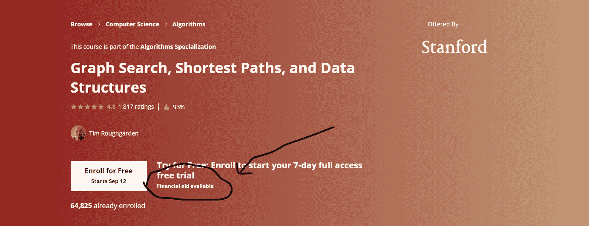

# 成为自学成才的开发人员的实惠方法

> 原文：<https://javascript.plainenglish.io/affordable-ways-to-be-a-self-taught-developer-a157de54f569?source=collection_archive---------1----------------------->

## 进入科技职业的实惠路线图。

Photo by [Austin Poon](https://unsplash.com/@austinpoon?utm_source=medium&utm_medium=referral) on [Unsplash](https://unsplash.com?utm_source=medium&utm_medium=referral)

这是我在 Medium 上的第一个帖子，我希望我的第一个帖子对那些有兴趣在技术(web 开发)领域发展的人有用。

对于我所写的每一点，我都会尽力附上一些参考资料和一些资源链接供你们参考。

## **我的背景**

我来自马来西亚，毕业于 T2 马来西亚科技大学，获得了纯数学学位。在四年的学习中，我所学的与 tech 相关的课程有离散数学、C 编程、C++编程。

## **这些是让我进入科技职业的一些资源。**

## 1.Coursera 和 Udemy 是你最有价值、最实惠的工具。

为什么是 Coursera？为什么是 Udemy？因为这些平台整体都是最好的(质量好+价格实惠)。相比 YouTube，我更喜欢 Coursera 和 Udemy 的原因是我更喜欢结构化的学习方式。

质量好的。

我不认为我需要详细说明 Coursera 和 Udemy 上的课程的质量。但是，如果你想找到一门课程，请浏览学生给出的评级。下面我推荐了一些我上过的课程，觉得有用。

**实惠的价格**

是的，这是真的！

对于 Coursera，你可以为你想要的课程申请经济资助。

写一篇短文:
——你为什么要申请助学金？(要求至少 150 个单词)
-参加本课程将如何帮助您实现职业目标？(至少 150 字)

Financial Assistance for Coursera

根据我的经验，只要你给出的理由是有效的，并且满足最少的字数要求，并且你愿意等 15 天，你就一定能得到它。

**PS:** 你也可以把每个问题写好的论文留着下次申请其他课程的资助。因此，最终，你只需要写一篇一次性的论文，保存在一个文件中，并在每次你希望将来获得一门课程时复制和粘贴这篇论文。还有，每次申请后要等 15 天。

对于 Udemy，请确保在促销日购买。在促销日，课程价格约为 40 至 70 马来西亚元。但是，如果您今天真的想购买课程，但今天不是促销日，您仍然可以访问此[链接](https://couponcause.com/stores/udemy-coupon-codes/?matchtype=e&device=c&network=g&creative=543012905013&keyword=udemy%20coupon&targetid=kwd-33641072489&position=&adgroup=14309385040&locaton=9066772&locationint=&campaign=169332520&extention=&gclick=CjwKCAjwp_GJBhBmEiwALWBQkzlb-nKlKHrQBO55xa32ZQNopyh4ueloD5Ll74UHrN21OGho4dULMRoCwYoQAvD_BwE/)以获得购买课程的折扣。

当然，有一种更便宜的方式来获得 Udemy 课程，例如，从盗版卖家那里购买。然而，我不认为这对那些花了很多心血来创建课程的 Udemy 导师是公平的，我相信折扣价格应该是你可以承受的。

我发现 Udemy 和 Coursera 的一些课程对我进入科技世界非常有用:

a) [查克博士的 Web Application for Everybody](https://www.coursera.org/specializations/web-applications)
这绝对是点燃我对 Web 开发之路热情的课程！爱死了！❤

b) [谷歌 IT 支持专业证书](https://www.coursera.org/professional-certificates/google-it-support)
从这个课程中你可以学到 IT 的所有基本概念。

c) [完整的 Web 开发人员:零到精通](https://www.udemy.com/course/the-complete-web-developer-zero-to-mastery/)

d)[Git by Kalob tau lien](https://www.udemy.com/course/git-and-github-crash-course-creating-a-repository-from-scratch/)
免费教程。

## 2.输出 aka 建筑项目

经过一些输入，现在是时候建立一个简单的项目来展示你到目前为止学到了什么。

单独构建一个项目时，你会遇到很多问题。没人问，一直卡住又松开，卡住又松开。这就是 YouTube 和 StackOverFlow 出现的原因。利用谷歌的力量，因为你所面临的问题通常也是其他人所面临的问题。

在建立一个项目时，一定要利用到目前为止你所学到的东西。比如 Git，版本控制。

## 3.是时候找份全职工作了

还是自由职业项目？

我发现与自由职业项目相比，获得全职工作更容易。

**答**简历

把所有的项目链接都放在简历上。

**b.** 联网

去参加一些研讨会或黑客马拉松。多认识些人就行了。一点也没有坏处(我认为)，你要么拥有很多有帮助的导师，要么是你未来的老板。

**c.** 定期重复步骤 1 和 2(输入和输出)。
不停地学习。

这是我进入科技职业的三种方式。我真诚地希望这些对你有用。
***1。Coursera 和 Udemy 是你最有价值、最实惠的工具。
2。输出 aka 建筑项目。
3。是时候找份全职工作了。***

## 推荐资源

如果你读到这里，谢谢你的阅读。我会用我觉得超级有用的其他资源来结束这篇文章。

**YouTube 频道**

[CS50](https://www.youtube.com/c/cs50)

侯赛因·纳赛尔(Hussein Nasser)
同一个人向我推荐了很多很多次，我确实觉得它很有用。

[凯文鲍威尔](https://www.youtube.com/kepowob)CSS 之王
。

看到一个超级漂亮的女孩给我解释科技，我有点受不了，尽管我也是个女孩。

[自由代码营](https://www.youtube.com/c/Freecodecamp)

**有用的 Chrome 扩展**

[daily.dev](https://daily.dev/)

[网络开发工具](https://chrispederick.com/work/web-developer/)

**免费笔记来自** [**马来西亚开放大学**](https://www.oum.edu.my/)

[信息技术的基本概念](https://drive.google.com/file/d/1XE_9eQ64bUsBElNugRnLJG6JDaEu0ByD/view?usp=sharing)

感谢您的阅读。如果你觉得这篇文章有用，请给我一个大拇指。此外，如果你发现一些不正确的地方，请在下面评论，让我知道。

为什么要做陌生人？通过 [LinkedIn](https://www.linkedin.com/in/syhue/) 与我联系。❤

*更多内容请看*[***plain English . io***](http://plainenglish.io/)*。报名参加我们的* [***免费周报***](http://newsletter.plainenglish.io/) *。在我们的* [***社区***](https://discord.gg/GtDtUAvyhW) *获得独家获得写作机会和建议。*