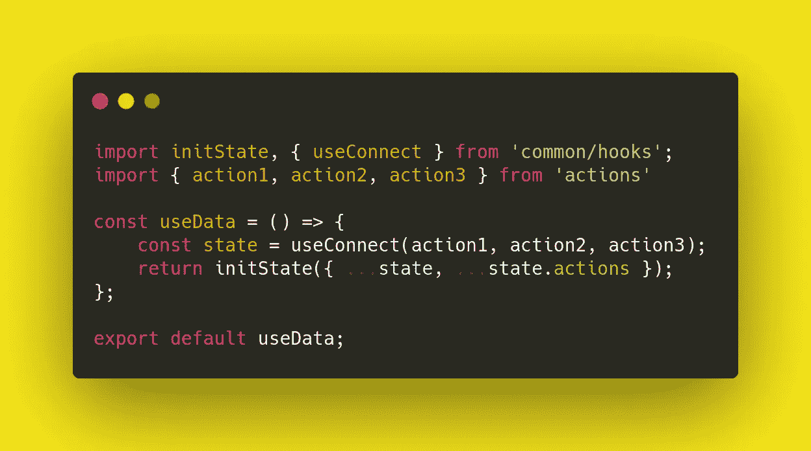

# 不可知状态:如何使用 React 中的函数方法减少对存储的依赖

> 原文：<https://javascript.plainenglish.io/agnostic-state-b0c7d4d7584a?source=collection_archive---------11----------------------->

Photo by [Nicolas Thomas](https://unsplash.com/@nicolasthomas?utm_source=medium&utm_medium=referral) on [Unsplash](https://unsplash.com?utm_source=medium&utm_medium=referral)

# **简介**

如果您使用 React 库开发过 JavaScript 应用程序，您可能听说过函数式方法和钩子的概念。虽然大多数开发新项目的团队选择带钩子的功能组件而不是类组件。在 React 存在的这些年里，生产中有许多遗留代码库需要维护和开发。

除了改变编写组件的方法，还有一个趋势是使状态容器现代化。所以在一些项目中，有一个过渡，比如将 *Redux* 切换到 *Mobx* ，转换 *redux-observable* ，以及其他改进。谁知道明天会发明什么？:)

由于我们工作领域的特殊性，总会有一个与业务部门就新特性的引入和项目的技术债务进行争论的过程，这通常包括重构过程。结合 Redux 使用 React 应用程序的示例，我将展示如何以最少的痛苦迁移到依赖性更低、更灵活的架构，这将允许您在未来实施新的技术解决方案时问题更少、浪费的时间更少。

# **动机**

由于我们正在逐步将组件转移到功能性方法，停留在旧的商店连接上没有意义。如今，react-redux 提供了开箱即用的许多灵活解决方案，如 *useStore* 、 *useSelector* 、 *useDispatch* 等。(使用 React 上下文的类似方法可以在其他状态容器中找到)。函数式方法在架构上提供了灵活性，这有利于伸缩和重构。

# **问题**

## 1 .派遣的行动

最有可能使用 API 的是像 [redux-thunk](https://github.com/reduxjs/redux-thunk) 或 [redux-saga](https://redux-saga.js.org/) 这样的东西。在 redux-thunk 的例子中，我们使用异步操作来提交到存储。目前，由于需要异步调用，我们的典型操作如下所示:

当在组件内部调用时，这导致了极其尴尬的重用。

## 2.“垃圾”代码

通常，当使用类方法编写组件时，它包含与显示逻辑不直接相关的代码，因此生命周期方法增加了，这增加了支持这种组件的复杂性。

不仅如此，在组件的闭包中，还有子查询函数、度量设置、数据处理(这些与显示没有直接关系)等。将所有这类处理数据的情况与渲染分开，以便将组件作为一个独立的结构来处理，会方便得多。

## **3。扩展处理程序**

许多项目都有 DOM 元素事件处理程序，这些处理程序会导致商店树的不同部分发生变化，或者在 JSX 中显示之前准备聚合数据。有时，如此大量的改变商店的行动必须保持分离，不能组合。这就是为什么我们的组件的方法携带了太多额外的逻辑。

聚合和序列化逻辑可以有更复杂的实现，这也混淆了显示层的一般逻辑。

# **解决方案**

前一个模块中描述的常见问题的解决方案可以是在商店和功能组件之间形成一个中间数据层。这种方法可能有点类似于后端应用程序的三层架构(*控制器*<->-*服务* < - > *存储库*)或 angular 应用程序，其中控制器传递数据以进行显示。

## **1。装订分派**

为了处理当前的动作，你可以创建一个钩子来准备使用状态层。钩子包装了组件中使用的动作，并将它们绑定到 dispatch，这样可以方便地重用方法。如果有必要放弃旧的动作实现，我们总是可以改变隐藏的实现。

## 2.连接到 Redux 商店

我们形成选择器挂钩来接收商店实体和准备好的在商店内部使用的动作。

如果描述的动作没有绑定到 dispatch，我们将能够在不可知状态下声明方法。

## 3.在渲染层中使用

最初， *useConnect* 似乎足以提供来自商店的数据，但是数据需要放入一个对象中，该对象将被传递给生成 JSX 的函数。因此，为了方便调用，有必要应用 currying 方法。因此，我们绑定了状态初始化和提交，以便在组件内部使用。

# 用法示例

## **1。初始化组件**的不可知状态

对于简单的组件，在组件内部声明数据拦截器( *useDate* )就足够了，但是对于复杂的组件，在我看来，还是放在单独的文件里比较好。因此，状态级依赖关系将只是不可知状态数据，而不可知状态依赖关系将是存储数据。回到所描述的方法的思想，如果有必要改变状态的容器，显示层将不会进入受影响的区域。

从上面的例子中，您可以看到我们正在为我们的状态创建一个 javascript 对象。因此，不可知论国家有能力:

*   从商店直接转移到显示层。
*   为聚合/添加/重用逻辑添加您自己的函数。
*   通过 getter 函数聚合数据。

P.S .为了简单组件的易用性，我们可以充分利用 decorators！

## 2.在组件内部使用不可知状态

为了使用不可知状态，我们调用 *useData* ()函数(如果需要，我们可以传递 props)。当再次被调用时(因为使用了 currying)，我们得到状态参数，我们用它来填充 JSX。需要注意的是，对于需要使用第三方钩子的组件，可以添加函数 *useRender* (state) {}。这是创建函数上下文所必需的。

对于简单的组件，lambda 函数就足够了。

优势:

*   摆脱存储依赖。
*   没有道具和状态的混合。(如果你需要传递创建不可知论国家的道具，你可以这么做)
*   易于感知。

# 结论

带有 React 钩子的函数式方法是一个强大的工具，它可以以相对较低的成本对您的架构进行大的修改。如果您的项目中有遗留代码，并且您不知道从哪里开始，我建议您查看所描述的解决方案。本文并不打算成为一个全面的指南，但是它确实提供了一个降低项目依赖项的紧密耦合的一般概念。

*更多内容尽在*[***plain English . io***](http://plainenglish.io/)