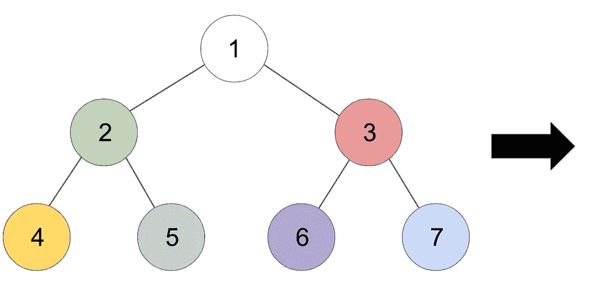
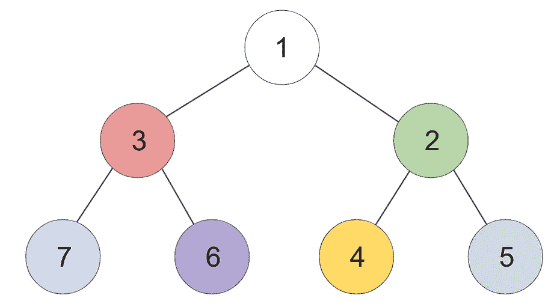

# 算法壁龛:倒置二叉树

> 原文：<https://javascript.plainenglish.io/algo-alcove-invert-a-binary-tree-1947cab36c46?source=collection_archive---------19----------------------->


Photo by [note thanun](https://unsplash.com/@notethanun?utm_source=medium&utm_medium=referral) on [Unsplash](https://unsplash.com?utm_source=medium&utm_medium=referral)

欢迎回到壁龛，后面有咖啡和不新鲜的饼干，请自便。今天，我们将看看上周关于二叉树遍历的博客的扩展，并看看一个经典的实现。

# 问题是

> 给定二叉树的`root`，反转该树，并返回*它的根*。

这个问题需要我们在垂直轴*上镜像二叉树。* 下面是那个样子。



Before and After

# 思维过程

如你所见，树上的每个节点都交换了左**和右**子节点。您可能还会注意到，因为树是由**子树组成的，**这看起来有点像递归函数:每个子树都被就地交换，它们的子树也是如此，等等。

当我们听到递归时，我们应该首先想到的是**深度优先搜索**，这是有意义的，因为它看起来像是沿着树的边向下并镜像它们的节点，而不是向下扫描每一层。

现在的问题是，我们将使用哪种类型的 DFS？如果你还记得上周[的](/the-algo-alcove-binary-tree-traversal-af0e8f7ce55e)，按顺序有**前序、**后序、和**。**在伪代码中，它的操作顺序应该是:

*   落在一个节点上
*   如果**为空**返回
*   否则，用它的左子交换它的右子
*   在左边的子树上递归调用这个函数
*   在右边的子树上递归调用这个函数

因为我们在调用我们的递归函数之前操作数据*，对我来说这听起来像是**预先排序**。*

# 解决方案

首先，让我们定义一个交换函数，作为我们的主递归函数的助手。

```
const swap = (node) => {
    let temp = node.right;
    node.right = node.left;
    node.left = temp;
}
```

这里，我们只是使用一个 **temp** 变量作为右节点的占位符(虽然我们可以使用右节点，但这并不重要)，然后交换我们发送给函数的任何节点的值。

现在，我们需要一个递归函数，它首先交换，然后在它的两个子节点上调用我们的遍历方法。

```
const traverse = (node) => {
    if (node === null) return;
    swap(node); traverse(node.left);
    traverse(node.right);
}
```

就是这样！我们现在需要做的就是将我们的根节点发送到这个主函数中，包装其他两个节点，并返回所述根节点以完成挑战。

```
const invertBinaryTree = (root) => {
    const swap = (node) => {
        let temp = node.right;
        node.right = node.left;
        node.left = temp;
    } const traverse = (node) => {
        if (node === null) return;
        swap(node); traverse(node.left);
        traverse(node.right);
    } traverse(root);
    return root;
}
```

超级简单！如果我们遇到任何 **null** 节点，由于我们的基本情况，它们将脱离递归循环。在交换函数中，一个空节点将被它的兄弟节点替换，因为我们的 temp 值派上了用场。

说到二叉树问题，通常第一步是弄清楚它是属于**广度优先**还是**深度优先**的领域。如果你能找到一个连接，那么在你遍历的时候，只需要花一点心思就能弄清楚如何操作这些数据。

感谢您的阅读，并在下面留下您的任何意见或问题。编码快乐！

*更多内容请看*[***plain English . io***](http://plainenglish.io)