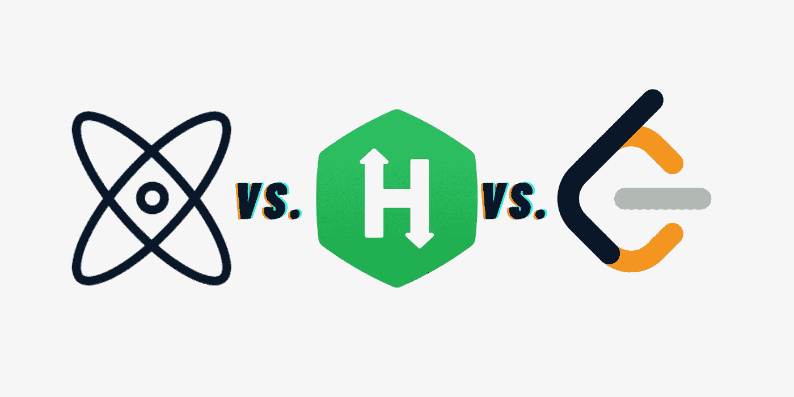
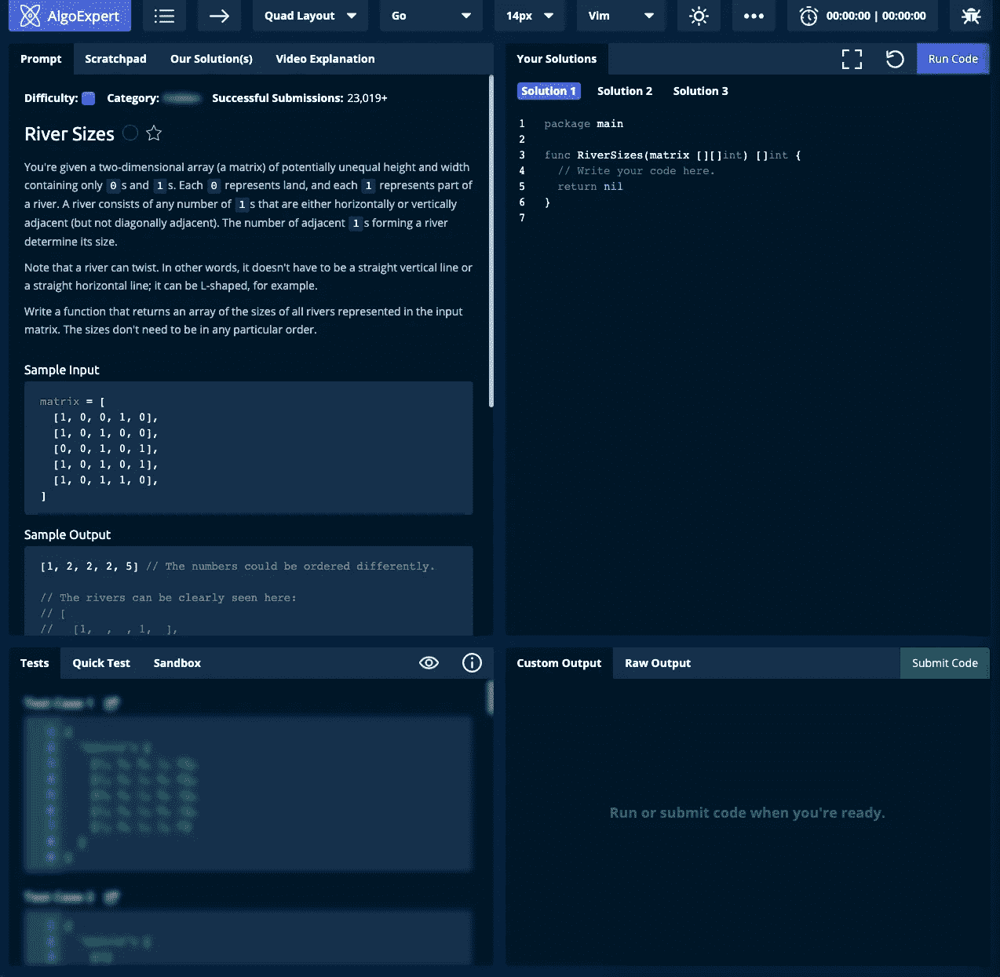
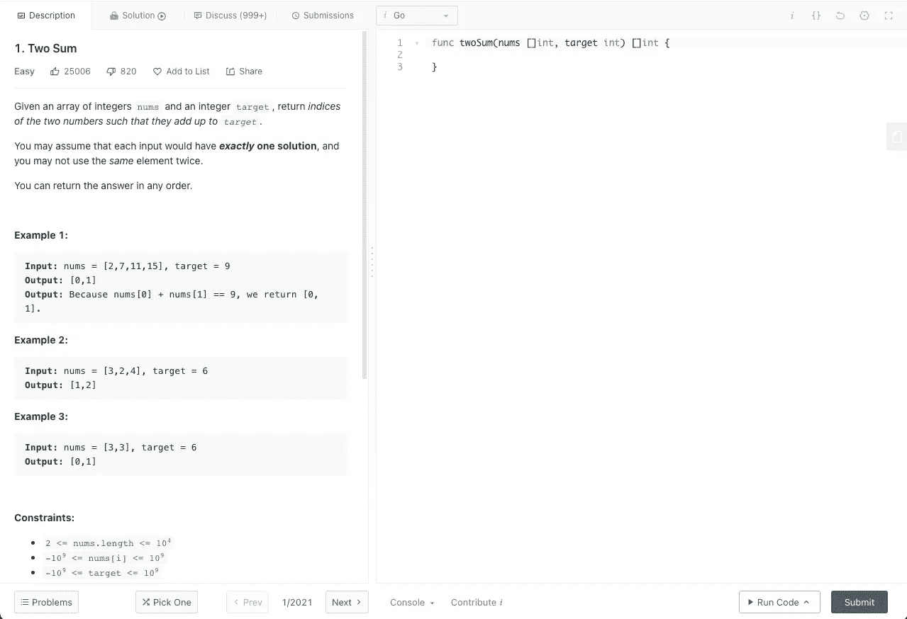
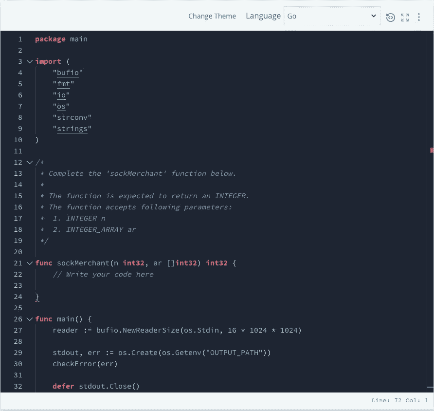

# algo expert vs . hacker rank vs . leet code

> 原文：<https://javascript.plainenglish.io/algoexpert-vs-hackerrank-vs-leetcode-8d64f34cd048?source=collection_archive---------1----------------------->

## 什么对你最好？Ace 面试？提高你的算法技巧？

直到今天，还有很多平台提供算法问题和模拟面试问题。在这么多平台中，我挑选了三个流行的平台，AlgoExpert、HackerRank 和 LeetCode，来比较它们的区别。

# 算法专家

AlgoExpert 是克莱门特·米哈伊尔斯库(Clément Mihailescu)的联合创始人，他曾在脸书和谷歌担任软件工程师。

目前，它提供三门课程和两个面试包:

1.  算法专家——99 美元/年
2.  系统专家—99 美元/年
3.  移动专家—99 美元/年
4.  技术面试套餐——128 美元/年
5.  ML 面试套餐——199 美元/年

当您购买多个产品时，您将自动获得 **25%的捆绑折扣。**可惜不是一次性购买。购买后你只有 1 年的使用权。与 HackerRank 和 LeetCode 不同，AlgoExpert 没有社区，既不是官方的，也不是非官方的。

AlgoExpert 拥有 **160 个编码面试问题，分为 15 个类别**，并且仍在统计中。

Clement 和 Tim Ruscica(也就是 Tim 的技术顾问)是这些问题的讲师。他们非常有信心，这些问题会让你有很大的机会在面试中胜出。

除了**编码面试问题**，他们还提供了**数据结构速成班**，有十三个视频，四个**编码面试测评，**五个**编码面试技巧视频，**和**模拟面试问题**。你可以和一个随机的 AlgoExpert 用户或朋友模拟面试。

AlgoExpert’s code editor

每个问题**中都有**提示、便笺、解答和视频讲解**。**代码编辑器可以选择 Vim、Sublime 和 Emacs 中的键映射。支持九种编程语言，分别是 C++、C#、Go、Java、JavaScript、Kotlin、Python、Swift 和 TypeScript

# LeetCode

温斯顿·唐在 2015 年发现了 LeetCode。LeetCode 提供免费版和高级版两种版本。保险费为**35 美元/月**和**159 美元/年**。使用 premium，您将可以访问 LeetCode 上的独家优质内容和额外功能。

直到今天，它已经解决了 1800 多个问题，并且还在继续。

LeetCode 有一个庞大的官方和非官方社区。每个问题都有讨论。用户分享他们的解决方案、想法、解释等。

LeetCode 允许面试官每个月为他们的招聘过程创建十个面试问题。FAANG 级公司三次免费**模拟考核**和 24 次溢价。除此之外，LeetCode 还有每周一次的比赛。

LeetCode’s code editor

LeetCode 的代码编辑器支持 **18 种编程语言**。不幸的是，它没有编辑器的黑暗模式。

# 黑客银行

HackerRank 由 Vivek Ravisankar 和 Hari Karunanidhi 于 2009 年创立。它的目标是开发商和雇主。

HackerRank 对开发者免费，对雇主有四种[定价方案](https://www.hackerrank.com/products/pricing/)。

没有关于 HackerRank 有多少问题的信息，但大多数问题都是用户贡献的，所有的**大赛**都是用户创造的。

HackerRank 也有对每个问题的讨论，但是 UI 和 LeetCode 相比并不好看。

除此之外，HackerRank 提供了 Angular、C#、Go、CSS 等**技能认证**。完成测试后，你就可以申请 HackerRank 上的职位了。有一个 **Jobs Board** 页面，但是位置只有几个。

HackerRank’s code editor

HackerRank 的代码编辑器支持超过 40 种编程语言。它覆盖了所有现存的编程语言。

# 结论

三个平台各有各的独特之处。在我看来，如果你准备在 FAANG 级公司的面试中胜出。 **AlgoExpert** 是最佳选择，因为它就是为此而生的，但 **LeetCode** 的高级版在这种情况下也相当不错。

如果你想训练你的算法技能，HackerRank 和 **LeetCode** 的免费版本最适合你，因为它们都有排行榜、竞赛和社区。

AlgoExpert 和 LeetCode 并不贵，因为如果你能为 FAANG 级别的公司工作，回报几乎是你投入的 100 倍。

但是，如果你只是想学习或练习，那么在这些上浪费金钱是没有意义的，不要骗自己说，一旦花费，你就会完成这些问题。

*更多内容请看*[***plain English . io***](http://plainenglish.io)