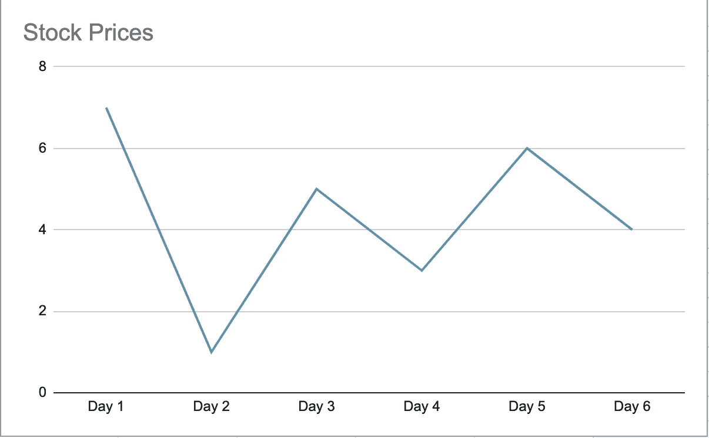
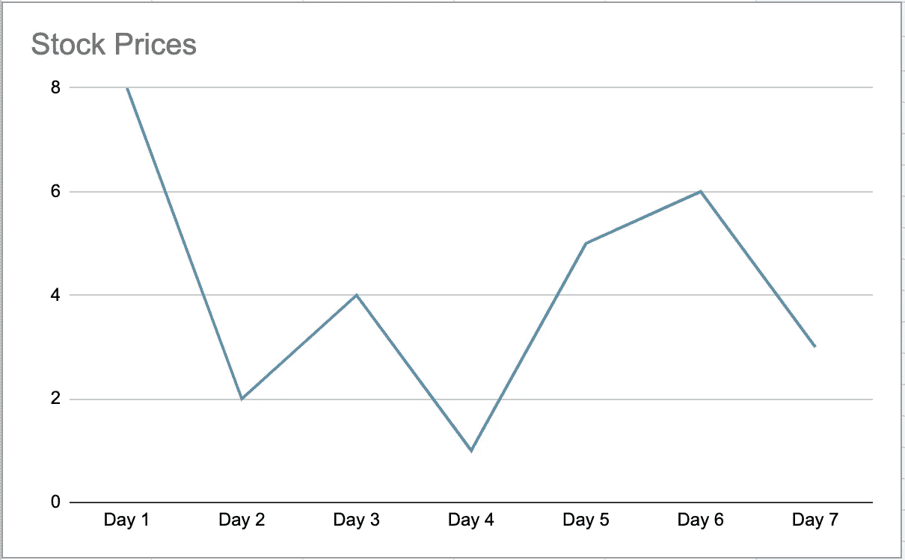

# 算法:买卖股票的最佳时机

> 原文：<https://javascript.plainenglish.io/algorithm-best-time-to-buy-and-sell-stock-bf5309195a4b?source=collection_archive---------13----------------------->


Photo by [Maxim Hopman](https://unsplash.com/@nampoh?utm_source=medium&utm_medium=referral) on [Unsplash](https://unsplash.com?utm_source=medium&utm_medium=referral)

恭喜你！一周以来，你已经获得了一些股票价格的内幕消息(没有内幕交易的所有令人讨厌的分支)。你的工作是想出一个算法来确定买卖股票的最佳时机，以实现利润最大化。

欢迎回到我刚刚称之为“Algo Alcove”的地方，这是一个软件工程师学习更多关于数据结构和算法的时髦地方。今天，我们来看一个类似问题的两种变化。

# 问题 1。单一买入/卖出

> 给你一个数组`prices`，其中`prices[i]`是在`ith`日给定股票的价格。
> 
> 你想通过选择一个**单日**买入一只股票，并选择未来**不同的一天**卖出这只股票来最大化你的利润。
> 
> 返回*你从这笔交易中可以获得的最大利润*。如果你不能获得任何利润，返回`0`。

# 崩溃

本质上，你想找到所有股票的最低价和最高价，确保高点在低点之后，你想在那几天买入和卖出以最大化你的利润。让我们以图表的形式来看这个。

例子`prices` : `[7,1,5,3,6,4]`



Stock Prices

当我们想象这一点时，我们可以看到最佳购买时间是第二天，然后等到第五天卖出，获得利润 **5** (美元？欧元？里拉？我们永远不会知道)。

# 设置

所以，我们知道我们需要记录最低价格和最高利润。我们还想确保按顺序遍历我们的`prices`数组，这样就不会意外地回溯并试图根据过去卖出股票。

我们可以设置我们的最低和最高价格，并像这样开始我们的循环:

```
function maximizeProfit(prices) {
    let minPrice = Infinity;
    let maxProfit = 0;

    for (let i = 0; i < prices.length; i++) {
    // To be filled in
    }
}
```

我们将`minPrice`设置为无穷大，以确保我们进行的任何比较都将自动降低并覆盖当前值。我们的`maxProfit`从零开始，因为我们只关心利润，所以我们不必关心每只股票应该买入/卖出的那一天，只关心我们应该获得的利润。

接下来，当我们迭代时，我们应该将每个价格与`minPrice`进行比较，如果它更低，就更新它。然后，我们应该在每个转折点比较`currentPrice — minPrice`，本质上是看到潜在的利润。如果潜在利润更高，我们已经找到了更好的交易，可以更新我们的`maxProfit`。让我们看看那是什么样子。

```
function maximizeProfit(prices) {
    let minPrice = Infinity;
    let maxProfit = 0;

    for (let i = 0; i < prices.length; i++) {
        if (prices[i] < minPrice) {
            minPrice = prices[i];
        } else if (prices[i] - minPrice > maxProfit) {
            maxProfit = prices[i] - minPrice;
        }
    }
    return maxProfit;
}
```

当我们遍历数组时，我们的 minPrice 将总是在时间点更新*。如果我们每次都将后面的日子与最大利润进行比较，我们将始终确保我们的钱得到最好的回报。*

现在，让我们来看看这个问题的一个变种。

# 问题二。无限的购买/销售

> 给你一个数组`prices`，其中`prices[i]`是在`ith`日给定股票的价格。
> 
> 找到你能实现的最大利润。您可以完成任意多的交易(即多次买入和卖出一股股票)。
> 
> **注意:**您不得同时进行多项交易(即，您必须在再次买入之前卖出该股票)。

这个问题与第一个问题的原理相同，但是它允许我们想买多少次就买多少次，想卖多少次就卖多少次(确保总是在我们再次购买之前卖出)。

让我们看另一张图。价格= `[8,2,4,1,5,6,3]`



Prices v2

这个问题实际上比上一个更简单，因为我们有无限的买卖。我们可以直观地看到，我们希望在第 2 天**买入，在第 3** 天**卖出(利润:2)，然后在第 4** 天**买入，在第 6** 天**卖出(利润:5)，总利润为 **7** (共和国信用，这次我确定)。**

但是，因为我们可以无限次地买入/卖出，如果我们继续使用上次的`maxProfit/minPrice`设置，情况可能会变得混乱。我们的`minPrice`现在是相对的！

你再看看，在**第 4 天**买入，在**第 6 天**卖出，和在**第 4 天**买入，在**第 5 天**卖出(然后再买入)，在**第 6 天**卖出，利润是一样的。

我们真正关心的是股票是否会一天比一天上涨。只要把这些加起来，我们就会获得最大的利润。这看起来是这样的:

```
function maximizeProfit2(prices) {
    let max = 0;
    for (let i = 0; i < prices.length; i++) {
        if (prices[i] > prices[i - 1]) {
            max += prices[i] - prices[i - 1];
        }
    }
    return max;
}
```

我们走吧！我们只是将数组值与它们之前的值进行比较，如果我们有所收获的话，就把差值加起来。即使价格持续攀升，我们最终的利润也会和我们坚持到顶峰时一样。

差不多结束了。这些问题向你表明，即使是微小的变化也能改变你对问题的看法。但是，如果你把它分解开来，试着想象你需要什么来解决这个问题，写伪代码听起来并不可怕。

感谢阅读。像往常一样，如果你有不同的方法来解决这个问题，或者遇到了不同的变化，请留下评论。编码快乐！

*更多内容看*[***plain English . io***](http://plainenglish.io)