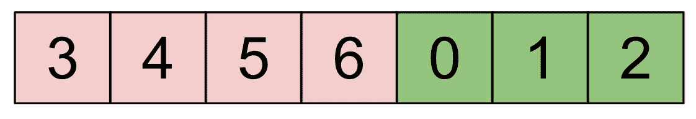
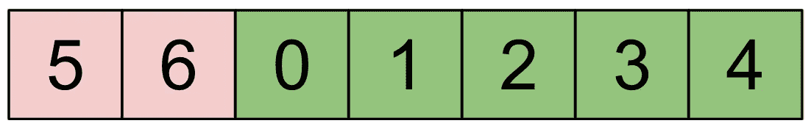
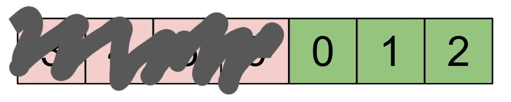
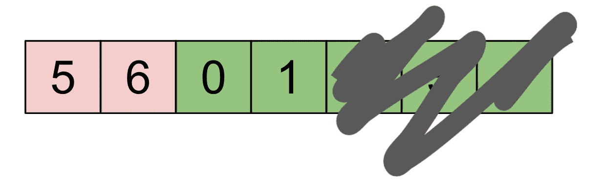
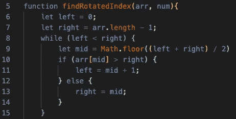
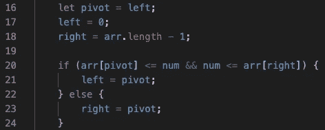
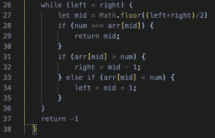
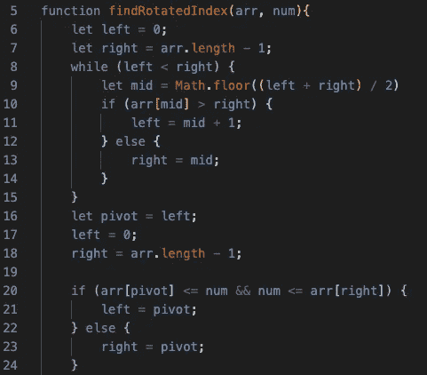
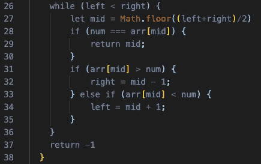

# 算法:旋转数组

> 原文：<https://javascript.plainenglish.io/algorithm-rotated-array-94d976be0ff3?source=collection_archive---------12----------------------->

## 二分搜索法猛地一扭

在我解决所有现存算法的旅程中，我在 Leetcode 等网站上遇到了许多有趣的问题。我最近遇到了一个非常标准的搜索算法，它有一个有趣的变化，让我停下了脚步。


Photo by [Michael Dziedzic](https://unsplash.com/@lazycreekimages?utm_source=medium&utm_medium=referral) on [Unsplash](https://unsplash.com?utm_source=medium&utm_medium=referral)

# 问题是

> 编写一个名为**findroatedindex**的函数，它接受一个排序数字和一个整数的旋转数组。该函数应该返回数组中整数的索引。如果找不到该值，则返回-1。

看起来是个很标准的问题，对吧？让我们强行通过它，遍历整个数组，然后早点回家，好吗？不对！如果我们走捷径，我们就不是软件工程师了(另外，这个问题需要我们以 O(log n)的时间复杂度来解决)。

# 分析

首先，什么是旋转数组？它只是一个经过移位的有序数组，所以数组中的最小值不在索引[0]处。

```
// Regular array
[1, 2, 3, 4, 5, 6]// Rotated array
[3, 4, 5, 6, 1, 2]
```

现在，我们不能简单地用二分搜索法方法。对于那些不熟悉的人来说，二分搜索法就是将数组一分为二，将中点与目标值进行比较。如果目标值小于中点，您可以将数组向左对半切割，否则，您可以向右对半切割。重复这个步骤几次，直到你锁定你的目标值。由于每次迭代都将数组减半，这大大减少了搜索时间，达到 O (log n)，这正是我们想要的！

然而，二分搜索法在旋转阵列上的问题是，我们不能确定这个旋转阵列的支点到底在哪里。在那之后，我们做什么？让我们开始吧。

# 第一步:找到支点

找到支点的第一步是分析一个旋转的数组，并思考关于每个旋转的数组的一些不变的事实。

*   旋转后的数组可以围绕一个轴心点分成两半。
*   左边部分的每个值总是大于右边部分的每个值。

最后一项是关键。如果左边部分的每个值都大于右边部分的值，并且数组是以其他方式排序的，那么我们总是可以通过比较任意随机值和数组最右边的值来判断我们在哪个部分。



Rotated Array (A)

**案例一:**支点在中点的*右侧*。我们看到 6 是这个数组的中点。我们还可以看到，由于 6 比 2(右边的点)大*，我们的中点是数组左边部分的一部分。我也用颜色标记了。因为 6 大于 2，我们可以截掉数组的左半部分，就像二分搜索法一样，因为我们知道支点总是我们右半部分的开始。*



Rotated Array (B)

**情况二:**支点在左侧*或等于中点的*。我说“或等于”，因为如果我们将中间值与 4(我们最右边的值)进行比较，绿色部分的任何值都将小于 4，包括枢轴。在这种情况下，我们可以截掉数组的右半部分，用数组一半的大小重复循环。

在这两种情况下，我们都将有新的数组，新的红绿部分的比例，但原则保持不变，直到我们缩小到支点。



Rotated Array (A)



Rotated Array (B)

我们可以看到(特别是在例子 B 中)，原则上我们仍然保留了旋转数组，只是它们的尺寸缩小了。在示例 A 中，我们潦草地写下了 6，因为我们确信它在红色部分，而不是我们所需要的。剩下要做的就是继续我们的循环，直到我们制作的**左**和**右**指针汇聚到支点上。

代码如下所示:



Find the pivot

我们可以看到，场景 A 和 B 分别出现在第 10 行和第 12 行的条件语句中。

# 步骤 2:找到保存目标值的部分

现在我们有了支点(当我们退出循环时，它应该是我们的 **left** 值留下的值)，我们可以看到目标数字是在数组的绿色部分还是红色部分。


Example (A) — Target is ‘4’

假设我们试图找到 **4 的索引值。**我们可以查看该值是否在中枢值和我们最右边的值之间，如果是，我们可以操作绿色部分，如果不是，我们操作红色部分。

代码如下:



Picking our portion of the array.

我们可以在第 16 行看到，我们将 **pivot** 的值设置为 **left** ，因为我们认为这是步骤 1 中的情况。然后我们通过比较枢轴和最右边的目标 **num** 来检查它是否在数组的绿色部分。如果它在两者之间，它就在绿色部分，我们可以这样分割我们的数组，否则，我们将分割它，只看到红色部分。

# 第三步:二分搜索法

现在剩下的就是表演二分搜索法了。无论我们是对绿色部分还是红色部分进行操作，我们都有一个带有目标值的排序数组。

代码如下:



Binary Search

对那些从未见过这段代码的人的解释是:

我们循环`while (left < right)`是因为我们不断地将数组减半，一旦左右相遇，我们要么找到了目标值，要么它不存在于循环中，所以我们可以突围。我们通过将左值和右值的底值相加并除以 2 来找到中间值(我们也可以计算上限，重要的是我们保持一致)。

在第 28 行，我们检查我们的中点是否是我们的值，如果是，我们完成并返回索引值。

否则，我们检查目标是在中点的右边还是左边，并相应地对数组进行切片。最终，我们要么找到我们要找的目标，要么发现它不在数组中，我们的一生都是一个谎言。

以下是我们旋转数组的完整代码:



findRotatedIndex()

# 概述


Rotated Array Example (A)

我们意识到一个旋转的数组可以被分解成两部分，并找到一个支点。我们还发现右边部分必须总是小于左边部分的任何数字。这允许我们使用一个修改的二分搜索法来寻找支点。之后，我们将轴心点周围的数组分成绿色或红色部分(取决于我们的目标值)。最后，我们执行二分搜索法来找到我们的目标值。

虽然这看起来比简单地遍历数组寻找目标值要复杂得多(对我们来说确实如此)，但实际上用二分搜索法来做要快得多。 **O(n)** 和 **O(log n)** 的差别是天文数字。如果数组中有 1，000，000 个数字，可能需要 1，000，000 次迭代，但是对于二分搜索法，最多需要 20 次。

感谢您阅读本博客，并一如既往地在下面留下任何问题或评论。编码快乐！

*更多内容尽在*[***plain English . io***](http://plainenglish.io)