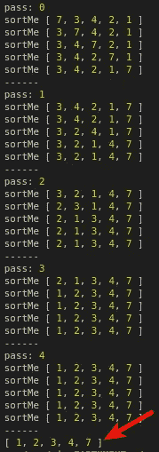
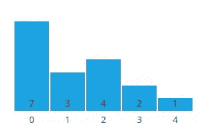
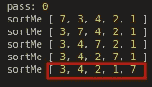
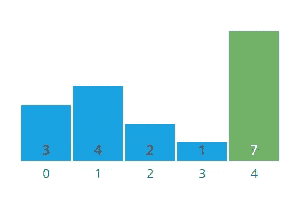
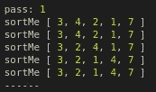
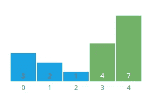
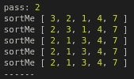
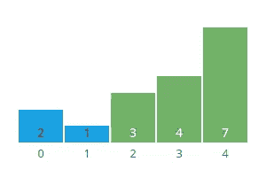
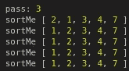
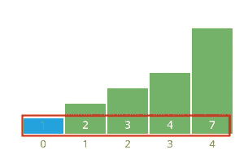

# 算法可视化

> 原文：<https://javascript.plainenglish.io/algorithms-visualized-4506b96fc3bc?source=collection_archive---------18----------------------->

## 冒泡排序


Bubbles, bubbles, bubbles

**冒泡排序**是基于重复比较相邻值对的想法，然后**在值乱序时交换它们的位置**。这是一种**直观的**排序方法，因为它的逻辑是基于一次一个值的比较。缺点是与其他排序方法相比，这种方法效率低且耗时。

这里是 JavaScript 中**冒泡排序**的实现。

```
const **bubbleSort** = (sortMe) => {
  sortMe.forEach((item, pass) => {
    console.log('**pass:**', pass)
    sortMe.forEach((item, j) => {
      console.log('**sortMe**', sortMe)
      if(item > sortMe[j + 1]) {
        const temp = sortMe[j]
        sortMe[j] = sortMe[j + 1]
        sortMe[j + 1] = temp
      }
    })
    console.log('------')
  })
  return sortMe
}console.log(bubbleSort(**[7, 3, 4, 2, 1]**))
//output: [1, 2, 3, 4, 7]
```

该函数包含一个**嵌套循环**，再次对数组中的每个元素进行迭代。外部嵌套循环是如何遍历数组的，内部嵌套循环是每次遍历中对每个项目的迭代。

下面是 **[7，3，4，2，1]** 数组的冒泡排序的 **console.log()** 输出。在下面的最终输出中，我们可以看到它正确地将数组从最小值(1)到最大值(7)排序。



The final sorted array is: [1, 2, 3, 4, 7]

让我们分解一下 **BubbleSort** 函数，以便更好地了解它是如何工作的。因为输入数组长度为 5，所以该函数执行 5 次，索引从 0 到 4(外部循环)。

## 一传

**sortMe** 数组输入数组开始为:

```
**[7, 3, 4, 2, 1]**
```

我们可以看到，值 7 是数组中最大的数字，位于最左侧的第一个位置。这个想法是将较大的数字向右移动。内部循环在每次遍历数组时再次迭代。这种迭代将左边最大的数字移动到右边。所以，在第一遍的过程中，7 会“冒泡”到右边。这里我们可以直观的看到。



7 “bubbles” all the way to the right

在内循环中的每次迭代中，从左到右比较相邻的值，如果两个比较值中的较大值顺序不对，则交换它们，将较大的值向右移动，准备再次与下一个值进行比较。

因为在第一遍的每次比较中，7 都是较大的值，所以它在每次迭代中交换位置，最终停留在数组的最后一个位置。在第一遍之后，数组被部分排序。



Array sort after the first pass (0)

需要多次遍历数组才能完成排序。对数组排序所需的最大遍数等于数组中的元素数。

## 第二遍

在第二遍中，因为 4 大于 2，所以发生了两次交换，然后在下一次比较中，4 大于 1。作为第二次传递的结果，值 4 在 7 旁边“冒泡”。



4 “bubbles” into place next



第二遍后排序的数组是:

```
[3,2,1,4,7]
```

4 号和 7 号在右边正确的位置，还有 3 次传球。

## 第三遍

该算法继续比较项目，并像以前一样将较大的值向右移动。这一次，3“冒泡”到 4 下面的位置，因为它大于 2 和 1。我们看到数组越来越接近完全排序。



3 “bubbles” into place



第三遍之后的数组如下…

```
[2, 1, 3, 4, 7] //almost there.
```

## 第四遍

因为 2 大于 1，所以在第四遍时仅发生一次交换。在此过程之后，数组被正确排序。



2 “bubbles” into place



## **第五遍**

尽管此时数组已被正确排序，但算法仍会进行最后一次处理。这一次没有发生交换，一切正常。最终的数组正确排序为[1，2，3，4，7]。



Final sorted array: [1, 2, 3, 4, 7]

## **bubble sort 的缺点**

**冒泡排序**一次只考虑一个元素，费时低效。使用带有(n ) 的**大 O 符号的，对于大型数组来说效率非常低。**

要了解更多关于大 O 符号的知识，请查看我最近的博客文章[数星星:使用大 O 分析编写高效代码](https://levelup.gitconnected.com/counting-stars-86a168c9d14d)。

## 参考

[https://www . hackere earth . com/practice/algorithms/sorting/bubble-sort/visualize/](https://www.hackerearth.com/practice/algorithms/sorting/bubble-sort/visualize/)

[](https://visualgo.net/en/sorting) [## VisuAlgo -排序(冒泡、选择、插入、合并、快速、计数、基数)

### 排序是一个非常经典的重新排序项目的问题(可以比较，例如整数，浮点数…

visualgo.net](https://visualgo.net/en/sorting) 

*详见*[***plain English . io***](https://plainenglish.io/)