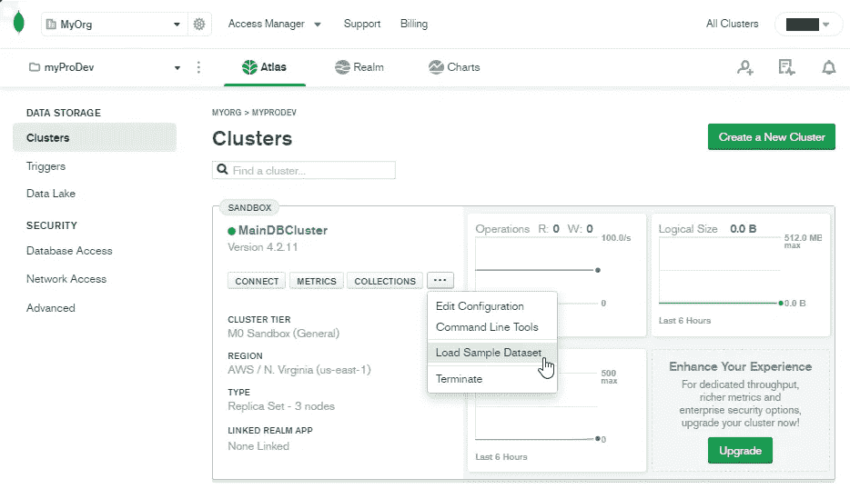
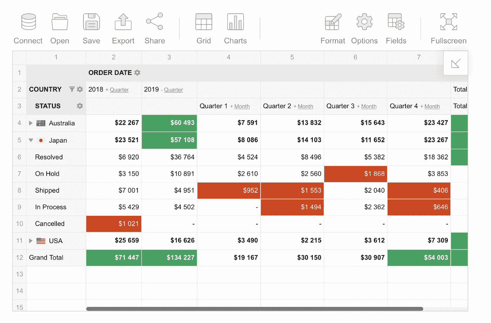
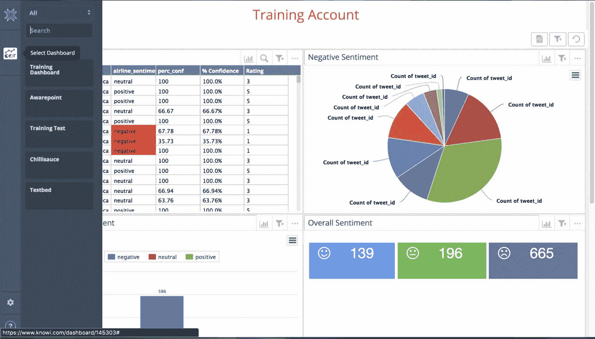

# 关于 MongoDB 的所有内容:优点、特性和工具

> 原文：<https://javascript.plainenglish.io/all-about-mongodb-benefits-features-and-tools-to-use-with-b06eb18ddf3d?source=collection_archive---------13----------------------->

## 为什么以及何时应该使用 MongoDB？

# MongoDB 简介:特性和架构

根据 DB-Engine [排名](https://www.c-sharpcorner.com/article/what-is-the-most-popular-database-in-the-world/)，全球最受欢迎的数据库是 Oracle、MySQL、SQL Server、PostgreSQL。数据存储在这类数据库的表中，它们工作的主要原理是编写查询。然而，有一个具有不同架构的数据库——MongoDB，它在上述评级中排名第五。本文将解释它是如何工作的，描述它的优点和显示数据的报告工具。

# 什么是 MongoDB？

[MongoDB](https://www.guru99.com/what-is-mongodb.html) 是一个面向文档的 NoSQL 数据库，用于大容量数据存储。MongoDB 不像传统的关系数据库那样使用表和行，而是使用集合和文档。文档由键值对组成，键值对是 MongoDB 中的基本数据单元。集合包含多组文档和函数，相当于关系数据库表。

MongoDB 可以使用不同的编程语言:PHP、Perl、C / C ++。也可以将 MongoDB 连接到节点 JS。

但是，即使考虑到传统数据库的所有缺点和 MongoDB 的优点，也必须说任务是不同的，解决它们的方法也是不同的。在某些情况下，MongoDB 将显著提高应用程序的性能，例如，如果您需要存储结构复杂的数据。否则，使用传统的关系数据库可能会更好。

# MongoDB 的优势

*   灵活性— MongoDB 将数据存储在 JSON 文档中，而不是表中。这允许您存储具有复杂结构的信息。同时，文档的内容和大小可以不同，不需要创建特定的数据库模式。这样，定义和遵守模式是可选的；
*   跨平台— MongoDB 可以在 Windows、Linux (Ubuntu、Debian、CentOS)、macOS 操作系统上使用；
*   如果你熟悉 JSON 对象或者 javascript 语言，你会更容易理解和使用 NoSQL；
*   对文档的动态查询；
*   复制— MongoDB 可以在多台服务器上运行；
*   简单的可扩展性；
*   NoSQL 是存储分层数据的更好选择。

# 更多好处

## MongoDB 中的数据格式

JSON 是一个广泛使用的数据交换和存储标准。它完整地描述了结构复杂的数据。MongoDB 存储数据的方式在这方面与 JSON 类似，虽然 JSON 并没有正式使用。MongoDB 使用一种称为 BSON(二进制 JSON)的格式进行存储。

BSON 可以让你快速处理数据:更快的搜索和处理。尽管 BSON 与以 JSON 格式存储数据相比，有一个小小的缺点:JSON 格式的数据比 BSON 格式的数据占用的空间少。另一方面，如果我们谈论速度，这个缺点似乎是一个好处。

## 文档而不是字符串

关系数据库存储字符串，而 MongoDB 存储文档。与字符串不同，文档可以存储结构复杂的信息。文档就像一个键和值的存储库，其中一个键作为一个简单的标签，与特定的数据片段相连接。

然而，尽管有这些差异，MongoDB 和关系数据库的一个特点是更接近了——主键。它描述了具有唯一值的某一列。MongoDB 对每个文档都有一个惟一的标识符，称为 _id。而如果你没有明确指定它的值，那么 MongoDB 会自动为它生成一个值。

每个键都与一个特定的值相关联。但是在这里，您还需要考虑一个特性:如果关系数据库具有定义良好的带字段的结构，并且如果某个字段没有值，那么它(取决于特定数据库的设置)可以被赋予一个空值。对于 MongoDB，情况有所不同:如果一个值不与一个键相关联，那么这个键在文档中被省略，并且不被使用。

## 收集

传统的 SQL 有表，而 MongoDB 有集合。假设关系数据库表存储相同类型的严格结构化对象。在这种情况下，集合可以包含具有不同结构和不同属性集的各种对象。

## 分身术

MongoDB 中的存储系统代表一个副本集。这个集合有一个主节点，也可以有一组次节点。所有辅助节点保持不变，并在主节点更新时自动更新。如果主节点由于某种原因出现故障，那么其中一个辅助节点将成为主节点。

## 易用性

没有严格的数据库模式，因此数据存储概念稍有变化就需要重新创建该模式，这使得使用 MongoDB 数据库和进一步扩展变得更加容易。也节省了开发者的时间。他们不再需要考虑重建数据库和浪费时间构建复杂的查询。

## GridFS

任何数据库系统面临的挑战之一是存储大量数据。您可以使用各种编程语言将数据保存到文件中。有些数据库提供特殊的数据类型来存储数据库中的二进制数据(例如，MySQL 中的 BLOB)。

与关系数据库不同，MongoDB 允许您用不同的数据集保存各种文档。但是，文档大小限制为 16 MB。在这种情况下，MongoDB 提供了一个解决方案——一种特殊的 GridFS 技术，允许您存储大于 16 MB 的数据。

GridFS 系统由两个集合组成。第一个集合称为 **files** ，存储文件名及其元数据，例如大小。另一个叫做**块**的集合以小块的形式存储文件数据，通常是 256 kb 的块。

# MongoDB 架构的关键组件

*   **_id** 是 MongoDB 文档的惟一标识符。如果添加一个没有 _id 字段的新文档，将自动生成 id。
*   **文档**是存储在集合中的记录。它相当于关系数据库系统中的字符串。它由键值对组成。
*   集合是一个 MongoDB 文档组，相当于关系数据库系统中的一个表。
*   **数据库**是一个集合容器。每个数据库在文件系统上都有自己的一组文件。MongoDB 服务器可以存储多个数据库。

# MongoDB 的报告工具

在一个公司中同时使用关系数据库和 NoSQL 数据库可能会导致一些报告问题。例如，匹配 SQL 和 NoSQL 数据库中的数据的复杂性，或者在快速变化时无法满足报告需求。

像上面提到的问题就是为什么找到一个完美的分析工具来帮助你通过 MongoDB 处理数据是至关重要的。幸运的是，市场上有许多选择。重要的是找到一个适合你精确目标的。

## MongoDB 地图集

它是一种创新的云数据库服务，具有跨 AWS、Azure 和 Google Cloud 的无与伦比的数据分发和移动性，内置的资源和工作负载优化自动化等等。

MongoDB Atlas 是一个跨平台但一致的数据库，扩展到公共云:Amazon Web Services、Google Cloud 和 Microsoft Cloud。它有许多区域来监控合规性，并将应用程序与数据放在一起以提高性能，因此您有许多云平台和区域的选择。您可以放大或缩小，应用程序不会停机。

MongoDB Atlas 是一个 MongoDB 数据库即服务平台，这意味着服务会自动配置和托管数据库。用户只需要在数据库中填入内容。MongoDB Atlas 减轻了客户管理 NoSQL 数据库的负担，使他们能够专注于应用程序。

## MongoDB 罗盘

[这个工具](https://www.mongodb.com/products/compass)是 MongoDB 创建的 GUI。有了这个报告工具，您可以直观地浏览您的数据，在几秒钟内运行特定查询，并使用完整的 CRUD 功能与您的数据进行交互。

MongoDB 指南针功能

*   查看、添加和删除数据库和集合
*   使用所有 CRUD 函数处理文档
*   使用 GUI 运行和优化查询
*   可视化地理空间数据以在查询中使用
*   使用索引
*   使用附加插件扩展 Compass 的功能，甚至创建自己的插件
*   通过直观的图形界面建立连接

优点是它是免费的，但只能在 MongoDB 上使用。如果 Compass 功能不足以满足您的需求，请尝试下面提到的工具之一，看看是否能满足您的需求。

## Flexmonster 数据透视表和图表

用于 web 报表的 Flexmonster 数据透视表组件是用于可视化业务数据的最强大的 JavaScript 工具之一。

Flexmonster 数据透视表和图表功能

*   快速网格渲染和平滑滚动，即使数据超过 100 万行
*   丰富的 API 涵盖了数据表示的各个方面，允许您完全根据您的业务需求定制数据透视表
*   对数据进行聚合、过滤、排序和分组，以关注特定的子集。
*   向上和向下钻取，从不同的角度查看数据。
*   使用条件格式和数字格式来突出最重要的数字和数据趋势。

在上一个版本中，他们提高了 MongoDB 可视化的速度。新功能允许您专门针对您的情况定制您的数据库工作，并将所有查询的执行速度提高 3 倍。客户有机会通过日志监控工作，启用或禁用缓存，并管理内存量和缓存生存时间。

## Knowi

[Knowi](https://www.knowi.com) 是一个商业智能解决方案，可立即与任何结构化或非结构化数据建立联系，无需转换或迁移。此外，[它是唯一一个全栈](https://blog.panoply.io/top-mongodb-analytics-and-reporting-tools)分析平台，内置了所有流行的 NoSQL 数据存储以及云 API 和关系数据源的集成。

已知特征

*   到底层数据源的安全连接
*   跨异构数据源发现、查询、清理、聚合和传输数据的能力
*   将数据留在源位置，使用可选的弹性存储来缓存查询结果
*   自助式数据可视化、即席分析、仪表盘和报告
*   共享和 OEM 嵌入功能
*   多数据源加入机器学习

**总结:**是否使用 MongoDB 取决于你的目标。正如我们提到的，MongoDB 和关系数据库之间的主要区别在于它提供了一个面向文档的数据模型，这使得 MongoDB 使用起来更加快速和简单。然而，在某些领域，关系数据库如 MySQL 会是更好的选择。