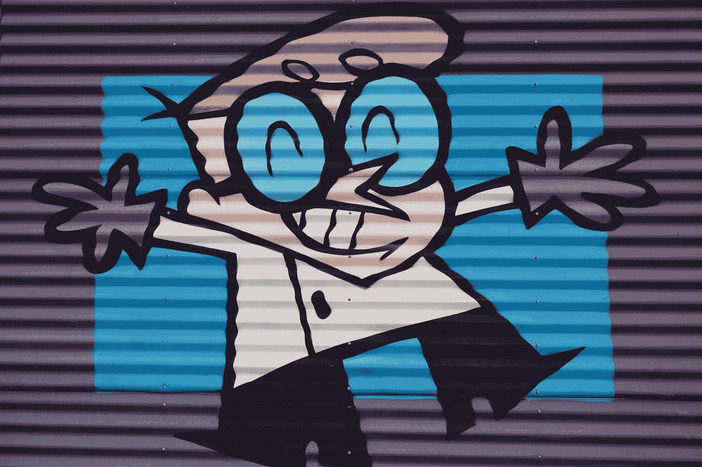
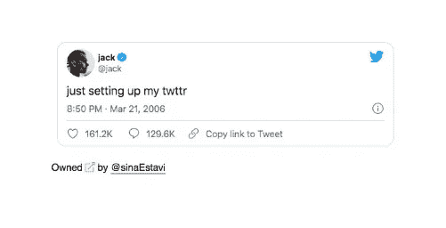

# 每个程序员都应该知道的关于 NFT 的一切

> 原文：<https://javascript.plainenglish.io/all-about-nft-that-every-programmer-should-know-bcb933d4e71b?source=collection_archive---------5----------------------->

## 解释什么是不可替代令牌(NFT)。

Photo by [Doug Maloney](https://unsplash.com/@dougmaloney?utm_source=medium&utm_medium=referral) on [Unsplash](https://unsplash.com?utm_source=medium&utm_medium=referral)

一个 **NFT** 或者一个**不可替代的令牌**是一个**数字资产**用一种叫做**区块链**的技术数字化存储。你可以像出售实物资产一样出售和交易它。

NFT 可以是任何可以在网上交易的东西，也可以是你创造的一段独特的代码。

在早期阶段，**数字艺术**是与 NFT 相关的主要来源。许多内容创作者创作了内容，并以独特的所有权以数字形式出售，获得了巨额利润。

 [## 埃隆·马斯克讨厌 Web 3.0、NFT 和区块链技术吗

### 埃隆·马斯克在 Web3.0 和 NFT 上发布的推文

medium.datadriveninvestor.com](https://medium.datadriveninvestor.com/does-elon-musk-hate-the-idea-of-web-3-0-nft-and-blockchain-technology-ff7b28601c17)  [## 什么是区块链，为什么所有程序员都应该了解它

### 一篇关于区块链的信息性文章。

javascript.plainenglish.io](/what-is-blockchain-and-why-all-programmers-should-know-about-it-897d73c24a75) 

Twitter 的联合创始人杰克·多西以大约 290 万美元的价格出售了 Twitter 上的第一条推文

实际上，一个名为 **Sina Esatavi** 的用户在 2021 年 3 月**日**21**的拍卖中，以大约 **50 比特币的价格购买了 Twitter 的第一条推文，这在当今市场上有着巨大的评价。****

**杰克·多西将他的 NFT 所得全部捐给了慈善机构。**

****

**NFT sold for 50BTC (first tweet on Twitter)**

**NFT 可以是任何东西。它可以是一个图标，迷因，标志，以及一切可以数字化创造的东西。**

**顾名思义，它是不可替换的。让我们用其他术语来理解它。**

**可替代的是具有完全相同价值的东西。**加里·维纳查克举了一个很好的例子，**拿一张**美元的钞票举例。如果你有两张 1 美元的钞票，它们的价值完全相同。因此，它是可替换的，或者用更简单的话来说，它可以被交换。****

****而 NFT 是同类中的一个，他们是独一无二的，可以暂时改变它的价值。****

**** [## 什么是加密货币？作为程序员可以做一个吗？

### 揭开加密货币的基础。

javascript.plainenglish.io](/what-is-cryptocurrency-can-you-make-one-as-a-programmer-5cc92bdfb651)**** 

****目前，由于人们的觉醒，NFT 正一如既往地蓬勃发展。由于 Meta( **脸书**)推出 Meta Verse，NFT 在未来几年肯定会成为趋势。****

****我希望这篇文章内容丰富，你喜欢阅读。祝你编程之旅好运。继续编程，继续练习。****

**** [## 通过我的推荐链接加入 Medium-Aniket

### 作为一个媒体会员，你的会员费的一部分会给你阅读的作家，你可以完全接触到每一个故事…

aniketz.medium.com](https://aniketz.medium.com/membership)  [## 绝对初学者的 Python 基础教程

### 用最简单的方式解释了 Python 的基础知识。

python .平原英语. io](https://python.plainenglish.io/fundamental-python-tutorial-for-absolute-beginners-2d848e66850d)  [## 2022 年的技术趋势

### 2022 年需要的技能。

javascript.plainenglish.io](/technologies-that-will-trend-in-2022-122d2dcf5ca3)  [## 编程前我优先考虑的 3 条黄金法则

### 即使有困难，我如何处理编程生活方式。

javascript.plainenglish.io](/3-golden-rules-i-prioritize-before-programming-d7286beb566b) 

*更多内容看*[***plain English . io***](http://plainenglish.io/)****