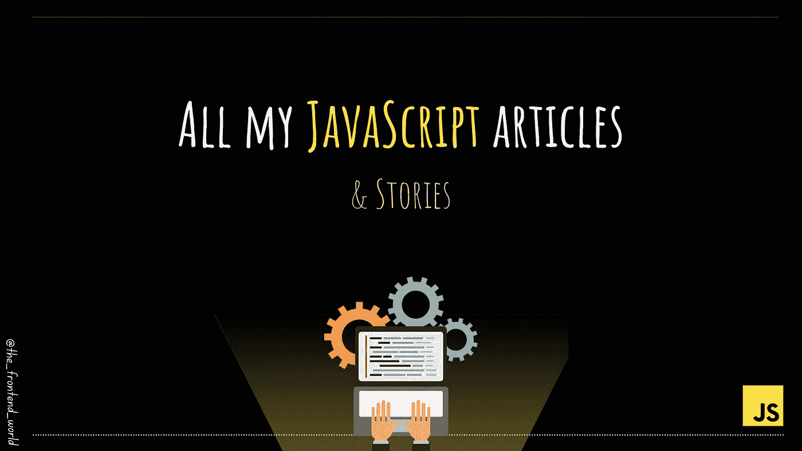

# 我所有的 JavaScript 文章

> 原文：<https://javascript.plainenglish.io/all-my-javascript-articles-7083f8b04fd0?source=collection_archive---------14----------------------->

## 给 web 开发人员的关于 JavaScript 的简短而有用的提示

By FAM

另一篇“*我的所有文章”*文章。😅

这篇文章是我在[推特](https://twitter.com/FatimaAMZIL9)上的忠实读者要求的。这是我的 JavaScript 文章。我希望你会喜欢它们！

> 特别的**发自内心的感谢**所有阅读、互动、创作和请求我的文章的忠实读者……你们是我每天的光明，是我每一次奋斗的力量❤

 [## JavaScript 中什么是事件循环？

### JavaScript 多线程背后的秘密。

javascript.plainenglish.io](/what-is-event-loop-in-javascript-917ca464808e)  [## 您应该尝试的 5 个有趣的 Web APIs

### 可以改变你的网络应用的网络应用编程接口

medium.com](https://medium.com/geekculture/5-interesting-web-apis-you-should-try-out-9d1dc8c2fef6)  [## 每个 Web 开发人员都应该知道的 JavaScript APIs

### 如何使用最强大的 JavaScript APIs 的实用指南。

javascript.plainenglish.io](/javascript-apis-every-web-developer-should-know-fa9b36cc1ecf)  [## Web 开发人员喜欢使用的 5 个超棒的 JavaScript 库

### 小的库可以在用户体验上产生巨大的差异。

levelup.gitconnected.com](https://levelup.gitconnected.com/5-awesome-javascript-plugins-web-developers-love-to-use-78009f563fb1)  [## 使用现代浏览器 JavaScript APIs 增强您的用户体验

### 4 个强大的 API，让用户在浏览网站时有更好的体验

levelup.gitconnected.com](https://levelup.gitconnected.com/enhance-your-user-experience-with-the-modern-browser-javascript-apis-7ab70464e695)  [## 如何像专业人士一样操作 JS 中的数组

### 关于在 JavaScript 中操作字符串的文章之后:数组也不例外！每个开发人员都操纵…

levelup.gitconnected.com](https://levelup.gitconnected.com/how-to-manipulate-arrays-in-js-like-a-pro-b8f6f5cff5ac?source=list-dab6fe391f94----b8f6f5cff5ac----12-------6e272dd3fa62---------------------)  [## 如何像专业开发人员一样操作 JavaScript 中的字符串

### 在 JS 中操作字符串要记住的 10 个主要方法

medium.com](https://medium.com/geekculture/how-to-manipulate-strings-in-javascript-like-a-professional-developer-6bec15b08cba)  [## 开发人员日常工作中需要的有用的 JavaScript 代码片段

### 有用的 JavaScript 代码片段。

javascript.plainenglish.io](/useful-javascript-snippets-you-need-in-your-everyday-tasks-as-a-developer-38541100bb39)  [## 编写简短智能 Javascript 代码的 9 个技巧

### 如何聪明地写 JavaScript 代码？

levelup.gitconnected.com](https://levelup.gitconnected.com/9-tricks-for-writing-short-and-smart-javascript-code-6c832290e0b1)  [## 学习 JavaScript 的五大免费网站

### 说到网站前端，JavaScript 是你必须学习的基础之一！

levelup.gitconnected.com](https://levelup.gitconnected.com/top-5-free-websites-to-learn-javascript-c164077d9f7)  [## JavaScript 中 null 和 undefined 有什么区别？

### Null 和 Undefined 的区别

javascript.plainenglish.io](/do-you-know-whats-the-difference-between-null-and-undefined-1d68bf56322b)  [## 类型脚本与 JavaScript

### TypeScript 和 JavaScript 有什么区别？Typescript 和 JavaScript 哪个更好？

famzil.medium.com](https://famzil.medium.com/typescript-vs-javascript-a1d24810dd6b) 

> 我今天的故事到此结束，希望你喜欢 it❤

如果你喜欢看我的文章… ♥️

 [## 如果你喜欢看我的文章… ♥️

### 如果你喜欢读我的文章… ♥️，当我的文章发表时，欢迎你第一个得到通知…

famzil.medium.com](https://famzil.medium.com/subscribe) 

> 谢谢你，❤

如果你有兴趣成为付费会员，你可以使用我的推荐链接。下次见

亲爱的读者，感谢你在我生命中的存在。

**让我们在** [**上取得联系**](https://medium.com/@famzil/)**[**Linkedin**](https://www.linkedin.com/in/fatima-amzil-9031ba95/)**[**脸书**](https://www.facebook.com/The-Front-End-World)**[**insta gram**](https://www.instagram.com/the_frontend_world/)**[**YouTube**](https://www.youtube.com/channel/UCaxr-f9r6P1u7Y7SKFHi12g)**或**********

******参见我的关于网络要素和一般文化的电子书。******

*******更多内容请看*[***plain English . io***](http://plainenglish.io/)******