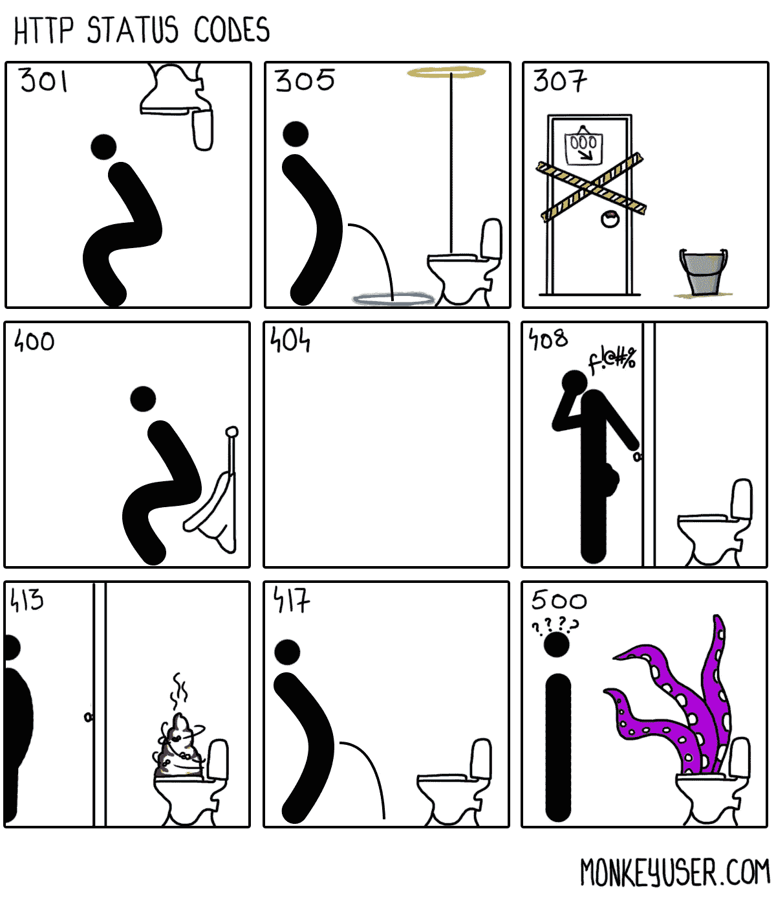

# 作为一名 Web 开发人员，您需要的所有 HTTP 响应状态代码！

> 原文：<https://javascript.plainenglish.io/all-the-http-response-status-codes-you-will-ever-need-as-a-web-developer-fee26d3706b4?source=collection_archive---------18----------------------->

在这篇短文中，我列出了作为 web 开发人员可能需要的所有 HTTP 状态代码。不要再拐弯抹角了，让我们开始吧！

首先，这些状态代码是什么？

> HTTP 响应状态代码指示特定的 HTTP 请求是否已经成功完成，并提供一些额外的信息。

有不同类型的状态代码:

> **信息回复→ 1xx**
> 
> **成功响应→ 2xx**
> 
> **重定向→ 3xx**
> 
> **客户端错误→ 4xx**
> 
> **服务器错误→ 5xx**

让我们逐一查看一下。

***注*** *:有些代码需要了解一些其他各种概念。如果您对任何状态代码感到好奇，一个简单的搜索将会给您足够的细节来深入研究它。*

**推荐文档浏览:**[https://developer.mozilla.org/en-US/docs/Web/HTTP/Status](https://developer.mozilla.org/en-US/docs/Web/HTTP/Status)

## 信息回复→ 1xx

> 100:继续
> 101:交换协议
> 102:处理(WebDAV)
> 103:早期提示

## 成功回复→ 2xx

> 200: OK
> 201:已创建
> 202:已接受
> 203:非权威信息
> 204:无内容
> 205:重置内容
> 206:部分内容
> 207:多状态(WebDAV)
> 208:已报告(WebDAV)
> 226:已使用 IM(HTTP Delta 编码)

## 重定向响应→ 3xx

> 300:多选
> 301:永久移动
> 302:找到
> 303:查看其他
> 304:未修改
> 305:使用代理
> 306:未使用
> 307:临时重定向
> 308:永久重定向

## 客户端错误响应→ 4xx

> 400:错误请求
> 401:未授权
> 402:要求付款。
> 403:禁用
> 404:未找到
> 405:方法不允许
> 406:不可接受
> 407:需要代理认证
> 408:请求超时
> 409:冲突
> 410:消失
> 411:需要长度
> 412:前置条件失败
> 413:有效负载过大
> 414 : URI 过长
> 414 我是茶壶
> 421:错误的请求
> 422:不可处理的实体(WebDAV)
> 423:锁定(WebDAV)
> 424:失败的依赖项(WebDAV)
> 425:太早
> 426:需要升级
> 428:需要前提条件
> 429:请求太多
> 431:请求头字段太大

## 服务器错误响应→ 5xx

> 500:内部服务器错误
> 501:未实现
> 502:错误网关
> 503:服务不可用
> 504:网关超时
> 505:不支持 HTTP 版本
> 506:变体也协商
> 507:存储不足(WebDAV)
> 508:检测到环路(WebDAV)
> 510:未扩展
> 511:需要网络认证

所以，这就是我在这篇文章中给你的全部内容。谢谢你一直读到最后。

顺便说一句，你可以看看我其他一些受欢迎的帖子:

[**脚本下载 Google Drive**](https://mohithgupta.medium.com/how-i-coded-a-script-to-download-the-download-restricted-files-of-google-drive-718e74c55a68?source=your_stories_page-------------------------------------)[**只需 1 次点击**](https://python.plainenglish.io/play-youtube-videos-in-vlc-with-just-1-click-2baca84c03f3)[**就能在 VLC 播放 YouTube 视频我黑了 Chrome 恐龙游戏。下面是我如何将**](/an-immortal-dinosaur-and-the-fastest-too-hack-the-dino-game-7c5716c53e8b)[**转换成你的。py '到 a '。exe '文件，只有两个命令**](https://python.plainenglish.io/convert-your-py-to-exe-with-just-2-commands-4c6cefe9af4c)

希望你喜欢阅读这篇文章。下一集见。阿德乌斯。

如有任何疑问或其他问题，你可以在推特上找到我，或者在 mohithguptak@gmail.com 联系我。

*更多内容请看*[***plain English . io***](http://plainenglish.io/)