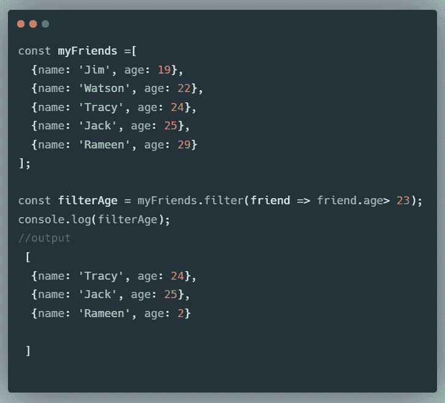

# React 之前需要学习的所有 JavaScript

> 原文：<https://javascript.plainenglish.io/all-the-javascript-you-need-to-learn-before-react-294d36b9f791?source=collection_archive---------9----------------------->

## 本文中的类、this、Rest、Spread 等等

Photo by [Arian Darvishi](https://unsplash.com/@arianismmm?utm_source=medium&utm_medium=referral) on [Unsplash](https://unsplash.com?utm_source=medium&utm_medium=referral)

我们都经历过这个阶段。您刚刚完成一门在线课程或其他自学资源，对 JavaScript 有所了解，现在显而易见的选择是学习一些 JavaScript 框架。但是接近你的第一个 js 框架真的很可怕。但是我请求你不要就此打住，我们都曾经怀疑我们还没有准备好，这是每个开发者都要经历的事情。

在这篇文章中，我将使你向 React 框架的过渡更加容易。我已经列出了 React Js 中最常用的 JavaScript 概念。

在进入 React Js 之前，您需要首先确保您已经学习了 JavaScript 的基础知识。但即使在那之后，你也有可能没有理解 React Js 所要求的概念，所以请把这篇文章读完，即使你觉得太容易或太无聊，至少浏览一下。

> “如果你不能简单地解释它，你就不够了解它。”
> 
> ——阿尔伯特·爱因斯坦

编码是一个持续的旅程，你在途中学习。你需要明确一点，这个世界上没有人完全准备好去做一件事。你只需要做这些事情。

我总是做一些我还没准备好去做的事情。我认为这是你成长的方式。

我们走吧！

## 我们将涵盖的内容

*   **Es6 类**
*   **数组函数(尤其是滤镜和贴图)你会经常用到！**
*   **箭头功能**
*   **假设和常数**
*   **进出口**
*   **散歇符**
*   **“这个”概念**

## 使用 Let 和 Const 变量

之前`var`用于设置新变量，但随着 ES6 的更新`let` let 和`const`被引入。

但是`var`和`let` 和`const` 有什么区别呢？

## 范围

变量是全局作用域或可访问的。这意味着当它们在函数之外被声明时，它们在整个文件或窗口中都是可访问的。这可能很危险，因为您可能在不知道的情况下更改它，因此会出现很多错误。

而另一方面`let`和`const`具有阻挡范围。这意味着当它们在函数或任何代码块中被声明时，它们不能在函数或代码块之外被访问。因此，您不能通过在函数外部操纵或重新声明同一个变量来轻易地破坏您的代码。

## 重新分配

Var 变量可以很容易地重新赋值和更新，let 可以更新但不能重新赋值，const 既不能重新赋值也不能更新，它是常量(不变)。

## 箭头功能

当我开始学习箭头函数时，获得保持箭头函数有点困难，我花了一些时间来适应它。

箭头函数简短而直截了当。它们与常规函数几乎相同，但语法更少。

**注意:**箭头函数在现代框架中被大量使用，是必须要学习的。

## ES6 类

类是另一种类型的函数，由关键字`class`声明，可用于创建新对象。一个类包含属性和方法。

`constructor method`用于初始化由类本身创建的对象，我们使用`this`关键字来引用当前的类。StudentName 类中的 eg`this`指的是 StudentClass。

类中使用最多的东西之一是继承

我们在类中使用`extends`来继承另一个类的属性。
在下面的示例中，TopStudents 类从 StudentName 类继承属性和方法。super 方法用于调用父构造函数。在我们的例子中，它将调用 TopStudent 类的构造函数。

## 进口和出口

您可以将函数存储在一个 Javascript 文件中，然后通过导入文件或特定的函数来导出它，以便在另一个 Js 文件中使用。组织代码结构非常方便。

如何导出一个文件或者一些函数？
从文件中导出一个主要内容时，您可以使用默认值。

如何导入文件

## 传播和休息运算符

当我第一次听说这个操作符时，我非常好奇为什么只有三个点就能如此强大、简单而又易于使用。对我来说，这三个点就像魔术一样，是复制引用类型的安全方法，没有任何问题。

spread and rest 运算符使用三个点(。。。)来初始化它。

spread 运算符用于拆分一个数组的值，并将它们添加到另一个数组中。就像 spread 运算符将一个数组的值传播到另一个数组中一样。
同样的道理也可以用于物体。

## rest 运算符

该运算符用于表示函数中无限数量的参数。

相反，我们需要指定我们将为一个函数提供多少个参数，但是如果我们不知道我们将需要多少个参数呢？rest 操作符来了，你可以指定无限数量的参数。

## 数组函数

数组函数并不新鲜，但了解和实践它们仍然很重要。在 react 中，处理数据时广泛使用映射和过滤方法。

Filter 方法
filter 方法创建一个新的元素数组，该数组从传递的回调函数中返回 true，并过滤掉其余的元素。

在上面的例子中，它只返回 23 岁以上的人的对象。

Map 方法
map 方法从回调函数的结果中创建一个新的数组。对数组上的每个索引调用回调。索引是数组中的元素。让我们看一个例子。

## 这

这是你在学习 JavaScript 时面临的最恐怖最麻烦的事情之一。一开始很混乱，很荒谬，但是学习它将会是值得的。第一次尝试时你可能不会明白，但是别担心，几乎每个人都会遇到这种情况。

JavaScript `this`关键字指的是它所属的对象。

这里的`this`指的是对象人。

# 结论

为了过渡到 react，先学习 JavaScript，不要急着学习课程或文档。花几周或几个月的时间来确保你理解了普通的 JavaScript。我再说一遍，不要急。不知道一些概念会让你的反应之旅很痛苦。

我已经列出了您开始 React 之旅所需的概念，但请记住这不是全部。

感谢阅读，我希望你喜欢这篇文章。

*更多内容尽在*[***plain English . io***](http://plainenglish.io/)