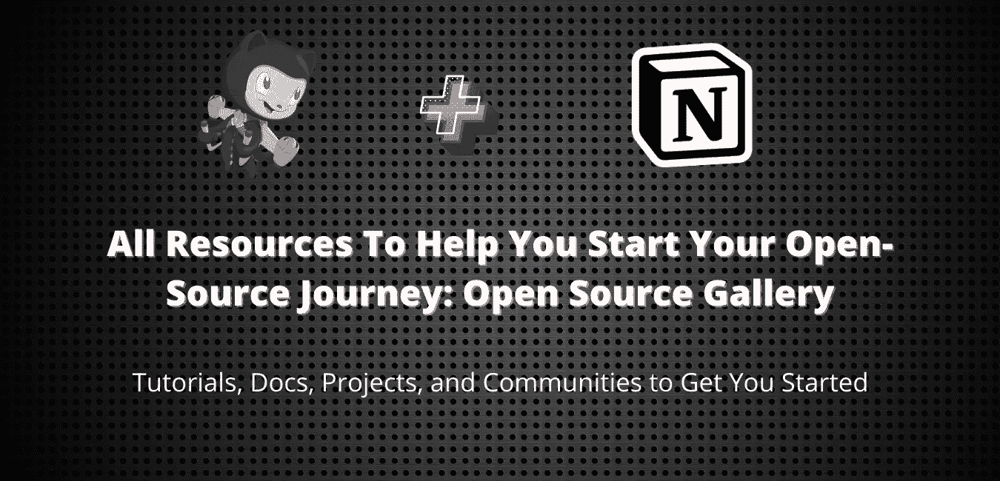

# 帮助您开始开源之旅的所有资源:开源库

> 原文：<https://javascript.plainenglish.io/all-the-resources-to-help-you-start-your-open-source-journey-open-source-gallery-ebb2456af057?source=collection_archive---------10----------------------->

你想开始你的开源之旅吗？不知道从哪里开始？根据您的技术水平，很难找到合适的项目？那么这篇文章就送给你了。在这篇文章中，我将讨论一个资源库，它是我为帮助初学者进入开源世界而策划的。

# [开源图库](https://github.com/Astrodevil/Open-Source-Gallery)

# About❓

你是初学者吗？想开始开源？不知道如何、从哪里、为什么开始？

不客气！你来对地方了。😊

开源库为你提供了成为一个好的开源者所需的所有资源。

动机🎯这个项目的目的是帮助像你这样的初学者熟悉开源世界。

# 内容🔥

每个学习者都有不同的偏好，有些人觉得文档很容易理解和学习，有些人更喜欢视频。在管理这些资源时，我已经考虑到了所有这些。

即使愿意开始，新手也很难找到项目和社区，我已经注意到了这一点。

开源图库包括:

*   录像📹
*   文章📝
*   Projects🦾
*   Opportunities☕项目和实习
*   团体🔥
*   基 Peoples🧑‍💻

# 什么 Else⚡

除了开源之外，我还包括了一些[其他资源](https://github.com/Astrodevil/Open-Source-Gallery#more-resource-gallery)和资源图库。希望对你的学习有帮助。

这个资源库最初是由 idea 策划的，但现在它托管在 GitHub 上。如果你觉得这很有帮助，别忘了在 GitHub 上给它一个 [⭐](https://github.com/Astrodevil/Open-Source-Gallery) 。

快乐学习。👍

那么，你还在等什么？[从这里开始](https://astrodevil.github.io/Open-Source-Gallery/)

# 最终 Words✅

开源图库旨在帮助每个人，它将不断更新新的有价值的资源。因此，欢迎大家向[资源库](https://github.com/Astrodevil/Open-Source-Gallery)添加更多资源，并与 2022 年将开始开源的所有人分享。

别忘了在 GitHub 上给它一个 [⭐](https://github.com/Astrodevil/Open-Source-Gallery) 。

## 如果你❤️我的内容！在推特上联系我或者给我买杯咖啡来支持我

*更多内容看* [*说白了. io*](http://plainenglish.io/) *。报名参加我们的* [*免费每周简讯*](http://newsletter.plainenglish.io/) *。在我们的* [*社区*](https://discord.gg/GtDtUAvyhW) *获得独家写作机会和建议。*