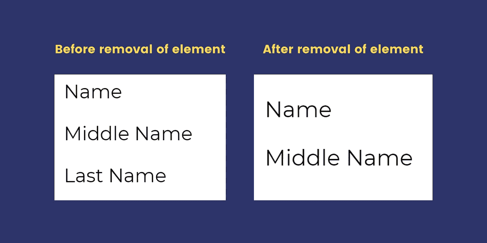

# JavaScript DOM 入门所需的一切

> 原文：<https://javascript.plainenglish.io/all-you-need-to-get-started-with-javascript-dom-d8c5dae38f02?source=collection_archive---------2----------------------->

JavaScript DOM 使 Web 开发人员能够访问和操作 HTML 和 CSS 文档的内容。在本文中，我们将简要介绍 JavaScript DOM 及其不同的属性。您将深入了解所有属性和示例。

## 目录

1.  [简介](#c875)
    ——什么是 DOM？
    -DOM 能做什么？
    -什么是方法和属性
2.  [使用 JavaScript 选择 HTML 元素](#445f)
3.  [JavaScript 中的查询选择器](#b3a2)
4.  [使用 JavaScript 更新 HTML](#1c08)
5.  [使用 javaScript 更新样式](#58df)
6.  [使用 javaScript 处理事件](#e6e9)
7.  [使用 JavaScript 添加 HTML 元素](#c1e4)
8.  [使用 JavaScript 删除 HTML 元素](#4bf6)
9.  [使用 JavaScript 添加/删除类](#5502)
10.  [使用 JavaScript 获取元素样式值](#731c)
11.  [结论](#b2c5)

# 介绍

这篇文章是关于 JavaScript 文档对象模型及其不同的方法。我们假设你理解了 HTML 和 CSS 的基础知识。


Introduction to Javascript DOM | Web Development

## 什么是 DOM？

文档对象模型(DOM)是 web 文档的编程接口。开发人员可以操纵文档的内容，如结构、样式和元素。

当网页被加载时，浏览器创建整个页面的文档对象模型。这个文档使 JavaScript 能够访问和操作网站的元素和样式。它是 HTML 文档的树形表示。

## DOM 能做什么？

在对象模型的帮助下，JavaScript 可以对 HTML 树结构做任何你想做的事情。它可以做以下事情:

1.  添加新元素和属性。
2.  更改元素和属性。
3.  更改元素的样式。
4.  移除和更新现有元素和属性。
5.  添加并收听`onClick`、`onScroll`等事件。

HTML 代码的树状表示如下所示:


Image by Author, inspired by [www.w3schools.com/](https://www.w3schools.com/).

所以，现在你明白了 DOM 是什么，它能做什么。现在让我们看看如何使用它来操作我们的 HTML。

## 什么是方法和属性？

在 JavaScript DOM 中，**方法**是您可以执行的操作(在 HTML 元素上)。**属性**是可以设置或更改的(HTML 元素的)值。我们通过一个例子来理解这一点。

**Example: Methods and Properties**

这里，我们试图操作其 id 为 test 的段落标记的内容。`getElementById()`是**方法**，因为我们正在对一个 id 为 test 的元素进行操作。而`innerHTML`是**属性，**改变所选 HTML 元素的值。

# 1.使用 JavaScript 选择 HTML 元素

让我们看看使用 JavaScript DOM 选择 HTML 元素的最常见方法。


Selecting HTML elements

## ⅰ.按 ID 获取元素

`getElementById()`是一个 JavaScript DOM 方法。它接受 HTML 元素 ID，并返回与该 ID 匹配的 HTML 元素。如果文档中没有匹配的 Id，那么它将返回 NULL。

**语法**:

```
var selected_element = document.getElementById('ID');
```


Get element by ID

## ⅱ.通过类名获取元素

这是 JavaScript DOM 方法之一。它接受 HTML 元素类字符串作为参数，并返回与该类名匹配的元素数组。

**语法**:

```
var selected_element = document.getElementsByClassName('class-name-string');
```


Get element by Class Name

如果没有找到匹配，那么它返回一个空数组。

## ⅲ.通过标记名获取元素

`getElementById()`是一个 JavaScript 方法，它接受 HTML 元素 ID，并以 JavaScript 数组的形式返回与该 ID 匹配的 HTML 元素。

**语法**:

```
var selected_element = document.getElementsByTagName('Tag-name');
```


Get element by Tag Name

如果没有找到匹配，那么它返回一个空数组。

# 2.JavaScript 中的查询选择器

查询选择器是一种 DOM 方法，允许您使用 CSS 选择器来选择 HTML 元素。这是选择 HTML 元素的新方法。


Select using CSS selectors | Query Selector

查询选择器接受 CSS 选择器字符串，并返回与该字符串匹配的 HTML 元素。让我们看看它们的类型和语法。

注意:一些旧的浏览器不支持查询选择器。

## 有两种类型的 CSS 选择器

有两种类型的查询选择器。

**ⅰ** 。**query selector(' CSS-selector ')**:选择第一个匹配指定 CSS 选择器的 HTML 元素。


Query Selector

**ⅱ。query selector all(' CSS-selector ')**:选择所有与指定 CSS 选择器匹配的 HTML 元素。


Query Selector All

**通过 id 选择器选择:**

这将选择 id 等于 navbar 的第一个 HTML 元素。

```
var navbar = document.querySelector(‘#navbar’)
```

**通过类选择器选择:**

第一行代码将选择第一个出现的类。`div-content`。而第二行将选择类名为`div-content`的所有元素

```
var data = document.querySelector(‘.div-content’)var data = document.querySelectorAll(‘.div-content’)
```

**按标签选择:**

如上所述，第一行将选择第一次出现的`h1`标记。但是第二行将从 HTML 文档中选择所有的`h1`标签。

```
var head = document.querySelector(‘h1’);var heads = document.querySelectorAll(‘h1’);
```

# 3.使用 JavaScript 更新 HTML

HTML 文档模型允许用户使用 JavaScript 更新元素的内容和属性。


Update HTML using JavaScript

## ⅰ.更新元素的内容

使用名为`innerHTML`的属性，用户可以很容易地改变任何 HTML 元素的内容。下面是相同的语法。

```
var old_HTML = document.getElementById(‘ID’);old_HTML.innerHTML = new HTML;
```

**示例**:

**Example: Updating the content of elements**

第 13 行将替换`h1`欢迎来到 Hello World 的内部 HTML。第 16 行将在`div` 标签中添加一个新的`h1`标签。

## ⅱ.更新元素的属性

使用 JavaScript，还可以使用 DOM 更改任何元素的属性值。您只需要使用点运算符来更改特定的属性。

这里，我们将背景图像的`src`改为“new_bg.png”

```
var bg_img = document.getElementById(‘background’);
bg_img.src = 'new_bg.png'
```

**示例**:

**Example: Updating Attributes of elements**

JavaScript 的这两行，15 和 18 将用`new_bg.png`替换图像`bg-1.png`

# 4.使用 JavaScript 更新样式

使用 DOM 属性，您可以更新 HTML 元素的样式。让我们看看怎么做。


Update Style using JavaScript

**语法:**

```
var selected_element = document.getElementById('ID')
selected_element.style.{prop-name} = values;
```

**示例**:

**Example: Update styles using JavaScript DOM**

第 30 & 31 行将`div`元素的背景颜色从`“aquamarine”`更改为`“orange”`

CSS 属性需要以 camel 格式编写，而不是普通的 CSS 属性名。例如:使用`borderRadius` 代替`border-radius`

# 5.使用 JavaScript 处理事件

当用户在网页上执行某个操作时，该操作称为事件。事件的例子包括，

*   在某个元素上单击鼠标。
*   将鼠标悬停在特定元素上。
*   按键盘上的按钮。
*   调整浏览器窗口的大小。
*   关闭浏览器窗口。
*   播放视频、暂停视频、提交表单等。

对这些事件的反应被称为**事件监听**或**事件处理**。


Handling Events

## 如何在 JavaScript 中处理事件？

处理事件有两种方法。第一个使用事件属性，另一个使用`[addEventListener](https://developer.mozilla.org/en-US/docs/Web/API/EventTarget/addEventListener)()`功能。让我们来看看它们各自的语法。

## ⅰ.使用事件属性

**语法:**


Handling Events Using Events Properties

## ⅱ.使用 addEventListener()函数

**语法:**


Handling Events Using addEventListener() function

**用两种方法处理事件的例子:**

**Example: Handling event**

第 19 行使用事件属性处理事件，而第 20 行使用`addEventListener()`函数。

# 6.使用 JavaScript 添加 HTML 元素

要创建新的 HTML 元素，首先，您需要熟悉节点关系。因为，要向 HTML DOM 添加新元素，必须首先创建元素子节点，然后将其附加到现有的父元素。

## 节点关系

DOM 中的节点像树一样结构化。它们与其前面和后面的元素有层次关系。从下面的图片中你会有一个清晰的认识。


Node Relationship | Javascript

所以，从上图，我们可以理解。为了在 HTML 中添加新元素，我们需要执行以下步骤:

1.  创建一个子节点。
2.  如果要将文本节点附加到子节点，请创建一个文本节点。
3.  使用`appendChild()`函数将这个子节点附加到主父节点。

**添加新 HTML 元素的示例**


Add HTML child Node-1


Add HTML child Node-2

**代码相同:**

**Example: Adding new HTML element**

**添加元素后&之前的输出:**


Output: before & after addition of an element:

如果想在某个特定元素之前添加新元素，可以使用`insertBefore()`功能。

`eg: document.body.insertBefore(div, currentDiv);`

# 7.使用 JavaScript 删除 HTML 元素

如果你明白，如何添加 HTML 元素。那么移除元素就比这简单多了。您需要:

1.  选择要删除的孩子的父母。
2.  选择要删除的子节点。
3.  使用`{Parent}.removeChild({child})`功能删除孩子。

**移除 HTML 元素的例子。**


Remove HTML child Node Javascript

**代码相同:**

**Example: Remove HTML elements**

**移除元件后&之前的输出:**



Output: before & after removal of an element:

# 8.使用 JavaScript 添加/删除类

现代浏览器让我们可以访问一个叫做 ClassList 的属性。这个类列表包含了一个 HTML 文档的所有类。因此，我们可以简单地从这个列表中添加/删除类来完成我们的工作。

**语法见类列表:**

```
var selectedElement = document.getElementById('main-heading');
console.log(selectedElement.classList);*// This will print all the classes present in selectedElement.*
```


Add/ remove classes using JavaScript DOM

## ⅰ.添加类别:

为了添加一个新类，我们使用了一个叫做`add()`的方法。下面是语法。

```
var select_element = getElementById('ID')
select_element.classList.add('new class')
```

## ⅱ.移除类别:

我们使用`remove()`函数从 DOM 中移除一个类。下面是语法。

```
var select_element = getElementById('ID')
select_elememt.classList.remove('Class')
```

**在元素中添加/移除类的示例:**

**Example: Add/remove class using javascript**

第 37 行添加了一个类`shadow`，而第 40 行从`div` 元素中删除了类`container` 。

**输出:**


**Output: Add/remove class using javascript**

# 9.使用 JavaScript 获取元素样式值

在前一点中，我们看到了如何更新 HTML 元素的样式。现在让我们看看如何获得一个对应于特定 HTML 元素的样式。


Get Element style value

```
var selected_element = getElementById('ID');
console.log(selected_element.style);
```

上面的代码块将给出 style 对象，该对象包含与之相关的所有内联样式的列表。可以使用以下语法打印特定样式属性的值。

**获取内联 CSS 的语法:**

```
var selected_element = getElementById('ID');
console.log(selected_element.style.{inline-style-property});
```

*   **注意:**我们需要将 CSS 属性名转换成 camelCase。

但是，问题是这个方法**只给出了与 HTML 相关的内联 CSS 属性**。为了从 CSS 文件中获取样式属性，我们需要使用另一个叫做`window.getComputedStyle()`的方法

**获取非内联 CSS 的语法**:

```
var selected_element = getElementById('ID');
console.log(window.getComputedStyle(selected_element).{style-prop});
```

**获取 CSS 样式的示例(内联&非内联)**:

**Example: Get Element style value**

**输出:**


**Output: Get Element style value**

# 结论:

这就是关于 JavaScript 文档对象模型的全部内容。希望这篇文章能帮助你清楚地理解 DOM 方法。现在，您可以使用 JavaScript 轻松操作 HTML 文档的元素和样式。

你觉得这有帮助吗？如果是，那么请跟随我&与其他开发者分享，他们可能需要这个。您也可以在下面的评论框中留下您的观点和建议。

你也可以[订阅我的时事通讯](https://atharvayadav.medium.com/subscribe)把我的文章直接发到你的邮箱里。

*更多内容看* [***说白了就是***](http://plainenglish.io/) ***。*** *报名参加我们的* [***免费每周简讯这里***](http://newsletter.plainenglish.io/) ***。***