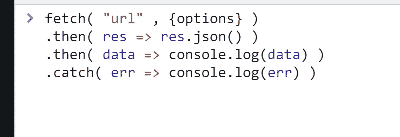
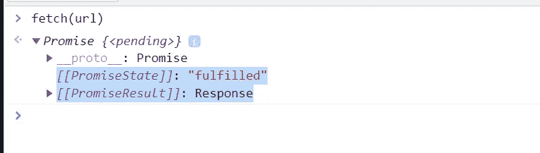
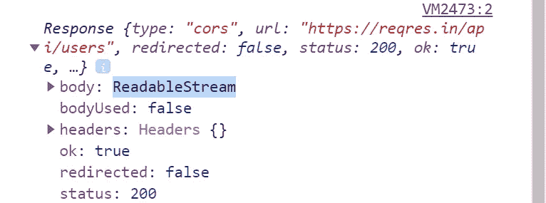
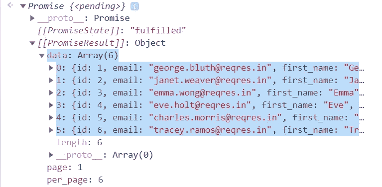
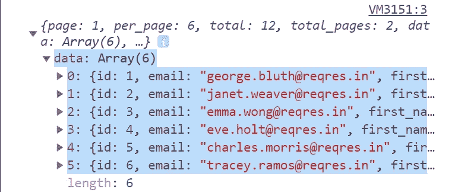
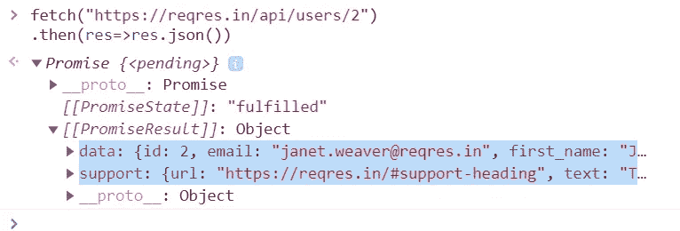
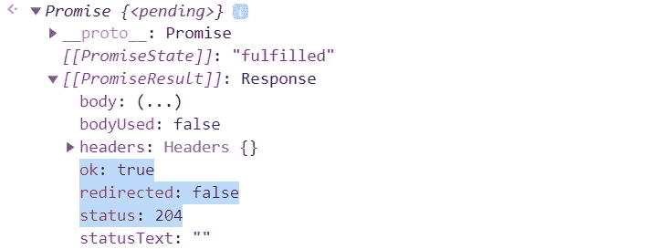
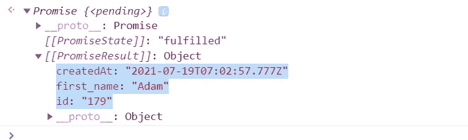
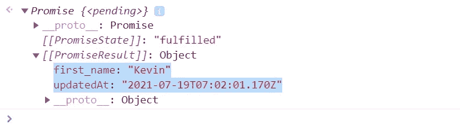

# 关于 JavaScript 中的“获取 API ”,您需要知道的就是

> 原文：<https://javascript.plainenglish.io/all-you-need-to-know-about-the-fetch-api-6929930572a8?source=collection_archive---------6----------------------->

## JavaScript 中的获取 API 教程



嘿，希望你今天过得愉快，即使你并不愉快，让我们通过学习“获取 API”来使它变得愉快。通过学习获取 API，您将能够以自己的方式获取您想要的数据。

在这篇文章中，我们将了解以下内容:

*   **什么是获取 API？怎么用？**
*   **不同的方法在里面→ get，post，put，delete**

> 在[续帖](https://mohithgupta.medium.com/handling-unsuccessful-calls-of-fetch-api-7eef551b74c8)中，我已经讨论过如何处理`fetch()`的不成功调用。如果你愿意，你可以直接跳到那个。

**先决条件** : [箭头功能](https://www.w3schools.com/js/js_arrow_function.asp)和[承诺](https://developer.mozilla.org/en-US/docs/Web/JavaScript/Reference/Global_Objects/Promise)。
前方长帖，抓牢！但是我为每样东西都添加了图片，这样就不会那么无聊了。

## 什么是 Fetch API？

它内置于浏览器中，对不同的网络资源发出异步请求。

**语法** : fetch("URL") →默认方法将是`GET`，为了接收数据
我们可以为其他目的添加选项，我们将在后面讨论。

一些值得注意的要点:

> Fetch 总是返回，我们称之为“[承诺](https://developer.mozilla.org/en-US/docs/Web/JavaScript/Reference/Global_Objects/Promise)
> 
> Fetch 总是成功的或者得到一个响应，除非有某种网络错误，比如 DNS 查找失败(我们将在下一篇文章中利用这一点)

当然，“我不知道谁还在用它”浏览器也就是 IE ( [Internet Explorer](https://en.wikipedia.org/wiki/Internet_Explorer) )不支持 fetch 调用。

出于 using 的目的，我们将使用开源 API `[https://reqres.in/api/users](https://reqres.in/api/users)`。让我们将它存储在一个变量 url 中以备将来使用。

```
let url = "[https://reqres.in/api/users](https://reqres.in/api/users)"
```

因此，要进行 fetch，需要两个参数，即“URL”和一个对象“options”。只有“URL”是必需的，如果没有提供，该方法默认设置为`GET`。

```
fetch( url , {options} )   
// url must be a string and an object with required options
```



我们得到一个承诺，显示“状态”为“完成”，结果我们得到一个“响应”。让我们获取响应并在控制台记录它，看看我们在那里有什么。我们使用`.then()`，因为承诺是由`fetch()`返回的。

```
fetch(url)
.then( response => console.log(response) )
```



因此，我们有一个“可读流”的主体，为了能够读取它，我们需要返回一个 JSON 格式的响应。为此，我们使用了`.json()`方法。

```
fetch(url)
.then(response => response.json())
```



您可以看到，我们有一个包含所需数据的对象数组。
为了从这个响应中提取数据，我们可以再次使用`.then()`方法来获取数据并在控制台记录它。这是可能的，因为`.then()`也返回一个承诺。所以，可以有一连串的方法。

```
fetch(url)
.then(response => response.json())
.then(data => console.log(data))
```



您可以看到，我们只有以对象数组形式存在的所需数据。

## 不同的方法:

现在，到了第二个参数`fetch()`，它包含了不同的方法→选项对象

目前提取选项:

> 方法→HTTP-方法(GET、POST、PUT、DELETE)
> 
> 头→带有请求头的对象(不允许任何头)
> 
> body →作为字符串、FormData、BufferSource、Blob 或 UrlSearchParams 对象发送的数据(请求正文)

对于方法`GET`和`DELETE`，我们不需要头部或主体。但是要获得特定的用户数据或删除用户，我们需要用户的 id，它通常是表示特定用户的整数。

**GET:** 由于默认方法是`GET`，我们甚至不需要包含 options 对象。默认情况下，上述所有调用都使用`GET` 作为方法。

要获取特定用户数据→在 url 末尾添加 id:

```
fetch(url + "/2") // 2 is the id of that user
.then(res=>res.json())
```



> 对于删除、更新、创建，我们可以看到状态以确认或者只返回`response.json()`以检查调用是否成功。以“ok : true & status code: 2xx”的形式收到一条成功消息，我已经包含了所有这些情况的图像，请耐心等待。

**删除:**删除 id 为“2”的用户:

```
fetch("https://reqres.in/api/users/2", { // full url can be written
method : 'DELETE',
}) // headers and body are not required
```



> **POST:** 创建一个新用户，我们使用`POST` 方法，更新用户数据，我们使用`PUT` 方法。对于这两种方法，我们必须提供标题和正文，让浏览器知道我们正在发送什么类型的数据(在标题中提到)和我们正在发送什么数据(在正文中提到)

创建新用户→为创建的用户设置新 id:

```
fetch(url, {
    method : 'POST',
    headers: { 
      'Content-type': 'application/json; charset=UTF-8'  
      },
   // Indicates the content type as "json"(you can omit the charset)

    body: JSON.stringify( { 
      first_name : "Adam",
    } )
   // we must provide body data in JSON string format
   // hence we convert it with JSON.stringify()})
.then(res=>res.json())
```



> **PUT:** 更新用户数据→我们必须在 url:

```
fetch("https://reqres.in/api/users/3", {
    method : 'PUT',
    headers: {
      'Content-type': 'application/json; charset=UTF-8'  
    },
    body:JSON.stringify({
        first_name : "Kevin",
    })
})
.then(res=>res.json())
```



最后，我们完成了不同的方法。但这并不是结束。我们还有更多。今天到此为止，下一篇文章继续。哇，尽管帖子很长，你还是坚持到了最后。拍拍你的背，你值得一些表扬。

在下一篇的[文章中，我将讨论如何捕捉错误或不成功的请求，这些错误或请求是我们无法捕捉的，必须以不同的方式处理。
因此，请关注并关注下一篇文章。我希望你能从这篇文章中学到一些东西。](https://mohithgupta.medium.com/handling-unsuccessful-calls-of-fetch-api-7eef551b74c8)

请考虑通过在评论区提供反馈和建议来表达你的感激之情。

如果你太高兴，你可以请我喝杯咖啡😉


你可以看看我其他的一些帖子:

[只需点击一下](https://python.plainenglish.io/play-youtube-videos-in-vlc-with-just-1-click-2baca84c03f3)
[“转换你的”,即可在 VLC 播放 YouTube 视频。py '到 a '。我编写了一个脚本来下载 Google Drive 的“下载受限”文件](https://python.plainenglish.io/convert-your-py-to-exe-with-just-2-commands-4c6cefe9af4c)

*如有进一步疑问，可在 mohithguptak@gmail.com ping 我或在*[*Twitter*](https://twitter.com/tobeawebdev)*上找我。*

*更多内容请看*[***plain English . io***](http://plainenglish.io/)