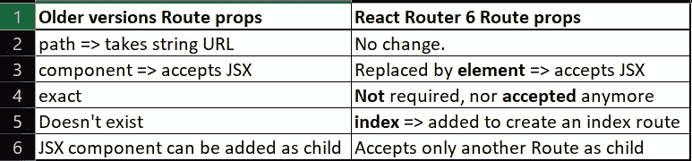

# 关于新款 React 路由器 6，您需要了解的所有信息

> 原文：<https://javascript.plainenglish.io/all-you-need-to-know-about-the-new-react-router-6-987a7b3085dc?source=collection_archive---------3----------------------->


Photo by [Joseph Barrientos](https://unsplash.com/@jbcreate_?utm_source=medium&utm_medium=referral) on [Unsplash](https://unsplash.com?utm_source=medium&utm_medium=referral)

2021 年 11 月， [React 路由器 6](https://reactrouterdotcom.fly.dev/docs/en/v6/getting-started/overview) 最终版本发布。它引入了许多突破性的变化。让我们深入了解一下，熟悉一下最新的变化。

[**此处代码可用**](https://codesandbox.io/s/react-router-6-demo-97d7q?file=/src/index.tsx)

1.  **将应用程序连接到浏览器 URL 没有变化。**
2.  `**Link**` **组件也没有变化。**
3.  先前版本中的`**Switch**` **组件被** `**Routes**` 组件替换。

`Routes`只接受`Route`组件或`React.Fragment`为子组件。

**4。** `**Route**` **组件道具也随之改变。下表总结了这些变化:**



我们现在可以添加一个嵌套路由，方法是将一个路由作为子路由添加到父路由。有了嵌套路由，我们不需要在子路由中添加父路径。

但是对于嵌套的 route，需要在父 route 元素中添加一个额外的组件— `Outlet`来呈现子 route 元素。没有`Outlet`组件，将不会呈现子路线元素。

有了所有这些变化，index.js 看起来像这样:

src/index.js

```
import { render } from "react-dom";
import { BrowserRouter, Route, Routes } from "react-router-dom";
import Component1 from "./components/Component1";
import Component2 from "./components/Component2";
import Component3 from "./components/Component3";
import NotFoundPage from "./components/NotFoundPage";import App from "./App";const rootElement = document.getElementById("root");
render(
  <BrowserRouter>
    <Routes>
      <Route path="/" element={<App />}>
        <Route path="expenses" element={<Component1 />} />
        <Route path="invoices" element={<Component2 />} />
        <Route path="invoice/:id" element={<Component3 />} />
        <Route path="*" element={<NotFoundPage />} />
      </Route>
    </Routes>
  </BrowserRouter>,
  rootElement
);
```

**5。现在可以很容易地添加不匹配路线。**

```
<Route path="\*" element={<NotFoundPage />} />
```

**6。读取 URL 参数和查询(搜索参数)**

[**此处代码可用**](https://codesandbox.io/s/react-router-6-demo-97d7q?file=/src/index.tsx)

一、URL Params: `useParams()`返回以参数名为关键字的对象。

```
import { useParams } from "react-router-dom";const Component3 = () => {
  // for Route => <Route path="invoice/:id" element={<Component3 />} />

  const { id } = useParams(); return (
    <div>
      <h1>Component3</h1>
      <p>Param: {id}</p>
    </div>
  );
};export default Component3;
```

二。URL 查询参数:`useSearchParams()`返回`searchParams`对象和`setSearchParams`函数。

`searchParams`是一个 [URLSearchParams](https://developer.mozilla.org/en-US/docs/Web/API/URLSearchParams) 对象。

```
import { useSearchParams } from "react-router-dom";const Component1 = () => {
  let [searchParams, setSearchParams] = useSearchParams();
  console.log(searchParams.get("name")); return (
    <div>
      <h1>Component1</h1>
      <p>You have entered following value for "name" query parameter:</p>
      {searchParams.get("name")}
    </div>
  );
};export default Component1;
```

**7。像比赛，位置，历史这样的道具在 React Router 6 中是没有的。**

**8。** `**Redirect**` **替换为** `**Navigate**` **。**

有了`Navigate`组件，我们可以送以下道具:

```
<Navigate to="/dashboard" replace={true} state={from: location}/>
```

9。 `**useHistory**` **钩被`**useNavigate**`**钩取代。

`useNavigate`钩子返回一个函数，让你以编程方式导航。

```
import { useNavigate, useLocation } from "react-router-dom";

function SignupForm() {
  let navigate = useNavigate();
  let location = useLocation();

  async function handleSubmit(event) {
    event.preventDefault();
    await submitForm(event.target);
    navigate("../success", { replace: true, state: {from: location}});
    // navigate(-1) ==> goes back to last route
  }

  return <form onSubmit={handleSubmit}>{/* ... */}</form>;
}
```

`navigate`函数有两个签名:

*   要么传递一个带有可选的第二个`{ replace, state }`参数的`To`值(与`<Link to>`类型相同),要么
*   在历史堆栈中传递你想要的增量。比如`navigate(-1)`就相当于打了后退键。

10。 `**useLocation**` **还是老样子。**

```
import * as React from 'react';
import { useLocation } from 'react-router-dom';

function App() {
  let location = useLocation(); // location object looks like this:
  // pathname: "/invoices"
  // search: ""
  // hash: ""
  // state: null
  // key: "default" React.useEffect(() => {
    ga('send', 'pageview');
  }, [location]);

  return (
    // ...
  );
}
```

11.在 React Router 6 中，为了给导航栏或侧边栏中的活动链接添加样式，我们可以添加以下处理。

```
<NavLink
   style={({ isActive }) => {
     return {
       display: "block",
       margin: "1rem 0",
       color: isActive ? "red" : ""
     };
   }}
   to={`/invoices/${invoice.number}`}
   key={invoice.number}
>
 {invoice.name}
</NavLink>
```

`NavLink`将`isActive`参数传递给 style prop 内部的函数。此参数可用于活动链接的条件样式。

这些是 React Router 6 中引入的一些汇总更改。试试吧，现在变得更好玩了。我已经创建了这些注释和一个小的演示项目来重用语法并在工作中节省一些时间。

[**代码此处可用**](https://codesandbox.io/s/react-router-6-demo-97d7q?file=/src/index.tsx)

感谢你的阅读！

***定时下班休息，放松一下！***

*更多内容看* [***说白了就是***](http://plainenglish.io/) ***。*** *报名参加我们的* [***免费周报在这里***](http://newsletter.plainenglish.io/) ***。***