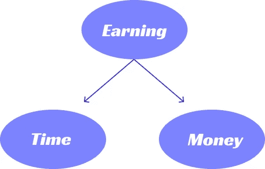

# 作为开发人员，编码挣钱的替代方法

> 原文：<https://javascript.plainenglish.io/alternatives-to-coding-to-earn-money-as-a-developer-84b9d1719f8b?source=collection_archive---------7----------------------->

## 作为一名开发人员，你不一定要通过编码来赚钱——是的，还有其他(也许更好)的选择。这里有几个可以让你赚大钱的选择。

Src: Pexels

软件开发人员和工程师需求量很大:埃隆·马斯克、比尔·盖茨和桑德尔·皮帅就是我们都知道的活生生的例子。

但我不是那种类型的程序员。我得实话实说:我不想每次打开笔记本电脑都要编码。如果你们大多数人像我一样，你们也不会。

由于这种类型的心态，我有点好奇，想知道作为一名开发人员赚钱的其他方式。

所以在这里，我将提供一些不用写代码就能赚钱的酷方法。

> **注**:两年来，我一直在学习和实现除编码之外的几种赚钱方法，我想与我的网友分享。这是我唯一的意图。
> 
> 此外，没有推广和附属链接，所以不要紧张，我卖给你我的利润。

这里有一些证据:

 [## 我尝试过技术写作，在一个月内赚了 2521.24 美元

### 停止尝试出版更多是我成功的理想方式。

medium.com](https://medium.com/feedium/i-have-tried-technical-writing-side-hustle-and-made-over-2521-24-within-a-month-9f142ee21ed7)  [## 比特币是否会在 2022 年增长 10 万美元

### 否则它将继续处于衰败之中。

medium.com](https://medium.com/geekculture/is-bitcoin-will-grew-100-000-usd-in-2022-or-not-8403c147d66c) 

不要紧张，稍后我会向你更详细地解释以上所有的东西。

# 介绍

这里我将把概念分成两种不同的方式。

第一种方式是花掉你的关键时间(风险较小)。

第二种方式是通过投资赚钱的不同方式(风险稍微大一点)。

仅此而已。

让我们从花时间的第一种方式开始。

**1。UI/ UX 设计和平面设计**

当我在学习网页开发的时候，我不知道 UI/UX 和平面设计。

但是工作了一点之后，我知道 UI/UX 设计师或者平面设计师可以赚很多钱，而且他们不用编码。

平均而言，一个用户界面/UX 每年可以赚将近 75，000 美元。

类似的，一个平面设计师可以赚大约 50，000 美元/年。

是的，我学过一点设计，甚至为我的网站设计过。你也可以使用 [Figma](https://www.figma.com/) 免费学习设计。

所以至少想想这个。

# 2.在 YouTube 上销售在线课程或创建内容

我们大多数人都知道，消费者喜欢视频内容，我们人类往往更容易通过它来掌握它。这是大多数 YouTubers 和创作者收入丰厚的主要原因。

如果你知道一项技能，你可以很容易地教别人，并且赚很多钱。毫无疑问，你不会在一天之内赚很多钱，但如果你投入时间，你就能赚到。

例如，6 个月前，我正在寻找一门数据科学课程，我的一些朋友向我推荐了 Udemy 的一门课程。

我已经买了，过了一段时间，我看到它实际上是由 4 个以上的 lacs 学生买的。所以想想创造者通过它实际赚了多少钱。

# 3.技术内容写作

我最喜欢的赚钱方式之一。

我不得不承认这对每个人来说都不容易。但对我来说太简单了。

事实上，我大部分时间都在做网站开发，学习新东西，并实现它们。

当我感到不知所措时，我写下我所知道的，就这么简单。

现在让我们深入探讨一下。当我开始写作时，我并不想从中赚很多钱。

我没想到我会在一年之内写超过 100 篇文章，但是感谢上帝的恩典，这成为了可能。

还有，你不必像我一样写 100 篇文章，你甚至可以写一篇文章，赚 300-500 美元。

有足够多的网站支付巨额资金，如:

> a) DigitalOcean 每篇文章最高支付 300 美元。
> 
> b) Tutorialspoint 每篇文章最高支付 500 美元。

还有更多赚钱的方式，比如使用 Canva，出售设计等。

由你来决定。

Photo by [Precondo CA](https://unsplash.com/@precondo?utm_source=medium&utm_medium=referral) on [Unsplash](https://unsplash.com?utm_source=medium&utm_medium=referral)

> 另一种方法是通过投资你的钱。

如果你一直读到现在，你知道你投入了时间，赚了钱，但这不会让你变得富有。

最简单的方法是通过投资。

**要遵循的简单规则**:

> 在投资前(通过花费你的时间)赚钱，永远不要相信任何人，停止投资于单一来源。

这个简单的规则会帮你很多

> 你将会知道你通过努力工作赚来的钱的真正价值。(如果你没有自己的钱，请不要投资下面的方法，如果发生不好的事情，这将使你的生活变得最糟糕。)
> 
> 如果你用下面的方法投资，请不要相信任何人(包括我)。
> 
> 如果你把你的钱投资在一个单一的来源上，那么你就有更大的可能会失去你的钱，等等。

也不要把你全部的积蓄投资到下面的方法中。

# 4.创造或投资加密货币

作为开发者，你可以像 Dogecoin 一样轻松地创建一种加密货币。我知道埃隆·马斯克不会推广它，但它也可以足够大。

与此类似，开发者可以轻松投资加密货币。像我这样的开发人员知道基本的数据科学，可以用数据来预测。

如果你投资股票 10 年，你可能每年至少获得 10-20%的利润。

但是如果你已经投资了等量的比特币呢？稍微想一想。

是的，我知道加密货币是一个可以预测的行业，但我们不能每次都预测，所以离开预测的游戏。

那么我们能做什么呢？试着每月至少投资你收入的 2-5%。

但是为什么呢，尼廷？我的朋友，我确信你在无用的东西上浪费了 10-20%的收入。

但是我为什么要投资加密货币呢？

仅仅是为了赚取大量的利息。

> 其他原因:
> 
> 埃隆·马斯克(Elon Musk)说了很多 Dogecoin，口袋里装了很多比特币。所以他肯定不会浪费他的比特币。
> 
> 此外，如果任何一家公司开始接受加密货币，想想未来。

好吧，尼廷。

但是我们什么时候出售我们的加密货币呢？

如果你不需要钱，千万不要试图卖掉你的加密货币。

最后，不要相信任何人，而是试着想一想。

# 奖金:

我们已经学会了通过花费时间或金钱来赚钱的方法。

但是还有一个领域既需要时间又需要金钱。

# **5。开创自己的事业**

你可能听说过几个调查，比如 [95%的工人正在考虑辞职](https://www.businessinsider.in/policy/economy/news/95-of-workers-are-thinking-about-quitting-their-jobs-according-to-a-new-survey-and-burnout-is-the-number-one-reason/articleshow/84206142.cms)。

但是他们中的很多人因为生活费，创业成本等原因，无法辞掉工作。

甚至对于那些主要收入来自工作、必须养家糊口的人来说，风险也更大。

是的，我知道创业有风险，但这是让你的生活比现在更好的最佳投资之一。

让我来帮你轻松创业。

如果你是学生或者一两年后要工作的人，那就开始花大部分时间尝试自己创业吧。

否则，如果你是在职员工，你就得把时间省下来，投入到自己创业中去。当你能够从你的生意中赚取利润时，你就可以自由地离开这份工作。

# 让我们结束吧

我不得不承认，这些赚钱方法都不会让你一夜之间成为亿万富翁。

但是随着时间的推移，你可以享受你想要的生活。

***如果你喜欢我的工作，想要支持，可以*** [***请我喝杯咖啡！***](https://www.buymeacoffee.com/nitinfab)

就这样，谢谢。

 [## 我每天都在使用的 11 个 Web 开发工具，因为它们让我的生活变得更加轻松

### 他们也一定会为你做同样的事情。

javascript.plainenglish.io](/11-web-development-tools-i-use-every-day-because-they-make-my-life-easier-54ede59743c2)  [## 炫耀技能的同时掌握 Web 开发:5 个最佳基于项目的教程

### 通过这 5 个基于项目的教程，在掌握 web 开发的同时，作为初级开发人员构建您的作品集。

javascript.plainenglish.io](/master-web-development-while-showing-off-your-skills-5-best-project-based-tutorials-7a5ef044e9c5) 

*更多内容看* [***说白了. io***](http://plainenglish.io/)