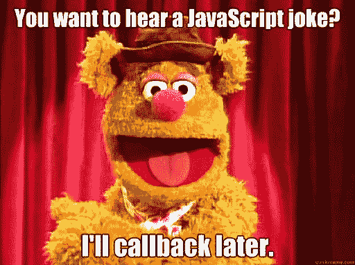

# 永远信守诺言

> 原文：<https://javascript.plainenglish.io/always-keep-your-promises-fee1487fff16?source=collection_archive---------11----------------------->

## JavaScript 中的承诺是什么，它们是如何工作的？

想知道 JavaScript 承诺是什么吗？你是否厌倦了使用回调？

这里有一个指南，让你了解承诺以及它们如何简化你的生活。


## **回访的缺点——为什么承诺更好？**

承诺比回访更好有几个原因:

*   由于回调是作为参数传递的，如果参数的数量增加，可能会混淆什么是输入，什么是返回值。
*   回调不处理在它们内部使用的函数抛出的错误(例如 JSON.parse)。
*   **回调地狱**——如果有多个函数要用回调函数依次调用，这很容易导致所谓的回调地狱。

```
firstRequestMethod(function(response) {  
    secondRequestMethod(response, function(nextResponse) {    
        thirdRequestMethod(nextResponse, function(finalResponse) {     
            console.log('Final response: ' + finalResponse);    
        }, failureCallback);  
    }, failureCallback);
}, failureCallback);
```

*   当我们使用回调函数时，它们可以依赖于调用她的函数



## **什么是承诺？**

一个`**Promise**`是一个在承诺产生时不一定知道的值的代理。它允许您将处理程序与异步操作的最终成功值或失败原因相关联。这使得异步方法像同步方法一样返回值:异步方法不是立即返回最终值，而是返回一个*承诺*在将来的某个时间提供该值。

换句话说，承诺，顾名思义就是在未来某个价值会被回报的承诺。这可能是成功值，也可能是失败值。因为在执行的时候，那个值并不存在，所以对于一个值的未来承诺，返回一个承诺。


当正在执行的任务具有不确定的完成时间时，这尤其重要。在最常见的情况下，这可能是一个需要不同时间的网络调用。您不希望在得到响应之前暂停执行，因此返回了一个承诺，执行可以继续。一旦值可用，它将在承诺中返回。

## **承诺入门**

```
const myFirstPromise = new Promise((resolve, reject) => {  
    // check condition here
});
```

promise 的构造函数 resolve 和 reject 有两个参数。如果满足条件，则承诺解决，否则拒绝。

您可以添加如下示例条件，以创建一个将返回解决或拒绝的示例承诺。在下面的示例中，如果条件为真，它将返回一个已解决的 else rejected 承诺。

```
 val condition = true
    const myFirstPromise = new Promise((resolve, reject) => {  
        if(condition) {    
            resolve('Promise is resolved successfully.');  
        } else {    
            reject('Promise is rejected');  
        }
    });
```

## **利用承诺**

在这里，您使用。然后()和。catch()方法。then()方法用于已解决的承诺，而我们需要使用 catch()方法来处理失败。

```
myFirstPromise
.then((successMsg) => {
    console.log(successMsg);
})
.catch((errorMsg) => { 
    console.log(errorMsg);
});
```

在上面的代码中，如果`myFirstPromise`返回一个 Promise.resolve()，那么 then()块中提到的代码将被触发。如果它返回了一个 Promise.reject()，那么 catch 块将被触发。

## **承诺的状态**

承诺对象有 3 种状态:

*   **待定:**初始状态，承诺成功或失败前
*   **已解决:**已完成承诺
*   **拒绝:**承诺失败


## **连锁承诺**

您也可以链接多个。然后()或。catch()块。例如，如果下面的承诺返回了一个字符串 JSON 对象。第一个将得到字符串 JSON。它可以返回解析后的 JSON，这将被发送到第二个 then 块。

```
promiseReturnsJSONString
.then((stringJSON) => {
    return JSON.parse(stringJSON)
})
.then((jsonObj) => {
    console.log(jsonObj)
}
.catch((errorMsg) => { 
    console.log(errorMsg);
});
```

## **finally()处理函数**

还可以将 finally()块与。然后()和。catch()。每次承诺为`settled`时都会被调用。无论承诺是`fulfilled`还是`rejected`都会被调用。当你想做某事而不考虑承诺的最终状态时，这很有用。这个处理程序不需要任何参数，因为没有传递任何东西给它。

```
myPromise
.then((receivedData) => {     
    console.log(receivedData)   })   
.catch((error) => {         
    console.log(error)   })   
.finally(() => {     
    console.log('Promise is done.')   })
```

# 更多关于承诺

现在你已经理解了承诺的基本内容以及如何使用它们，让我向你介绍几个更多的概念，你可能会根据你的需求的复杂性来使用这些概念，尤其是当多个承诺出现时。

## **Promise.all()**

```
const allPromise = Promise.all([promise1, promise2, ...]);
```

当你将承诺传递给`Promise.all()`时，它会尝试解决所有的承诺。当你通过的所有承诺都被解决后，`Promise.all()`将返回一个包含所有值的承诺。然后，您可以通过将`then()`处理程序与回调函数一起附加到`Promise.all()`来访问这个值。

当某件事情发生并且其中一个承诺被拒绝时,`Promise.all()`将立即返回被拒绝的值。记住这一点很重要。如果一个承诺“失败”`Promise.all()`将只返回被拒绝的值。它不会从任何以前解决的承诺中返回数据。[ [链接](https://blog.alexdevero.com/javascript-promises/)

当你在做一些需要全有或全无的操作时，这会特别有用。例如，如果您正在进行银行交易，您可能希望检查当前帐户余额，检查是否允许借记以及是否满足最小余额条件，借记帐户，更新帐户数据库，更新交易数据库，向用户提供确认。现在，如果在任何一个步骤中，您收到一个失败，您可能也想回滚所有以前的步骤。

```
const promise1 = new Promise((resolve, reject) => {   
    setTimeout(function() {     
      resolve('myPromiseOne has been resolved.')   }, 500) })const promise2 = new Promise((resolve, reject) => {      
    setTimeout(function() {     
      resolve('myPromiseTwo has been resolved.')   }, 1000) })const allPromise = Promise.all([promise1, promise2]);
```

然后，您可以使用一个`then`able 语法提取承诺解析值:

```
allPromise.then(values => {
  values; // [valueOfPromise1, valueOfPromise2, ...]
}).catch(error => {
  error;  // rejectReason of any first rejected promise
});
```

`Promise.all([...])`是一个有用的帮助函数，它允许你使用快速失败策略并行执行异步操作，并将结果聚集到一个数组中。

## **Promise.allSettled()**

```
const anyPromise = Promise.allSettled([promise1, promise2, ...]);
```

`**Promise.allSettled()**`方法返回一个承诺，该承诺在所有给定承诺完成或被拒绝后解析，并带有一个对象数组，每个对象描述每个承诺的结果。

如果任务相互独立，这将非常有用。

```
const promise1 = new Promise((resolve, reject) => {   
    setTimeout(function() {     
      resolve('myPromiseOne is resolved.')   }, 500) })const promise2 = new Promise((resolve, reject) => {      
    setTimeout(function() {     
      reject('myPromiseTwo is rejected.')   }, 1000) })const allSettledPromise = Promise.allSettled([promise1, promise2]);
```

因此，在这种情况下，输出将是:

```
allSettledPromise.then(values => {
  console.log(values); 
});// [
//   {status: "fulfilled", value: 'myPromiseOne is resolved.'},
//   {status: "rejected", value: 'myPromiseTwo is rejected.'},
// ]
```

## **Promise.any()**

```
const anyPromise = Promise.any([promise1, promise2, ...]);
```

顾名思义，这与 Promise.all()正好相反。这将返回承诺列表中解决的第一个承诺。

例如:

```
const promise1 = new Promise((resolve, reject) => {   
    setTimeout(function() {     
      reject('myPromiseOne has been rejected.')   }, 500) })const promise2 = new Promise((resolve, reject) => {      
    setTimeout(function() {     
      resolve('myPromiseTwo has been resolved.')   }, 1000) })const promise3 = new Promise((resolve, reject) => {      
    setTimeout(function() {     
      resolve('myPromiseThree has been resolved.')   }, 1000) })const anyPromise = Promise.any([promise1, promise2, promise3]);
```

在这里，任何承诺都具有承诺 2 的值

```
anyPromise.then((value) => 
  console.log(value). // 'myPromiseTwo has been resolved.'
}).catch((error) => {
  error;  // rejectReason of any first rejected promise
});
```

只有当所有的承诺都失败时，catch 块才会被触发。

*示例:您可以使用它的一个示例是，如果您从多个来源获取一些数据以获得高可用性，并且一旦您从任何来源获得数据，您就可以返回。你不需要别人给你。*

## **Promise.race()**

```
const racePromise = Promise.race([promise1, promise2, ...]);
```

`**Promise.race()**`方法返回一个承诺，该承诺在 iterable 中的一个承诺满足或拒绝时立即满足或拒绝，并带有该承诺的值或原因。

> **注意** —与返回第一个解析值的 **Promise.any()** 不同，P **romise.race()** 将返回第一个完成的承诺，无论它是被解析还是被拒绝。

## **了解更多信息的伟大链接**

*   https://www . loginradius . com/blog/async/callback-vs-promises-vs-async-await/
*   https://blog.alexdevero.com/javascript-promises/
*   https://developer . Mozilla . org/en-US/docs/Web/JavaScript/Reference/Global _ Objects/Promise
*   https://ivanjov.com/do-you-promise/
*   https://dmitripavlutin.com/what-is-javascript-promise/
*   https://code burst . io/a-simple-guide-to-es6-promises-d 71 bacd 2e 13 a

# 希望这对你有帮助！

> 如果你想了解更多关于**ASYNC()…AWAIT()…**[**点击这里**](https://sicpic.medium.com/what-is-async-await-and-how-to-use-it-20ef88bb0f1) **。**


*更多内容请看*[***plain English . io***](http://plainenglish.io/)