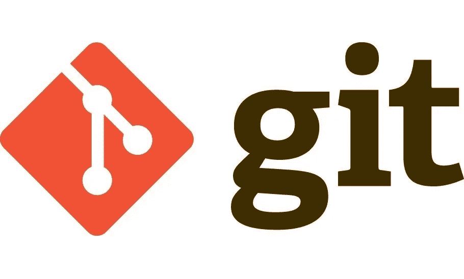

# Git 分钟指南

> 原文：<https://javascript.plainenglish.io/an-8-minute-guide-to-git-ec48cef6bfcb?source=collection_archive---------26----------------------->

## git——您需要知道的一切



如今，Git 实际上是大多数软件工程项目的版本控制工具。当然，也有其他的选择，比如 Mercurial 和 Apache Subversion。然而，在这个版本控制生态系统中，Git 已经成为真正的赢家。

查看堆栈溢出趋势图，了解版本控制系统如何随时间发展。


[彼得·贝尔](https://medium.com/u/5becaa84000d?source=post_page-----ec48cef6bfcb--------------------------------)用您需要的所有常用命令[写了一篇关于 Git 的精彩介绍。读一读。在本文中，我们将在 5 分钟内总结并帮助您掌握 Git！我们开始吧！](https://medium.com/learn-love-code/an-introduction-to-git-b3fd46a72ffa)

# 安装 Git

首先，让我们通过下载[安装 Git，这里是](https://git-scm.com/downloads)。有时，您可能已经安装了它。要检查是否安装了 Git，请打开您的终端并键入

```
git version
```

这将给出类似`git version 2.32.0`的结果。

在 macOS 上，您也可以使用自制软件通过`brew install git`安装 Git。

# Git 配置

我们现在需要配置 3 件事:名称、电子邮件和默认分支名称。为了做到这一点，

```
git config --global user.name "Your Name"
git config --global user.email "name@email.com"
git config --global init.defaultbranch <branch_name>
```

2020 年，Git 社区决定将 Git 存储库的默认分支名称从“主”更改为“主”，以避免使用“主”和“从”等术语以及术语的模糊性。我也建议这样做，使用`main`作为你默认的分支机构名称。

注意:对于默认的分支名称配置，您需要 Git 版本`2.28.0`或更高版本。

完成后，使用以下命令列出全局 Git 配置:

```
git config --global --list
```

您可以通过编辑`~/.gitconfig`来编辑全局配置文件。

# 初始化新的存储库

现在，为了初始化一个新的 Git 存储库，我们可以使用`git init`命令。这必须在一个目录中完成，在这个目录中，您将保存要提交的源文件/文件夹。

```
mkdir my-app
cd my-app
git init
```

这将创建一个`.git`隐藏文件夹，用于跟踪目录中的所有更改。

# 提交更改

让我们在存储库中创建一个名为`index.js`的新文件，并对其进行更改。

```
echo "console.log('hello world')" >> index.js
git status
```

当您创建一个新文件时，Git 会自动注意到这一点。键入`git status`创建新文件后，会给我们:

```
~/Desktop/my-app(main*) » git status                                    
On branch mainNo commits yetUntracked files:
  (use "git add <file>..." to include in what will be committed)
 index.jsnothing added to commit but untracked files present (use "git add" to track)
```

让我们展示我们新添加的文件:

```
git add index.js
```

再次运行`git status`将显示:

```
~/Desktop/my-app(main*) » git status                                    
On branch mainNo commits yetChanges to be committed:
  (use "git rm --cached <file>..." to unstage)
 new file:   index.js
```

我们可以看到 Git 识别了我们的新文件，它正在等待我们“提交”文件。Commit 帮助我们在 Git 中记录我们的更改，以及一条消息，我们可以在这条消息中描述所做的更改。

```
git commit -m "Adding index.js"
```

`-m`标志指定我们想要添加一个提交消息。这将为我们提供:

```
~/Desktop/my-app(main*) » git commit -m "Adding index.js"               
[main (root-commit) e25ad54] Adding index.js
 1 file changed, 1 insertion(+)
 create mode 100644 index.js
```

要编辑最后提交的消息，我们可以使用`--amend`标志:

```
git commit --amend
```

这将打开一个编辑器。编辑描述，一旦完成，你可以键入`:wq`退出。

# 列出我们的提交

Git 为我们提供了一种使用`git log`列出提交的简单方法。

```
git log
```

这给了我们:

```
commit e25ad54a136de851abe83a557de9d983e39c21b9 (HEAD -> main)
Author: Your Name <name@email.com>
Date:   Sat Jul 17 16:24:05 2021 +0800Adding index.js
```

可以按`q`退出 Git 日志界面。

# Git 中的分支

通常，我们需要在同一个代码库上与多个开发人员同时工作。为了处理您的特性或变更，而不会给其他人带来任何冲突，我们使用分支。

要创建一个新的分支并在分支内工作，我们可以运行

```
git checkout -b new_branch_name
```

例如，上面的命令将向我们展示:

```
~/Desktop/my-app(main) » git checkout -b new_branch_name                
Switched to a new branch 'new_branch_name'
```

让我们在`index.js`文件的分支中做一些新的改变:

```
echo "console.log('making a change)" >> index.js
```

让我们提交我们的更改:

```
git commit -am "Making changes to index.js"
```

我们也可以使用`checkout`命令切换分支。让我们回到我们的`main`分支。

```
git checkout main
```

现在我们可以比较使用`diff`命令引入的变化:

```
git diff new_branch_name
```

这将显示:

```
------------------------------------------------------------
diff --git a/index.js b/index.js
index cea4f10..f236b0f 100644
--- a/index.js
+++ b/index.js
@@ -1 +1,2 @@
 console.log('hello world')
+console.log('making a change)
```

Git 清楚地列出了我们当前的文件内容和新分支上修改过的内容。

# 管理冲突

现在，如果在`main`和我们的新分支上都有变化怎么办？这将导致将来我们试图合并它们时发生冲突。合并是将来自另一个分支的变更合并到当前分支的动作。

在我们的`main`分支上，让我们修改`index.js`。

```
echo "console.log('modified')" >> index.js
```

让我们使用以下代码提交更改:

```
git commit -am "Changes to index.js"
```

让我们尝试合并新分支的变更:

```
git merge new_branch_name
```

这将给我们带来冲突:

```
~/Desktop/my-app(main) » git merge new_branch_name                      
Auto-merging index.js
CONFLICT (content): Merge conflict in index.js
Automatic merge failed; fix conflicts and then commit the result.
```

要解决冲突，我们有几种方法:

1.  我们使用`git diff --ours`看到我们的变化
2.  我们使用`git diff --theirs`看到它们(传入分支)的变化
3.  我们可以使用`git merge --abort`完全中止合并

在这种情况下，让我们继续接受即将到来的更改。如果我们使用 Vim 或您的代码编辑器打开`index.js`文件，我们将看到:

```
 1 console.log('hello world')
  2 console.log('making a change)
  3 <<<<<<< HEAD
  4 console.log('modified')
  5 =======
  6 >>>>>>> new_branch_name
```

这表明引入的变更增加了一行，让我们假设我们想要接受它。让我们首先中止合并操作:

```
git merge --abort
```

我们可以用一个“策略”标志来重做合并操作，该标志指定接受哪些更改。

```
git merge -X theirs new_branch_name
```

这将打开一个新窗口来描述合并操作的更改。我们可以按 Vim 上的`:wq`来接受默认值。

现在，在`main`分支上，我们可以查看我们的`index.js`文件的内容，我们将看到我们在新分支上所做的更改得到了反映，而在`main`分支上的更改被忽略了。

我们的`git log`现在看起来像:

```
commit 9d913d0326722f3111596db937e64362c302fbfc (HEAD -> main)
Merge: df6200a c93871e
Author: Your Name <name@email.com>
Date:   Sat Jul 17 16:43:48 2021 +0800Merge branch 'new_branch_name'commit c93871eac5f5dbe8b8d6a0543158b02c601a0814 (new_branch_name)
Author: Your Name <name@email.com>
Date:   Sat Jul 17 16:36:51 2021 +0800Making changes to index.jscommit df6200a2eb3116d5fe2134fc6ed78f539e815468
Author: Your Name <name@email.com>
Date:   Sat Jul 17 16:35:12 2021 +0800Changes to index.jscommit e25ad54a136de851abe83a557de9d983e39c21b9
Author: Your Name <name@email.com>
Date:   Sat Jul 17 16:24:05 2021 +0800Adding index.js
```

# 删除分支

一旦我们合并了代码，我们就可以通过删除不再需要的分支来清理我们的分支。

这可以通过使用`-d`标志来实现:

```
git branch -d new_branch_name
```

这给了我们:

```
~/Desktop/my-app(main) » git branch -d new_branch_name                 
Deleted branch new_branch_name (was c93871e).
```

# 重置基础

Rebase 允许我们**重放**在另一个分支中对我们当前分支所做的变更。

为了尝试一个 rebase，让我们创建一个新的分支，并在那里做一些更改。

```
git checkout -b new_branch
echo "new file" >> file.txt
git add file.txt
git commit -m "Adding a new file"
```

让我们也对我们的`main`分支做一些改变。

```
git checkout main
echo "main file" >> main.txt
git add main.txt
git commit -m "Adding main file"
```

现在我们的目标是将我们的`main`分支中所做的更改重放到我们的`new_branch`中。让我们这样做:

```
git checkout new_branch
git rebase main
```

现在，如果我们检查目录，我们可以看到现在添加了一个新文件`main.txt`！这是因为我们已经将在`main`分支上所做的更改重放到了我们当前的分支中。

*一个警告:永远不要改变已经提交并与其他人共享的提交的基础。*

要了解更多关于 rebase 的知识，尤其是要了解何时以及何时不使用 rebase，请阅读[这篇文章](https://medium.com/@harishlyadav/when-to-use-git-rebase-explained-3c8192cba5c7)作者 [Harish Yadav](https://medium.com/u/d0dfecfbae90?source=post_page-----ec48cef6bfcb--------------------------------) ！

# 存储更改

Git 还支持我们“保存”我们的更改，并在将来的某个时候应用它们。这是使用`stash`命令。

例如，让我们做一些改变:

```
echo "I am making some changes for future" >> main.txt
```

此时，我们已经修改了现有的`main.txt`文件。为了保存这种状态，我们可以使用:

```
git stash
```

要查看隐藏内容，我们可以使用:

```
git stash list
```

这表明:

```
stash@{0}: WIP on new_branch: 9714ecf Adding a new file
```

隐藏的格式是`stash@{stash_number}`。

为了应用存储，我们可以使用:

```
git stash pop <stash_number>
```

`stash_number`是一个可选字段，通过它您可以指定您想要应用的贮藏数量。如上所示，这可以通过使用`git stash list`来实现。

要删除更改，我们可以使用:

```
git stash drop <stash_number>
```

同样，`stash_number`是一个可选字段。

要去掉应用的更改，我们可以使用`restore`命令:

```
git restore .
```

# 使用远程存储库

虽然我们可以在本地使用 Git，但通常情况下，您会将更改“推”到云中，例如 GitHub。

要添加远程存储库链接，我们需要首先在 GitHub 这样的平台上创建一个新的存储库。请按照这些[说明](https://docs.github.com/en/github/creating-cloning-and-archiving-repositories/creating-a-repository-on-github/creating-a-new-repository)进行操作。

一旦完成，您将收到您的 GitHub 资源库链接，例如:【https://github.com/harishv7/example_repo.git

在我们的本地 Git 回购中，我们使用:

```
git remote add origin <your_github_repo_link>
git push -u origin main
```

这将为我们的 GitHub 存储库添加一个“原点”,我们可以将本地 Git 存储库中的更改“推”到云中。

如果你使用了上面的命令，你也可以在 GitHub 中看到相同的文件和变化！

要查看我们的远程存储库，我们可以使用:

```
git remote -v
```

# 结论

这就是这个速成班的所有 Git 命令！这足以让你踏上 Git 之旅。Git 是一个非常强大的版本控制系统，要掌握它，只需要足够的练习。因此，请确保在本地使用示例项目练习这些命令。当与团队合作时，在应用不可逆转的变更时，一定要小心谨慎！如有疑问，请在本地尝试，并在执行命令之前理解它们，以最大限度地减少对团队的影响。

编码快乐！💻

*更多内容尽在*[***plain English . io***](http://plainenglish.io/)