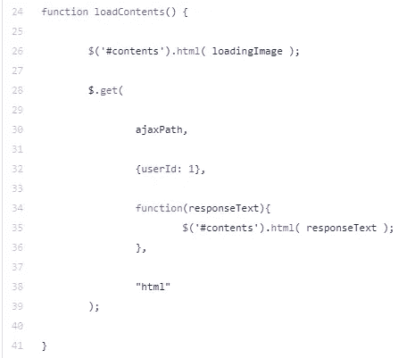
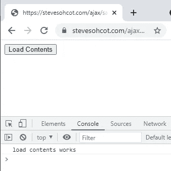
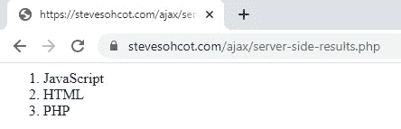
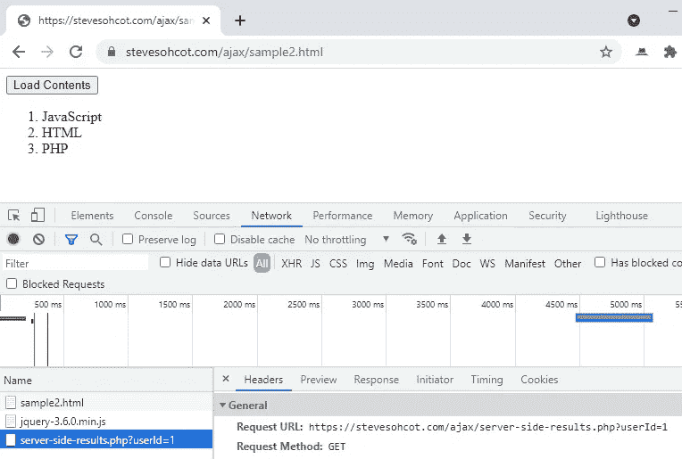
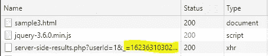

# 使用 jQuery 的 Ajax 速成教程

> 原文：<https://javascript.plainenglish.io/an-ajax-crash-course-tutorial-using-jquery-23dec8cc9a99?source=collection_archive---------14----------------------->



本教程展示了如何使用 jQuery 通过 Ajax 刷新网页的一部分。

> 下面的例子被大大简化了。在我的书《面向中级程序员的 Web 开发——用 PHP 开发》中，我用了整整一节(大约 50 页)一步步地讲解了通过 jQuery 与 Ajax 进行的所有常见数据库交互。

# 什么是 Ajax？

Ajax 允许网页的一部分发生变化，*而无需刷新整个网站*。例如，当你使用搜索引擎时，自动预测建议出现，这是因为网站的一部分更新了(文本框/下拉菜单/光标所在的部分)。

这是用 JavaScript 完成的。更具体地说，“异步 JavaScript 和 XML”(缩写为“Ajax”)。

# **为什么要使用 jQuery？**

jQuery 是一个 JavaScript 库，允许您使用快捷方式编写代码。

如果用普通/普通的 JavaScript 编写 Ajax，会涉及到很多代码，特别是因为每个 web 浏览器对它的处理略有不同。幸运的是，jQuery 具有内置的 Ajax 功能，这使得跨浏览器兼容性变得非常容易。

# 这个例子

Ajax 的一个常见用途是提交表单(例如保存数据)。为了使本教程简单，让我们假设用户刚刚按下了 save 按钮，现在我们希望看到新更新的数据。

**我们希望只刷新页面的*部分*，我们将使用 jQuery 的 get()函数通过 Ajax 来实现这一点。**

## HTML 代码

下面是一个简单的页面来演示这个概念。它包括:

*   jQuery 的引用
*   调用 JavaScript 函数 *loadContents( )* 的按钮
*   ID 为“内容”的 DIV
*   用于 *loadContents( )* 的 JavaScript 函数，该函数在浏览器控制台中显示文本以供测试

它看起来会像这样:



## 服务器端代码

让我们显示一个简单的有序列表:

最终，这里的代码可以运行一个查询来从数据库中检索数据。这里，我只是打印出最终的 HTML 输出。



**目标是获取服务器端呈现的 HTML 并将其显示在 DIV** 中(ID 为 *contents* 的 DIV)。

## JavaScript 代码

我们将使用 jQuery 的 **get( )** 函数。

> 这对于本例来说是合适的，因为我们只是在读取网页的内容。或者，如果我们将数据保存到数据库中，我们可以使用 **post( )** 。

jQuery 的 get()和 post()函数遵循以下格式:

```
$.get(
  urlEndPointHere,
  {variableOne: varOneValue, variableTwo: varTwoValue},
  function(responseText){
    // do something with the results
  },
  dataFormat
);
```

您可以看到传入了四个参数:

1.  代码将访问的 URL 端点
2.  要传入的变量(例如。表单中的数据)
3.  脚本完成处理时运行的函数
4.  返回数据的格式(例如:HTML、JSON 或 XML)

让我们用这些值来调用函数:

1.  第一个参数(第 3 行)表示加载哪个网页。
2.  第二个参数(第 5 行)是我们传入页面的数据。假设我们需要用户 ID 1 的数据。在服务器端页面上，我们当然会检索 URL 参数并将值注入到 SQL 查询中。
3.  第 7 行到第 9 行定义了函数完成后会发生什么。这里，返回的 HTML 被放入一个名为 *responseText* 的变量中(第 7 行)。然后我们找到 ID 为*内容*的元素，并将返回的 HTML 放入其中(第 8 行)。
4.  最后一个参数指示返回的数据类型(第 11 行)，在本例中是“html”。

您可以在您的服务器上尝试一下，上面的代码应该可以工作:服务器端呈现的页面的输出现在出现在给定 ID 的 DIV 的内容中。



在 Chrome 的开发者工具窗格中，网络选项卡显示对指定的 URL 进行了调用。因为它的类型是“GET”，所以它生成了 URL，并在末尾附加了参数。

> 注意:当使用 **get()** 函数时，您可以选择用已经存在的参数预先生成 URL。在 **post()** 中，更常见的是使用代码中描述的方法来传递参数。

# 但是等等，还有呢！


我想提一下我经常做的一些修改:

*   通常我会有几个 JavaScript 函数都使用同一个 URL 端点(对于那些熟悉模型-视图-控制器概念的人来说，我的“控制器”)。因此，我将定义一个变量，并将其传递给 *get()* 和 *post()* 函数。
*   当页面加载(即检索新数据)时，我喜欢有一个动画 GIF。因为这个图像的路径在几个 JavaScript 函数中都要用到，所以我也将它设置为一个变量。
*   我明确地关闭了*缓存。这确保了每次页面刷新都获得最新的数据。*

## 最终的 JavaScript 代码:使用 GET()的 jQuery 的 Ajax

## 发生了什么变化

*   被调用的 URL(通常是我的“控制器”)在第 16 行被定义为一个变量，并在第 30 行使用。
*   我在第 18 行指定了加载图像的路径。当 JavaScript 函数第一次被调用时，它将出现在第 26 行的 DIV(即将填充新内容的那个)中。一旦加载了新页面，DIV 的内容将被覆盖(从而删除动画)。
*   第 20 到 22 行关闭缓存，确保我们总是从服务器获得最新的值(下面 Chrome 开发者工具中网络面板的截图)。



An additional parameter with the timestamp is automatically generated — ensuring the URL is unique for each request

## 最终注释:

*   在这个例子中，我们使用了 jQuery 的 *get()* 函数，我提到的 *post()* 函数也是相当类似的。jQuery 还有一个 *ajax()* 函数，它提供了一些额外的功能和选项。
*   所述附加选项中的一些将考虑服务器端页面呈现的成功/失败。
*   你很容易受到同源政策的影响，这意味着你不能从其他人的网站(T2 的网站)进入页面。
*   提交数据时，除了给“name”属性加上之外，给输入元素一个 ID *会很有帮助(就像我们对上面的 DIV 所做的那样)。这样更容易瞄准/参考输入。*

*喜欢这种文笔？有兴趣了解 jQuery 的 Ajax，或者如何用 PHP 创建服务器端 web 应用程序吗？查看我的书* [*《面向中级程序员的 Web 开发——使用 PHP*](https://stevesohcot.com/php-book) *,该书对这些主题进行了更详细的介绍。*

*更多内容请看*[*plain English . io*](http://plainenglish.io/)