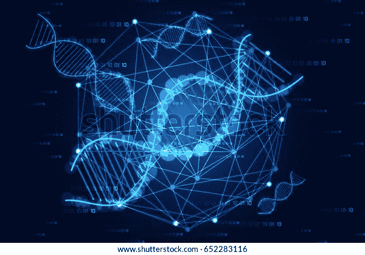
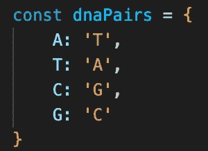
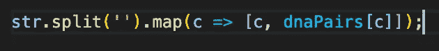

# 用 JavaScript 中的 Object 破解 DNA 配对算法

> 原文：<https://javascript.plainenglish.io/an-easy-way-to-crack-dna-pairing-algorithm-in-javascript-8f50cd4970ff?source=collection_archive---------9----------------------->



我在 [freeCodeCamp](http://www.freecodecamp.org/) 做代码挑战的时候遇到了 DNA 配对算法挑战。首先，当我回答这个问题时，我真的很困惑，因为他们要求将一些字母' G '与' C' & 'A '与' T '配对，我不知道为什么这些字母要配对，或者这些字母代表什么，为什么其他字母不代表。

傻傻的我，因为算法本身的标题是“DNA 配对”，我怎么没想到那些字母指的是 DNA 的碱基对:鸟嘌呤-胞嘧啶和腺嘌呤-胸腺嘧啶。

因此，挑战在于将元素中提供的字符对返回到 2d 数组中。例如，如果输入是`‘TTAG’`，输出应该是`[[‘T’,’A’], [‘T’,’A’],[‘A’,’T’], [‘G’,’C’]]`。我有一个非常简单的方法，通过使用 object 来完成这个挑战。

首先，我用 DNA 碱基对的键值对创建了一个对象。比如如果我们的密钥是 A，它就等于 T 等等如下图所示:



然后，我用`split(‘ ’)`方法将输入的字符串分开。它的作用是，将一个字符串转换成一个数组，每个字符作为一个元素。例如:

```
let s = 'abcd';
console.log(s.split('');output: ['a', 'b', 'c', 'd']
```

此外，我对数组进行了映射，这样我就可以对数组的每个元素进行循环，并将该元素转换为一个新数组，该数组将该元素作为第一个元素，第二个元素作为`dnaPairs`的结果。这里，`dnaPairs`将把第一个元素作为键，并把它的对作为第二个元素返回。

我的代码是这样的:



```
where str = 'GATC'output = [['G', 'C'], ['A', 'T'], ['T', 'A'], ['C', 'G']]
```

## 结论

希望你们都喜欢这个简单的一行代码来得到 DNA 配对算法的结果。

*更多内容请看*[***plain English . io***](http://plainenglish.io)