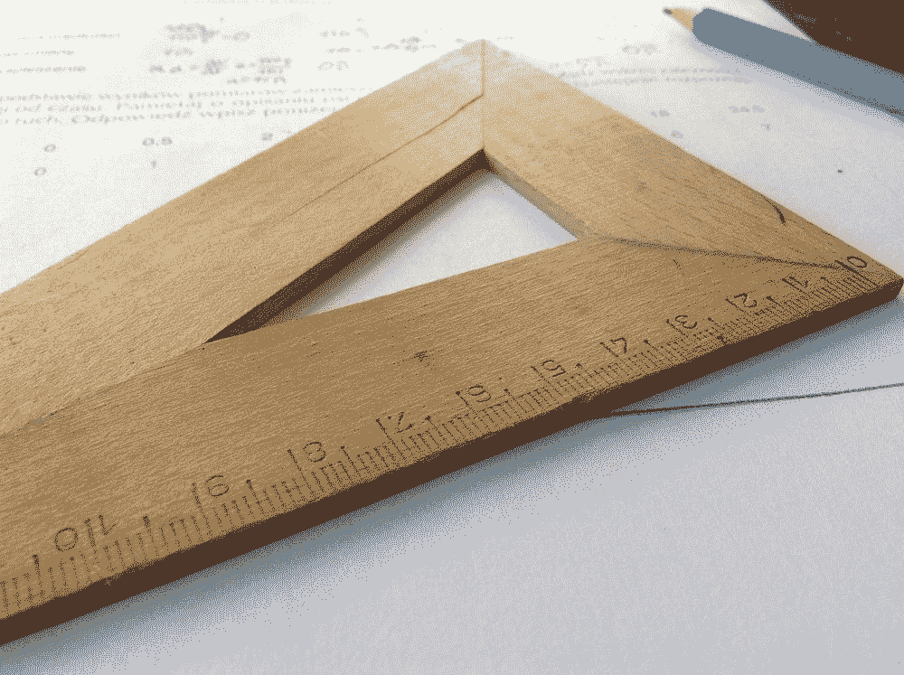

# 测量 JavaScript/TypeScript 性能的简单方法

> 原文：<https://javascript.plainenglish.io/an-easy-way-to-measure-performance-in-javascript-typescript-293628a5f08d?source=collection_archive---------9----------------------->

## 在 JavaScript 和 TypeScript 中测量方法性能的一种快速简单的方法。

Photo by [Dawid Małecki](https://unsplash.com/@djmalecki) on [Unsplash](https://unsplash.com/)

# JavaScript 中的性能测量

在 JavaScript 或任何其他语言中测量某个方法的性能实际上非常简单，通常可以分为 4 个部分。

*   获取当前时间=开始时间
*   运行方法代码
*   获取当前时间=结束时间
*   从方法的开始时间=运行持续时间中减去结束时间

因此，下一个代码片段显示了您在 JavaScript 中要做的事情:

但是您可以想象，一直添加这些代码是相当多的样板文件，并且每次您想要测量某个方法的性能时，您都必须重复许多工作。此外，如果您想要测量多个嵌套方法，您可能会遇到命名冲突，并且必须使用不同的变量名，从而增加了开销。

为了简化这一部分，我写了一个没有依赖关系的小 NPM 包，它可以帮助你摆脱这些样板代码。该软件包提供了完整的类型脚本支持和严格的类型。此外，它支持同步和异步方法。

 [## 简易性能测量

### 测试方法性能的超小型包装方法

www.npmjs.com](https://www.npmjs.com/package/easy-performance-measure) 

这个包可以帮助你包装你想要的方法，用一行代码代替上面的代码。

# 简易性能测量

在您使用它之前，您首先必须通过`npm install --save easy-performance-measure`将它添加到您的 JavaScript 应用程序中。

之后，您可以像下面这样使用它，或者使用同步方法，或者使用异步方法:

让我们简单解释一下上面的步骤:

1.  创建同步方法来测量
2.  创建一个异步方法，在特定超时后包装并调用同步方法
3.  通过`measureSync`测量同步方法
4.  通过`measureAsync`测量异步方法

测量方法返回一个数组，每个数组包含测量方法对`[0]`索引的响应和在`[1]`的测量结果(毫秒)。

你可以看到，你可以在那里插入任何方法，然后毫不费力地测量它的性能。

以下是与 NPM 包装一起交付的上述测量方法的签名。

如您所见，这里使用了一个 [rest 参数](https://developer.mozilla.org/en-US/docs/Web/JavaScript/Reference/Functions/rest_parameters)，因此您可以为您想要测量的方法传入任意多个方法参数。

所以下面所有的都是有效的。当然，您的`syncFn`应该定义适当的输入参数来处理这些参数。

## 类型脚本支持

[简单的性能测量](https://www.npmjs.com/package/easy-performance-measure)包提供了完整的字体支持和严格的打字。如果你访问 [Github 库](https://github.com/Abszissex/easy-performance-measure)或者 [NPM 页面](https://www.npmjs.com/package/easy-performance-measure)，你可以在`README.md`中看到一个工作的打字稿示例。

# 结论

我希望我可以通过发布这个小小的 NPM 包为您提供一些价值，这样您就不必一遍又一遍地编写相同的样板代码来对您的方法进行简单的度量。

感谢您花时间阅读我的文章。

## 你想联系吗？

如果你想联系我，请在 LinkedIn 上打电话给我。

另外，请随意查看[我的书籍推荐](https://medium.com/@mr-pascal/my-book-recommendations-4b9f73bf961b)📚。

 [## 我的书籍推荐

### 在接下来的章节中，你可以找到我对所有日常生活话题的书籍推荐，它们对我帮助很大。

mr-pascal.medium.com](https://mr-pascal.medium.com/my-book-recommendations-4b9f73bf961b)  [## 通过我的推荐链接加入 Medium—Pascal Zwikirsch

### 作为一个媒体会员，你的会员费的一部分会给你阅读的作家，你可以完全接触到每一个故事…

mr-pascal.medium.com](https://mr-pascal.medium.com/membership)