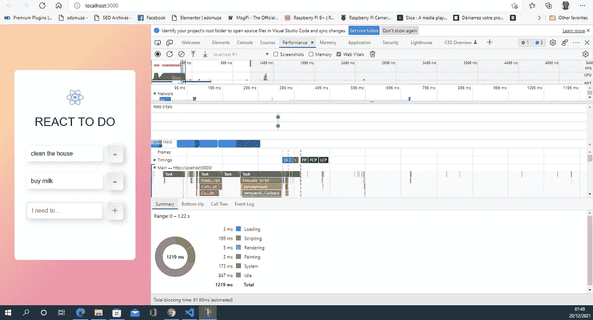
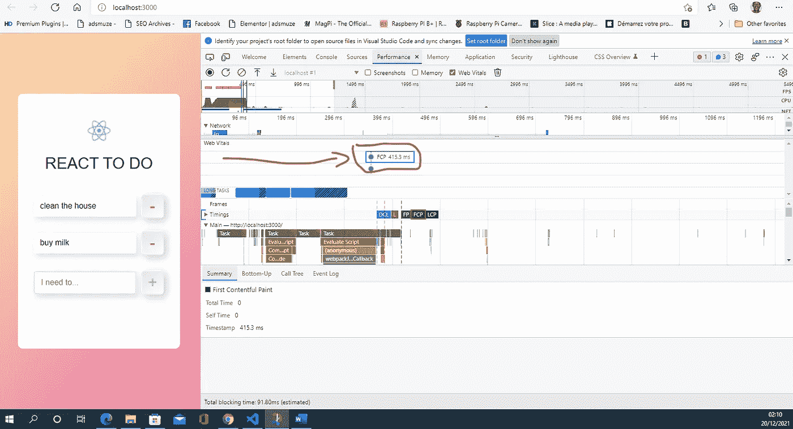
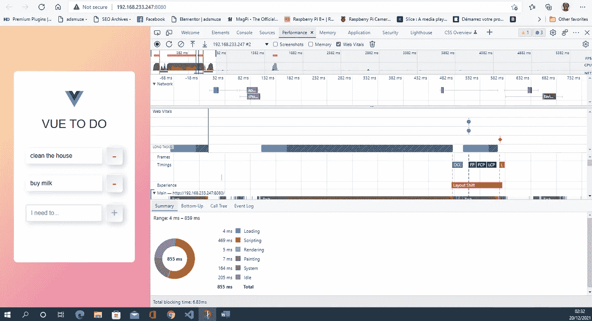
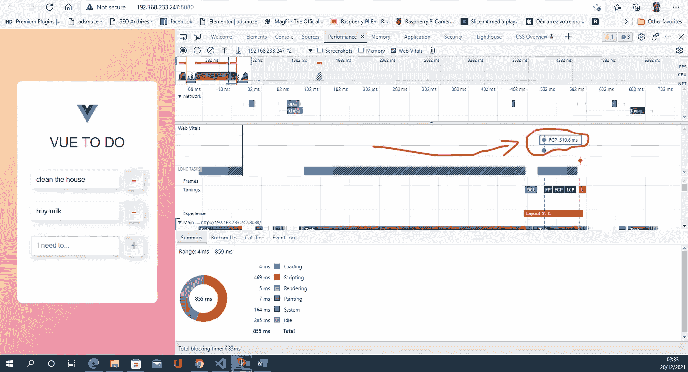
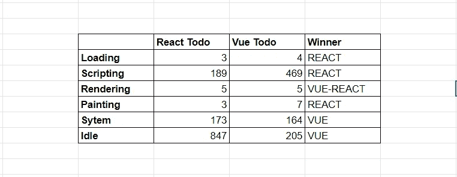

# React 和 Vue 前端的核心 Web 活力基准测试示例

> 原文：<https://javascript.plainenglish.io/an-example-of-benchmarking-core-web-vitals-of-react-and-vue-frontends-58e3b4a9c94a?source=collection_archive---------19----------------------->

Logos of REAT and VUE, the javascript frontend frameworks

像苏尼尔·桑德胡这样有技能的人比我更擅长使用几种框架开发应用程序。感谢像他们这样的人，我们将更快地对每个 JavaScript 前端框架进行基准测试。稍后，我们将使用人工智能和定制的开发工具开发一个技术支持的前端应用程序基准测试、优化和代码转换解决方案。这种技术支持的 JavaScript 解决方案是本文的主题。

在讨论我们将围绕这个 JavaScript 框架项目所做的工作之前，让我们首先感谢[苏尼尔·桑德胡](https://medium.com/u/a7b125868703?source=post_page-----58e3b4a9c94a--------------------------------)并开始做一些不能反映他更高技能的糟糕的基准测试。

我愿意分享一个更复杂的分析，但我认为从基础开始会很有用。通过这样做，我再次传递了我已经用高级分析完成的工作，我将在从这些基础开始重新开始时自动完成这些工作。我将在本文中对此进行阐述。这就像获得第一次有内容的时间一样简单，这是一个即将被像谷歌这样的搜索引擎考虑的指标，这是关于我在过去的文章中报道的核心网络生命的更新。我正在构建的目标解决方案，你也可以构建，因为我几乎可以肯定你在构建东西方面比我更有能力。

以下是使用 React 前端运行的 Sunil 待办事项 web 应用程序的截屏，以及使用 Microsoft Edge developer 工具完成的代码检查的结果。但请相信我，因为我承诺最终的工作将在所有可用的浏览器中完成，因为这是为了帮助用户获得更快的 web 体验，并帮助开发人员构建更快的 web 应用程序，无论用于消费 web 应用程序的浏览器是什么版本和类型。

React todo 应用程序加载速度很快，浏览器任务的这一部分花费了 3 毫秒。但是在这个任务被执行之后，JavaScript 引擎，在这个例子中是 Chakra，因为我们使用的是 Microsoft Edge，接过中继并开始编写脚本。在这里，对于这个 todo React 应用程序，脚本步骤需要 189 毫秒。然后是最重要的部分，这是谷歌等搜索引擎的核心 web vitals 实现所考虑的。当内容显示在用户的屏幕上时，这部分是绘画部分。在这里，对于这个 React todo 应用程序，绘制需要 3 毫秒。执行这个应用程序的系统部分需要 173 毫秒，而空闲时间是 847 毫秒。让我们回忆一下，空闲时间是指用户不能与浏览器正在处理的页面进行交互的时间，但这种空闲发生在屏幕上绘制内容之后。

**实际上要考虑的最重要的指标是** FCP 的第一幅内容丰富的绘画，这个指标是 415.3 毫秒，如下图所示。

**VUE 版 ToDo App**

让我们通过使用 Microsoft edge 开发人员的工具进行相同的性能检查来查看这个 todo 应用程序的 Vue 版本。表演截图如下。

如你所见，Vue 版本的应用程序花费了 4 毫秒加载，489 毫秒脚本，5 毫秒渲染，7 秒绘画。同样，如果我们根据核心网站的重要指标来测试性能，绘画是需要注意的关键事件。因为请记住，对于核心 web vitals，浏览器制作第一个内容丰富的绘画的时间被考虑在内，对于这个用 Vue 构建的应用程序，这个 FCP 值是 510.6 毫秒，而 React 版本的 FCP 是 415.3 毫秒

**React 前端解决方案的空闲时间过长**

React 实现比 Vue 实现花费更少的时间来加载、渲染和绘制 todo 应用程序的内容，但是使用 Vue 实现，我们的空闲时间更少。这个由 [Sunil](https://sunilsandhu.medium.com/) 开发的 todo 应用的空闲时间，Vue 是 203 ms，React 是 875 ms。尝试了解 React 为什么有更大的空闲时间是很重要的。实际上，我不能说这是因为我的测试浏览器，还是因为应用程序或者 React 框架设计的内在原因。

Summary of the benchmarking of the react and Vue todo apps

以上是这个快速测试的总结，没有深入分析每个前端框架的性能。但这只是为了向您强调，前端框架的选择不仅取决于您作为开发人员或软件工程师的技能，还取决于您的用户拥有的浏览器版本以及您的应用程序所依赖的模块类型。

关于这些依赖，我将写一篇文章，讲述这个[前端框架包装器](/javascript-front-end-frameworks-wrapper-9fab635378a0) (swapper 更好)将如何通过允许 JavaScript 开发者测试它们的几个版本和类型来处理依赖。

正如你所猜测的，这个测试是为了更好的用户体验。然后，如果我们从 web 应用程序的生产分析或前瞻性研究中获得了有关 web 应用程序受众的反馈，这些反馈提供了有关用于访问 web 应用程序的浏览器版本的指标，则可以为每个用户群生产特定于浏览器版本的前端版本，以获得更快的用户 web 体验和更低的生产成本。

交叉关于浏览器版本和其他指标的数据可以帮助提出更多的前端战略设计解决方案。例如，如果我们知道 80%的用户群使用 Chrome，平均来说，这个 Chrome 用户在 web 应用程序或网站上平均花费 1 分钟。然后，知道该浏览器版本允许给定数量的存储空间用于缓存、文件系统和 cookies，可以导致前端设计收集和存储关于用户行为的数据，这些数据通常由浏览器提供的这些存储解决方案中的 web 应用的分析模块收集，然后以更大的块(加密以保护用户或可以控制用户计算机的人再次利用)发送它们，而不是发送多个发布分析数据的请求，并且通过这样做，开发者削减了请求数量的成本，这是云托管的通用计费参数。

这就是为什么我一年前说[第三方网络应用正在成熟](https://mkrdiop.medium.com/third-party-apps-are-maturing-c64824706f5c)因为现在重要的是让网络用户体验更丰富、更智能、更快捷。我们可以使用第三方应用程序，而不是构建整个轮子，比如我正在构建的关于 JavaScript 前端框架的第三方应用程序，它可以帮助我们在用户基础上发布基于 JavaScript 框架的前端解决方案。

**PS:** 如果你有关于用两种不同的 JavaScript 前端框架开发的 web 应用的资料，那么我很想知道，因为我正在收集更多的资料，以便进行深入的分析，我将在[用简单的英语与你分享 JavaScript](https://javascript.plainenglish.io/)。我要感谢苏尼尔·桑德胡所做的惊人的工作和这篇文章的基础。

*更多内容请看*[*plain English . io*](http://plainenglish.io/)*。报名参加我们的* [*免费每周简讯*](http://newsletter.plainenglish.io/) *。在我们的* [*社区不和谐*](https://discord.gg/GtDtUAvyhW) *获取独家写作机会和建议。*