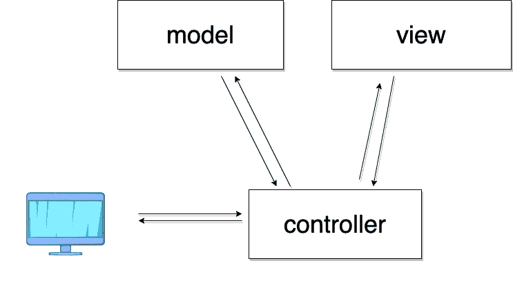

# MVC 软件设计模式的解释

> 原文：<https://javascript.plainenglish.io/an-explanation-of-the-mvc-software-design-pattern-b1947ab65b4b?source=collection_archive---------10----------------------->

## MVC 的基本架构

Image Source: Author

我对每一部分都做了说明。

在过去的 20 年里，网站已经从带有极其复杂的 CSS 的简单 HTML 页面发展到极其复杂的应用程序。成千上万的开发人员正在使用这些复杂的 web 应用程序，以使它们更容易使用。

开发人员使用不同的模式来扩展他们的项目，通过这些模式中最流行的模式来使代码更复杂和更容易使用。MVC 也被称为面向大型应用程序的模型视图控制器。所以让我们来看看 MVC 的一个软件设计模式

# 模型、视图和控制器

这里，用户基于 URL 向服务器请求特定的页面。如果用户正在请求，服务器将把所有的请求所有的信息发送到一个特定的控制器。

这个控制器负责处理来自客户端的整个请求，以及它将如何请求服务器的其余部分，以便充当中介。看看其他两个模型模型，它应该不会包含太多的代码。

当控制器收到请求时，第一件事就是根据请求向模型请求信息。模型负责处理请求的所有数据逻辑。

这意味着模型与数据库交互，保存所有删除和删除数据的合法性。

控制器不应该直接与数据逻辑交互。它应该只使用模型来执行这些交互，这意味着控制器永远不必担心如何处理数据。它发送和接收，而只需要告诉模型做什么，并根据模型返回的内容做出响应。

这也意味着模型永远不必担心处理用户请求以及失败或成功时该做什么所有这些都由控制器处理，模型只关心在模型将其响应发送回控制器后与数据的交互。

然后，控制器需要与视图交互，将数据呈现给用户。视图只关心如何呈现控制器发送给它的信息。

这意味着视图将是一个基于控制器发送给它的数据动态呈现 HTML 的模板文件。视图不担心如何处理数据的最终显示。

而是只关心如何呈现它，视图将把它的最终呈现发送回控制器，控制器将处理把该呈现发送回用户。关于这种设计，需要注意的重要一点是，模型和视图从不相互交互。模型和视图之间的任何交互都是通过控制器完成的。

模型和视图之间的出生控制器意味着数据的表示和数据的逻辑是完全分离的。这使得创建复杂的应用程序变得更加容易，尽管这只是理论上的。

让我们看一个例子，看看这种设计是如何处理请求的。

# **例子**

假设一个用户向服务器发送一个请求来获取猫的列表。服务器会将请求发送给处理猫的控制器。然后，控制器会要求处理猫的模型返回所有猫的列表。该模型将在数据库中查询所有猫的列表，并将该列表返回给控制器。

如果从模型返回的响应是成功的，那么控制器将调用与猫相关联的视图来返回猫列表的呈现。该视图将从控制器获取猫的列表，并将列表呈现为 HTML。可以被浏览器使用。

然后，控制器将获取该表示并将其返回给用户，这样，如果之前模型返回的是错误而不是列表，则结束请求。

控制器将通过要求处理错误的视图呈现该错误的表示来处理该错误。然后，该错误呈现将被返回给用户，而不是 cat 列表呈现。

从这个例子中我们可以看到，模型处理了所有的数据。视图处理所有的表示，控制器只是告诉模型和视图做什么。这三个是 MVC 的基本架构。

# 一锤定音

MVC 设计模式是众多设计模式中最流行的设计模式之一。每个开发人员都应该对这种设计的类型及其好处有一个基本的了解。谢谢你。

祝你愉快。

*更多内容尽在*[plain English . io](http://plainenglish.io/)