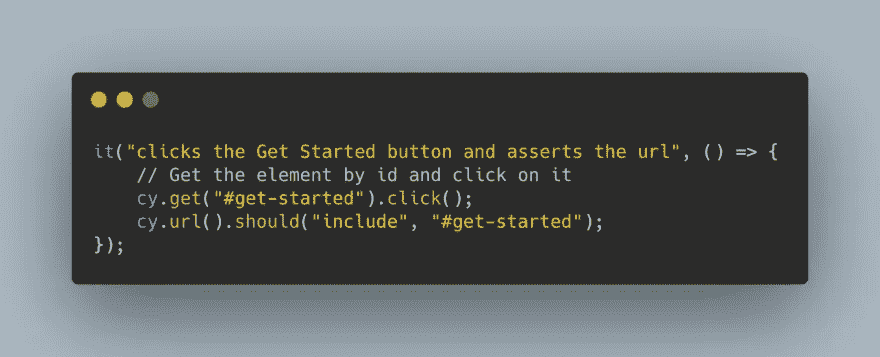
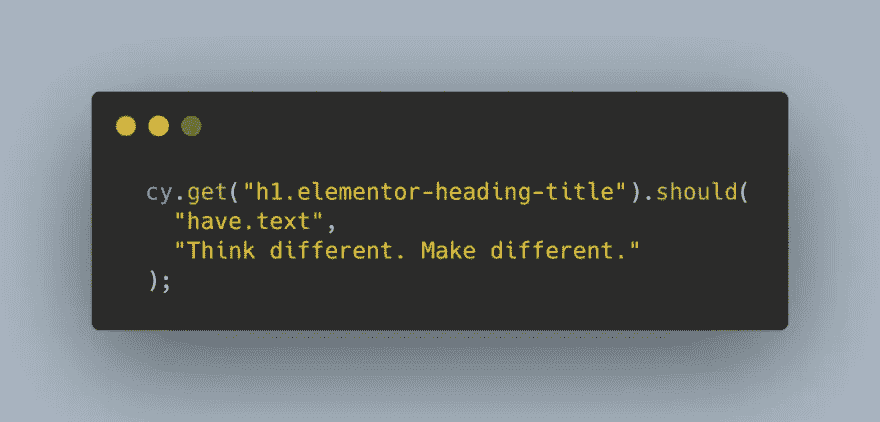
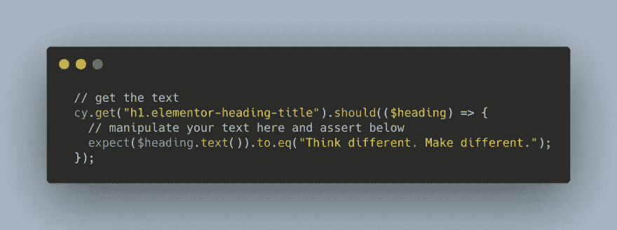
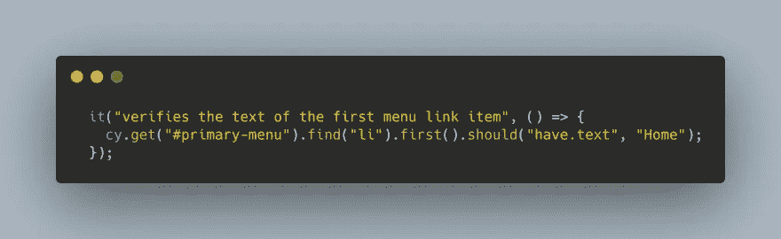

# Cypress 的获取、单击和查找命令简介

> 原文：<https://javascript.plainenglish.io/an-introduction-to-cypress-get-click-and-find-commands-e463972f6d0d?source=collection_archive---------19----------------------->

在本教程中，我们将介绍一些常用的 Cypress 命令，如“get”、“click”和“find”。我们还将看看如何找到特定元素的文本。

# Cypress 获取并单击命令

在 Cypress 中最常用的命令之一是“get”命令。“get”命令用于通过选择器访问一个或多个 DOM 元素。

**用法:**

# Cypress 获取元素的文本

在 Cypress 中有多种方法可以获得元素的文本。

1-最简单的选项是通过断言方法:

2-如果需要先处理文本，可以使用此选项:

# Cypress 查找命令

“find”命令用于获取特定选择器的后代。例如，在下面的代码中，我们首先通过 id 选择器访问 nav 菜单，然后使用“find”命令查找 nav 中的所有列表项。

## 查看下面的视频，了解有关 get、click 和 gind 命令的更多信息–

感谢阅读！

*更多内容尽在*[plain English . io](http://plainenglish.io/)