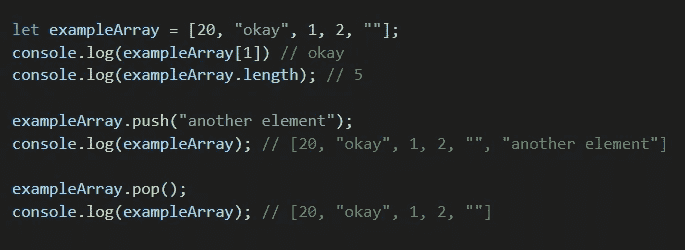
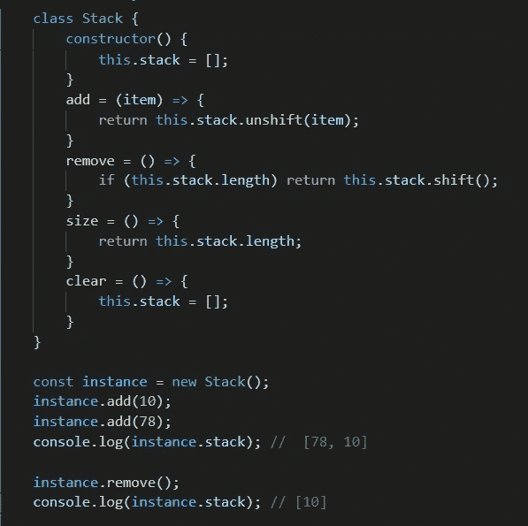
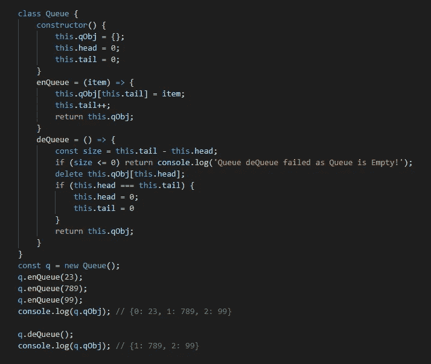
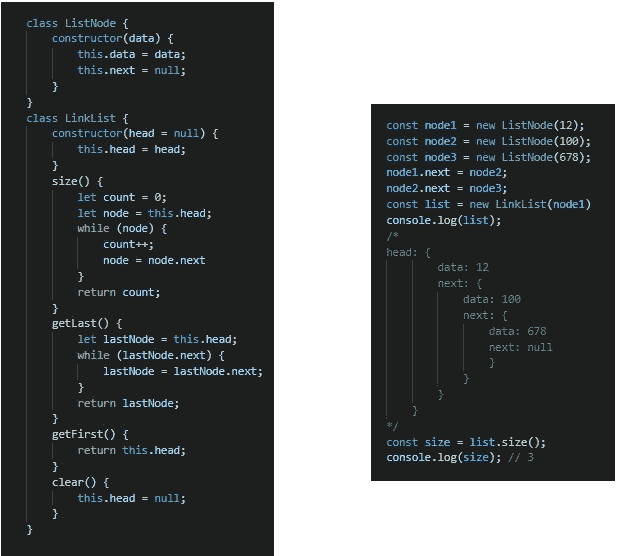
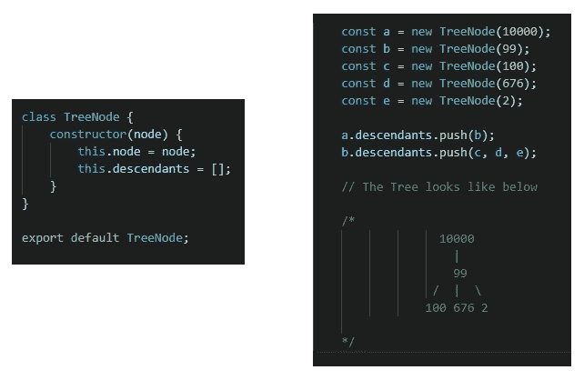

# JavaScript 数据结构介绍

> 原文：<https://javascript.plainenglish.io/an-introduction-to-data-structures-with-javascript-69fcd76045ef?source=collection_archive---------9----------------------->

# 介绍

嗨伙计们！在这篇文章中，我们将探讨使用 JavaScript 实现数据结构(DS)的简单方法。这些实现旨在提供 DS 的本质，从而帮助我们探索使用 JS 的数据结构背后的基本思想。我们先做仪式，所以定义是这样的:

> [数据结构](https://www.geeksforgeeks.org/data-structures/)是在计算机中存储和组织数据的编程方式，以便可以有效地检索和使用数据。
> 
> 根据元素在 DS 中的访问和存储方式，我们有两种分类
> 
> 1.线性 DS:按顺序访问，但不一定按顺序存储。
> 例子:数组、链表、堆栈和队列
> 
> 2.非线性 DS:元素以非线性方式存储和访问。
> 例如:树木

公平地说，如果我们包含更干净、更有效的数据结构，程序会更好。不同的数据结构擅长不同的事情。我们现在就来看看其中的一些！

# 数组

数组是单个元素的集合，每个元素都有自己的索引，存储在连续的内存位置。这个集合可以是任何东西:数字、对象、更多数组等等。存储在数组中的元素数就是数组的长度。

正如我们所知，数组的元素存储在连续的内存位置，[删除和插入元素的成本](https://cseweb.ucsd.edu//~kube/cls/12.s13/Lectures/lec06/lec06.pdf)很高。

# 大量

堆栈是一种遵循后进先出(LIFO)原则的数据结构。最后添加的元素首先被访问。这就像把你的书一摞一摞的叠起来。你最后放的那本书放在第一位。下面是我们的 JS 栈实现:

# 行列

队列是一个动态集合，其中:

*   元素被插入(入队)到队列的末尾(尾部)。
*   元素从队列的开始处(头部)被删除/移除(出列)。
*   删除操作基于 FIFO(先进先出)，就像在真实的队列中一样，停留时间最长的人(也就是第一个到达队列的人)先走。

    让我们用 JavaScript 对象实现队列:

# 链接列表

链表是一种类似于数组的线性数据结构。但是，与数组不同，元素并不存储在特定的内存位置或索引中。相反，每个元素都是一个单独的对象，包含一个指向列表中下一个对象的指针或链接。每个元素(通常称为节点)包含两项:存储的数据和到下一个节点的链接。

链表中的搜索操作很慢。与数组不同，不允许随机访问数据元素。

# 树

树是一种非线性数据结构，其中一个节点可以有零个或多个子节点。每个节点都包含一个值。像图一样，节点之间的连接称为边。树是图的一种类型，但并不是所有的图都是树(后面会详细介绍)。

这些数据结构被称为“树”，因为数据结构类似于树🌳。它从一个根节点开始，分支到它的后代，最后是叶子。该结构出现在需要准确存储树数据的地方，例如文件系统。

希望这将有助于并鼓励你探索更多的 DS 的酷东西。
这里是上述代码片段和更多内容的 GitHub 链接——[https://github.com/gitdeepsingh/data-structures-algorithms](https://github.com/gitdeepsingh/data-structures-algorithms)

感谢阅读！

*更多内容尽在*[***plain English . io***](http://plainenglish.io/)