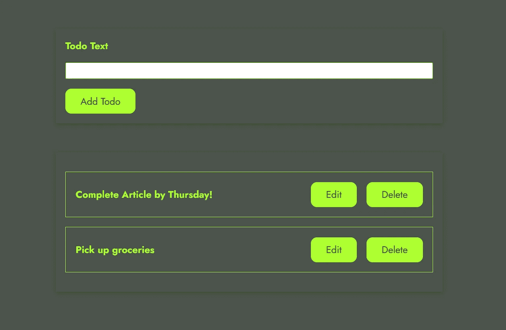

# 让我们用 Deno 构建一个 Todo 应用程序

> 原文：<https://javascript.plainenglish.io/an-introduction-to-deno-js-with-a-simple-todo-app-9337417555fd?source=collection_archive---------5----------------------->

## 新的 JavaScript 运行时环境 Deno 简介



Simple Todo Web App

Deno 是一个安全的 JavaScript 运行时环境，旨在解决 Node.js 在开发过程中没有解决的一些问题。尽管 Deno 还没有准备好在生产中部署应用程序，但它有可能在未来取代 Node.js，所以让我们开始吧！

本文将通过构建一个简单的 Todo 应用程序向我们介绍 Deno 环境，该应用程序将使用 [Oak](https://oakserver.github.io/oak/) 中间件框架来处理请求，使用 [denoDB](https://eveningkid.com/denodb-docs/) 来实现持久性。由于 Deno 可以运行 TypeScript，所以这个项目也完全是用它写的。连接应用程序后，它看起来会像这样:

> [德诺托多 App(react-Todo-Deno-abrar . web . App)](https://react-todo-deno-abrar.web.app/)

在开始之前，这里是应用程序的完整源代码，这应该给我们一个应用程序的文件结构的良好概述。我们将只关注 [**后端代码**](https://github.com/abrarhayat/deno-app-oak) ，前端将用于测试后端。需要记住的另一点是，只有这些存储库的**主**分支与本文相关。

后端:[***https://github.com/abrarhayat/deno-app-oak***](https://github.com/abrarhayat/deno-app-oak)

前端:[***https://github.com/abrarhayat/react-todo-app***](https://github.com/abrarhayat/react-todo-app)

在进一步处理源代码之前，我们需要遵循[后端存储库](https://github.com/abrarhayat/deno-app-oak)中的 [README.md](https://github.com/abrarhayat/deno-app-oak/blob/master/README.md) 文件中的这些**步骤**。该应用程序将不会工作，直到这些要求得到满足。我们编写 scripts.json 文件来使用 [denon](https://deno.land/x/denon@2.4.7) ，这是一个可以模拟我们 Deno 环境变量的包，让我们的开发体验更加流畅。我们将允许 Deno 运行时访问我们的网络和环境变量。我们的启动脚本将如下所示:

```
deno run --allow-net --allow-env app.ts
```

现在我们仔细看看后端代码，从 **app.ts** 开始。

首先，我们进行必要的进口。Deno JS 中任何库的导入都是通过 URL 完成的，然后缓存到系统中，这与我们之前在 Node JS 应用程序中从 node_modules 进行的导入不同。

在 Oak 中间件框架中，应用程序中的每个中间件都在前一个中间件内部运行*。因此，我们将错误处理中间件定义为第一个中间件，这样我们就可以在这里捕获所有其他中间件的错误并进行处理。我们也总是等待 *next()* 函数，以确保后续中间件返回的所有承诺都已完成。*

我们注册了一个中间件来处理 cors 头，因为我们有一个独立的前端应用程序，然后我们注册了端点的路由。我们需要注册的路由与我们在 NodeJS Express 应用程序中注册的略有不同。我们实际上登记了 ***的结果。routes()*** 和 ***。路由器的*allowed methods()**。然后，我们从 Deno 环境中获得我们想要的端口，并启动我们的应用程序。

在启动应用程序之前，我们使用 ***connect()*** 函数连接到数据库，我们将在后面详细讨论。

更深入地了解端点:

我们将使用 DenoDB 包来实现持久性，并将实现一个 MySQL 服务器。我们需要将有效的 MySQL 细节放在 scripts.json 文件中，正如在 [README.md](https://github.com/abrarhayat/deno-app-oak/blob/master/README.md) 文件中提到的。然后我们导出我们的数据库用于我们的模型，并在启动我们的应用程序之前使用 **app.ts** 中的 connect 函数。

我们在 [DenoDB](https://eveningkid.com/denodb-docs/docs/guides/create-models) 的帮助下为我们的 todos 定义模型。我们的模型将有两个字段， ***id*** 字段将自动递增并作为主键，我们的 ***文本*** 字段将保存我们的 todo 文本。然后，我们将 Todo 模型链接到我们在上一步中创建的 db 对象，并同步我们的模型。

最后但同样重要的是，我们为所有的 Todo CRUD 操作定义了控制器逻辑。对于 Oak 中的中间件，我们得到一个上下文对象和一个 next 函数作为请求处理函数的参数。

我们使用上下文对象来决定我们将在响应中发送什么，或者从请求体和下一个函数中检索数据，从而将我们带到下一个中间件。我们只需要配置响应，而不是发送它。然后，响应将由框架本身发送。

我们在***CTX . response . body***中配置响应体的内容，从***CTX . request . body . value***中获取请求体，基本返回一个承诺，所以我们要等待。

让我们从处理 REST api 事务的角度来比较一下 **Express.js** 和 **Oak** 。

在 Express 和 Oak 中检索请求体并发送 JSON 响应:

```
//get the request body
const body = request.body //Express
const body = await ctx.request.body.value //Oak//send JSON data response
response.json(data) //Express
ctx.response.body = data //Oak
```

## 结论

这就是我们为 Deno 环境编写的第一个应用程序。这是一个非常简单的应用程序，但它是一个很好的起点，可以走得更远。Deno 很有前途，所以我们绝对应该继续使用它，并通过更多令人兴奋的第三方库[来使用它！](https://deno.land/x)