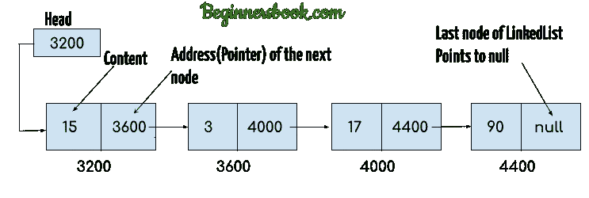

# 第 2 部分—(JavaScript 中的 Linkedlist 介绍)JavaScript 中的链表是如何工作的

> 原文：<https://javascript.plainenglish.io/an-introduction-to-linkedlist-operations-in-javascript-part-2-how-linkedlist-works-in-ee8452f0fa3f?source=collection_archive---------20----------------------->

如果您直接阅读了这篇文章，那么在进一步阅读之前，请阅读我之前的一篇关于如何在 JavaScript 中实现链表的文章[这里](/all-operations-of-linked-list-in-javascript-9958a4d3cb07)。

假设你读过我之前的文章，你也知道在 JavaScript 中一切都是对象。因此，即使链表也必须是一个对象。不像 Java、C、C++这样的强类型语言会直接与系统内存交互，JavaScript 不与系统内存交互；相反，它是作为一种语言提供给底层编译器的，它们将代表我们执行 JavaScript 代码并返回结果。

像数组、链表、树等数据结构与内存位置交互，下面是强类型语言中链表的典型排列，其中从 3200 开始的位置被分配给链表。



来源:[https://beginnersbook.com/](https://beginnersbook.com/)

在 JavaScript 的情况下不会发生同样的事情。下面是 JavaScript 情况下的链表表示。

```
head : { next: { element: 10, next: { element: 20, next: …. } }}
```

因此，在幕后，JavaScript 中的链表只不过是一组对象，一个在另一个内部循环。因此，在上面的例子中，`head.next`将给出第一个节点，它包含一个名为 element 的键，该键包含一个元素，另一个术语 next 将指向下一个节点。

如果你非常理解这个概念，那么你就可以在 JavaScript 中完成链表的所有复杂操作。如果你有任何疑问，请在评论框中提出。我会最早回答。

在下一篇文章中，让我们学习如何回答面试中的一些常见问题，如反转链表、寻找中间元素等。敬请关注。

**别忘了阅读下一篇文章**

[第 3 部分——如何使用 JavaScript 在链表中找到中间元素](https://mevasanth.medium.com/part-3-introduction-to-linkedlist-in-javascript-how-to-find-middle-element-of-the-list-using-1cf2ba7baff0)

**同一作者的其他文章:**

1.  [JavaScript 中的一切如何都是对象？](https://mevasanth.medium.com/how-everything-is-object-in-javascript-a4164d7e6a2d)
2.  [JavaScript 中的吊装:采访热点](https://mevasanth.medium.com/hoisting-in-javascript-hot-topic-for-interview-43b463a6a77?source=follow_footer---------0----------------------------)
3.  [JavaScript 中的记忆化——采访热门话题](https://mevasanth.medium.com/memoization-in-javascript-hot-topic-for-interview-815475544ab0)

点击[此处](https://mevasanth.medium.com/)查看作者所有文章。

*更多内容尽在*[***plain English . io***](http://plainenglish.io/)