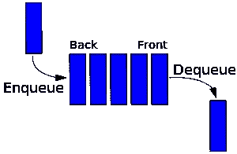
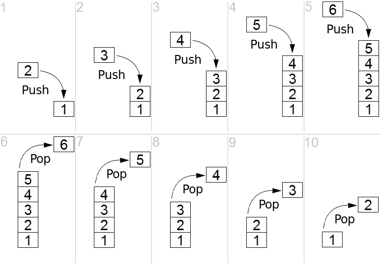

# JavaScript 中队列和堆栈的介绍

> 原文：<https://javascript.plainenglish.io/an-introduction-to-queues-and-stacks-in-javascript-efa26203386c?source=collection_archive---------9----------------------->

## 在代码中使用队列和堆栈数据结构的初学者指南。

Photo by [Levi Jones](https://unsplash.com/@levidjones?utm_source=medium&utm_medium=referral) on [Unsplash](https://unsplash.com?utm_source=medium&utm_medium=referral)

当你开始学习数据结构和算法时，事情会变得非常复杂。因此，本文旨在放慢速度，让您熟悉两种常见的数据结构(队列和堆栈),这两种数据结构通常用作更复杂算法实现中的基本构件。

**P.S.**
你已经在你的代码中使用这些数据结构了，只是你不知道而已！

# 行列

好吧，那么什么是队列？一个更官方的定义是这样的:

*“按顺序维护的元素集合，可以通过在集合后面添加新元素或删除集合前面的现有元素来修改。”*

最终，队列是一个**先进先出(FIFO)** 的数据结构。下面这张简单的图片展示了这一过程:

很好，您应该对这些是如何工作的有一个非常清晰的概念，如果您有一点 JavaScript 编码的经验，您可能已经猜到我们将使用哪种数据类型来创建我们的第一个队列。

没错一个**阵**！

1.  使用。push()方法，我们可以通过从数据结构的***后面添加新元素来填充我们的数组(也称为**入队**)。***
2.  ***使用。shift()方法，我们可以通过从数据结构的**前端**移除元素来从我们的数组中移除元素(也叫**出列**)。***

***好了，现在我们了解了如何创建一个队列，让我们更形式化一些，给我们的队列一些结构。***

***在这个例子中，我们将使用一个类(以 OOP 或面向对象的编程风格)实现一个队列，并添加一些有用的方法来操作和查看它的不同部分。***

***所以在上一个例子中，我们构建了队列，并添加了一些方法来对它进行一些处理。在下一个例子中，我们将做同样的事情，但是使用稍微更函数化的编程风格。在这种方法中，我们永远不会直接改变现有的队列。相反，每个函数将创建并返回队列的新副本。***

***JavaScript 不是真正的函数式语言，所以这不是一个完美的例子，但它应该说明了另一种思考数据结构构造的方式。***

## ***挑战 1***

***在上面的例子中，我使用数组来构建每个队列，因为它们易于理解，易于编写，并且是 JavaScript 中非常常见的模式。但是，您可以使用不同的数据类型来实现队列，只要它按照上面提到的 FIFO 原理工作。所以这是你的挑战:***

> ******用字符串代替数组创建队列。******

# ***大量***

***既然我们已经理解了什么是队列，那么用栈来包装我们的思想就相当简单了。与队列(FIFO)不同，堆栈是遵循**后进先出(LIFO)** 原则的数据结构。下图说明了这在实践中是如何工作的:***

******

***同样，使用数组，我们将在 JavaScript 中实现一个堆栈数据结构。***

1.  ***我们可以使用。对**的 push()方法将**元素从**后面的**添加到堆栈中，就像我们对队列所做的那样。***
2.  ***但是与队列不同，我们将使用。pop()方法将**中的**元素从堆栈的**后面**中移除。***

***太棒了，所以从上面的代码中可以看出，除了如何移除元素之外，Stack 与 Queue 几乎完全相同。***

***接下来，我们将仔细看看使用类对象构建堆栈的 OOP 方法。***

***同样，为了更好地衡量，我们将构建一个功能性更强的堆栈。***

## ***挑战 2***

***同样，我使用数组来构建每个堆栈。但是，您可以使用不同的数据类型实现堆栈，只要它根据 LIFO 原则运行。所以这是你的挑战:***

> ***使用对象而不是数组创建堆栈。***

# ***结论***

***这就是队列和堆栈。虽然它们看起来相对简单，但它们经常在更复杂的数据结构和算法中使用，并与它们结合使用。当你在面试和工作中遇到真正棘手的问题时，对这些基本概念有一个坚实的理解将为你以后的成功做好准备。***

***感谢阅读，一如既往，继续编码！***

***看看一些更复杂的算法，看看您是否能发现队列和堆栈在哪里使用:***

*** [## 选择排序算法 101

### 用 JavaScript 实现选择排序算法

medium.com](https://medium.com/@tom.w.j.sanderson/selection-sort-algorithm-101-f324e33ded2a)  [## 合并排序算法 101

### JavaScript 中递归和迭代合并排序实现概述。

medium.com](https://medium.com/swlh/merge-sort-algorithm-101-c4fdea276289)  [## 插入排序算法 101

### JavaScript 插入排序算法的迭代和递归实现指南。

medium.com](https://medium.com/@tom.w.j.sanderson/insertion-sort-algorithm-101-1ac309f5b0e7) 

来源

 [## 队列(抽象数据类型)

### 在计算机科学中，队列是按顺序维护的实体的集合，可以被修改

en.wikipedia.org](https://en.wikipedia.org/wiki/Queue_%28abstract_data_type%29)  [## 堆栈(抽象数据类型)

### 在计算机科学中，栈是一种抽象的数据类型，作为元素的集合，有两个主要的作用…

en.wikipedia.org](https://en.wikipedia.org/wiki/Stack_%28abstract_data_type%29)***