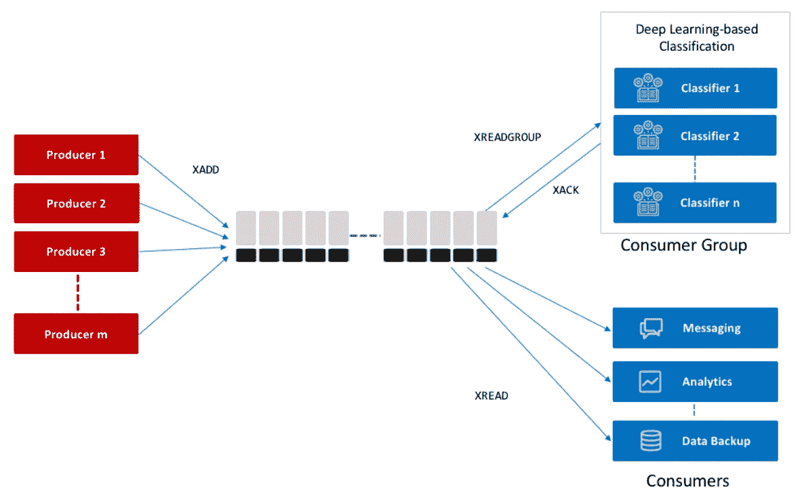

# Redis 流简介

> 原文：<https://javascript.plainenglish.io/an-introduction-to-redis-stream-57445a21751e?source=collection_archive---------2----------------------->

## 如何使用 Redis 流有效地管理数据消耗和持久化数据？



[Image Source](https://devopedia.org/redis-streams)

[Redis](https://redis.io/) 是内存中的数据结构存储，主要用作数据库、缓存和消息代理。Redis 以其令人难以置信的速度和对不同类型数据结构的支持，如字符串、散列、列表、集合、位图、流等，在开发人员中非常流行。

此外，它有如此多的内置特性，如内置复制、Lua 脚本、LRU 驱逐、事务、磁盘持久性等，这使它非常出色。在本文中，我们将了解一个名为**流**的 Redis 数据结构。我们可以使用这种数据结构在我们的消费者或微服务中构建消息服务。

简单来说，我们可以把它作为一个消息代理，我们的微服务可以通过这个数据结构在它们之间进行通信。开始吧！

# 什么是 Redis 流？

简单地说，Redis streams 是 Redis 的一种仅附加数据结构。它与列表等其他数据结构有一些相似之处，但它更有用，也更复杂。当我们在一个流变量上附加一些数据/消息时，它就可供消费者使用了。它有一个**阻塞 API** ，允许我们让消费者等待新消息的到来。它速度快，易于实现。它还提供**消费者群体**，允许向不同的消费者发送不同的消息子集。

# 用例示例

例如，假设我们有两个微服务— **MS-1** 和 **MS-2** 。这些微服务想要在它们之间进行通信或者想要在它们之间交换一些数据。在这种情况下，消息服务就成了问题。Redis 流位于 **MS-1** 和 **MS-2** 之间，充当**代理**。它通过 Redis 中的一些 streams 变量交换消息/数据 **MS-1** 到 **MS-2** ，反之亦然。为了更清楚，让我们说 **MS-1** 在一个流中附加一些数据。MS-2 正在持续监听那个流。一旦 **MS-1** 在那个流中追加数据， **MS-2** 就会得到它。

# 基本操作

流条目不仅仅是一个字符串，而是由一个或多个字段-值对组成。基本上，主要有两种类型的操作，向流中添加数据和从流中获取数据。

# 添加数据

基本的写命令是 **XADD** ，它在指定的流中追加一个新的条目。

```
> XADD profile-information * name alex age 27 hair blackSample Output
-------------------------------------------
1627885225420-0
```

上面的命令将在关键字" **profile information "的流中添加一个新条目**让我们一部分一部分地解释这个命令，以便更好地理解。

*   **XADD** 是告诉 Redis 在指定的键上添加一个新条目的命令。
*   **profile-information** 是流的键名。
*   ***** 告诉 Redis 为每个条目创建一个单调递增的 ID。我们也可以显式指定 ID，但这种情况非常少见。服务器自动生成 id 几乎在所有情况下都是完美的。
*   命令的其余部分是组成我们的流条目的键值对。

还有一个有用的命令可以告诉我们流中的项数。

```
> XLEN profile-informationSample Output
-------------------------------------------
(integer) 1
```

*   **profile-information** 是流的关键名称

# 获取数据

现在，我们能够通过 **XADD** 命令在流中追加数据。现在是时候学习如何从流中读取条目了。获取数据的操作主要有三种类型。我们一个一个来讨论吧。

## 按范围查询:XRANGE & XREVRANGE

在学习如何进行范围查询之前，我们需要对 IDs 有更多的了解。由 **XADD** 命令返回的 id 看起来确实是这样的——1627796743670–0，格式为。

```
<millisecondsTime>-<sequenceNumber>
```

毫秒部分是本地 Redis 节点中的本地时间，如果条目是在相同的毫秒内创建的，则序列号用于区分它们。Redis 确保这些 id 以单调递增的顺序排列。IDs 的第一部分基本上是一个时间戳，因此它也为我们提供了一个基于时间的范围查询。为了进行范围查询，我们需要分别指定两个 id—**start**和 **end，**。请注意，查询的范围是**包含**，这意味着返回的范围将包括 ID 为 **start** 或 **end** 的元素。

```
> XRANGE profile-information - +Sample Output
-------------------------------------------
1) 1) 1627885225420-0
   2) 1) "name"
      2) "alex"
      3) "age"
      4) "27"
      5) "hair"
      6) "black"
```

*   **XRANGE** 是基于范围的查询命令。
*   **profile-information** 是流的键名。
*   两个特殊 ID**(—和+ )** 分别表示指定流中可用的**最小**和**最大** ID。
*   我们还可以指定任何有效的 id 来代替——和 **+** 来表示范围的起点和终点。

时间范围查询

对于基于时间的查询，我们可以省略序列部分，只放置开始时间和结束时间的时间戳。当我们省略序列部分时，开始序列自动设置为 0，结束序列将是可用的最大序列号。

```
> XRANGE profile-information 1627796743670 1627799297560
```

我们可以在查询的最后指定一个选项 **COUNT** 。它将从一个范围中获取前 N 项。

```
> XRANGE profile-information - + COUNT 2
```

XREVRANGE 的工作方式与 **XRANGE** 完全一样，只是顺序相反。

```
> XREVRANGE profile-information + - COUNT 2
```

它将以范围的逆序返回 N 个元素。

## 使用 XREAD 获取新项目

我们可以**订阅**到达信息流的新项目。这个概念看起来类似于 **Pub/Sub，**但是有显著的区别。主要的相似之处是，一个流可以有多个消费者，默认情况下，一个新的项目将被交付给每个等待消息的消费者。这非常类似于**扇出**技术，如**发布/订阅**。主要区别在于，虽然发布/订阅的工作方式类似于 **fire 和 forgot** 意味着在扇出消息后，它将从 Redis 中删除，但流的工作方式完全不同。流用它们的 id 保存消息。除了流，**消费者群体**提供了发布/订阅或阻止列表无法实现的控制级别。

**xdread**是监听到达流的新消息的命令。

```
> XREAD COUNT 1 STREAMS profile-information 0
```

*   **计数**是限制输出条目的可选命令。COUNT 之后的值表示我们想从一个流中读取多少个条目。
*   **STREAMS** 是强制的，带有以下流的键名。
*   最后一个值 0 是 ID。该 ID 表示最大 ID 已经存储在流配置文件信息中，并且该命令将仅返回其 ID 大于该 ID 的那些条目。这里，0 表示我们希望消息从流的开头开始，ID 大于 0–0。

我们可以很容易地把 **XREAD** 变成阻塞命令。

```
> XREAD BLOCK 0 STREAMS profile-information $
```

*   **阻塞**选项，超时值为 0 表示该命令将检查是否可以立即处理请求。如果它能够处理请求，它就会这样做。否则，它将阻塞请求，直到数据到达。超时 0 毫秒意味着该请求永远不会超时。
*   **$** 是一个特殊的 ID，表示已经存储在流中的最大 ID，因此我们将只接收新消息。
*   我们还指定 COUNT 选项来限制输出条目。其实， **XREAD** 只有两个选项**BLOCK**&**COUNT**。

## 消费者群体

现在我们处于一个有趣的部分。XREAD 已经为我们提供了一种很好的扇出技术。但是我们可以考虑一种不同的情况，我们可以有多个消费者，我们希望在他们之间分发我们的消息子集。简单地说，我们不想向不同的消费者传递相同的信息。例如，假设我们有两个消费者——**C1**、 **C2** ，我们有 7 条消息，它们的 id 分别是 1、2、3、4、5、6、7。现在我们想在 C1 和 C2 之间分发这些信息，就像这样

```
1 -> **C1**
2 -> **C2**
3 -> **C1**
4 -> **C2**
5 -> **C1**
6 -> **C2**
7 -> **C1**
```

您可能已经注意到，我们没有向多个客户推送相同的消息。我们向不同的客户发送不同的信息。在这种情况下，消费者群体进入了这个画面。

创建消费者群体

假设我已经有一个 stream 类型的键“ **profile-information** ”，那么下面的命令将创建一个消费者组。

```
> XGROUP CREATE profile-information mygroup $
```

*   您可能已经知道 **$** 是一个特殊的 ID，表示流中最后一个可用的最大 ID。消费者团体需要知道应该从哪里为其消费者跟踪消息。传递 **$** 将仅跟踪该组创建时间之后的新消息。如果我们传递 0 而不是$,那么这个组将从流的开始使用所有的消息。我们可以指定任何有效的 id 来指示组消费消息的起点。
*   **我的组**是组的名称。
*   **简档信息**是现有的流密钥。
*   如果流不存在，XGROUP 也支持通过在最后一个 **MKSTREAM** 处传递子命令来创建流

```
> XGROUP CREATE newstream mygroup $ MKSTREAM
```

从群体中消费

Redis 提供了一个命令名 **XREADGROUP** 非常相似，提供了相同的 **BLOCK** 选项；否则，就是同步的。有一个带有两个参数的强制选项组—消费者组的名称和试图读取的消费者的名称。

```
> XREADGROUP BLOCK 0 GROUP mygroup Alice COUNT 1 STREAMS profile-information >
```

*   这个命令非常具有描述性。它声明我想使用消费者组'**my group '**'从流'**简档信息'**中读取，我是消费者 Alice。每个消费者必须指定一个名称，该消费者名称在组内唯一地标识该消费者。
*   **>** 是另一个特殊的 ID，只在消费者群体的上下文中有效，这意味着消息迄今为止从未被传递给其他消费者。

# 结论

这几乎是所有关于 Redis 流的基本东西。我从这篇发表在官方网站上的[文章](https://redis.io/topics/streams-intro)中获取了概念和信息。如果你阅读原文，你可能会了解更多。我已经缩小了主要文章的范围，并试图呈现 Redis 流的有用视图。我希望它能帮助你，如果有帮助，请把它分享给你的朋友。编码快乐！

*更多内容尽在*[***plain English . io***](http://plainenglish.io)