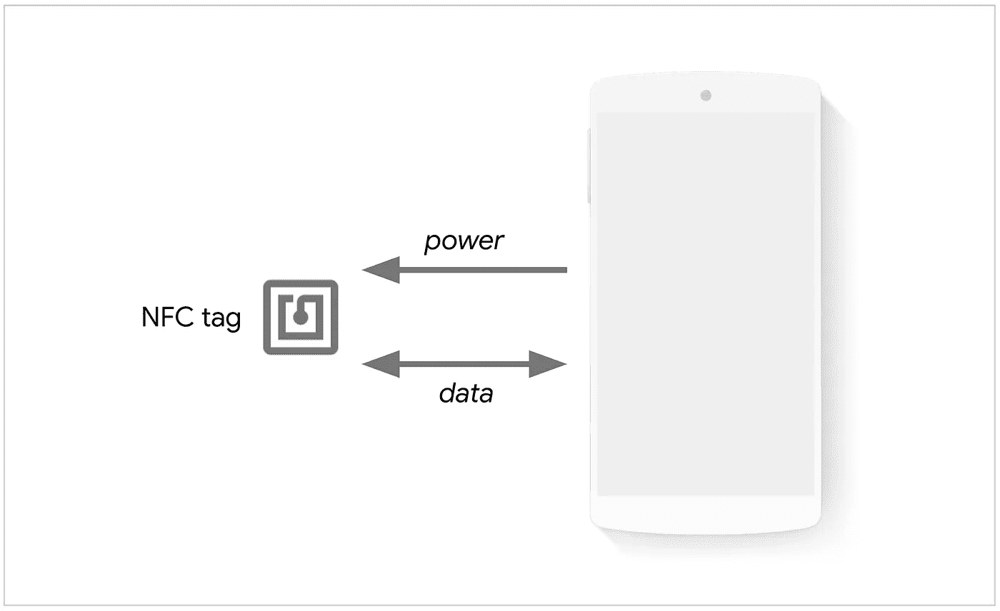

# 网络 NFC 简介

> 原文：<https://javascript.plainenglish.io/an-introduction-to-web-nfc-86bbf83098ba?source=collection_archive---------8----------------------->

## 什么是 Web NFC？这是一种短程无线技术，允许 10 厘米范围内的设备进行通信。



NFC 或近场通信是一种短程无线技术，允许距离小于 10 厘米的设备进行通信。它在与 NFC 标签交互时最有用。随着谷歌宣布在 Android 的 Chrome 中支持网络 NFC，网络 NFC 最近才成为现实。

可以使用称为 NFC 数据交换格式(NDEF)的跨不同标签工作的轻量级格式来交换消息。

web NFC 的常见用例是在任何可以使用标签来提供信息的地方，例如博物馆、美术馆、会议和音乐会，以便在用户触摸 NFC 卡时显示附加信息。它也可以在活动中用于扫描徽章。另一个用例是零售店的游戏化体验，打开网页参与其中。

我可以想象，在未来的某个时候，支付可能会被嵌入其中，但第一版完全避免了 NFC 的所有安全属性。除了读取器/写入器(NDEF)之外，其他 NFC 模式尚未在 Web NFC 中实现。这些模式是点对点、卡仿真和无线充电。

# 入门指南

你需要 NFC 标签才能开始。目前还没有 Chrome 开发工具支持模拟 NFC。可以从亚马逊获得 NFC 标签[贴纸](https://amzn.to/3CrJPms)。你还需要一个支持 NFC 的 Android 设备。下一个很简单:Chrome v86+。

# 写入标签

现在您已经有了所需的硬件，写入标签就很容易了:

```
// can add logic to feature detect first
// if ('NDEFReader' in window) {}
document.getElementById("write-to-nfc-tag").addEventListener("click", async () => {
 try {
     const ndefReader = new NDEFReader();
     await ndefReader.write("Hello Web NFC!");
   } catch (error) {
     console.log(error);
   }
 });
```

NDEF 消息不一定必须是字符串。它可以由多个 NDEFRecords 组成，可以是文本、URL 或更复杂的类型。让我们写一个标签的 URL:

```
document.getElementById("write-to-nfc-tag").addEventListener("click", async () => {
 try {
     const ndefReader = new NDEFReader();
     await ndef.write({
      records: [{ recordType: "url", data: "[https://www.wisdomgeek.com](https://www.wisdomgeek.com)" }]
    });
   } catch (error) {
     console.log(error);
   }
 });
```

# 阅读标签

在读取时，您必须区分标签可以包含的不同类型的记录。在此之前，可以使用以下方法进行阅读:

```
try {
    const ndef = new NDEFReader();
    await ndef.scan();
    ndef.addEventListener("reading", ({ message, serialNumber }) => {
        console.log(message.records);
    });
} catch (error) {
    console.log(`Error! Scan failed to start: ${error}.`);
}
```

只有当用户允许网站与 NFC 设备交互并在手机上启用 NFC 时，承诺才会兑现。

为了添加读取不同类型消息的逻辑，我们可以运行一个循环，并在其中设置一个开关:

```
const decoder = new TextDecoder();
for (const record of message.records) {
  switch (record.recordType) {
    case "text":
      console.log(`Text: ${decoder.decode(record.data)} (${record.lang})`);
      break;
    case "url":
      console.log(`URL: ${decoder.decode(record.data)}`);
      break;
    case "mime":
      if (record.mediaType === "application/json") {
        console.log(`JSON: ${JSON.parse(decoder.decode(record.data))}`);
      } else {
        console.log(`Media not handled`);
      }
      break;
    default:
      console.log(`Record not handled`);
  }
}
```

这就是使用网络 NFC 读写标签的方法。它的使用非常简单，未来应该会激发出围绕 NFC 标签的创造性项目。该 API 将来可能会扩展，其他有趣的项目也将开始成为现实。如果你有任何关于使用网络 NFC 的问题或想法，欢迎在下面留言！

*原载于 2021 年 8 月 7 日*[*【https://www.wisdomgeek.com】*](https://www.wisdomgeek.com/development/web-development/web-nfc-is-a-thing-now/)*。*

*更多内容请看*[***plain English . io***](http://plainenglish.io/)*。报名参加我们的**[***免费周报***](http://newsletter.plainenglish.io/) *。在我们的* [***社区获得独家访问写作机会和建议***](https://discord.gg/GtDtUAvyhW) *。**