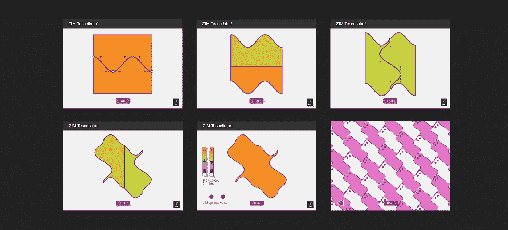

# 邀请艺术创立者和互动艺术家

> 原文：<https://javascript.plainenglish.io/an-invite-for-generative-art-makers-and-interactive-artists-106f3ed186ab?source=collection_archive---------2----------------------->

## 超越处理/ p5.js


An Invite from Dr Abstract, Founder of ZIM

我们想邀请你制作艺术工具和应用程序。这是一个双赢的局面，你授权他人创作艺术，同时自己也能创作艺术。回复之前，*我已经这样做了！请继续阅读…*

我相信你已经制作了(或看到了)数字艺术，人们可以用 *DatGui* 这样的控件来改变参数。这是生成艺术的支柱，因为看到用几个滑块就能做出各种各样的东西是很神奇的。这也是教育，甚至科学，因为你探索边界，也许会发现与自然的相似之处。下面是从 CodePen 中随机选取的一个例子:


[Torus Tunnel](https://codepen.io/Mombasa/pen/leiGu) — Mombasa — demonstration of DatGui

有两种**方法可以让你超越这种常见的安排。我们将在[https://zimjs.com](https://zimjs.com)大会上介绍 ZIM JavaScript Canvas 框架，并展示如何通过使用以下工具提升您的艺术:**

1.  **嵌入式接口**
2.  **精心制作的交互性**

> Z IM 是在主要的画布库建立之后才登场的，比如 p5.js(视觉/IOT)、Pixi.js/Phaser(营销/游戏)、Three.js (3D)、Paper.js(曲线)和 CreateJS(互动媒体)。ZIM 建立在 CreateJS 之上，在一个通用的交互式媒体框架中提供便利、组件和控件。参见 [◎你在画布上编写创意代码的指南](https://drabstract.medium.com/your-guide-to-coding-creativity-on-the-canvas-ada0996298f6)。ZIM 也有 Generator()，它的工作方式类似于处理 push()、pop()等。


[ZIM](https://zimjs.com) — Code Creativity — with [Embedded Interface](https://codepen.io/danzen/pen/vavwmv) at right

# 嵌入式接口

我们鼓励你在你的作品中考虑嵌入界面。这可以增强体验，并确实使整个工具看起来像艺术。


[Bloob](https://codepen.io/zimjs/pen/XWjrmoQ) — Dr Abstract — Noise Art with Embedded Interface for speed and curvature

在某种程度上，这让你的艺术更接近于一种产品，也许像一个台灯。它可以带来更完美的感觉，当然也比 *DatGui* 控制台更加个性化。这种方法也能给你带来营销领域的工作(美元)，在那里你可以加入商标等。不是每个人都这样，但是还有更糟糕的赚钱方式。你也可以和 ZIM 制作互动 NFT。

[制作互动 NFTs](https://levelup.gitconnected.com/making-interactive-nfts-4a50a8f8feb3)

下面是处理噪声的 ZIM 生成器()代码。类似于加工。之后，我们将展示接口代码，因为这是 ZIM 可以提供额外可能性的一种方式。

[CodePen 上的全部代码](https://codepen.io/zimjs/pen/XWjrmoQ)。

```
const segments = 180; // how many lines
const delta = 360/segments; // angle between each line
const inner = 50; // inner radius
const outer = 300; // outer radius
const variation = outer-inner; // maximum noise// curve and speed are adjusted by Dial interfaces
let c = 2.5;    // curve factor 
let s = .05;    // speed factor
let t = 0;      // time// ZIM Generator() works somewhat like Processing / P5js.
// Using stamp instead of draw will draw all generations immediately 
// rather than one generation at a time.const g = new Generator({
 stamp:gen, // the function to call
 strokeWidth:5,
 maxCount:segments,
 startY:stageH/2
});
function gen(count) {  
 let angle = delta*count*RAD; 
 let noise = g.noise(c*Math.sin(angle), c*Math.cos(angle), t);
 let radius = inner+variation*noise;
 g.push() // remember the starting position
   .stroke(innerColor)
   .line(0,0,radius,0)
   .stroke(outerColor)
   .line(0,0,outer-radius,0)
   .pop() // go back to the starting position
   .rotate(delta); // rotate delta each time
}
Ticker.add(()=>{
 t+=s; // set the speed through the noise
 g.restamp();
});// Note that ZIM also works with a traditional Shape class
// with fill, stroke, moveTo, lineTo, curveTo, etc. 
// But this is absolute position (complex angle code). 
// The trick of Processing and Generator is relative position.
// The Generator class was coded in one week for ZIM Cat.
```

ZIM 有许多组成部分。参见 ZIM 站点的 [UI/UX 部分](https://zimjs.com/uiux.html)。我们将展示一些例子，然后回到上面 Bloob 应用程序的接口代码。


[UI/UX section](https://zimjs.com/uiux.html) of the ZIM site


More [Noise](https://codepen.io/zimjs/pen/jOMZjOy) with Sliders similar to DatGui


An [Interactive Book](https://zimjs.com/angels/) also with Crafted Interactivity (at left)


[ZIM Synth](https://zimjs.com/cat/synth.html) with Sliders, Dials and Selectors for Animating Sound


A different Dial and Slider treatment in a ZIM [SoundScape](https://codepen.io/zimjs/pen/PMymaY)


A variety of interfaces in [Vault 7](http://danzen.com/vault7/) and [Vault 6](https://zimjs.com/vault6/) puzzles


Tabs in [ZIM Generator](https://zimjs.com/cat/generator.html) example


Minimal Dial and Slider in [Controlled Noise](https://codepen.io/zimjs/pen/KKKeGZg) Example

以下是 Bloob 示例中转盘的代码。

```
// ZIM has CSS-like style on the Canvas as of ZIM OCT (8)
STYLE = {        
 step:0, 
 useTicks:true,
 tickColor:purple,
 tickStep:series(.01,.5)
}const speed = new Dial({min:-.1, max:.1, currentValue:s})
 .pos(120,60,LEFT,BOTTOM)
 .rot(180)
 .change(()=>{s = speed.currentValue;});const curve = new Dial({min:0, max:10, step:0, currentValue:c})
 .pos(120,60,RIGHT,BOTTOM)
 .change(()=>{c = curve.currentValue;});
```

ZIM 允许您使用传统的参数或配置对象。以上我们两个都用。这被称为 ZIM 二重奏，因为该系统是在 ZIM 二重奏(2)中推出的。我们还使用 series()表示 tickStep 的值。这我们称之为 ZIM VEE 值，因为动力学参数是在 ZIM VEE (5)中推出的。你也可以每次传入一个数组来获得一个随机值，还有更多[选项](https://zimjs.com/tips.html#DYNAMIC)在制作艺术品时非常方便

除了用于事件的传统 on()方法，ZIM 还提供了可链接的 tap()和 change()方法，使得捕捉组件事件更加容易。ZIM 也有 wire()和 wired()，允许您将组件连接到值，反之亦然。ZIM 绑定()允许您将数据绑定到本地存储或将服务器脚本绑定到数据库。

# 精心设计的交互性

精心制作的交互性意味着我们让人们指导他们的艺术，同时仍然提供环境的艺术参数。这不仅仅是在方程中循环参数。从某种意义上说，它变成了一个 app，让人们创造某种类型的艺术。这可能涉及也可能不涉及生成性艺术。

编码工具比艺术本身需要更长的编码时间。ZIM 有许多便利设施、组件和控件可以帮助您。这里有一些例子。


[Gen-Pen](https://zimjs.com/genpen) generative pen tool — Lamps

这张图是怎么做出来的？笔是可生成的，但画是自由形式的。下面，我们看到钢笔面板可以被打开，钢笔的设置类似于动画的宽度和缓和参数等。可以设置。颜色组合可以是随机的，也可以是连续的。其他笔也有扩展参数。


ZIM 提供的组件包括菜单列表、面板、切换、组织器、复选框、步进器、按钮、标签、滑块和刻度盘。还有许多便利的方法，如单线拖动()，一个强大而简单的 animate()方法。提供了一些控件，例如 MotionController()，它可以很好地引导笔()。布局有平铺()。有一个 Loader()可以加载图像并轻松保存图像。


Robots made with [Gen-Pen](https://zimjs.com/genpen)


[Truchet Making Tool](https://codepen.io/zimjs/project/editor/ZbYwmJ)

Truchet Maker 允许您添加 Truchet 图案，拖动它们以捕捉到不同的位置，旋转它们，改变颜色，下面显示了用于选择的菜单，包括多个选择以[S]交换或[U]统一颜色，以及通过捕捉移动和调整多个维度的大小(棘手)。你可以想象会涉及到更多的编码。ZIM 是专门为这种形式的互动媒体。ZIM 吸收了从 CreateJS 到 Flash 再到导演的一长串学习。


[ZIM Ornamator](https://zimjs.com/ornamate) — with Precision Stepper Component

dial 奥纳马托超越了一般的滑块和表盘。首先，它有精密步进器()组件，其中主箭头控制大数字，侧箭头控制小数。而且，滑块控制着环，在制作图案时有一种视觉效果。


如果人民能够控制道路，那将会怎样呢？与 ZIM，我们有 Blob 和 Squiggle。让我们来看几个例子，用户可以调整路径来制作艺术。下面，我们可以用贝塞尔曲线改变路径，两条曲线在中间绘制出路径。滑块控制绘图点的速度。


[Custom Path Generative Art](https://codepen.io/zimjs/pen/QWbMQKx)


[ZIM Tessellator](https://codepen.io/zimjs/pen/ZEKvgVR) — with Squiggles cutting Blobs

ZIM 镶嵌细工是 ZIM 所能做的一个惊人的例子。ZIM 有业界领先的路径工作，让人们使用贝塞尔控件定制曲线和斑点形状。如下所示，我们可以拖动曲线，然后切割成两个斑点。然后，我们添加另一条曲线，这条曲线可以沿着之前的曲线的边缘拖动——**这太神奇了**！我们将形状切割成两个以上的斑点，然后使用 ZIM 瓷砖()将它们平铺，并再次使用一行代码保存结果！Tessellator 相当复杂，但却是在一天内完成的。



Interactive Tessellator steps

让我们来看看 ZIM 斑点和曲线。它们被认为是矩形、圆形、三角形、多边形、线形和喇叭形，所有这些最终都是画布上的形状。所以它们可以有边框，颜色等。在 ZIM，这些是可编辑的。以下是 Blob 和 Squiggle 对象的特征。我们可以:

*   通过双击点，在四种不同类型的点之间循环。有镜，直，自由，无(针对尖点)。
*   通过单击边来添加点，通过按住 shift 键单击或单击来移除点。
*   多个选择点或控制一起移动。
*   使用 TransformManager 保存路径，并使用 transform()保存其他转换。
*   将一个形状制作成另一个形状的动画(补间形状)。
*   沿着路径动画对象。
*   沿着路径拖动其他对象。
*   沿着路径放置对象(ZIM 珠)。
*   找出是否有物体碰到路径。
*   动画和摆动路径上的点

这就是我们所说的行业领先。许多特性都是在 ZIM NIO (9)中添加的。这里是[迷你站点](https://zimjs.com/nio)。下面是一个有趣的例子，沿着用户可编辑的斑点动画曲线。超过 150 个 CodePen 赞证明这比静态图片更有趣。


[ZIM Zinkle](https://codepen.io/danzen/pen/dgrMMX) — animating Squiggles along Blobs

# 结论

我们邀请您尝试 ZIM。这里是一个 [GEN ART](https://zimjs.com/art.html) 横幅页面，其中有一个 MORE 部分概述了可以用于制作艺术的 ZIM 的一些功能。这些功能包括自定义循环()和间隔()、Ticker()、现成的形状、生成器()、Pen()、Tile()、发射器()、噪波()、声波()、视差()等等！


[Gen Art with ZIM](https://zimjs.com/art.html) — Open the MORE Section

要开始学习 ZIM，请查看该网站的[学习部分](https://zimjs.com/learn)了解介绍、视频、SKOOL、KIDS、文章和教程。文章指向介质上的可用指南。以下是《导游指南》的摘录；-).

## 所有指南的摘要

首先阅读这篇文章，了解每个指南部分的概述。
◎ [你的画布创意编码指南](https://medium.com/@zim_67337/your-guide-to-coding-creativity-on-the-canvas-ada0996298f6)

1.  画布库和框架◎ [指南](https://medium.com/@zim_67337/your-guide-to-selecting-a-javascript-canvas-library-or-framework-3584f4512a30)
    `CreateJS, ZIM, Pixi.js, Phaser, P5.js, Paper.js`
2.  代码环境和模板◎ [指南](https://medium.com/@zim_67337/your-guide-to-setting-up-an-editor-and-template-to-code-the-canvas-7f684e24c2ce)
    `text editor, browser, HTML page, template, import, script tag`
3.  显示对象::形状◎ [引导](https://medium.com/@zim_67337/your-guide-to-coding-concepts-with-the-colorful-canvas-8ff24086eb6)
    `Circle, Rectangle, Triangle, Blob, Squiggle, Container
    variables, classes, objects, parameters, properties, methods`
4.  显示对象::组件◎ [向导](https://medium.com/@zim_67337/your-guide-to-components-on-the-javascript-canvas-54e0d8fc79b)
    `Button, Slider, Dial, List, Tabs, Stepper, Indicator, Selector
    events, functions, anonymous functions, arrow functions`
5.  便利设施◎ [指南](https://medium.com/@zim_67337/conveniences-when-coding-on-the-canvas-f6b0b8dd981d)
    `object literals, chaining, arrays, random, series`
6.  互动性◎ [引导](https://medium.com/@zim_67337/your-guide-to-interactivity-on-the-canvas-with-javascript-e7c96c02ff74)
    `drag, gesture, transform, tap, change, hitTest, conditionals`
7.  动画◎ [引导](https://medium.com/@zim_67337/your-guide-to-animation-on-the-canvas-with-javascript-cb928c4c888a)
    `interval, timeout, animate, wiggle, Ticker`
8.  辅助功能◎ [向导](https://medium.com/@zim_67337/your-guide-to-accessibility-on-the-canvas-with-javascript-ff58074c30c8)
    `screen reader for canvas components and content`
9.  资产◎ [向导](https://medium.com/@zim_67337/your-guide-to-images-sounds-and-sprites-on-the-canvas-1b13b019e76d)
    `images, sounds and sprites`
10.  风格◎ [引导](https://medium.com/@zim_67337/style-on-the-canvas-12660313ba6a)
    `Set the style for all, types and groups of display objects`
11.  反应灵敏，适应性强◎ [导读](https://medium.com/@zim_67337/your-guide-to-responsive-and-adaptive-design-on-the-canvas-e2f763128152)
    `Pages, Layout, HotSpots, Guide, Grid, Manager, Tile, Wrapper`
12.  控件◎ [向导](https://medium.com/@zim_67337/controlling-the-canvas-with-javascript-d94792aa33cd)
    `MotionController, Pen, Parallax, Emitter, SoundWave, VR, Physics`


[ZIM Examples](https://zimjs.com/examples.html)

该网站的[示例部分](https://zimjs.com/examples.html)有超过 200 个用 ZIM 制作的应用示例——每一个都非常值得制作！现在轮到你了。我们有三个演示卷视频，带您快速浏览突出显示的示例。中间一个以一组重制的比较结束。

> 与 Processing、Pixi.js、CreateJS 和 HTML/CSS/JS 相比，ZIM 的代码量只有一半左右。

[Highlight Reel 2021](https://www.youtube.com/watch?v=QQR4g8irfCM)

[Highlight Reel 2020](https://www.youtube.com/watch?v=EB66-QgUz98)

[Highlight Reel (2017)](https://www.youtube.com/watch?v=Wl4IxVvqQbQ)

我们希望你接受我们的邀请。欢迎你加入我们的 [ZIM Slack 频道](https://zimjs.com/slack)，在这里我们讨论画布上的编码，展示例子，提问和回答问题。万事如意！

抽象博士


> *在推特上关注我们在* [*ZIM 学习*](https://twitter.com/zimlearn) *这里是* [*ZIM 在 YouTube 上学习*](https://www.youtube.com/zimlearn) *！*

*更多内容请看*[***plain English . io***](http://plainenglish.io/)