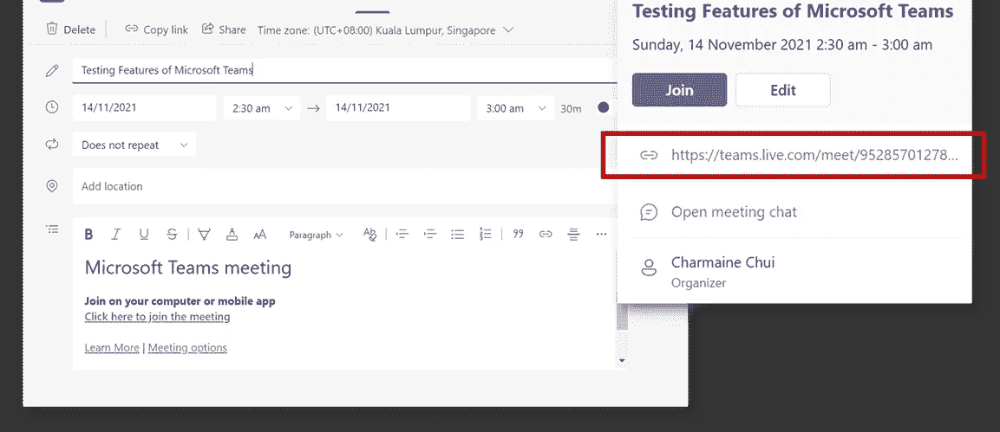
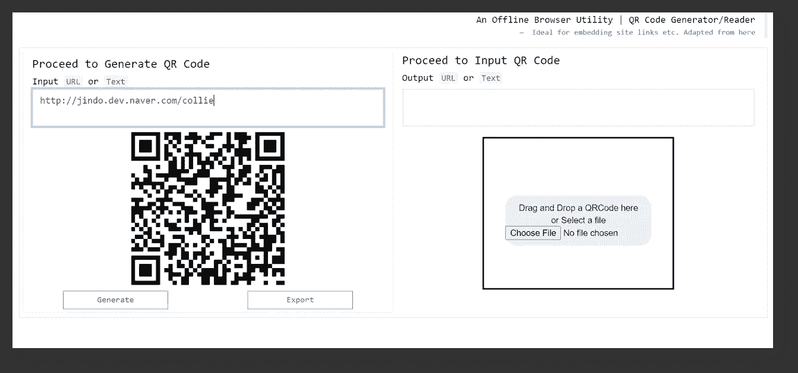
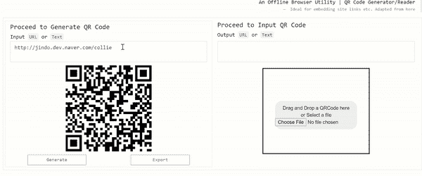
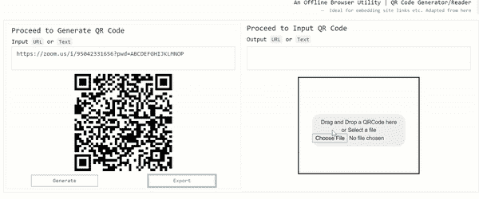

# 用 100%普通 JavaScript 构建的离线 QR 码生成器/阅读器

> 原文：<https://javascript.plainenglish.io/an-offline-qr-code-generator-reader-built-in-100-vanilla-javascript-b7e8aec812e8?source=collection_archive---------8----------------------->

## 为什么每个人都应该准备好这个。包含工具链接。

过去两年的冠状病毒事件导致我们朝九晚六的工作传统发生了重大转变。首先，远程工作频率的增加鼓励了协作平台的使用，如 Zoom、Skype、微软团队会议等。以便取代面对面的会面。

就个人而言，我已经习惯于看到一长串🔗虚拟会议 URL 被垃圾邮件发送给同一组织内的集体子实体。

对于其他发现上述内容的人来说，你肯定会发现以下内容有些熟悉:

Image by Author | A sample screenshot of a scheduled meeting on the platform Microsoft Teams Meeting | Note that a URL (outlined in red) is generated

然而，在适应这一新规范的同时，有一个小细节(或者说缺乏细节)让我感到相当奇怪。

> 迄今为止，我所遇到的任何一个协作平台都没有内置生成二维码的功能，以便对访问预定虚拟会议的 URL 进行编码。

我认为这令人震惊的原因是，在以下情况下，许多麻烦本可以避免

*   个人必须在不同的笔记本电脑之间切换
*   另一名员工要求获得该链接的副本
*   …或者简单地说，跳过输入完整 URL 的复杂过程会给用户带来巨大优势的任何其他场景

虽然迄今为止我遇到的平台都没有包含这一功能，但幸运的是，有一个变通办法，这正是我写这篇文章来分享一个包含 **QR 码生成/扫描**功能的工具的原因。

Screenshot by Author | Illustration of JavaScript QR Code Utility | **Left**: QR Code encodes URL upon selection of the button [Generate] | **Right**: QR Code reader which reads in any QR Code image and outputs the encoded content

## 仅供参考:请随意从我的 GitHub [这里](https://gist.githubusercontent.com/incubated-geek-cc/d98cd82e3fadbfca20bb2805ee4bd4a6/raw/e804b96822a8e693366db93653d803e9f05217ff/QRCodeUtility.html)取回工具

# 功能(1):生成和导出二维码

**用例:**假设虚拟链接是通过缩放生成的，例如[https://zoom.us/i/95042331656?pwd=ABCDEFGHIJKLMNOP](https://zoom.us/i/95042331656?pwd=ABCDEFGHIJKLMNOP)

Demo by Author | Simply proceed to copy and paste the meeting URL into the text area and proceed to export the QR Code Image generated | Include it in any meeting invitation or share the image with relevant stakeholders of the scheduled virtual meet-up

# 功能(2):扫描二维码检索内容

**用例:**收到所需的 QR 码图像后，继续将其上传到相同的工具中，以便检索实际的会议 URL

Demo by Author | Upload the QR Code Image generated to output the required URL | Note that in this example I have chosen to upload the generated image from the first example to output the exact same zoom link. Hence, in the event that you have to toggle between 2 laptops, simply ensure that this QR Code utility is present on both sides and access the URL by uploading the image on the right side of the tool as shown.

就是这样！虽然这不是火箭科学，也不是彻底的创新，但我确实希望这个[二维码工具](https://gist.githubusercontent.com/incubated-geek-cc/d98cd82e3fadbfca20bb2805ee4bd4a6/raw/e804b96822a8e693366db93653d803e9f05217ff/QRCodeUtility.html) ( [演示链接](https://incubated-geek-cc.github.io/qr-utility/))能够以某种方式提供帮助。由于它是一个 HTML 浏览器工具(不需要互联网)，只需双击它就可以在任何支持 JavaScript 的浏览器上运行该文件，如 Chrome 或 Microsoft Edge，就可以了！

非常感谢你坚持到这篇文章的最后，❤希望你已经发现这是有用的，并考虑做书签以供参考。可能会派上用场。

如果你碰巧对数据分析或 Web 开发内容感兴趣，请随时[关注我的 Medium](https://medium.com/@geek-cc) ！我真的很感激。

 [## 通过我的推荐链接加入灵媒——李思欣·崔

### 获得李思欣·崔和其他作家在媒体上的所有帖子！😃您的会员费直接…

geek-cc.medium.com](https://geek-cc.medium.com/membership)