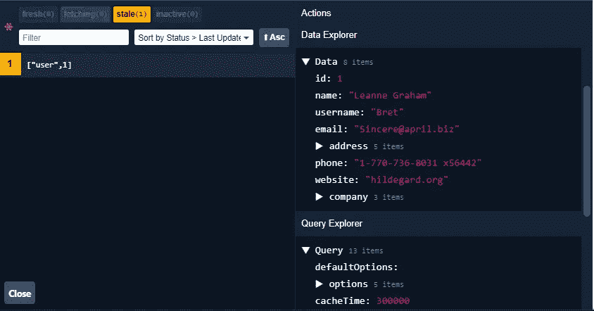
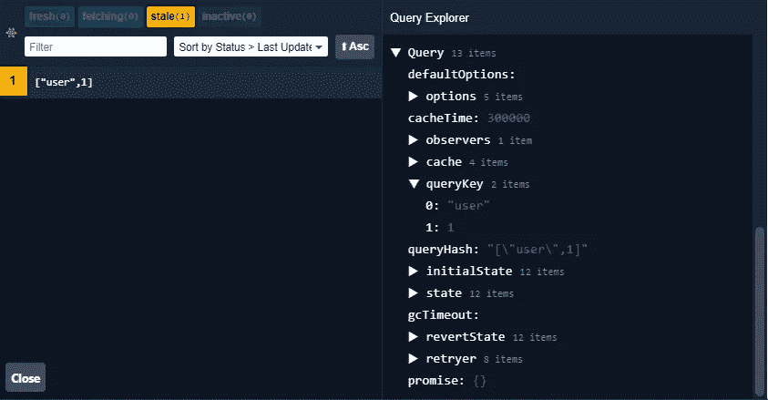
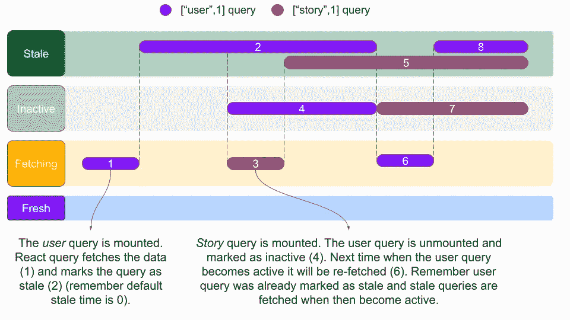

# React 查询概述

> 原文：<https://javascript.plainenglish.io/an-overview-of-react-query-88935faadcd7?source=collection_archive---------3----------------------->

## 缺少服务器状态管理库

状态管理一直是前端应用中讨论的话题。现有的解决方案，如 Redux、Mobx 等，都是面向客户端状态管理的。然而，在本文中，我们将集中于有效地管理从服务器获取的状态。


Photo by [Alireza Khatami](https://unsplash.com/@alirexa?utm_source=unsplash&utm_medium=referral&utm_content=creditCopyText) on [Unsplash](https://unsplash.com/s/photos/server-rack?utm_source=unsplash&utm_medium=referral&utm_content=creditCopyText)

# 服务器状态实际上意味着什么？

从服务器获取的任何数据都可以称为服务器状态。例如，您订阅的出版物、您为之鼓掌的故事、您撰写的故事都是服务器状态。客户端状态的一个例子可以是用户的主题偏好(亮或暗)。

控制存储在远程服务器上的信息会变得很棘手。此外，服务器数据带来了缓存、获取、更新以及将应用程序状态与服务器状态同步的固有挑战。

让我们看看 react query 如何帮助解决这些问题。

# 获取数据

获取数据具体指的是向服务器上的端点发出 GET 请求。react query 允许我们与服务器交互的方式是通过提供钩子。它提供了 [**useQuery**](https://react-query.tanstack.com/reference/useQuery) 钩子从服务器获取数据。

useQuery 挂钩有两个必需的参数。

第一个参数是实际发出 GET 请求的函数(与 API 交互)，称为 [**查询函数**](https://react-query.tanstack.com/guides/query-functions) 。该函数可以选择任何方法与服务器交互。它可以使用本机 fetch API 或任何其他库，如 Axios。唯一的要求是函数应该返回一个承诺，要么解析数据，要么抛出一个错误。

请注意下面的查询函数是如何查询第 3 行的特定端点/users/1 的。

A function used for fetching data from the API.

第二个参数叫做 [**查询键**](https://react-query.tanstack.com/guides/query-keys) 。react query 使用它来管理缓存。字符串、数组和对象是有效的查询关键字。查询键应该是可序列化的，并且对于查询是唯一的。以下是一些有效的查询关键字示例。

Examples of valid Query Keys in React Query.

注意上面的 useQuery 钩子是如何提供两个参数的，查询键和查询函数(fetchUser)。

React query 在内部将查询键传递给查询函数。让我们修改上面的查询函数来获取任何用户的信息，而不是硬编码的用户(users/1 端点)。

A Query Function in React Query.

既然我们能够从服务器获取信息，那么让我们创建一个组件来向用户显示信息。

Displaying the data fetched from the API to the user.

注意 useQuery 钩子如何返回 *isLoading、isError、data、*和 *error* (第 4 行)。这些只是钩子返回的几个值。

```
The list of all the variables returned by the useQuery hook has been [discussed here](https://react-query.tanstack.com/reference/useQuery).
```

*   *isLoading* 是一个布尔值，当数据被提取时为真。这可能会导致错误或成功的请求。
*   *如果提取数据时出现错误，isError* 为真。还记得 useQuery 期望查询函数返回一个承诺，要么解析数据，要么抛出一个错误。在查询函数抛出错误的情况下， *isError* 标志被设置为真，相应的错误在 *error* 变量中可用。
*   *数据*包含成功请求时您期望的实际数据。

React query 确实简化了应用程序的样板文件，并为我们提供了从服务器获取数据的标准方式。

# 缓存数据

React query 为所有 GET 请求维护一个全局缓存。缓存就像一个字典，根据称为查询键的键来存储获取的数据。从服务器获取数据后，react query 会跟踪缓存时间等方面。

React query 提供了一个[调试工具](https://react-query.tanstack.com/devtools)来跟踪应用程序中的所有查询。

下图显示了根据查询关键字[“user”，1]存储的数据(还记得我们在上一节中获取并显示的数据)。



Devtools provided by React Query (Notice the Data on the right hand side).

看看下图中查询资源管理器下的 cacheTime、queryKey 和 queryHash 的值。



Devtools provided by React Query (Notice the Query on the right hand side).

React query 为开发人员做了维护缓存的必要工作。它还更新缓存，以便数据与服务器的状态同步。

# 同步数据

在继续之前，让我们了解一下**活动**和**非活动**查询的概念。在 react query 的上下文中，活动查询是当前安装在应用程序中的查询。例如，假设您有两条路线/用户和/故事。前一个路由具有访问具有关键字[“用户”，1]的查询的组件，而后一个路由访问具有关键字[“故事”，1]的查询。在这种情况下，每当有人访问/user 时,[“user”，1]查询将变为活动(已安装),而[“story”，1]查询将变为非活动。

此外，每个查询都有一个与之关联的**陈旧**时间。您可以全局或逐个修改所有查询的失效时间。默认失效时间为零。它只是意味着与查询相关联的数据在相对于最近一次读取 0 毫秒后被认为是陈旧的。这意味着 react query 将尽快重新获取数据(记住失效时间是 0 毫秒)。考虑这样一个场景，其中一个查询[“likes”，1]有一个 5 分钟的过时时间。此外，让我们假设最后一次获取查询是在 1800 小时。这仅仅意味着 react query 直到 1805 小时才会重新提取查询，因为在那之前查询是**新鲜的**。在这个场景中，react query 只是提供存储在缓存中的数据，而不是进行外部 API 调用。

除了不活动、新鲜和陈旧之外，查询还可以处于**获取**状态。从服务器提取的查询处于提取状态。这种查询可以返回有效的响应，也可以导致错误。

现在让我们看看 react query 如何帮助同步服务器和应用程序之间的状态。

*   所有过时的查询在激活时都会被重新提取。
*   当您重新聚焦一个窗口时(尝试在 react query 项目中切换选项卡并检查 network 选项卡)，陈旧的查询也会被重新提取。

```
Read about the [default behaviour](https://react-query.tanstack.com/guides/important-defaults) of React Query.
```



A timeline showing transition of two react queries with query keys — [“user”,1] and [“story”,1].

*   如果在获取数据时出现任何错误，默认情况下，在实际抛出错误之前，查询会尝试三次。
*   除此之外，您还可以通过[使查询无效](https://react-query.tanstack.com/guides/query-invalidation)来强制重新提取查询。查询关键字用于选择要使其无效(标记为过时)的查询。过时的查询在再次激活时会被重新提取。

Invalidating query in React Query.

无效查询非常有用。考虑一个场景，其中设置页面修改用户的信息。在这种情况下，配置文件页面必须与设置页面所做的更改保持同步。可以在设置页面更新用户信息，并使你认为需要从服务器接收更新状态的和查询失效(这里[“用户”，1]查询应该失效)。

# 更新数据

React query 使得使用[](https://react-query.tanstack.com/guides/mutations)**突变在服务器上创建/更新/删除数据成为可能。就像 useQuery 一样，react query 提供了一个[**use mutation**](https://react-query.tanstack.com/reference/useMutation)**钩子，用于在服务器上执行突变。useMutation 挂钩需要一个名为**变异函数**的必需参数。这个函数实际上负责与服务器交互和执行副作用。请注意下面的突变函数与 react query 有什么特别的关系。这只是一个在服务器上执行变异的简单函数。****

****A mutation function used in React Query.****

****让我们将这个函数与 react query 挂钩。****

****An example of using the useMutation hook in React Query.****

****useMutation 钩子只是指向突变函数(第 3 行:在这种情况下，modifyUser 函数就是突变函数)。当您调用由 useMutation 钩子返回的 mutate 函数(第 11 行)时，实际上调用了 mutate 函数。传递给 mutate 函数的对象(第 11 行)被 react query 简单地传递给突变函数。****

****useMutation 钩子返回辅助变量，例如 *isLoading* 、 *isError* 、 *error* (第 3 行)等等，这些变量类似于 useQuery 钩子返回的变量。useMutation 钩子也提供了可选的助手。最广泛使用的助手是 onSuccess(第 4 行)和 onError。例如，当相应的突变达到 onSuccess 状态时，您可以使设置页面上的[“user”，1]查询无效。这将确保配置文件页面实际上与服务器同步。同样，您也可以定义 onError 助手来传达任何错误消息。****

# ****结论****

****我希望您能够对 React Query 以及它如何解决服务器状态管理问题有一个总体的了解。除了这里讨论的以外，这个库还有很多内容。例如，除了 useQuery hook 之外，它还为常见 UI 用例提供了解决方案，如无限滚动或创建分页视图。****

****[](https://react-query.tanstack.com/overview) [## 概观

### React Query 经常被描述为 React 缺少的数据获取库，但是用更专业的术语来说，它使……

react-query.tanstack.com](https://react-query.tanstack.com/overview) 

*更多内容请看*[***plain English . io***](https://plainenglish.io/)****