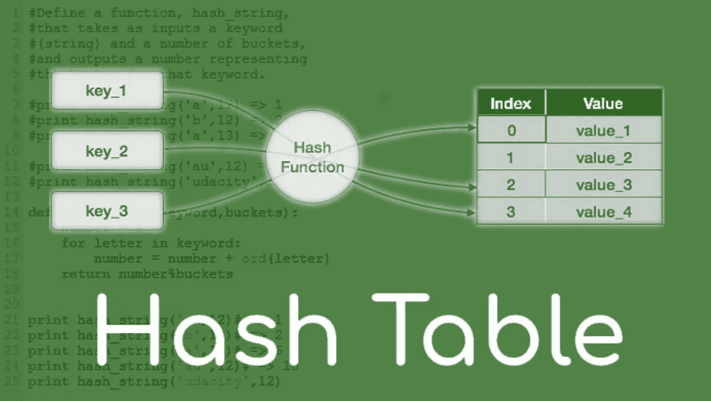
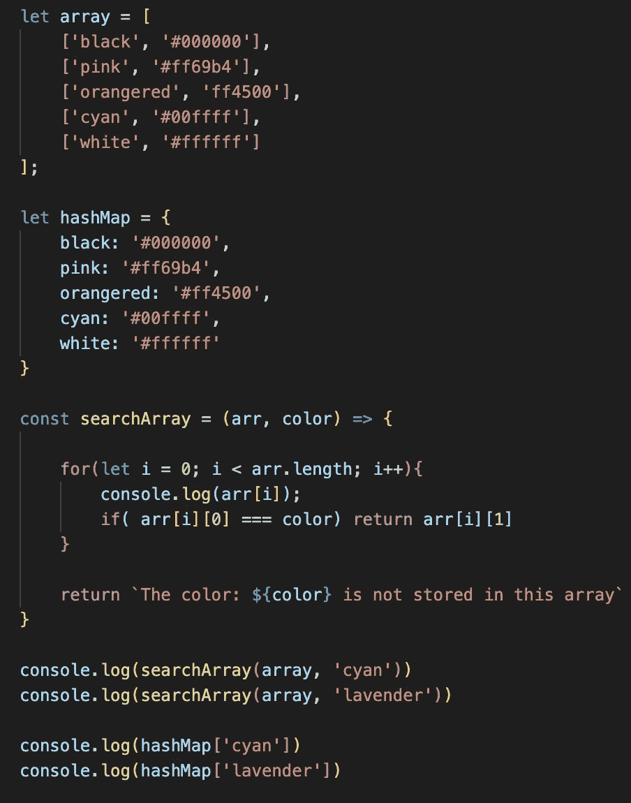
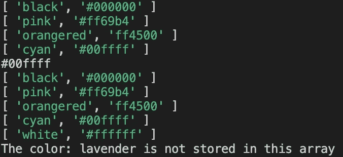
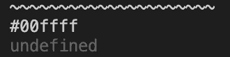

# JavaScript 中哈希表的分析

> 原文：<https://javascript.plainenglish.io/analysis-of-hash-tables-in-javascript-a00138f8ade3?source=collection_archive---------11----------------------->

在我们正在进行的涉及一些核心数据结构的系列中，我们将讨论散列表，也就是通常所说的散列表。

# 什么是哈希表？

哈希表用于存储键值对。哈希表可以被认为是这些“kvp”的集合

当在 JavaScript 中实现时，我们将在实现类时使用数组。但是在一般的问题解决/编码挑战中，我建议你使用一个通用对象或者 JavaScript 中的预建 Map 对象。其他流行的语言如 Java 和 Python 也分别有预构建的散列表、hashmap 和 dictionary。

为什么要使用哈希表？只要我们知道要寻找的特定键，它们可以快速地查找、添加和删除值。在本系列以前的迭代中，我们会将 BigO 符号的讨论留到最后，但是理解哈希表的优势是一个非常重要的概念。

Searching through an array vs searching through a hash table

我创建了上面的[代码](https://github.com/maquino96/Colt-Steele-DSA-Udemy/blob/main/Code-Editor-Problems/hashExample.js)来展示搜索数组和搜索散列表的区别。我建立了一个包含相同信息的数组和散列表。我设置了一个“searchArray”函数来遍历数组，该函数将返回我们正在搜索的颜色的十六进制键，如果没有找到，则返回一条错误消息。比较以下结果:

Results of searching through an array

Results of searching a hash table

我特意搜索了一种颜色，我知道这种颜色在列表中的索引位置更靠下，以展示在进行搜索时，一个数组有一个 O(n ),而一个散列表有一个 O(1)。只要我们知道要搜索的关键字，我们就可以在 O(1)时间内找到相关的值。当我们处理庞大的数据集，并且需要确认数据是否存在于哈希表中时，这是非常重要的。想象一下，如果我们有一百万个条目，并且每次我们想要确认我们的数据点之一的存在时，我们必须遍历整个数组，这将是非常低效的。

# 哈希表是如何工作的？

1.  一个键被传递到一个哈希函数中
2.  哈希函数将密钥转换为索引
3.  与该键关联的值存储在该索引中。

这看起来很简单，但是当我们深入研究时，你可能会有这样的问题，什么是散列函数？如果在以前使用的索引中已经存储了一个键-值对，会发生什么？

散列函数是任何可以用来映射数据的函数，它可以简单或复杂。

*   一个好的散列函数速度很快，因此要远离嵌套循环，甚至是耗时 O(n)的操作
*   均匀分布输出(防止特定索引处的键聚集)。
*   确定性，意味着相同的输入每次都会产生相同的输出。

关于聚类，哈希函数倾向于使用质数来设置可用索引的数量。“数学的本质”是质数阻止聚类，在谷歌上快速搜索会发现无数的答案，这些答案超出了我的文章范围，但深入探究却很有趣。

当处理冲突时，例如在散列函数导致重复索引的情况下，有两种通用方法，分别链接和线性探测。

单独链接:

*   在数组中的每个索引处，我们可以使用更复杂的数据结构(如数组或链表)来存储值，并遍历数组/链表来找到我们的键。
*   增加的复杂性允许在同一位置有多个键值对

线性探测:

*   当我们发现一个冲突时，我们在数组中搜索下一个空位
*   受限于分配的空间，可能需要大的索引才可行。

通常，在 JavaScript 实现中，我们将使用第一种方法，单独链接。

# 哈希表摘要

*   是键值对的集合
*   给定一个键，可以快速找到值
*   可以快速添加新的键值对
*   将数据存储在一个大数组中，并通过散列密钥来工作
*   一个好散列应该是快速的、均匀分布的密钥，且是确定性的
*   分离链接和线性探测是用于处理冲突的两种策略

BigO(最佳和一般情况):

*   插入:O(1)
*   删除:O(1)
*   Access: O(1) —使用给定的键，访问成对的值

最坏情况 O(n)。主要取决于所使用的散列函数，并且理想地最小化冲突。

## 额外资源:

JavaScript 中哈希表类的实现，请[点击这里](https://github.com/maquino96/Colt-Steele-DSA-Udemy/blob/main/Course/Data%20Structures/hashTable.js)。再一次，柯尔特·斯蒂尔把这些材料简化成易于理解的大块，这要归功于他。他的课程可以在[这里](https://www.udemy.com/course/js-algorithms-and-data-structures-masterclass/)找到。如需更深入的了解和该主题的一些视觉效果，请访问 [Visualgo](https://visualgo.net/en/hashtable?slide=1) 。

*多内容于* [***浅显易懂***](http://plainenglish.io/)