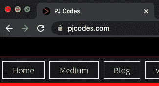
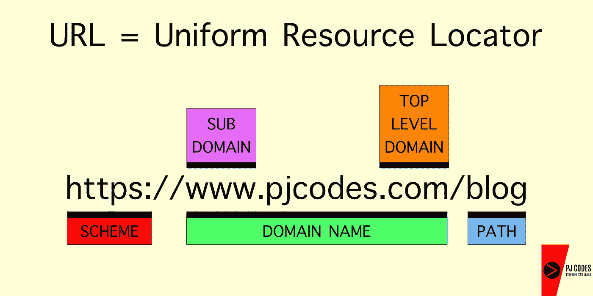
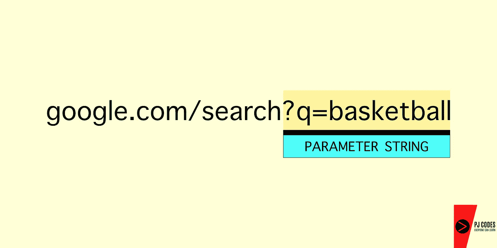
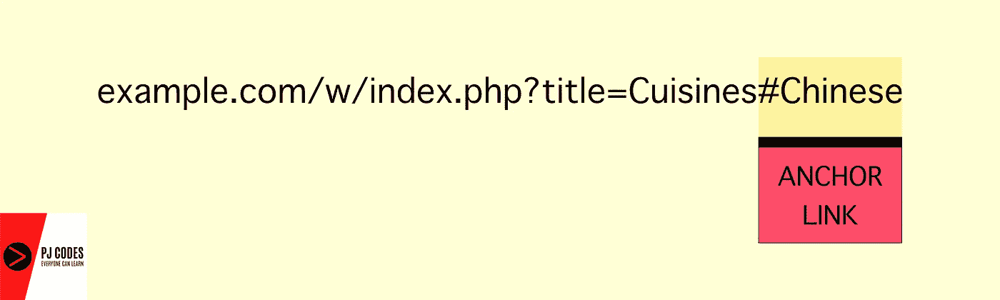

# URL 的剖析

> 原文：<https://javascript.plainenglish.io/anatomy-of-a-url-f565b500d086?source=collection_archive---------13----------------------->

我们都见过 URL 里面完全的胡言乱语。这到底意味着什么？好吧，我们来分析一下。

Photo by [Remotar Jobs](https://unsplash.com/@remotarjobs?utm_source=medium&utm_medium=referral) on [Unsplash](https://unsplash.com?utm_source=medium&utm_medium=referral)

# 让我们开始:

现在，如果你要导航到[pjcodes.com](https://www.pjcodes.com/)，你会看到类似左边图片的东西——*没有“https://”之类的。*然而，URL 有时看起来非常复杂。

# 但是等等……**网址**到底代表什么？

URL 代表**统一资源定位符**。资源可以指从互联网上某处的特定服务器中提取的一些文件。如果你键入[domain.com](https://www.dpbolvw.net/click-100417643-13631757)来购买一个便宜的域名，你的浏览器将会收到一个**响应**，其中包含网站的 HTML 文件、样式表和脚本文件——基本上是使页面可见的所有资源。

# URL 的目的是什么？

当你在搜索栏中输入[domain.com](https://www.dpbolvw.net/click-100417643-13631757)时，你的浏览器会将[domain.com](https://www.dpbolvw.net/click-100417643-13631757)转换成一个叫做 IP(*互联网协议*)的地址，它基本上代表了一个连接到互联网的设备的唯一地址。

所有直接或间接连接到互联网的东西都有一个 IP 地址——你的电脑、手机——甚至是终结者的大脑。

类似地，保存 domain.com 文件的服务器也只是一台拥有自己唯一 IP 地址的电脑 T21。当你输入[domain.com](https://www.dpbolvw.net/click-100417643-13631757)时，你的浏览器会将字母化的 URL 转换成数字 IP 地址，并通过一种叫做 **DNS** (域名服务)的东西来查找该 IP 地址……这一步通常被称为 **DNS 查找**。

我们不会在这里讨论细节，但是想象一下，当你有了一个很好的商业想法，想在别人之前保护好你的域名，你必须为 domain.com 写一个 IP 地址。**海拉**压力大。

因此，为了让我们人类的生活变得更容易，并且不必为我们想访问的每个网站记住由句点分隔的一串数字，URL 被发明了。*谢谢蒂姆-伯纳斯-李！(WWW 的创始人)。*

# “已经给我分解了！”

好吧。检查这个:

# **方案(或协议)**:

该方案表示网页数据的传输模式。 **HTTPS** 代表*超文本传输协议安全。*该协议基本上定义了文件**如何通过互联网从** **服务器**传输**到你的浏览器**。

# 子域:

子域是网站的一个较小的子集，主要用于分类目的。“www”代表万维网——大多数人都知道这一点，但很少有人了解它的实际用途。我们还可以看看子域的其他示例，例如:

*   support.mysite.com
*   blog.mysite.com
*   main.mysite.com

# 域名:

域名在技术上封装了子域名以及扩展名(俗称顶级域名如**)。com** 或**。net** )，但在[domain.com](https://www.dpbolvw.net/click-100417643-13631757)的情况下，就会是**域**。

# 顶级域名(TLD):

基本上是一种对互联网上的网站进行分类的方法。顶级域名也可以像**一样针对特定国家。在**、**中。fr** 或**。英国**。以下是一些例子:

*   。com
*   。网
*   。（同 organic）有机
*   。商业
*   。在印度
*   。fr(法国)
*   。英国(英国)

# 路径:

该路径基本上代表了网站目录中的子文件夹或子页面。例如，一个博客页面可能有一个路径[pjcodes.com/blog](https://www.pjcodes.com/blog/)。

# 搜索查询:

当你在谷歌中输入一个搜索词，你会在搜索栏中看到真正的胡言乱语吗？*啊…* 那个我朋友叫一个**参数串**。

看看这个:

拿任何一个搜索栏来说，如果你输入一个搜索词，你会看到你的关键词被附加到类似这样的东西上:**？q=**

问号后跟 **q** 和等号表示搜索查询，等号后面的内容就是要搜索的内容。

***注**** *:一个参数串不一定会有一个* ***q*** *。相反，它可以被构造成类似于* ***？***title =*美食。*

# 锚定链接:

"我有时在 URL 中看到的那些标签是怎么回事？"。

这些被称为锚链接，代表了特定页面的某一部分。想象一下，有一个网站列出了一堆美食。页面被分成不同的类别，如印度、日本、中国等。

比方说，编写网站代码的人想让用户更容易找到中餐，而不是手动滚动到页面底部。他们可以在网页的 HTML 中编写锚链接，用户点击 URL 时，它会自动将用户导向中文部分。

**这样一个锚链接可能看起来像这样:**

默认情况下，*的网站没有链接。必须向页面的现有标记(HTML)中添加特定代码，锚链接才能工作。事实上，开发人员甚至可以将锚链接制作成动画，让它在页面上平滑地向下滚动，而不是瞬间快速滚动。*

# 结论:

我希望这澄清了你可能有的关于 URL 的许多问题，并且希望，这个新发现的知识将帮助你更容易理解地在互联网上导航。感谢阅读。

去 Pjcodes.com[见我](https://www.pjcodes.com/)

*更多内容请看*[*plain English . io*](http://plainenglish.io/)

***(* ***)披露:*** *本文包含我可能会从 Domain.com 收到一小笔佣金的附属链接，如果您选择通过我的链接购买，您无需支付额外费用)**。*