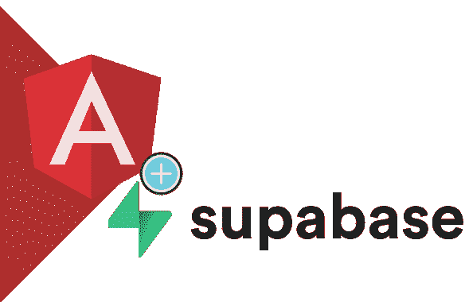
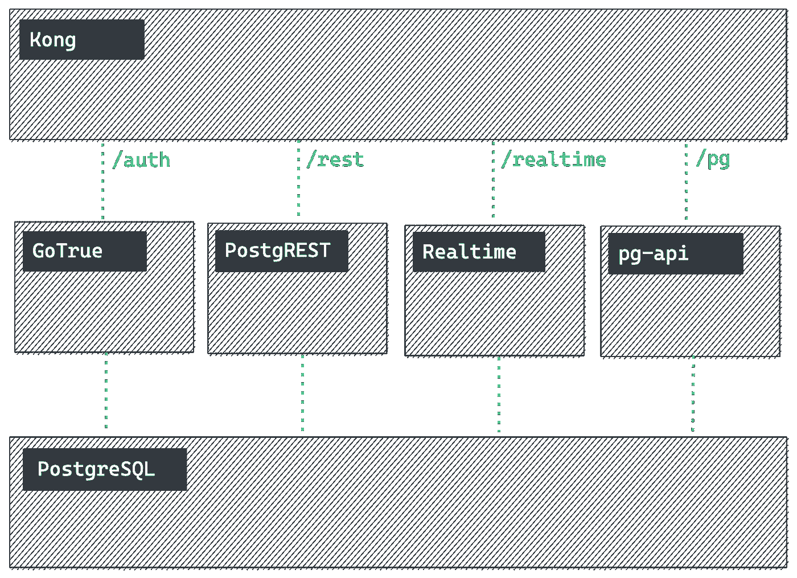
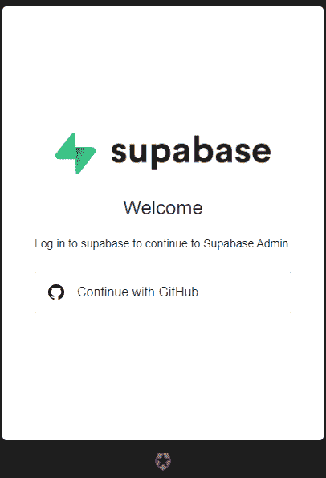
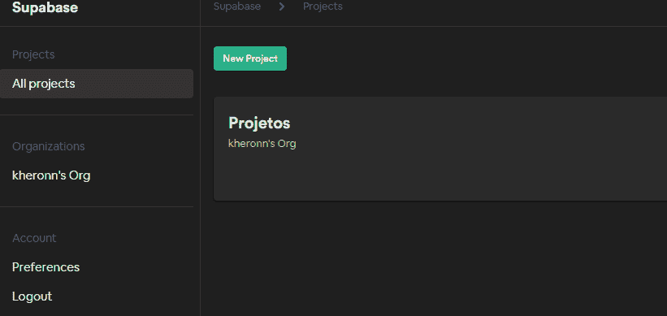
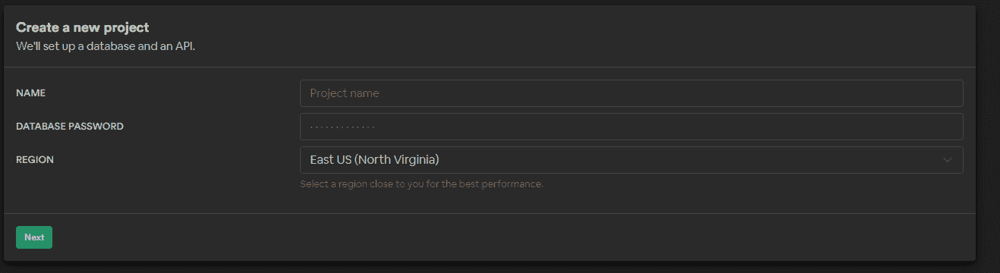
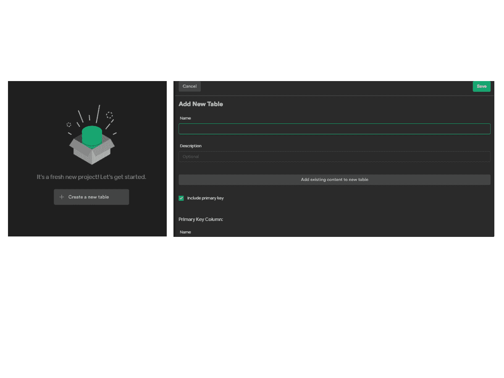
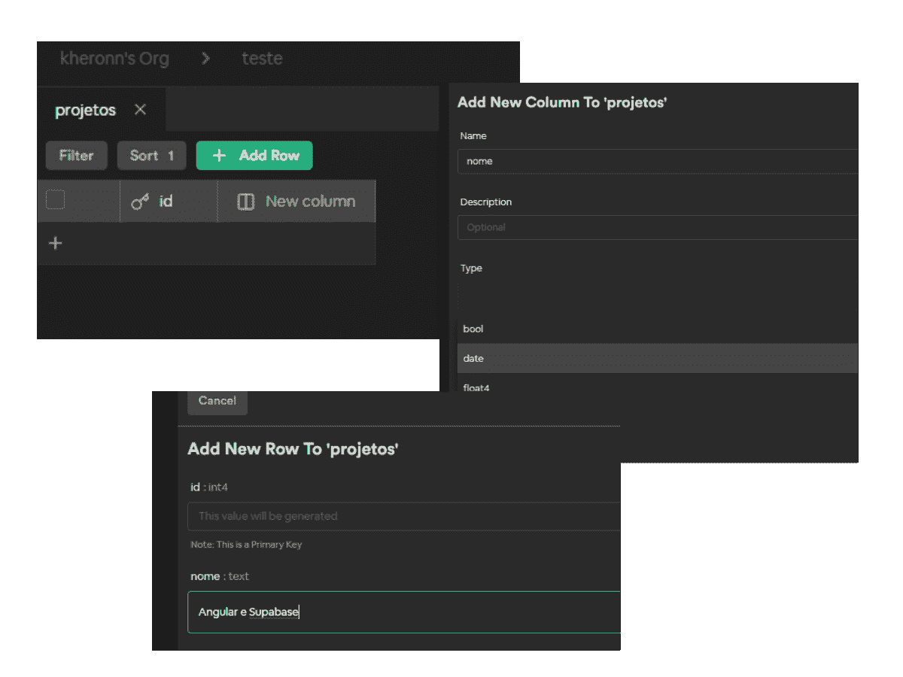
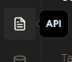
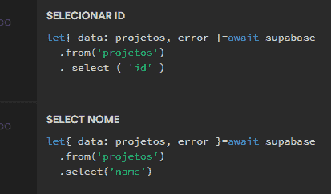

# Angular 11 和 Supabase——Firebase 的替代方案？

> 原文：<https://javascript.plainenglish.io/angular-11-and-supabase-an-alternative-to-firebase-63bafbd4febc?source=collection_archive---------8----------------------->

## 第 1 部分—了解服务

# 什么是 Supabase

API 服务的数据存储解决方案的出现只是没有超过 Javascript 框架的数量。事实上，我认为没有什么能打败它:)

然而，这几天我遇到了一个惊喜。 **SupaBase** 。我解释说，这个帖子的标题不是我的。根据官方网站，Supabase 是 **Firebase** 的开源替代方案，服务内容为:

*   监听数据库中的变化
*   查看您的表，包括过滤、分页和深层嵌套关系(如 GraphQL)
*   创建、更新和删除行
*   管理您的用户及其权限
*   使用简单的用户界面与数据库进行交互

(参考:【https://supabase.io/docs】T4)

该服务使用 Postgres 数据库而不是 NoSql，提供了一个开放的代码工具包。服务的图像如图 1 所示。

Fig. 1 — Functioning of the services

关于价格，有消息称公司目前(03/20021)处于测试阶段，使用是免费的，但是，将来会有托管费🤔🤔。我不太明白这是怎么回事。

# 第一印象

我对创建表格和访问 API 的速度和简易性印象深刻，几乎是即时的。在用 Github 帐户注册之后(图 2)

Figure 2 — Registering

用户被带到服务的仪表板。我们将在“新项目”中创建一个项目。将请求一个组织。在注册表中，创建了一个标准组织。

Figure 3 — Initial dashboard

我们将通知数据库和 API 的数据。

图 4—创建基础

在下一个屏幕上，稍等片刻，完成数据库和 API 的创建。

让我们创建一个表并插入一些记录。这一步让我想起了 MySql Admin..rsrs，点击创建新表，步骤非常直观。

Figure 5— Table

保存后，只需在**新增列**和**增加行**中包含列和记录即可。

Figure 6— New column and insertion of records

目前为止，没什么发现。完成这些步骤后，事情开始变得有趣起来。在左侧菜单中，找到 API 图标

在为银行生成的 RESTful 界面中，您可以随意处理所有文档，并在您进行更新时进行更新。

请注意位于右侧的面板中的一些信息，如 API 的 URL 和初始化与 javascript 项目集成的步骤。

通过点击表的名称，可以访问读取、插入、更新和删除的各种方法，以及表的真实示例(图 6)。

Figure 6 — Select in the table

嗯，在 [**part 2**](https://kheronn-machado.medium.com/a-crud-with-angular-and-supabase-c205e393c823) 中我会在 **Angular** (版本 11)中创建一个项目，消费开发的 API。

我还没有探索其他功能，如用户创建、身份验证，但这里有一个技巧。

再见，谢谢你读到这里。

 [## 有棱角和突出部分的污垢

### 这篇文章是继 Angular 11 和 Supabase 之后的又一篇文章 Firebase 的替代品！？

kheronn-machado.medium.com](https://kheronn-machado.medium.com/a-crud-with-angular-and-supabase-c205e393c823)