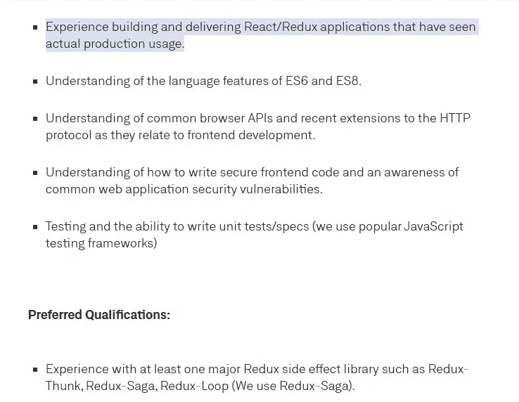

# Angular 和 React 为公司节省了数十亿美元

> 原文：<https://javascript.plainenglish.io/angular-and-react-are-saving-companies-billions-b4baf228c469?source=collection_archive---------12----------------------->

## 前端开发比以往更加复杂。

Photo by [Ayo Ogunseinde](https://unsplash.com/@armedshutter?utm_source=medium&utm_medium=referral) on [Unsplash](https://unsplash.com?utm_source=medium&utm_medium=referral)

7 月，一篇名为“ [Angular 让公司损失了数十亿美元](/enough-why-its-time-to-rip-out-angular-7d831802c8a2)”的病毒文章开始出现在我们的订阅源中。

我读了这篇文章，我想到的第一件事是，前端开发领域已经发展得如此之快，它本身已经成为一个宇宙，许多人仍然没有意识到这一领域的进步。

像 Angular 和 React 这样的框架已经使用了一段时间，并且增加了仅仅使用 JavaScript 和 HTML 就可以实现的事情的可能性。

给框架贴上不必要和“混乱”的标签就像 JavaScript 开发者取笑 WordPress & PHP 一样。

本文将提供我对框架如何为公司节省大量资金以及它们如何在前端开发方面拓展边界的看法。

## 选择和不同的需求

如今，构建任何 web 项目的一个关键方面是决定使用哪个框架和堆栈。

这可能看起来有点吓人，但最终，我很高兴我们有这么多选择。

这是因为需求不同，不同的堆栈适合不同的需求。

例如，React 非常适合构建仪表板和 SEO 不重要的网站，而 NextJS 非常适合 SEO 和服务器端呈现 React。

如果你想完全避免虚拟 DOM，用一些更*香草*，苗条可能是你的理想选择。

同样，如果您正在创建一个博客网站或其他类似的网站，Jamstack 可能是您的首选。

这些框架和栈存在的原因是对它们有广泛的需求，它们的存在都是为了某种目的。

## 水疗变得越来越复杂。

SPAs 或单页应用程序非常适合于构建复杂的站点，可以轻松地进行状态管理和身份验证。

然而，我确实同意，当涉及到搜索引擎优化和在谷歌上的排名时，温泉是可怕的。

但这并不意味着我们必须完全摆脱 T4。

spa 帮助开发人员实现了 DRY(不要重复自己)之类的原则，并促进了组件的可重用性。

此外，使用 React 和其他类似的框架，MVC 和其他类似的架构和模式已经变得非常容易实现。

使用像 React Redux 这样的行业定义的架构和模式的主要优点是，您不需要培训您的新员工，并且您可以在工作列表本身中声明知道这些模式。

[Source](https://weworkremotely.com/remote-jobs/files-com-frontend-engineer-es8-react-redux-saga).

在上图中，我分享了我在网上找到的一份随机工作清单，上面清楚地列出了求职者在申请工作前的要求。

> 学习和使用最佳行业标准不仅能让你轻松适应新工作，还能让你的技能可以转移。

如果每个人都改用普通 JavaScript，那么新员工将需要数周的培训来理解他们当前公司的代码，无论何时他们转换工作，他们都需要接受新公司的重新培训。

## 数据库、认证和状态管理

我并不是说用普通的 JavaScript 处理数据库、认证甚至状态管理是不可能的。

事实上，网上有一些非常棒的指南，讨论并展示了使用 vanilla JS 的状态管理。我最喜欢的指南之一是可以在这里找到。

你可以说我有偏见，但是在用 vanilla JS 实现了状态管理之后，我对 Vuex 和 Context API 的尊重直线上升。

对于现代框架来说，处理和存储数据库响应以及身份验证是小菜一碟。

使用框架控制组件的生命周期非常简单。

例如，如果您想在组件加载后立即在 React 中执行某些检查，只需使用`componentDidMount()`即可。

它们允许构建更复杂的应用程序，而不用担心状态或身份验证。

像网飞[这样的网站，以及其他许多网站，也已经采用了 React 和 JS 框架](https://www.zype.com/blog/netflix-tech-stack)，许多公司正在转向这些框架。

## 框架存在的真正原因。

框架和库的存在和流行是因为一个简单的事情:市场需求。

最近，web 开发领域变得越来越复杂，而框架就是这些复杂多变的需求的产物。

世界正朝着更加精炼、模块化的代码库发展，在这种代码库中，代码根据一些模式进行拆分，并且尽可能地促进代码的可重用性。

Flutter、React Native 和 Ionic 是代码可重用性的一些流行示例，因为它们允许制作多平台应用程序。

即使在应用程序开发领域，即时应用程序的概念也被更广泛地接受和使用。

类似地，对于公司和个人来说，与其从头开始制作原生应用程序，不如在原生应用程序处于生产状态时发布网站的 PWA(渐进式 Web 应用程序)版本更经济。

许多像 Vue 这样的框架允许您轻松实现 PWAs。

所有这些都是十几年前不存在的需求。

## 最后的想法

不管我们喜不喜欢 React 和 Angular 这样的框架，它们都会存在。

这绝对不意味着香草 JS 应该被抛弃。

> 了解 JavaScript 基础知识使得使用这些框架更加容易。

Vanilla JS 是 web 理解的编程语言，然而由于其局限性，框架和 TypeScript 已经获得了很大的流行。

在我看来，框架为公司节省了数百万美元，因为不需要重新培训员工和维护几个月后几乎没人理解的代码。

让我知道你的想法。

我希望你喜欢阅读这篇文章！

*更多内容看*[***plain English . io***](http://plainenglish.io/)