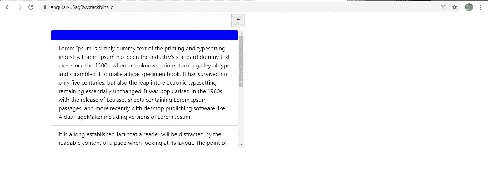
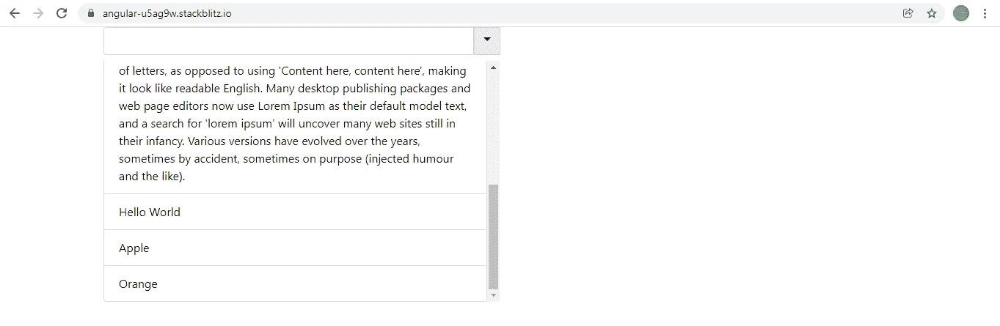
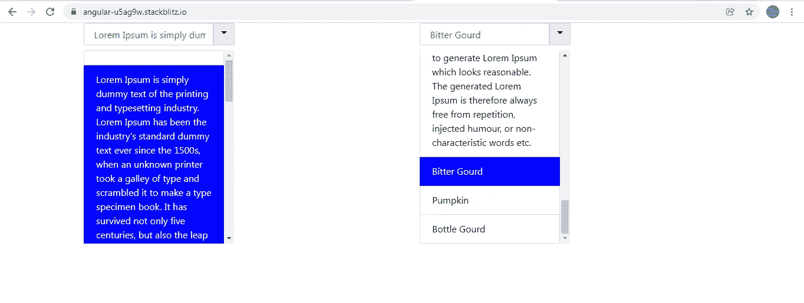

# Angular:如何创建带有文本换行选项的自定义可重用下拉列表

> 原文：<https://javascript.plainenglish.io/angular-creating-your-own-custom-reusable-dropdown-with-text-wrapping-options-18559f40c53e?source=collection_archive---------2----------------------->

试图在<select>标签中将长文本选项包装成多行总是徒劳的。默认情况下，常规的</select>标签不提供文本换行选项。

有像 Select2 这样的库可以通过稍微调整 CSS 来提供这种文本换行选项，但是安装一个新的模块来进行文本换行似乎是一种浪费。

我使用现有资源创建了一个自定义下拉列表:Bootstrap，它在整个应用程序中被广泛使用。



Custom Dropdown



Custom Dropdown

因为下拉菜单是可重用的，所以它可以跨应用程序使用不同的数据集。

该自定义下拉列表以两种方式实现:

**第一种方式:**

让我们从 **CustomDropdownComponent 模板开始。**

该模板包含一个模板驱动表单 **testForm。**这个表单包含一个文本框的<输入>标签和一个< ul >标签来创建一个选项列表。

当我们点击标签中的插入符号时， **toggleDropdown()** 被调用，如果列表被隐藏，它将显示< ul >标签下的选项列表**或**隐藏< ul >标签下的选项列表。

标签

 **isDropDownOpen** 

```
<ul class="list-group" ***ngIf="isDropDownOpen"**><li **[ngClass]="item.isActive ? 'activeOption' : ''"(click)="selectOption($event, index)"
*ngFor="let item of options; let index = index"**
class="item list-group-item"
>
{{ item.value }}
</li>
</ul>
```

**toggleDropdown()** 在 false 和 true 之间切换 **isDropDownOpen** 的值，以分别隐藏和显示< ul >标签。

当我们点击一个特定的列表选项

*   时， **selectOption()** 被调用，传递**事件细节**和**选项索引**作为参数。此方法的目的是将选定的选项设置为活动选项。我们将在课堂上看到这是如何实现的。

**CustomDropdownComponent 类:**

这个组件类接受来自父组件的 **@Input()选项**，这个可重用组件将驻留在父组件中。

```
@Input(‘options’) options: Options[];
```

**options** 属性包含要在下拉菜单< ul >中显示的选项列表。要显示的选项列表可以根据场景而有所不同，但是为了保持**CustomDropdownComponent**的可重用性，我们期望**选项属性**是一个对象数组，并且每个对象都必须包含**属性值。****属性值**将包含显示在列表选项中的文本。

**Options 是从 options.ts 文件中导出的一个界面**。

```
export interface Options {
value: string;
isActive?: boolean;
}
```

**isActive** 是一个可选属性，因为它将被手动添加到**选项**数组属性中，以区分活动的选中选项和未选中的选项。让我们看看如何！

```
**ngOnInit() {**
this.options.forEach((opt) => {
opt.isActive = false;
});
this.options.splice(0, 0, { value: ‘’, isActive: true });
}
```

在 **ngOnInit()生命周期挂钩**中，我们遍历数组**选项**，并为数组的每个对象添加一个附加属性 **isActive** 。 **isActive 的初始值为假**。

```
this.options.forEach((opt) => {
opt.isActive = false;
});
```

我们还在**选项**属性数组的开头添加了一个空列表选项，并将其 **isActive 属性设置为 true** 。这意味着空列表选项将首先出现在下拉列表中，并且在默认情况下将被选中。

```
this.options.splice(0, 0, { value: ‘’, isActive: true });
```

现在让我们看看当我们点击列表选项

*   时会发生什么。如前所述， **selectOption()** 被调用来传递事件细节和选项索引作为参数。

我们正在遍历**选项**属性数组，并将列表选项的 **isActive** 属性设置为 true，其选项索引与参数中传递的选项索引相匹配。其余列表选项的 isActive 属性将自动设置为 false。

最后，我们还将标签的 **ngModel dropdown** 设置为包含在所选列表选项中的文本。这使得行为非常类似于常规的<选择>标签。

```
**selectOption(evt: any, optionIndex: number) {**
this.options.forEach((opt: any, index: number) => {
opt.isActive = optionIndex === index;
});
this.dropdown = evt.target.innerHTML;
}
```

另外，请注意，选定的列表选项用蓝色背景来表示。 **isActive** 属性通过 **ngClass** 属性在< li >标签中控制 CSS 类 **activeOption** 的应用。

```
<li **[ngClass]="item.isActive ? 'activeOption' : ''"(click)="selectOption($event, index)"
*ngFor="let item of options; let index = index"**
class="item list-group-item"
>
{{ item.value }}
</li>
```

该类应用蓝色背景色，并将列表选项中的文本颜色改为白色。

```
**.activeOption** {
background-color: #0004ff;
color: white;}
```

现在我们来看看这个可重用组件在 **AppComponent** 中的用法。

我在 AppComponent 中使用了这个可重用组件两次，给每个组件传递了两个不同的选项列表。

**AppComponent 类:**



2 custom dropdowns in the AppComponent

下面是一个工作示例。

[](https://stackblitz.com/edit/angular-u5ag9w?file=src/app/app.component.html) [## 角形(叉形)堆叠

### 编辑描述

stackblitz.com](https://stackblitz.com/edit/angular-u5ag9w?file=src/app/app.component.html) 

**第二种方式:**

在这个方法中，整个列表项选择逻辑已经从**CustomDropdownComponent**移动到一个自定义指令 **ListDirective** 中。

下面是工作示例。

[](https://stackblitz.com/edit/angular-9qsep2?file=src/app/app.component.ts) [## 角形(叉形)堆叠

### 编辑描述

stackblitz.com](https://stackblitz.com/edit/angular-9qsep2?file=src/app/app.component.ts) 

为了更好地理解这个方法是如何工作的，我建议看看下面的故事，它给出了两个例子来解释当相同的自定义指令应用于一组列表元素时，如何以不同的方式操作每个列表元素，而不依赖于其他列表元素。

[](https://ramya-bala221190.medium.com/angular-how-the-same-custom-directive-applied-on-multiple-elements-can-be-used-to-manipulate-each-177856881f5c) [## 在不使用 jQuery 的情况下，对多个元素使用相同的角度指令来操作每个元素

### 选择一个列表项，并使用角度…以不同的样式显示它，以区别于其他列表项

ramya-bala221190.medium.com](https://ramya-bala221190.medium.com/angular-how-the-same-custom-directive-applied-on-multiple-elements-can-be-used-to-manipulate-each-177856881f5c) 

*更多内容看* [*说白了. io*](http://plainenglish.io/) *。报名参加我们的* [*免费每周简讯*](http://newsletter.plainenglish.io/) *。在我们的* [*社区*](https://discord.gg/GtDtUAvyhW) *获得独家写作机会和建议。*