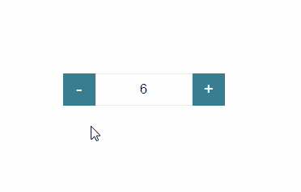

# 带有控件值访问器的角度自定义窗体控件

> 原文：<https://javascript.plainenglish.io/angular-custom-form-controls-with-control-value-accessor-90869cdf100c?source=collection_archive---------0----------------------->

> 在开发复杂的角度应用程序时，开发人员倾向于构建包含整个表单的大型组件，这使得高效重用变得非常困难。在这种情况下，可重用/定制组件的概念应运而生。自定义窗体控件是复杂角度应用程序中的典型模式。通常希望在输入组件中封装 HTML、CSS 和可访问性，以便在整个应用程序的表单中更容易使用。

在本文中，我们将探讨反应式表单的角度自定义组件的用法。为此，我们将观察内置的角度指令“ ***控制值访问器*** ”。

***控制值存取器指令***

*控制值存取器是 Angular 中的内置指令，负责跟踪子字段的值，并将其反馈给父表单。*

在下面的例子中，我们将构建一个自定义的数值计数器，它包含两个增加或减少数值的按钮。此外，我们为这个计数器提供了有效的`min` 和`max`值范围。

首先，我们创建一个名为“自定义计数器”的新角度自定义组件，作为本练习的父组件。下面是实现的定制组件。

在上面的代码片段中，你可以看到我们已经实现了 ***onAdd*** 和 ***onRemove*** 方法来递增和递减计数器值。此外，自定义计数器组件的模板如下所示。

下一步是实现利用自定义计数器组件的子组件。我们将子组件命名为 quantity form，并添加了内置验证器来添加`min` 和`max`范围值。

数量表单组件的模板如下，

***理解控制值存取器* I *接口***

尽管如此，我们还没有利用*控制值访问器* *接口*的实际用法。因此，下一步是理解控件值访问器接口的适用性。

控件值访问器接口提供了很少的方法，所有这些方法都只能在运行时由窗体模块调用，它们旨在促进窗体控件和父窗体之间的通信。

*   ***writeValue*** :表单模块使用此方法将值写入表单控件。
*   ***registerOnChange*** :如果一个表单的值由于用户输入而改变，我们需要将这个值报告回父表单。这是通过调用回调来完成的，该回调最初是使用 registerOnChange 方法向控件注册的。
*   ***register ontouched***:当用户第一次与表单控件交互时，该控件被认为具有被触摸的状态，这对于样式化很有用。为了向父窗体报告控件被触摸，我们需要使用一个通过 registerOnToched 方法注册的回调。
*   ***setDisabledState***:可以使用表单 API 来启用和禁用表单控件。此状态可以通过 setDisabledState 方法传输到表单控件。

作为下一步，让我们逐一讨论这些方法及其适用性。

***实现 writeValue***

每当父组件需要为子控件设置值时，都会在 Angular forms 模块中使用此方法。我们可以如下图所示。

***实现***

使用 ***writeValue*** 方法，父组件可以将值设置给子控件。但是关键的情况是，当计数器值通过增加或减少而改变时，父组件需要知道它以获取改变的值。

在那里，子组件可以使用*回调*函数通知父组件这个新值。为此，父组件需要使用***registerOnChange****方法*注册*回调*函数，如下图*。*

当调用***register onChange***方法时，改变后的值将保存到 **onChange** 变量中。在这个实现中，我们将 **onChange** 变量声明为一个函数，最初，它有一个空体。这样，如果程序由于某种原因在***register onchange***调用之前调用该函数，它将不会遇到任何错误。

当我们增加或减少计数器值时，我们可以通过调用下面的*回调*函数来通知父组件。

***实现了***

当窗体初始化时，窗体控件被认为处于未接触状态，CSS 类被应用到窗体组和它的每个子控件。

在前面的主题中，我们设置并获取父组件的值更改。此外，我们需要通知表单控件已经被用户触摸到父组件。因此，我们使用了 ***套印*** 的方法。

如果用户确实与表单控件交互，那么这意味着`ng-untouched` CSS 类将被应用于表单控件。

首先我们需要注册回调函数为前面的函数如下。

接下来，我们需要在用户增加或减少计数器值的情况下调用这个回调。在那里，窗体控件的状态将随着被触摸而改变。

***实现 setDisabledState***

我们可以使用***setDisabledState***方法来禁用或启用子窗体控件。在这里，我们将禁用变量初始化为 false，并通过调用***setDisabledState****方法来更改它的值。*

****配置 ControlValueAccessor 接口****

*这是本次实现的主要步骤，即使用 ***ControlValueAccessor 接口*** 将自定义计数器组件注册为依赖注入系统中的已知值访问器。*

*作为配置，我们提供了 *NG_VALUE_ACCESSOR* ，通过添加到已知值访问器列表来注册这个组件。注意`multi`标志设置为 true，这意味着这个依赖关系提供了一个值列表，而不仅仅是一个值。现在，我们的自定义组件能够在表单中设置属性值。此外，我们的组件现在能够通过内置的`required` 和`min`、`max` 验证器参与表单验证过程。*

****此外，如果我们需要为控件设置自定义验证怎么办？****

*如果组件需要有自己的内置验证规则，那么我们需要使用 ***验证器接口*** 实现自定义计数器类。这个接口包含两个方法，*

*   ***validate :** 该方法用于验证表单控件的当前值。每当向父窗体报告新值时，都会调用此方法。如果没有发现错误，此方法返回 null。*
*   ***registernvalidatorchange:**这将注册一个回调，允许我们按需触发自定义控件**的验证**。每当新的值输入到控件时，我们不需要触发这个方法，但是如果表单决定调用验证(外部的一些改变，表单初始化，等等),就需要这个方法。)*

*为了便于解释，让我们假设我们已经从控件中移除了内置的`min` 验证器，而不是实现一个自定义的验证器来检查计数器值是否小于零。我们可以这样做:*

*在这个代码片段中，如果计数器值有效，我们返回 null，否则我们返回 error 对象。为此，我们不需要***registernvalidatorchange***方法，因为我们只使用控件的当前值。*

*为了完成这个实现，我们需要将我们的组件注册为 *NG_VALIDATORS* 注入。*

*现在，我们已经构建了功能齐全的自定义控件，既能设置表单属性值，又能参与表单验证过程。最终代码如下。*

# *摘要*

1.  *我们用 ***控件值访问器*接口实现了一个定制组件。***
2.  **控制值取值器*接口包括 ***writeValue* 、*registernchange*、*registernoctouched*、 ***setDisabledState* 三种方法。*****
3.  *其中， ***writeValue*** 方法用于父组件给子控件设置值。***registerOnChange***方法用于当输入值改变时，父子组件之间的通信。***register ontouched***方法用于在认为子窗体控件被触摸时通知父组件。*
4.  *然后我们通过使用 ***验证器接口实现了自定义验证。****

*感谢您的阅读！希望你会用这篇文章来消除你对角定制组件的疑虑。*

**更多内容请看*[*plain English . io*](http://plainenglish.io/)*