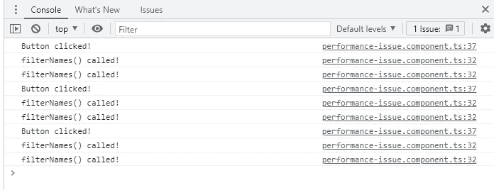
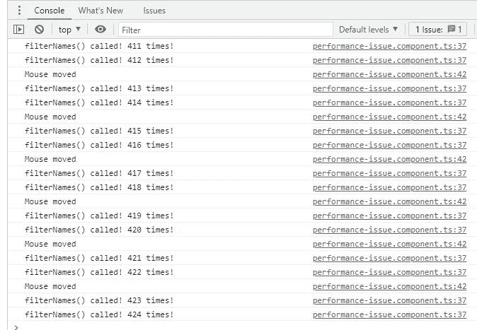
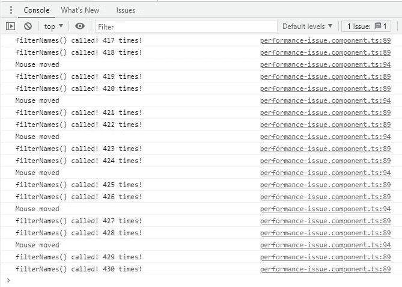

# Angular:不再调用模板内部的函数

> 原文：<https://javascript.plainenglish.io/angular-dont-call-a-function-inside-the-template-anymore-e74ebf499bb8?source=collection_archive---------0----------------------->

## 为什么不应该在角度模板中调用函数


模板是 HTML 的一种形式，它告诉 Angular 如何呈现组件。每个组件都有自己的模板，模板定义了组件的元素和外观。但是最常见的误用技术之一是调用模板内部的函数。

```
import { ***Component*** } from '@angular/core';

@Component({
  selector: 'app-performance-issue',
  template: `
    <div *ngFor="let ***name*** of filterNames()">{{ ***name*** }}</div>`,
})
export class PerformanceIssueComponent {

  names = ['Maria', 'Michel', 'Jack', 'John', 'Sam', 'Mila'];

  filterNames(): string[] {
    return this.names.filter(name => name.startsWith('M'));
  }
}
```

用这种方法很容易得到计算值。但是这可能会导致一个严重的性能问题，我们应该注意到这一点。

# 问题是

问题的核心与更改检测机制有关，Angular 使用该机制来检测更改的数据并更新 DOM 受影响的部分。然而，Angular 无法检测函数调用的值是否有任何变化。事实是，模板中的所有函数都将在每个变更检测周期中重新执行，以便进行比较。

例如，在上面的代码片段中，很明显`*filterNames()*` 依赖于*名称。*如果`*filterNames()*` 没有变化，那么*名称*也没有变化。即使在变化检测周期中没有值变化，仍然会调用`*filterNames()*` ，因为 Angular 引擎还不能检测这种类型的关系。

让我们实际看看问题的核心。

```
import { ***Component*** } from '@angular/core';

@Component({
  selector: 'app-performance-issue',
  template: `
    <div *ngFor="let name of filterNames()">{{ name }}</div>
    <button (click)="onClick()">Click Me!</button>`,
})
export class PerformanceIssueComponent {

  names = ['Maria', 'Michel', 'Jack', 'John', 'Sam', 'Mila'];

  filterNames(): string[] {
    ***console***.log("filterNames() called!");
    return this.names.filter(name => name.startsWith('M'));
  }

  onClick() {
    ***console***.log("Button clicked!");
  }
}
```

每次点击按钮(触发了一个变化检测周期)，总会重新执行`*filterNames()*`函数，如下图截图所示。



> 在开发模式下，预计每个检测周期会调用该函数两次。这是一个角度调试功能。[下面是更详细的解释](https://stackoverflow.com/questions/56785866/why-is-change-detection-called-twice)

每当按钮被点击时调用函数听起来无害，因为没有人会一直点击它。

Angular 中有一些特性在后台非常频繁地触发变化检测，比如绑定到`*mousemove*` 事件。当我们在应用程序中使用这些特性时，函数的重新执行将成为一个不可忽视的问题。例如，看看下面的代码片段。

```
import { Component } from '@angular/core';

@Component({
  selector: 'app-performance-issue',
  template: `
    <div *ngFor="let name of filterNames()">{{ name }}</div>
    <div
        style="height: 300px; width: 300px; background-color: #2f487e;"
        (mousemove)="onMousemove()">
    </div>`,
})
export class PerformanceIssueComponent {

  names = ['Maria', 'Michel', 'Jack', 'John', 'Sam', 'Mila'];
  counter = 0;

  filterNames(): string[] {
    this.counter++
    console.log("filterNames() called! " + this.counter + " times!");
    return this.names.filter(name => name.startsWith('M'));
  }

  onMousemove() {
    console.log('Mouse moved');
  }
}
```

通过在带有`*mousemove*` 绑定的`*<div>*`中移动光标，我们将看到该函数在很短的时间内被执行了数百次。



如果只有几个函数调用，最初的影响可能并不明显。然而，当越来越多的新组件添加到应用程序中时，它们会呈指数级增长，最终耗尽所有的计算能力并使应用程序变慢。

有些人可能会想到使用 getter 方法来避免函数调用。但实际上是不行的，因为 getter 方法也是函数调用，也有同样的问题。

```
import { Component } from '@angular/core';

@Component({
  selector: 'app-performance-issue',
  template: `
    <div *ngFor="let name of filteredNames">{{ name }}</div>
    <div
        style="height: 300px; width: 300px; background-color: #2f487e;"
        (mousemove)="onMousemove()">
    </div>`,
})
export class PerformanceIssueComponent {

  names = ['Maria', 'Michel', 'Jack', 'John', 'Sam', 'Mila'];
  counter = 0;

  get filteredNames(): string[] {
    this.counter++
    console.log("filterNames() called! " + this.counter + " times!");
    return this.names.filter(name => name.startsWith('M'));
  }

  onMousemove() {
    console.log('Mouse moved');
  }
}
```



# 解决方案

事实上，这个问题没有完美的解决方案。Angular 必须在变化检测期间重新执行模板内部的所有函数，这是其设计的一个限制。一个可能的解决方法是避免复杂计算的模板函数调用。如果我们需要一些计算值，我们应该自己手动管理它们，而不是依赖角度变化检测。

## 解决方案 1 —使用 setter 函数

```
import {***Component***, ***Input***} from '@angular/core';

@Component({
  selector: 'app-performance-issue',
  template: `
    <div *ngFor="let name of filteredNames">{{ name }}</div>`,
})
export class PerformanceIssueComponent {

  filteredNames = []

  @Input() set names(value: string[]) {
    this.filteredNames = value.filter(name => name.startsWith('M'));
  }
}
```

## 解决方案 2 —使用 *ngOnChanges*

```
import {Component, Input, OnChanges, SimpleChanges} from '@angular/core';

@Component({
  selector: 'app-performance-issue',
  template: `
    <div *ngFor="let name of filteredNames">{{ name }}</div>`,
})
export class PerformanceIssueComponent implements OnChanges{

  @Input() names = []
  filteredNames = []

  ngOnChanges(changes: SimpleChanges): void {
    if (changes.value) {
      this.filteredNames = this.names.filter(name => name.startsWith('M'));
    }
  }
}
```

感谢阅读！

任何意见都将受到高度赞赏。

**快乐编码:D**

*更多内容尽在*[***plain English . io***](http://plainenglish.io/)