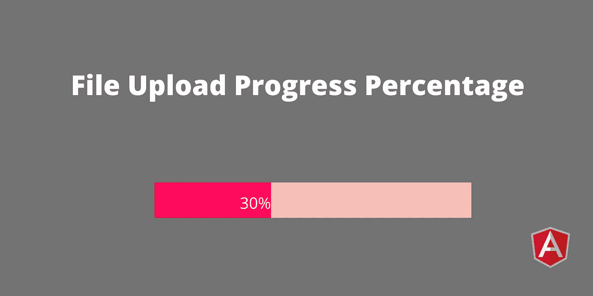
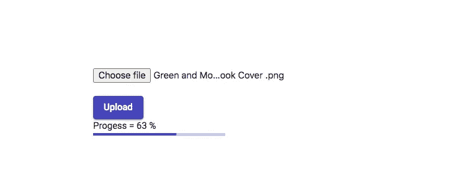

# 带进度条的角度文件上传

> 原文：<https://javascript.plainenglish.io/angular-file-upload-with-progress-bar-5780ca4cbb1c?source=collection_archive---------3----------------------->

## 了解如何在使用 Angular 上传文件时显示进度条



在本教程中，我们将了解如何使用 **Angular** 向服务器上传图像/文件时显示进度百分比。我已经写了一篇关于[如何使用 Angular](/upload-file-using-angular-and-php-7ee12c67a28b) 和 PHP 上传图像/文件的教程。我将使用前一篇文章中的相同代码来显示进度百分比，只做了少许修改。因此，如果你对 Angular 中的文件上传没有概念，请阅读之前的文章。

为了上传文件，我们将在 Angular 中使用 **HttpClient** 类。我们已经从 HttpClient 使用了 **post()** 方法来上传文件。为了显示进度百分比，我们需要在 POST 请求中使用以下选项。

```
reportProgress:true,observe:"events"
```

如果我们在 POST 请求中使用上面的代码，我们将在订阅它时得到两个输出。

1.  上传进度百分比
2.  当请求完成时，最终输出 JSON 数据。

## **上传进度百分比**

只有在 POST 请求中启用 reportProgress 参数时，我们才能获得上传进度。使用下面的代码获取上传进度百分比。

将事件类型与 HttpEventType 中的 UploadProgress 进行比较。如果事件类型是 UploadProgress，那么我们将使用事件中加载的值来计算上传的文件大小。

## **最终输出(响应)**

对于每个请求，我们总是有回应。要从服务器获得响应，请使用下面的代码。

这里我们检查事件类型是否为响应。为什么？因为当我们上传图像/文件时，有许多可用的事件类型。

**上传文件功能:**

让我们看看下面的代码。这是一个完整的代码上传文件到服务器，并显示百分比。

这里，我们使用 progress 变量存储上传进度百分比。我们可以通过 HTML 使用这些数据，通过显示上传百分比的百分比数字或动画来显示上传百分比。

## **有角度的材料进度条**

我们已经看到了如何获得上传百分比。现在我们将使用有角度的材质进度条来显示百分比。要使用角度材料进度条，首先将 MatProgressBarModule 导入到 **app.module.ts** 文件的 imports 部分。

```
import {MatProgressBarModule} from '@angular/material/progress-bar';
```

然后使用下面的 HTML 代码来显示进度条。

在 TS 文件中设置颜色和进度模式。

完整的 HTML 代码:

完整 TS 代码:

输出:



File Upload With Percentage Example

## **结论**

在本教程中，您学习了如何使用角度框架显示进度百分比。显示用户期望的百分比。为什么因为用户总是想知道文件上传了多少百分比。它给了用户更好的用户体验。

希望这篇文章会很有帮助。

感谢您阅读这篇文章。