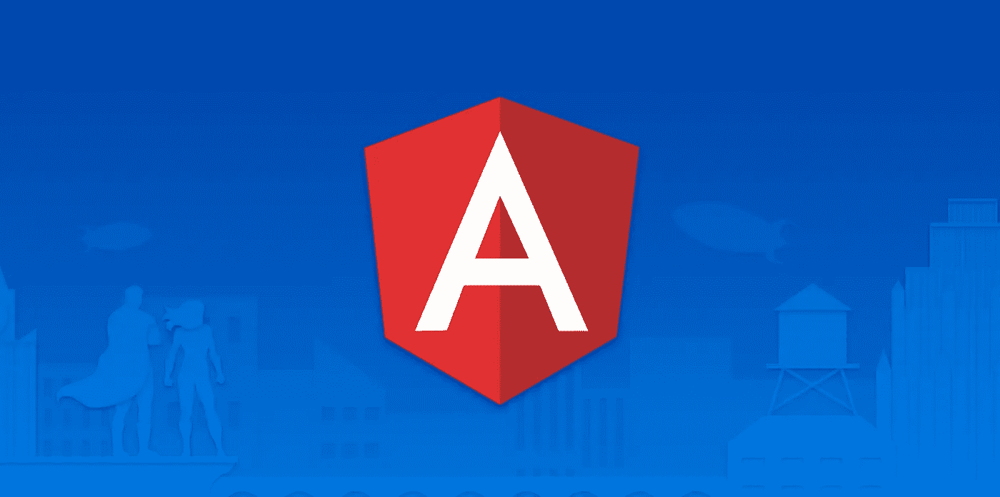
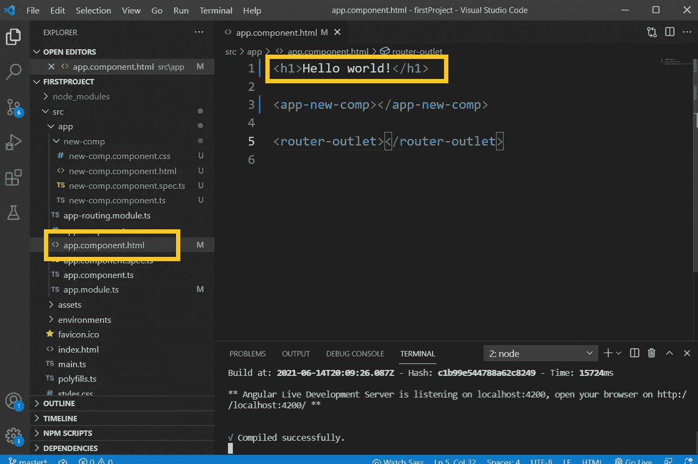

# 绝对初学者的角度—第二部分

> 原文：<https://javascript.plainenglish.io/angular-for-absolute-beginners-1f92d9ecd10e?source=collection_archive---------24----------------------->



在上一篇文章中，我们讨论了如何为 Angular 项目设置环境。此外，我们建立了一个新的角度项目。如果你错过了，请使用下面的链接参考第一篇文章。👇

[](/angular-for-absolute-beginners-479c174bf4c6) [## 绝对初学者的角度

### (第一部分)

javascript.plainenglish.io](/angular-for-absolute-beginners-479c174bf4c6) 

我们继续。

这是我们在上一篇文章中创建的 Angular 项目。👇


# 角度分量

*   在角度应用中，组件是主要的构建模块。
*   “app.component”是安装 angular 时获取的默认组件。每个组件由四个文件组成。


# 组件的优势

1.  复用性
2.  易于单元测试
3.  易于阅读。
4.  易于维护。

# 创建新组件

*   若要创建新组件，请在 Visual Studio 代码中使用命令提示符或终端。

> 要在 VS (Visual Studio)代码中获得一个新的终端，
> 
> 点击 VS 代码顶栏上的“终端”并选择“新终端”。


*   要生成一个新的组件，在终端上键入“**ng generate component<component-name>**”。(例如:“ **ng 生成组件 newComp** ”。“新组件”是组件的名称。)
*   它创建四个文件并更新一个文件。


*   打开创建的组件文件后，可以看到上面提到的创建的文件。


*   打开“app.module.ts”文件后，您可以看到它已经导入了新组件。原因是角度会在创建组件时自动更新。创建的组件的声明也自动在“@NgModule”内声明。


# 在浏览器上运行组件消息。

*   打开“new-comp.component.ts”文件。
*   选择“选择器”的值，并将其复制到剪贴板。


*   打开“app.component.html”文件，并使用“app.component.html”文件中的选择器值打开一个新标记，如下所示。


*   打开你的浏览器。它会给你一个如下的结果。👇


# 向组件添加样式。

*   考虑到浏览器的输出，“Hello world！”消息来自“app.component.ts”。在 VS 代码中打开' app.component.html '文件时，我们可以看到“Hello world！”“

    # ”标记内的文本。



要更改文本的样式，请打开“app.component.css ”,然后键入如下内容。

```
**h1{****color : blue;****}**
```


> 该样式将仅应用于“app.component.html”元素。改变“新作品”的风格消息，我们必须对' new-comp.component.css '文件进行更改。

*   “新-comp 作品！”消息来自“新组件组件”。当在 VS 代码中打开' new-comp.component.html '时，我们可以看到“new-comp works！”“

    标签内的文本。


要更改样式，请打开“new-comp.component.css ”,然后键入如下内容。

```
**p{****color : grey;****font-style : italic;****}**
```


*   保存文件并转到浏览器。您可以看到已经应用了样式。


*   让我们在“app.component.html”中添加一个新段落。打开 VS 代码，在“app.component.html”上键入如下内容。

```
**<p>Welcome to the first Angular project </p>**
```


*   保存文件并检查浏览器。


> 考虑到浏览器输出，您可以看到颜色和字体类型仅在特定组件中有效。我在“app.component.html”中创建的段落样式没有改变。因为我在' app.component.css '中只为'
> 
> # '标签编写了样式。不适用于“
> 
> ”标记。

*   要更改“app.component.html”中段落的样式，请在 VS 代码上打开“app.component.css”文件，并键入如下内容。

```
**p{****color: red;****font-size: 20px;****}**
```


*   保存文件并检查浏览器。


样式已应用于该特定元素。

我们在两个组件上都有相同的“

”标签。我们可以为每样东西编写自定义样式。因此，我们不需要特定的 id 或类。

**如果您喜欢这篇文章或觉得它有用，请点击👏按钮，并关注我更多像这样的文章。**

*更多内容尽在*[*plain English . io*](http://plainenglish.io/)