# 绝对初学者的角度

> 原文：<https://javascript.plainenglish.io/angular-for-absolute-beginners-479c174bf4c6?source=collection_archive---------11----------------------->

(第一部分)

Angular 是一个开源的 JavaScript 框架，主要由 Google 维护。这个框架是一个构建单页面客户端应用的框架，完全基于 JavaScript。Angular 是用 Typescript 写的(Typescript 是一种脚本语言)。

# **为什么要学 Angular？**

Angular 是一个非常稳定的 JavaScript 框架。它已经被很多人使用。

***棱角分明的用户***

*   Web 开发人员
*   网络应用开发者
*   UI/UX 开发人员
*   前端开发人员
*   JavaScript 开发人员

**Angular JS** 是第一个版本，也是最基础的一个。最新的版本是 Angular 的即将到来的版本，它仍然只叫做 **Angular** 。

**学习棱角之前你应该了解一下，**

*   HTML/HTML5
*   CSS/CSS3
*   JavaScript/JavaScript ES 6
*   引导程序

# Angular 的开发环境

*   谷歌 Chrome、火狐、Opera 或任何其他类似的浏览器。
*   Node.js →它是与 angular 交互的主要工具。
*   Visual Studio 代码或任何其他可选的 IDE。
*   计算机中的 Cmder(终端)或普通命令提示符。

# 为 Angular 安装 Node.js

1.  访问[https://nodejs.org](https://nodejs.org/)网站，下载 Node.js 最新版本。

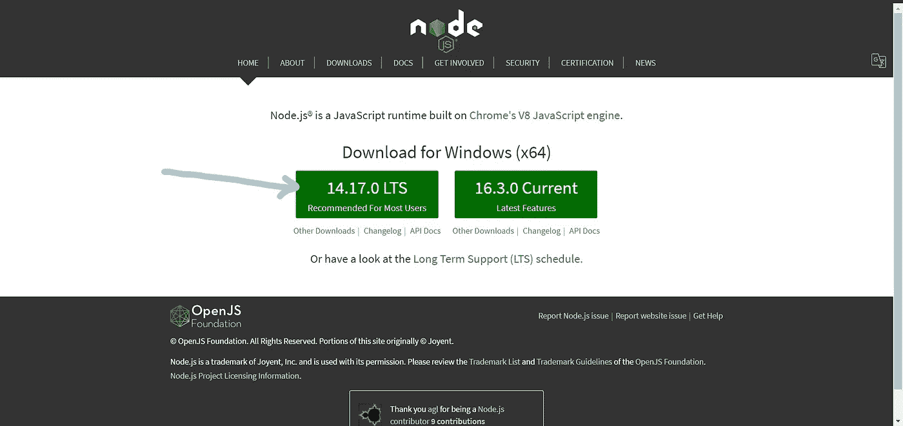

2.通过打开下载的安装程序来安装 Node.js 和 npm。

3.要检查 Node.js 的版本，请转到命令提示符并将其键入为“ **node -v** ”。

4.要检查节点程序包管理器版本，请将其键入为“ **npm -v** ”。

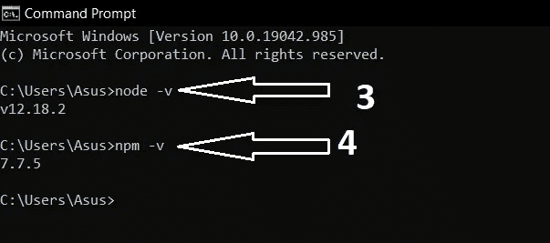

# 安装角度

打开命令提示符并键入“**NPM install-g @ angular/CLI**”。

> 在安装过程中，谷歌会问你，你是否愿意向谷歌发送关于你的项目的匿名信息。你可以回答“不”。

*   要检查 angular 的版本，请在命令提示符下键入以下命令。

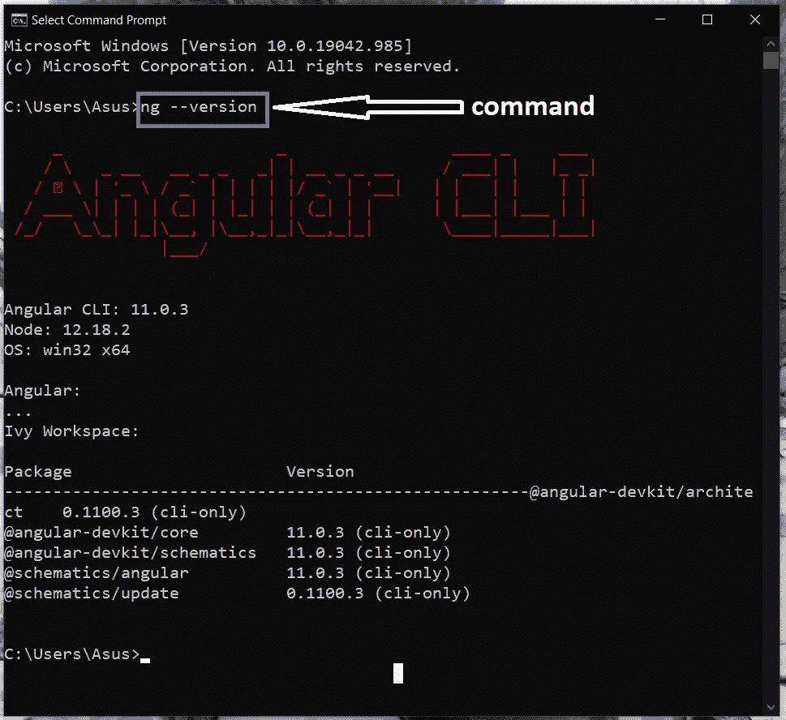

它显示您已经安装的版本。

# 设置新项目

1.  转到要构建项目的位置。然后单击该位置路径的顶部。

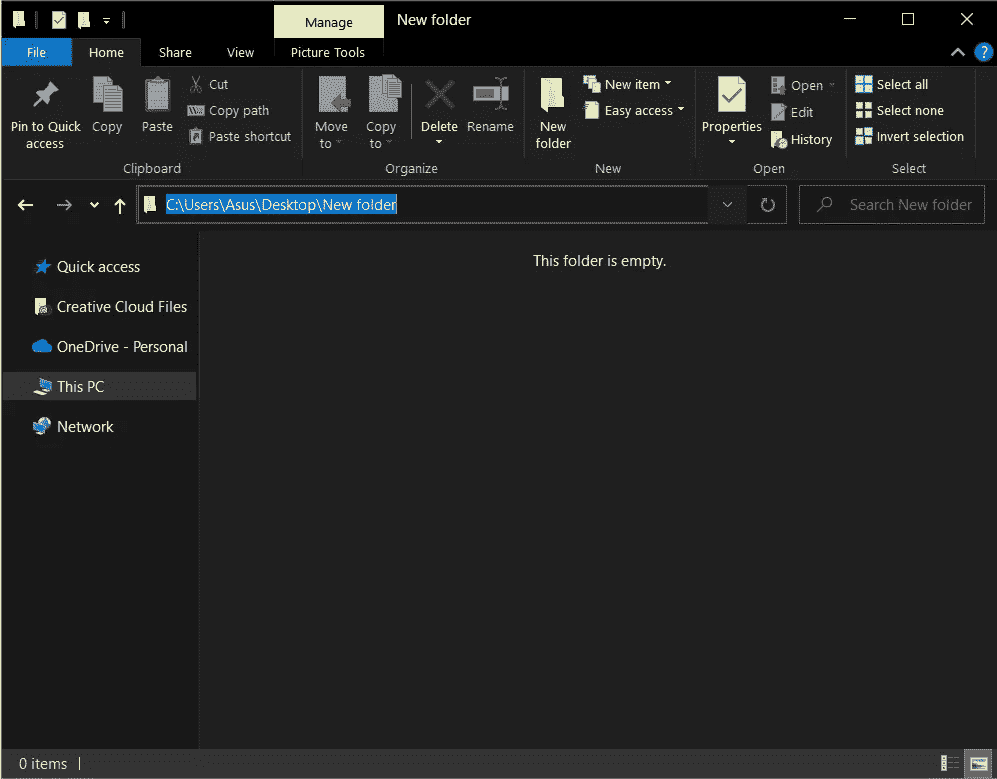

2.键入' cmd' + Enter。

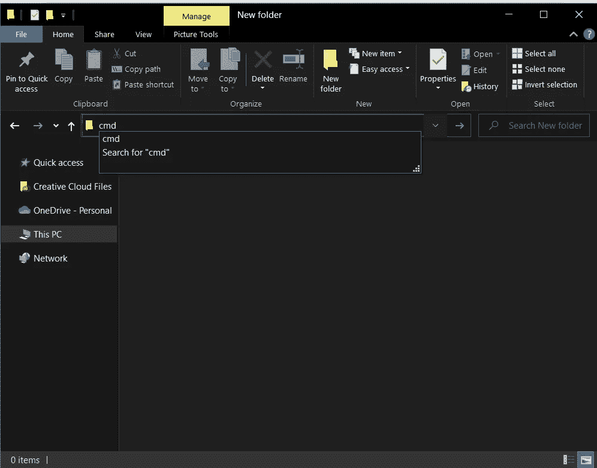

按回车键后，你已经打开了命令行提示符。

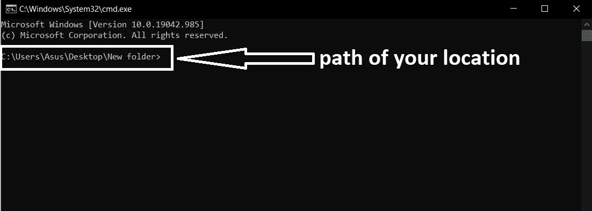

3.新建项目→ " **ng 新项目名称**

4.然后他们要求将角度路由添加到您的项目中。如果你愿意，就说“是”。

5.之后，您可以为您的项目选择一种样式。例如:CSS，SCSS

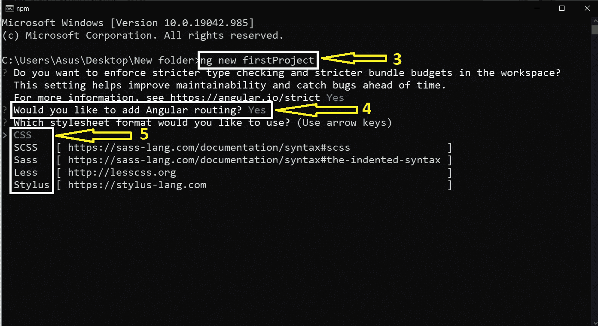

最后，您可以获得创建的 angular 项目。

# 在 Angular 中创建“Hello World”项目

1.  像以前一样打开命令提示符。
2.  键入' **cd 项目名称'**。
3.  通过运行“ **ng serve** ”启动应用程序。这将在您的计算机上设置一个本地开发服务器。
4.  要在浏览器中启动项目，请将浏览器上的 URL 指定为" **http://localhost:4200** "

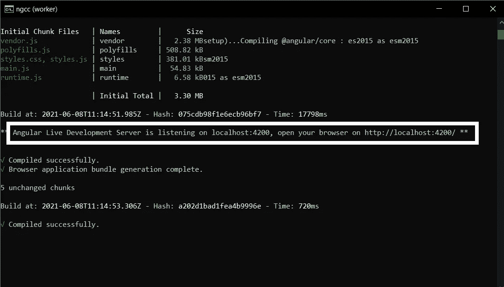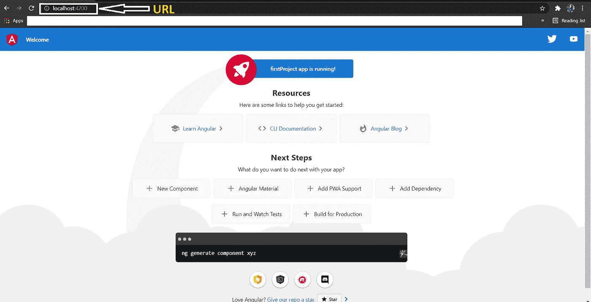

**要修改您的项目，**

1.  打开可视代码。
2.  转到文件。
3.  打开文件夹。
4.  选择您的项目文件。
5.  单击“选择文件夹”按钮(您也可以使用命令提示符在 Visual Studio 代码中打开 angular 项目。为此，如上打开命令提示符并键入“code”。然后 Visual Studio 代码将自动打开。)

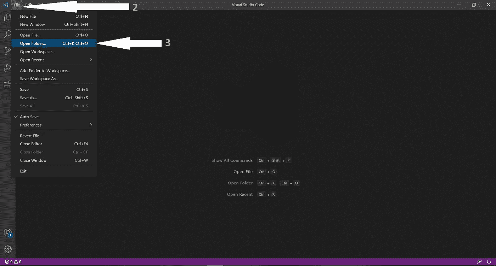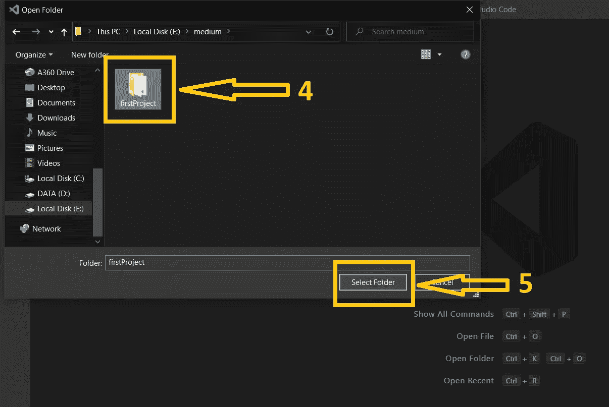

*   在 Visual Studio 代码项目中，
*   打开 src 文件夹。
*   打开 src 文件夹中的 app 文件夹。
*   打开“app.component.html”。
*   选择除“app.component.html”文件最后一行之外的所有行。然后删除它们。
*   键入如下。

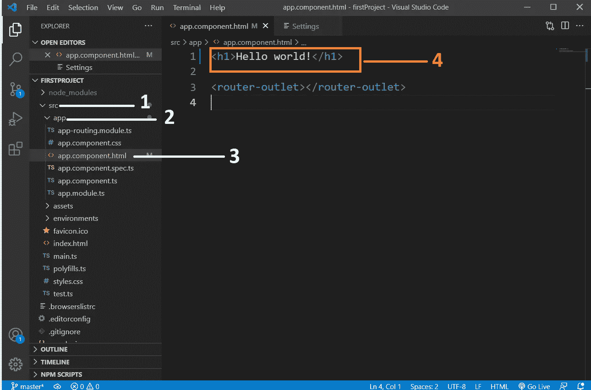

*   访问您的浏览器。你的浏览器会自动重新载入“Hello world”

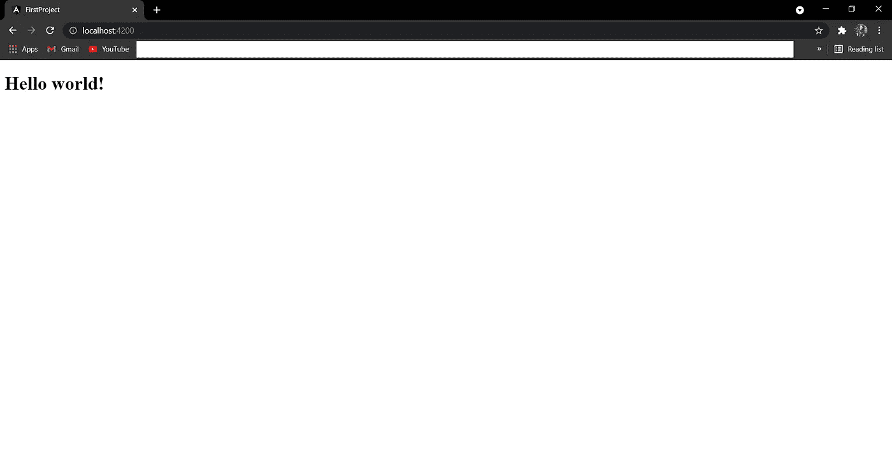

*更多内容尽在*[plain English . io](http://plainenglish.io/)