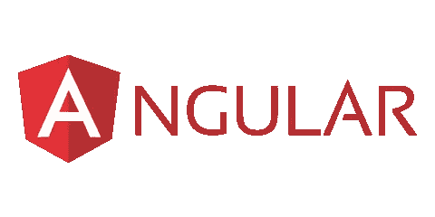
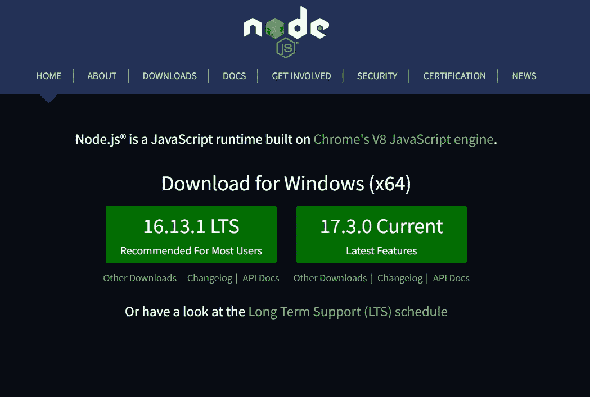
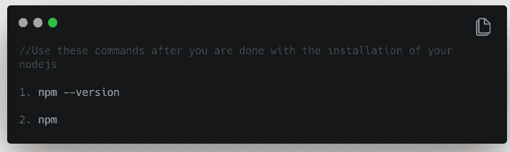
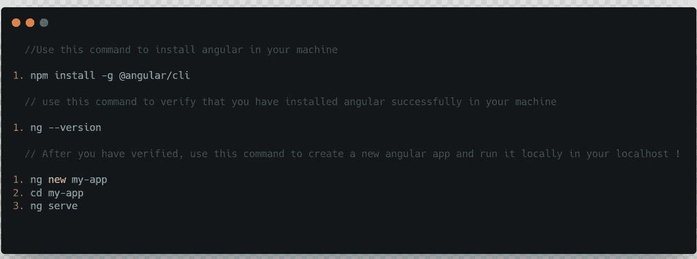

# Angular —入门！

> 原文：<https://javascript.plainenglish.io/angular-getting-started-10a015abcf21?source=collection_archive---------13----------------------->

你好啊。是我，你友好的邻居，棱角分明的家伙！

所以让我们来解决房间里的大象。棱角分明！

每个人都害怕的框架(嗯，是的)。你一定听说过这些短语，在野外，Angular 是“强硬”，“你不能学习 Angular”，“学习 Angular 一点也不好玩”(oof)。

让我告诉你，棱角分明很有趣，也不复杂。我们将一起穿越这片棱角分明的密林，你将体会到棱角分明的真正含义。

在这篇博客中，我们将在本地机器上设置 Angular，并安装必要的扩展来帮助我们在 Angular 框架中编写应用程序！

在开始我们的 Angular 之旅之前，让我们了解一些关于 Angular 的事情。

Angular 是谷歌在 2016 年 9 月推出的一个网络框架。这是一个由 Google 维护的开源前端框架。最初，Angular 是用 JavaScript 编写的，但是随着时间的推移，Angular 从 JavaScript 迁移到了 TypeScript。Angular 是一个框架，用于创建 SPAs 或单页应用程序、大型企业应用程序、PWAs 或渐进式 Web 应用程序。Angular 有你能看到的最好的记录之一。

最精彩的部分是* *鼓卷，请！**棱角分明的 CLI！Angular CLI 让您的 Angular dev 生活更加轻松。您可以使用它来创建组件、管道、服务等等。

但是，嘿，让我们冷静一点。当我们在这个角度的过程中前进时，我们会逐渐了解所有这些。

让我们开始角度设置。拉起你的袜子，做好准备，因为是时候做准备了！

# 第一步。安装 Node.js

## 重要的

请不要跳过这一步，因为在我们的本地机器上运行 Angular 非常重要！

去[这个](https://nodejs.org/en/)链接下载 LTS 版本。

# 第二步。安装角形

# 第三步。现在放松

嘿，你们做得很好！Angular 的准备工作现在完成了。现在吃片镇静剂。我们使用 Angular 需要的所有东西都已经安装好了！轻轻地拍一下自己。

嘿，使用 Angular 时，一定要在 VS 代码中安装[这些](https://www.geeksforgeeks.org/top-10-vs-code-extensions-for-angular-developers/)扩展。

## 重要的

在你的机器上安装 Angular 时，你仍然有可能遇到一些错误，所以我删除了一些链接来帮助你克服所有的障碍。
1。[有角度的](https://angular.io/)

2. [PS1 无法加载错误](https://www.c-sharpcorner.com/article/how-to-fix-ps1-can-not-be-loaded-because-running-scripts-is-disabled-on-this-sys/)

# 再见，但只是现在！

因此，我们都准备好了我们的旅程，航行在雄伟的海洋角。让我们在我的下一篇博客中了解 Angular 的内部工作方式，它的文件结构，以及更多！

现在，精益求精！

*更多内容看* [*说白了. io*](http://plainenglish.io/) *。报名参加我们的* [*免费每周简讯*](http://newsletter.plainenglish.io/) *。在我们的* [*社区*](https://discord.gg/GtDtUAvyhW) *获得独家写作机会和建议。*