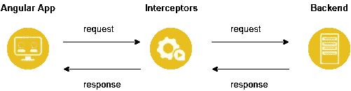
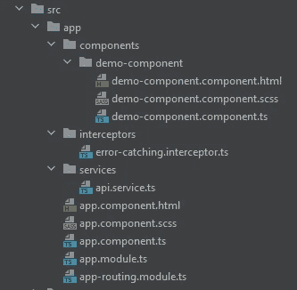
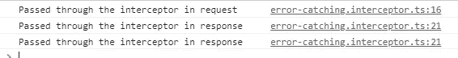
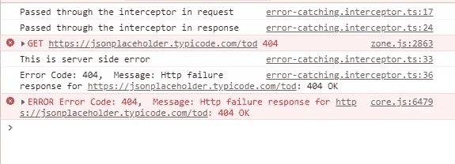

# Angular:使用拦截器处理 HTTP 错误

> 原文：<https://javascript.plainenglish.io/angular-handle-http-errors-using-interceptors-5cc483103740?source=collection_archive---------0----------------------->

发出 HTTP 请求时，Angular 中的 HTTP 错误很常见。在不影响用户体验的情况下处理这些错误是一个很好的实践。在本文中，我们将讨论处理这种情况的三种方法。


首先，让我们了解一下拦截器

# **拦截器是什么？**

拦截器是我们可以实现的一种独特的角度服务。拦截器允许我们使用 HttpClient 拦截传入或传出的 HTTP 请求。通过拦截 HTTP 请求，我们可以修改或更改请求的值。



# **什么是错误拦截器？**

错误拦截器是一种特殊类型的拦截器，用于处理发出 HTTP 请求时出现的错误。当请求由于任何原因失败时，错误可能来自客户端(浏览器)，也可能来自服务器端。

让我们看看实际中的错误拦截器。

# **项目设置。**

首先，让我们使用*ng new<project-name>*命令创建一个新项目(我将该项目命名为 *http-interceptor* )。

成功创建项目后，让我们创建所需的组件和服务。运行以下命令:

1.  ***ng g c components/demo-component***(创建一个名为 demo 的新组件)
2.  ***ng g s 服务/api*** (创建一个 api 服务)
3.  ***ng g 拦截器/错误捕捉拦截器*** (创建一个错误捕捉拦截器)

运行以上命令后，您应该会得到这样的项目结构。



清理 *app.component.hrml* 并添加***<app-demo-component></app-demo-component>****标签。*

*在*demo-component.component.html*中添加这段代码。*

```
*<button (click)="getData()">Get Data</button>

<div **ngIf*="data">{{data}}</div>*
```

*够简单吧！这里没什么特别的事情发生。在开始有趣的部分之前，让我们创建一个发送 HTTP 请求的函数。*

```
*// demo-component.component.tsimport {***Component***, OnInit} from '@angular/core';
import {ApiService} from "../../services/api.service";

@Component({
    selector: 'app-demo-component',
    templateUrl: './demo-component.component.html',
    styleUrls: ['./demo-component.component.scss']
})
export class DemoComponentComponent implements OnInit {

    data = ""

    constructor(private apiService: ApiService) {
    }

    ngOnInit(): void {
    }

    getData() {
        this.apiService.getData().subscribe(res => {
            this.data = ***JSON***.stringify(res)
        })
    }
}// api.service.tsimport {***Injectable***} from '@angular/core';
import {HttpClient} from "@angular/common/http";
import {Observable} from "rxjs";

@Injectable({
    providedIn: 'root'
})
export class ApiService {
    url = 'https://jsonplaceholder.typicode.com/todos/10';

    constructor(private http: HttpClient) {
    }

    getData(): Observable<any> {
        return this.http.get(this.url);
    }
}*
```

*此时，这是一个典型的 HTTP 请求。现在，让我们从有趣的部分开始。*

# ***使用 HTTP 拦截器***

*现在，让我们深入有趣的部分。首先，我们来看看*error-catching . interceptor . ts*文件，*

```
*import {***Injectable***} from '@angular/core';
import {HttpEvent, HttpHandler, HttpInterceptor, HttpRequest} from '@angular/common/http';
import {Observable} from 'rxjs';

@Injectable()
export class ErrorCatchingInterceptor implements HttpInterceptor {

    constructor() {
    }

    intercept(request: HttpRequest<unknown>, next: HttpHandler): Observable<HttpEvent<unknown>> {
        return next.handle(request);
    }
}*
```

*注意，它实现了 *HttpInterceptor* 接口，这迫使我们实现 *intercept* 函数，该函数识别并处理给定的 HTTP 请求。*

*截距函数参数呢？*

*   **req* —要处理的传出请求对象。*
*   **下一个* —链中的下一个拦截器，如果链中没有拦截器，则为后端。*
*   *返回:事件流的可观察值。*

*现在让我们添加我们的触摸。*

*看看下一段代码。*

```
*import {***Injectable***} from '@angular/core';
import {HttpErrorResponse, HttpEvent, HttpHandler, HttpInterceptor, HttpRequest} from '@angular/common/http';
import {Observable, throwError} from 'rxjs';
import {catchError} from "rxjs/operators";

@Injectable()
export class ErrorCatchingInterceptor implements HttpInterceptor {

    constructor() {
    }

    intercept(request: HttpRequest<unknown>, next: HttpHandler): Observable<HttpEvent<unknown>> {
        return next.handle(request)
            .pipe(
                catchError((error: HttpErrorResponse) => {
                    let errorMsg = '';
                    if (error.error instanceof ***ErrorEvent***) {
                        ***console***.log('This is client side error');
                        errorMsg = `Error: ${error.error.message}`;
                    } else {
                        ***console***.log('This is server side error');
                        errorMsg = `Error Code: ${error.status},  Message: ${error.message}`;
                    }
                    ***console***.log(errorMsg);
                    return throwError(errorMsg);
                })
            )
    }
}*
```

*这里发生了什么事？我会解释的。*

*在 rxjs 的 *pipe()* 操作符中，我们捕捉任何错误并检查其来源(无论是来自客户端还是服务器端)。然后我们通过 rxjs 的 *throwError()* 操作符返回错误。*

*现在，让我们在项目中使用拦截器文件。我们将把它添加到 *app.module.ts.* 中的*提供者*数组中*

```
*@NgModule({
    ...
    providers: [
        {
            provide: ***HTTP_INTERCEPTORS***,
            useClass: ErrorCatchingInterceptor,
            multi: true
        }
    ],
    ...
})
export class AppModule {
}*
```

*让我们确保一切都按预期运行。*

*预期的行为是什么？预期的行为是每个请求/响应都应该通过拦截器。*

*为了演示起见，我们将修改*error-catching . interceptor . ts*文件，并添加两个 *console.log()。**

```
*import {***Injectable***} from '@angular/core';
import {HttpErrorResponse, HttpEvent, HttpHandler, HttpInterceptor, HttpRequest} from '@angular/common/http';
import {Observable, throwError} from 'rxjs';
import {catchError, map} from "rxjs/operators";

@Injectable()
export class ErrorCatchingInterceptor implements HttpInterceptor {

    constructor() {
    }

    intercept(request: HttpRequest<unknown>, next: HttpHandler): Observable<HttpEvent<unknown>> {
        ***console***.log("Passed through the interceptor in request");

        return next.handle(request)
            .pipe(
                map(res => {
                    ***console***.log("Passed through the interceptor in response");
                    return res
                }),
                catchError((error: HttpErrorResponse) => {
                    let errorMsg = '';
                    if (error.error instanceof ***ErrorEvent***) {
                        ***console***.log('This is client side error');
                        errorMsg = `Error: ${error.error.message}`;
                    } else {
                        ***console***.log('This is server side error');
                        errorMsg = `Error Code: ${error.status},  Message: ${error.message}`;
                    }
                    ***console***.log(errorMsg);
                    return throwError(errorMsg);
                })
            )
    }
}*
```

*您应该会看到以下输出。*

**

*现在，让我们中断 URL 以使请求失败。*

```
*url = 'https://jsonplaceholder.typicode.com/tod';*
```

*现在，在使用一个断开的 URL 运行代码后，您应该会看到下面的输出。*

**

> *亲爱的读者:*
> 
> *谢谢你的时间。如果你分享你的想法，我会很高兴。*

> *编码快乐！❤*

## *进一步阅读*

*[](/code-documentation-is-broken-but-i-think-swimm-may-have-fixed-it-daaa7547d834) [## 代码文档被破坏了——但是我认为 Swimm 可能已经修复了它

### 传统的文档管理系统让软件开发人员失望了，是时候来点新的了。游泳吗…

javascript.plainenglish.io](/code-documentation-is-broken-but-i-think-swimm-may-have-fixed-it-daaa7547d834) [](https://plainenglish.io/blog/create-an-employee-satisfaction-survey-using-angular-and-store-results-in-a-mongodb-collection) [## 使用 Angular 创建员工满意度调查，并将结果存储在 MongoDB 集合中

### 一步一步的教程来建立一个员工满意度调查使用 Angular 和 SurveyJS，一个免费的，开源的…

简明英语. io](https://plainenglish.io/blog/create-an-employee-satisfaction-survey-using-angular-and-store-results-in-a-mongodb-collection) 

*更多内容看* [***说白了。报名参加我们的***](https://plainenglish.io/) **[***免费周报***](http://newsletter.plainenglish.io/) *。关注我们关于*[***Twitter***](https://twitter.com/inPlainEngHQ)，[***LinkedIn***](https://www.linkedin.com/company/inplainenglish/)*，*[***YouTube***](https://www.youtube.com/channel/UCtipWUghju290NWcn8jhyAw)*，以及* [***不和***](https://discord.gg/GtDtUAvyhW) ***。*****

***有兴趣规模化你的软件创业*** *？检查* [***电路***](https://circuit.ooo/?utm=publication-post-cta) *。**