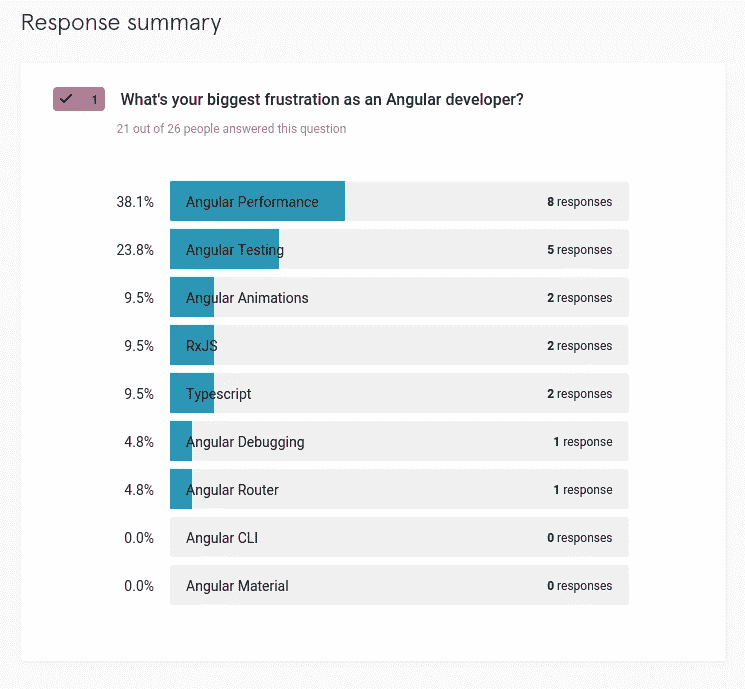
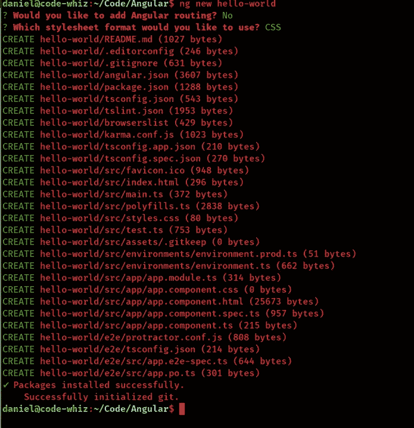
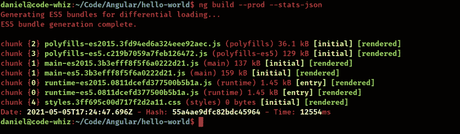

# 有棱角——如何提高你的束尺寸？

> 原文：<https://javascript.plainenglish.io/angular-how-to-improve-your-bundle-size-1cda25cfd815?source=collection_archive---------3----------------------->

## 这里有 4 种方法可以减少包的大小。让它加载得更快。


Photo by [Arnold Francisca](https://unsplash.com/@clark_fransa?utm_source=medium&utm_medium=referral) on [Unsplash](https://unsplash.com?utm_source=medium&utm_medium=referral)

棱角分明的开发人员通常会为性能问题而苦恼。

这是角框架最大的缺点和最大的麻烦之一。

我哪里知道？

最近我调查了一些 Angular 开发者，问他们 Angular 最大的挫折是什么。这是他们告诉我的。



不足为奇。我抓起 [Angular CLI](https://danielk.tech/home/how-to-install-and-use-the-angular-cli) 生成了一个基本的 app。没有花哨的组件。没有额外的包或依赖。甚至没有角度路由。



您认为构建文件有多大？



不算太坏。我想是的。

但我要说，对于一个基本的没有逻辑目的的 web 应用程序来说，这有点大。


如果我们不小心，我们的棱角分明的应用程序将变得沉重，快速。

那么你能做些什么来提高你的束尺寸呢？

如何让你的 Angular app 的捆绑尺寸变小？

还有怎么做才能让你的 Angular app 加载更快？

这里有 4 种方法来改善你的 Angular 应用程序的包大小。根据我的经验，这四个地方是你瞄准枪支的最佳方向。

[](https://school.danielk.tech/course/unleash-your-angular-testing-skills?utm_source=medium&utm_medium=banner&utm_campaign=unleash_testing_skills)

# 调查您的应用模块。它以一种偷偷摸摸的方式在我们身上滋长。

最近，我正在开发一个用 Angular 构建的商业应用程序。我对这个项目了如指掌。或者至少我认为我做到了，因为我是主要的开发者，并且为这个项目写了 95%的代码。

然后我决定做一轮优化，让它跑得更快。经过一些诊断后，我决定了*的主要*。引导 Angular 应用程序的 js* 文件相当大。在我们的 *app.module.ts* 文件中肯定有一些未使用的导入，只是给我的 Angular 应用程序添加了一堆垃圾。

当我打开 *app.module.ts* 文件时，我惊呆了！

它被项目已经超越的导入和库破坏了。

那我做了什么？我把那些进口的东西拉出来，然后把这个项目修整得干净整洁，就像一只时髦的小狗一样。


是的，伙计，如果你的 Angular 应用程序包太大，我首先会去的地方是 *app.module.ts* 。

你可能会吓到一些奇怪的东西。

# 惰性加载模块。没错。让那个棱角分明的 app 好好节食吧。

如果你不知道，Angular 有一个非常酷的功能，叫做 Angular 模块。

但这是什么呢？

角度模块是可以导入应用程序不同部分的代码块。一个模块可以包含成组的组件、服务和其他功能，每个组件、服务和功能都集中在一个功能区域、特定领域、工作流等。

为什么他们很酷？

它们很酷，因为 Angular 模块为 web 应用程序带来了模块的力量。据我所知，没有其他前端库或框架能像 Angular 那样做得这么好。

随着您的 Angular 应用程序的发展和成熟，如果您打算提高您的构建包的大小，您必须将 web 应用程序的各个部分分成可以在以后加载的特性模块。

然后，在您的 Angular 应用程序的主要部分已经被加载并显示给用户之后，这些模块可以稍后被延迟加载。

Angular docs 有一篇关于如何设置延迟加载的文章。我建议你去看看。

如果你不确定使用哪种惰性加载策略，那么[我会帮你搞定](https://danielk.tech/home/the-complete-guide-to-angular-preloading-strategies)。

# 调整您的导入。否则你会唱慢歌。

有些读者可能会说我是一袋燕麦，因为我告诉你要小心进口货。他们可能会对我大喊大叫，说有棱角的摇树的东西足够聪明，可以淘汰掉不用的或劣质的进口产品。

虽然我希望这是真的。尽管树木摇晃的角度有所改善。他们错了。至少这是我的经历。

所以…观察这些导入，确保所有未使用的导入都被剪掉。

其次，不要导入整个库，然后只使用其中的一部分。当您进行导入时，请确保您只导入您实际需要的内容。

而不是这个…

```
import * as my-import from 'package-name';
```

…这样做。

```
import { something } from 'package-name';
```

# 更新至 Angular 的最新版本。事实上有这么简单吗？

没错。就这么简单。尤其是如果你运行的是过时的 Angular 版本，比如 Angular 6 或 Angular 7。

角度性能不断提高，因此请确保您的角度应用保持最新。

另外，这并不难。有数百万用户的 Angular 应用程序，开发团队报告说，从 Angular 的一个版本更新到下一个版本只需要 30 分钟左右。更不用说 Angular 团队有一个[真正有帮助的升级网站](https://update.angular.io/)。

那你的借口是什么？

[](https://school.danielk.tech/course/unleash-your-angular-testing-skills?utm_source=medium&utm_medium=banner&utm_campaign=unleash_testing_skills)

# 结论

如果你想缩小你的 Angular 应用程序的大小，那么这是我建议你首先瞄准的 4 个地方。当我被雇佣来优化一个角度时，这些是我首先攻克的角落。

Angular 可能有一个性能怪癖，但我仍然[喜欢它胜过其他一些库和框架](https://danielk.tech/home/why-angular-instead-of-react)。

如果你喜欢这篇文章，并且发现它很有用，请留下一些掌声，并关注我以获得更多像这篇文章一样的酷文章。

**关注我:** [GitHub](https://github.com/dkreider) ，[传媒](https://dkreider.medium.com/)，[个人博客](https://danielk.tech)

*最初发布于*[*https://danielk . tech*](https://danielk.tech/home/angular-how-to-improve-bundle-size)*。*

*更多内容请看*[*plain English . io*](http://plainenglish.io/)