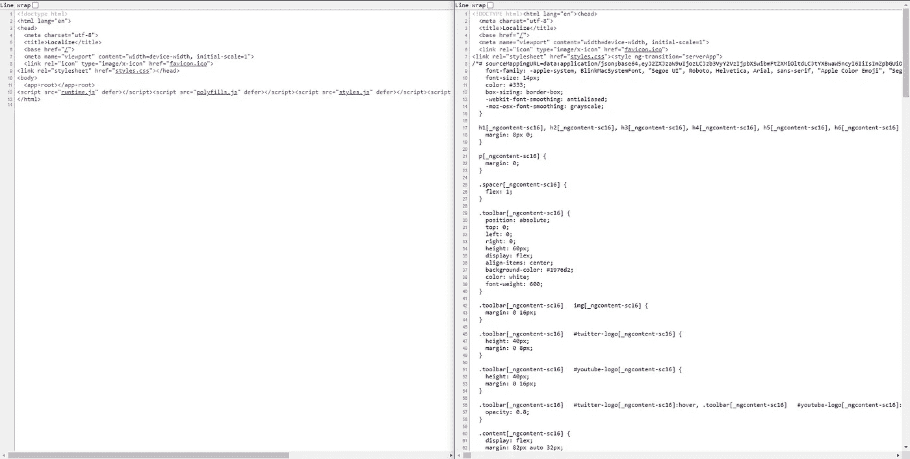

# 利用 SSR 进行角度定位的最佳实践

> 原文：<https://javascript.plainenglish.io/angular-localization-with-ssr-best-practice-ae75f22e2d05?source=collection_archive---------4----------------------->


我以前做过许多多语言网站，但当你想在搜索引擎中索引所有的网站，为每种语言建立一个专用链接，并优化加载时间时，事情就变得复杂了。

因此，在本文中，我将带您了解如何使用服务器端渲染来管理 Angular project 中的本地化，并为您提供最佳实践来充分利用它。

下面是本文将要完成的任务列表

1.  创建一个新项目，并向其中添加服务器端渲染。
2.  用两个简单的模块和一个头文件初始化项目(使用 bootstrap)。
3.  添加 [ngx-translate](http://@gilsdav/ngx-translate-router) 并翻译内容。
4.  添加更多语言。
5.  使用传输状态修复应用程序闪烁，这也将优化加载时间。
6.  添加 [ngx-translate-router](https://www.npmjs.com/package/@gilsdav/ngx-translate-router) 以保存所选语言，并为每种语言提供专用路径。
7.  RTL 支持(仅当您想要支持的语言之一是 RTL 时)

# **1。创建一个新项目并添加服务器端渲染**

通常用`ng new` *创建一个新的角度项目。*以下是我的回答:

```
> ng new
? What name would you like to use for the new workspace and initial project? angular-localization
? Do you want to enforce stricter type checking and stricter bundle budgets in the workspace?
  This setting helps improve maintainability and catch bugs ahead of time.
  For more information, see [https://angular.io/strict](https://angular.io/strict) Yes
? Would you like to add Angular routing? Yes
? Which stylesheet format would you like to use? SCSS [ [https://sass-lang.com/documentation/syntax#scss](https://sass-lang.com/documentation/syntax#scss) ]
```

然后添加 SSR，如下所示:

```
ng add @nguniversal/express-engine
```

为了验证一切正常，运行`npm run dev:ssr`并在它加载后，在浏览器中打开它，确保它在工作并转到源代码`view-source:[http://localhost:4200](http://localhost:4200/ar/home)`。然后确保内容被加载，如下图所示



left is before SSR, right is after SSR

# **2。用简单的两个模块和一个头文件(使用引导程序)初始化项目**

然后，我们应该创建两个新的简单模拟模块和一个共享模块，并将它们导入其中。

运行以下命令来生成它们:

```
ng g m shared
ng g m home --route=home -m=app
ng g m feature --route=feature -m=app
```

这将创建 3 个模块，共享，家庭和功能，最后两个将添加一个组件，路由到它和懒惰加载应用程序路由模块的模块。

我们只需要确保空的路线能回到家。以下是`app-routing.module.ts`中的最后一张路线图:

```
const ***routes***: Routes = [
  {
    path: '',
    redirectTo: 'home',
    pathMatch: 'full',
  },
  {
    path: 'home',
    loadChildren: () => import('./home/home.module').then(m => m.HomeModule),
  },
  {
    path: 'feature',
    loadChildren: () => import('./feature/feature.module').then(m => m.FeatureModule),
  },
];
```

然后，我们应该只添加一个简单的标题，为此我使用自举。

首先，我们需要安装`ngx-bootstrap`和`bootstrap`(这里将使用`@next`安装 Bootstrap 5 以支持 RTL，如果你不关心 RTL，你可以只安装 Bootstrap 4)。

```
npm i bootstrap@next ngx-bootstrap
```

然后修改`angular.json`添加引导 CSS 文件。它应该是这样的(请注意，我们将它包含在构建和测试中):

```
"styles": [
 **"node_modules/bootstrap/dist/css/bootstrap.min.css",**  "src/styles.scss"
]
```

在`app.module.ts`中，将`CollapseModule`和`BrowserAnimationsModule`(collapse module 所需)添加到其导入数组中，如下所示:

```
imports: [
  BrowserModule.withServerTransition({appId: 'serverApp'}),
  AppRoutingModule,
 **BrowserAnimationsModule,
  CollapseModule.forRoot(),**
],
```

对于头组件，使用

```
ng g c core/components/header
```

我使用了下面的 HTML 代码，但是任何代码都可以工作，没有问题:

```
<nav class="navbar navbar-expand-lg navbar-light bg-light">
  <div class="container">
    <a [routerLink]="'/home'" class="navbar-brand">Localize</a>
    <button
      (click)="isCollapsed = !isCollapsed"
      [attr.aria-expanded]="!isCollapsed"
      aria-controls="navbarSupportedContent"
      aria-label="Toggle navigation"
      class="navbar-toggler"
      type="button">
      <span class="navbar-toggler-icon"></span>
    </button>
    <div [collapse]="isCollapsed" [isAnimated]="true" class="collapse navbar-collapse" id="navbarSupportedContent">
      <ul class="navbar-nav">
        <li class="nav-item">
          <a
            [routerLinkActiveOptions]="{exact: true}"
            [routerLink]="'/home'"
            aria-current="page"
            class="nav-link"
            routerLinkActive="active">homepage</a>
        </li>

        <li class="nav-item">
          <a
            [routerLinkActiveOptions]="{exact: true}"
            [routerLink]="'/feature'"
            class="nav-link"
            routerLinkActive="active">feature</a>
        </li>
      </ul>
    </div>
  </div>
</nav>
```

对于 TS，我只是添加了这一行`isCollapsed = true;`。

对于`app.component.html`，我删除了初始代码并添加了标题。现在是这样的:

```
<app-header></app-header>
<div class="container">
  <router-outlet></router-outlet>
</div>
```

通过检查导航栏中的路由是否在模块之间导航来测试一切是否正常

## **3 .添加 ngx-翻译并翻译内容**

我们将从添加`ngx-translate`作为依赖项开始:

```
npm i @ngx-translate/core @ngx-translate/http-loader
```

在资产中添加一个名为`i18n`的文件夹和一个你现在使用的每种语言的文件，我会用这个添加`en.json`。

```
{
  "HOMEPAGE_WORKS": "homepage works",
  "FEATURE_WORKS": "feature works",
  "HOMEPAGE": "homepage",
  "FEATURE": "feature"
}
```

然后开始使用类似`{{'HOMEPAGE' | translate}}`的翻译管道翻译内容，其中`HOMEPAGE`是 JSON 中的键，用它在每种语言中的值替换，我们将在所有的 HTML 文件中这样做。

然后我们将在`AppModule`和`AppServerModule`中添加`TranslateModule`，但是我们将为每个添加自定义加载器，在`AppModule`中它将使用 HTTP 请求，在`AppServerModule`中它将使用节点 fs 来加载它。

我更喜欢将文件添加到一个新的文件夹`src/app/core/utils`中，但是你可以随意将它们添加到任何地方。

以下是每一个的加载程序:

`translate-browser.loader.ts`

```
import { Observable } from 'rxjs';
import { TranslateLoader } from '@ngx-translate/core';
import { TranslateHttpLoader } from '@ngx-translate/http-loader';
import { HttpClient } from '@angular/common/http';

export class TranslateBrowserLoader implements TranslateLoader {
  constructor(
    private http: HttpClient,
  ) {
  }

  public getTranslation(lang: string): Observable<unknown> {
    return new TranslateHttpLoader(this.http).getTranslation(lang);
  }
}

export function translateBrowserLoaderFactory(
  httpClient: HttpClient,
): TranslateBrowserLoader {
  return new TranslateBrowserLoader(httpClient);
}
```

translate-server.loader.ts

```
import { join } from 'path';
import { Observable } from 'rxjs';
import { TranslateLoader } from '@ngx-translate/core';
import * as fs from 'fs';

export class TranslateServerLoader implements TranslateLoader {
  constructor(
    private prefix: string = 'i18n',
    private suffix: string = '.json',
  ) {
  }

  public getTranslation(lang: string): Observable<any> {
    return new Observable((observer) => {
      const assetsFolder = join(
        ***process***.cwd(),
        'dist',
        'localize', // Your project name here
        'browser',
        'assets',
        this.prefix,
      );

      const jsonData = ***JSON***.parse(
        fs.readFileSync(`${assetsFolder}/${lang}${this.suffix}`, 'utf8'),
      );

      observer.next(jsonData);
      observer.complete();
    });
  }
}

export function translateServerLoaderFactory(): TranslateLoader {
  return new TranslateServerLoader();
}
```

然后在`AppModule`导入里面这样使用它

```
TranslateModule.forRoot({
  defaultLanguage: 'en',
  loader: {
    provide: TranslateLoader,
    useFactory: translateBrowserLoaderFactory,
    deps: [HttpClient]
  }
}),
```

也不要忘记导入`HttpClientModule`。

然后在`AppServerModule`导入里面添加

```
TranslateModule.forRoot({
  defaultLanguage: 'en',
  loader: {
    provide: TranslateLoader,
    useFactory: translateServerLoaderFactory,
    deps: []
  }
}),
```

最后，进出口`TranslateModule`中的`SharedModule`

为了验证到目前为止一切都很好，确保所有的单词都被正确翻译了，例如，主页显示“主页工作！”而不是“主页 _ 工作！”

# **4 .添加更多语言**

现在我将添加另外两种语言阿拉伯语(RTL)和法语，并将向您展示如何在它们之间切换。

首先，你需要在头中给它们添加一个切换链接。

首先，我将使头 TS 文件像这样(新增加的粗体)。

```
import { Component, OnInit } from '@angular/core';
**import { TranslateService } from '@ngx-translate/core';** 
@Component({
  selector: 'app-header',
  templateUrl: './header.component.html',
  styleUrls: ['./header.component.scss']
})
export class HeaderComponent implements OnInit {
  isCollapsed = true;
 **locales = ['en', 'fr', 'ar'];** 
  constructor(
 **private translateService: TranslateService,**  ) { }

  ngOnInit(): void {
  }

 **changeLanguage(locale: string): void {
    this.translateService.use(locale);
  }**
}
```

然后，我将把 HTML 改为

```
<nav class="navbar navbar-expand-lg navbar-light bg-light">
  <div class="container">
    <a [routerLink]="'/home'" class="navbar-brand">Localize</a>
    <button
      (click)="isCollapsed = !isCollapsed"
      [attr.aria-expanded]="!isCollapsed"
      aria-controls="navbarSupportedContent"
      aria-label="Toggle navigation"
      class="navbar-toggler"
      type="button">
      <span class="navbar-toggler-icon"></span>
    </button>
    <div [collapse]="isCollapsed" [isAnimated]="true" class="collapse navbar-collapse" id="navbarSupportedContent">
      <ul class="navbar-nav">
        <li class="nav-item">
          <a
            [routerLinkActiveOptions]="{exact: true}"
            [routerLink]="'/home'"
            aria-current="page"
            class="nav-link"
            routerLinkActive="active">{{'HOMEPAGE' | translate}}</a>
        </li>

        <li class="nav-item">
          <a
            [routerLinkActiveOptions]="{exact: true}"
            [routerLink]="'/feature'"
            class="nav-link"
            routerLinkActive="active">{{'FEATURE' | translate}}</a>
        </li>
      </ul>

 **<ul class="navbar-nav language-dropdown">
        <li class="nav-item dropdown" dropdown>
          <a
            aria-expanded="false"
            class="nav-link dropdown-toggle"
            data-bs-toggle="dropdown"
            dropdownToggle
            id="navbarDropdown"
            role="button">
            {{'CHANGE_LANGUAGE' | translate}}
          </a>
          <ul *dropdownMenu aria-labelledby="navbarDropdown" class="dropdown-menu">
            <li *ngFor="let locale of locales">
              <a
                class="dropdown-item"
                role="button"
                (click)="changeLanguage(locale)"
                >
                {{locale}}
              </a>
            </li>
          </ul>**
        </li>
      </ul>
    </div>
  </div>
</nav>
```

我将添加这个简单的 SCSS 代码来制作右侧的语言菜单。

```
.language-dropdown {
  margin-left: auto;
}
```

然后，我将在`en.json`文件中添加`"CHANGE_LANGUAGE": "change language"`，并为每种语言添加一个新文件:

`fr.json`

```
{
  "HOMEPAGE": "page d'accueil",
  "FEATURE": "FONCTIONNALITÉ",
  "HOMEPAGE_WORKS": "page d'accueil fonctionne",
  "FEATURE_WORKS": "fonctionnalité fonctionne",
  "CHANGE_LANGUAGE": "changer de langue"
}
```

`ar.json`

```
{
  "HOMEPAGE": "الصفحة الرئيسية",
  "FEATURE": "ميزة",
  "HOMEPAGE_WORKS": "الصفحة الرئيسية تشتغل",
  "FEATURE_WORKS": "الميزة تشتغل",
  "CHANGE_LANGUAGE": "غير اللغة"
}
```

最后，在`AppModule`导入数组中添加`BsDropdownModule.forRoot()`。

现在，当你点击另一种语言，它应该加载网站在其中。如果是这样的话，哇哦！您已成功将本地化添加到您的应用程序中。

当网站运行时，你一定注意到了 3 个问题:

1.  应用程序加载后闪烁
2.  当你刷新页面时，它总是返回到英文
3.  对于阿拉伯语，网站以 LTR 显示

这些是我接下来要解决的问题。

# **5。使用传输状态修复应用程序闪烁；这也将优化加载时间。**

TL；DR:使网站闪烁的核心问题是因为在 SSR 中内容被正确地呈现为静态 HTML，但是当 Angular 在浏览器中启动时，它用交互式内容替换静态 HTML 内容，但是为了工作，translate pipe 需要像`en.json`这样的翻译文件，并且在文件加载之前内容将是空的。然后内容再次返回

**解决方案:**解决方案就是避免等待 HTTP 请求到`en.json`文件，发送带有 SSR 内容的翻译文件。

虽然这看起来是一项复杂的任务，但谢天谢地 Angular 有一个内置的解决方案，那就是`ServerTransferStateModule`，一旦你在`AppServerModule`中导入了它，再次转到 SSR 内容的源代码，你会注意到添加了如下图所示的带有空对象的脚本:


at left after adding the module, at right before

现在让我们用翻译的数据填充这个对象。为此，我们将使用`TransferState`服务:

首先，将`app.server.module.ts`编辑为:

```
import { NgModule } from '@angular/core';
import { ServerModule**, ServerTransferStateModule** } from '@angular/platform-server';
import { AppModule } from './app.module';
import { AppComponent } from './app.component';
import { TranslateLoader, TranslateModule } from '@ngx-translate/core';
import { translateServerLoaderFactory } from './core/utils/translate-server.loader';
**import { TransferState } from '@angular/platform-browser';** 
@NgModule({
  imports: [
    AppModule,
    ServerModule,
 **ServerTransferStateModule,**    TranslateModule.forRoot({
      defaultLanguage: 'en',
      loader: {
        provide: TranslateLoader,
        useFactory: translateServerLoaderFactory,
        deps: [**TransferState**]
      }
    }),
  ],
  bootstrap: [AppComponent],
})
export class AppServerModule {}
```

然后将`translate-server.loader.ts`修改为

```
import { join } from 'path';
import { Observable } from 'rxjs';
import { TranslateLoader } from '@ngx-translate/core';
import * as fs from 'fs';
**import { makeStateKey, StateKey, TransferState } from '@angular/platform-browser';** 
export class TranslateServerLoader implements TranslateLoader {
  constructor(
 **private transferState: TransferState,**    private prefix: string = 'i18n',
    private suffix: string = '.json',
  ) {
  }

  public getTranslation(lang: string): Observable<any> {
    return new Observable((observer) => {
      const assetsFolder = join(
        ***process***.cwd(),
        'dist',
        'localize', // Your project name here
        'browser',
        'assets',
        this.prefix,
      );

      const jsonData = ***JSON***.parse(
        fs.readFileSync(`${assetsFolder}/${lang}${this.suffix}`, 'utf8'),
      );

 **// Here we save the translations in the transfer-state
      const key: StateKey<number> = makeStateKey<number>(
        'transfer-translate-' + lang,
      );
      this.transferState.set(key, jsonData);**

      observer.next(jsonData);
      observer.complete();
    });
  }
}

export function translateServerLoaderFactory(**transferState: TransferState**): TranslateLoader {
  return new TranslateServerLoader(**transferState**);
}
```

现在，让我们保存并再次查看源代码的内容


如您所见，翻译数据现在与我们的 SSR 一起返回，但我们仍然没有使用它。

现在让我们将`app.module.ts`修改为:

```
import { NgModule } from '@angular/core';
import { BrowserModule, **BrowserTransferStateModule, TransferState** } from '@angular/platform-browser';
import { AppRoutingModule } from './app-routing.module';
import { AppComponent } from './app.component';
import { HeaderComponent } from './core/components/header/header.component';
import { CollapseModule } from 'ngx-bootstrap/collapse';
import { BrowserAnimationsModule } from '@angular/platform-browser/animations';
import { TranslateLoader, TranslateModule } from '@ngx-translate/core';
import { HttpClient, HttpClientModule } from '@angular/common/http';
import { translateBrowserLoaderFactory } from './core/utils/translate-browser.loader';
import { BsDropdownModule } from 'ngx-bootstrap/dropdown';

@NgModule({
  declarations: [
    AppComponent,
    HeaderComponent
  ],
  imports: [
    BrowserModule.withServerTransition({appId: 'serverApp'}),
    AppRoutingModule,
    BrowserAnimationsModule,
    HttpClientModule,
 **BrowserTransferStateModule,**    CollapseModule.forRoot(),
    BsDropdownModule.forRoot(),
    TranslateModule.forRoot({
      defaultLanguage: 'en',
      loader: {
        provide: TranslateLoader,
        useFactory: translateBrowserLoaderFactory,
        deps: [HttpClient**, TransferState**]
      }
    }),
  ],
  providers: [],
  bootstrap: [AppComponent]
})
export class AppModule { }
```

为了向我们的`translate-browser.loader.ts`提供`TransferState`服务，请这样做:

```
import { Observable } from 'rxjs';
import { TranslateLoader } from '@ngx-translate/core';
import { TranslateHttpLoader } from '@ngx-translate/http-loader';
import { HttpClient } from '@angular/common/http';
**import { makeStateKey, StateKey, TransferState } from '@angular/platform-browser';** 
export class TranslateBrowserLoader implements TranslateLoader {
  constructor(
    private http: HttpClient,
 **private transferState: TransferState,**  ) {
  }

  public getTranslation(lang: string): Observable<unknown> {
 **const key: StateKey<number> = makeStateKey<number>(
      'transfer-translate-' + lang,
    );
    const data = this.transferState.get(key, null);

    // if none found, http load as fallback
    if (data) {
      return new Observable((observer) => {
        observer.next(data);
        observer.complete();
      });
    } else {**
      return new TranslateHttpLoader(this.http).getTranslation(lang);
 **}**  }
}

export function translateBrowserLoaderFactory(
  httpClient: HttpClient,
 **transferState: TransferState,** ): TranslateBrowserLoader {
  return new TranslateBrowserLoader(httpClient**, transferState**);
}
```

要再次检查问题是否不再存在，您可以检查浏览器上的网络选项卡，您不会发现对`en.json`文件的任何请求。

# **6 .添加 ngx-translate-router 以保存所选语言，并为每种语言指定一条专用路径。**

现在我们面临的另一个问题是，当我们改变语言时，我们的新语言选择不会被保存，一旦刷新，用户会再次得到我们在`AppModule`中定义的默认语言。

虽然这个问题有很多解决方案，但我更喜欢使用 ngx-translate-router，因为它可以处理很多现成的内容，当人们互相共享页面或将其保存为书签，或者甚至将其发送到他们的另一台设备时，发现它没有打开他正在阅读的同一种语言时，为每个内容创建一个专用链接是很重要的。

这个问题到此为止，让我们专注于解决方案。

您需要做的第一件事是使用以下命令将其作为依赖项安装:

```
npm i @gilsdav/ngx-translate-router @gilsdav/ngx-translate-router-http-loader
```

然后，我们将创建一个名为`locales.json`的文件，包含以下内容

```
{
  "locales": [
    "en",
    "ar",
    "fr"
  ],
  "prefix": "ROUTES."
}
```

然后，我们将在翻译加载器文件旁边创建两个新的加载器

`localize-server.loader.ts`

```
import { LocalizeParser, LocalizeRouterSettings } from '@gilsdav/ngx-translate-router';
import { Routes } from '@angular/router';
import * as fs from 'fs';
import { TranslateService } from '@ngx-translate/core';
import { Location } from '@angular/common';
import { join } from 'path';
import { makeStateKey, StateKey, TransferState } from '@angular/platform-browser';

export class LocalizeServerLoader extends LocalizeParser {

  isLoaded = false;
  constructor(
    translate: TranslateService,
    location: Location,
    settings: LocalizeRouterSettings,
    private transferState: TransferState,
  ) {
    super(translate, location, settings);
  }

  */**
   * Gets config from the server
   */* public load(routes: Routes): Promise<any> {
    // this because we load LocalizeRouterModule with forRoot twice once in AppModule and another in AppServerModule
    // so this will be called twice, so we need to ignore the second one
    if (this.isLoaded) {
      return ***Promise***.resolve();
    } else {
      this.isLoaded = true;
    }
    return new ***Promise***((resolve: any) => {
      const assetsFolder = join(
        ***process***.cwd(),
        'dist',
        'localize', // Your project name here
        'browser',
        'assets',
        'locales.json',
      );
      const data: any = ***JSON***.parse(fs.readFileSync(assetsFolder, 'utf8'));

      // Here we save the locales in the transfer-state
      const key: StateKey<number> = makeStateKey<number>(
        'transfer-locales',
      );
      this.transferState.set(key, data);

      this.locales = data.locales;
      this.prefix = data.prefix;
      this.init(routes).then(resolve);
    });
  }
}

export function localizeServerLoaderFactory(
  translate: TranslateService,
  location: Location,
  settings: LocalizeRouterSettings,
  transferState: TransferState,
): LocalizeServerLoader {
  return new LocalizeServerLoader(translate, location, settings, transferState);
}
```

`localize-browser.loader.ts`

```
import { LocalizeParser, LocalizeRouterSettings } from '@gilsdav/ngx-translate-router';
import { Routes } from '@angular/router';
import { TranslateService } from '@ngx-translate/core';
import { Location } from '@angular/common';
import { HttpClient } from '@angular/common/http';
import { makeStateKey, StateKey, TransferState } from '@angular/platform-browser';
import { LocalizeRouterHttpLoader } from '@gilsdav/ngx-translate-router-http-loader';

export class LocalizeBrowserLoader extends LocalizeParser {
  private translateService: TranslateService;
  private LocalLocation: Location;
  private localizeRouterSettings: LocalizeRouterSettings;

  constructor(
    translateService: TranslateService,
    location: Location,
    settings: LocalizeRouterSettings,
    private data: any,
  ) {
    super(translateService, location, settings);
    this.translateService = translateService;
    this.LocalLocation = location;
    this.localizeRouterSettings = settings;
  }

  public load(routes: Routes): Promise<any> {
    return new ***Promise***((resolve: any) => {
      this.locales = this.data.locales;
      this.prefix = this.data.prefix;
      this.init(routes).then(resolve);
    });
  }
}

export function localizeBrowserLoaderFactory(
  translate: TranslateService,
  location: Location,
  settings: LocalizeRouterSettings,
  httpClient: HttpClient,
  transferState: TransferState,
): LocalizeParser {
  const key: StateKey<number> = makeStateKey<number>(
    'transfer-locales',
  );
  const data = transferState.get(key, null);
  if (data) {
    return new LocalizeBrowserLoader(translate, location, settings, data);
  } else {
    return new LocalizeRouterHttpLoader(
      translate,
      location,
      settings,
      httpClient,
    );
  }
}
```

导入前的最后一步是修改`app-routing.module.ts`使其在导入`LocalizeRouterModule`时根据需要导出`***routes***` 。并将 initialNavigation 选项设置为禁用，因为 initialNavigation 将由模块处理。现在是这样的:

```
import { NgModule } from '@angular/core';
import { RouterModule, Routes } from '@angular/router';

**export** const ***routes***: Routes = [
  {path: '', redirectTo: 'home', pathMatch: 'full'},
  {path: 'home', loadChildren: () => import('./home/home.module').then(m => m.HomeModule)},
  {path: 'feature', loadChildren: () => import('./feature/feature.module').then(m => m.FeatureModule)},
];

@NgModule({
  imports: [RouterModule.forRoot(***routes***, {
    initialNavigation: '**disabled**',
  })],
  exports: [RouterModule],
})
export class AppRoutingModule {
}
```

然后我们将使用`app.server.module.ts`内部的这个加载器导入模块，如下所示:

```
LocalizeRouterModule.forRoot(routes, {
  parser: {
    provide: LocalizeParser,
    useFactory: localizeServerLoaderFactory,
    deps: [TranslateService, Location, LocalizeRouterSettings, TransferState],
  },
  initialNavigation: true,
}),
```

`app.module.ts`里面是这样的:

```
LocalizeRouterModule.forRoot(routes, {
  parser: {
    provide: LocalizeParser,
    useFactory: localizeBrowserLoaderFactory,
    deps: [TranslateService, Location, LocalizeRouterSettings, HttpClient, TransferState],
  },
  initialNavigation: true,
}),
```

但是一定要添加`import { Location } from ‘@angular/common’;`，因为 IDE 可能不会自动导入它。

现在一切都好了。但是你会发现所有的链接都不起作用(因为它应该到`en/home`或者`ar/home`而不仅仅是`home`)。为了解决这个问题，我们需要在所有绝对路由上调用`localize`管道，在路由的起点添加当前区域设置，并在区域设置改变时更新它。

此外，你会发现改变语言并不会改变网址，刷新加载我们的默认设置。为了解决这个问题，我们将使语言成为锚标记，以指向另一种语言的当前 URL，本地化模块将自动重新加载翻译，因此不再需要调用`this.translateService.use(locale);`。

下面是标题 TS 的完整代码:

```
import { Component, OnInit } from '@angular/core';
**import { LocalizeRouterService } from '@gilsdav/ngx-translate-router';
import { NavigationEnd, Router } from '@angular/router';
import { filter } from 'rxjs/operators';** 
@Component({
  selector: 'app-header',
  templateUrl: './header.component.html',
  styleUrls: ['./header.component.scss']
})
export class HeaderComponent implements OnInit {
  isCollapsed = true;
 **locales = this.localizeRouterService.parser.locales;
  currentUrl = '';** 
  constructor(
 **private localizeRouterService: LocalizeRouterService,
    private router: Router,**  ) { }

  ngOnInit(): void {
 **this.setCurrentUrl();

    this.router.events.pipe(
      filter(event => event instanceof NavigationEnd),
    ).subscribe(() => {
      this.setCurrentUrl();
    });**  }

 **private setCurrentUrl(): void {
    this.currentUrl = this.router.url
      .replace('/' + this.localizeRouterService.parser.currentLang, '')
      .split('?')[0];
  }**
}
```

和它的 HTML now:

```
<nav class="navbar navbar-expand-lg navbar-light bg-light">
  <div class="container">
    <a [routerLink]="'/home' **| localize**" class="navbar-brand">Localize</a>
    <button
      (click)="isCollapsed = !isCollapsed"
      [attr.aria-expanded]="!isCollapsed"
      aria-controls="navbarSupportedContent"
      aria-label="Toggle navigation"
      class="navbar-toggler"
      type="button">
      <span class="navbar-toggler-icon"></span>
    </button>
    <div [collapse]="isCollapsed" [isAnimated]="true" class="collapse navbar-collapse" id="navbarSupportedContent">
      <ul class="navbar-nav">
        <li class="nav-item">
          <a
            [routerLinkActiveOptions]="{exact: true}"
            [routerLink]="'/home' **| localize**"
            aria-current="page"
            class="nav-link"
            routerLinkActive="active">{{'HOMEPAGE' | translate}}</a>
        </li>

        <li class="nav-item">
          <a
            [routerLinkActiveOptions]="{exact: true}"
            [routerLink]="'/feature' **| localize**"
            class="nav-link"
            routerLinkActive="active">{{'FEATURE' | translate}}</a>
        </li>
      </ul>

      <ul class="navbar-nav language-dropdown">
        <li class="nav-item dropdown" dropdown>
          <a
            aria-expanded="false"
            class="nav-link dropdown-toggle"
            data-bs-toggle="dropdown"
            dropdownToggle
            id="navbarDropdown"
            role="button">
            {{'CHANGE_LANGUAGE' | translate}}
          </a>
          <ul **dropdownMenu* aria-labelledby="navbarDropdown" class="dropdown-menu">
            <li **ngFor*="let locale of locales">
              <a
                class="dropdown-item"
 **queryParamsHandling="merge"
                routerLink="/{{locale}}/{{currentUrl}}"
                routerLinkActive="active">**                {{locale}}
              </a>
            </li>
          </ul>
        </li>
      </ul>
    </div>
  </div>
</nav>
```

还有 wohoo！我们终于完成了。

现在当你刷新的时候，它应该会保留你选择的语言，即使我们把它从 URL 中移除，直接进入 [http://localhost:4200/](http://localhost:4200/) ，打开[http://localhost:4200/ar/home](http://localhost:4200/ar/home)应该会打开阿拉伯语的 home。

## **7。RTL 支持**

这是这篇长文的最后一部分。如果您使用的语言都不是 RTL 语，您可以放心地忽略这一部分。如果没有，这一部分将对你非常重要

现在，您应该还记得我提到过使用 Bootstrap 5 来支持 RTL，在这里我们将从它开始。

转到`angular.json`并将样式列表更新成这样(但这次只在构建中):

```
"styles": [
  {
    "input": "node_modules/bootstrap/dist/css/bootstrap.rtl.min.css",
    "inject": false
  },
  {
    "input": "node_modules/bootstrap/dist/css/bootstrap.min.css",
    "inject": false
  },
  "src/styles.scss"
],
```

这将告诉 Angular 编译器将这些文件复制到 dist，但不会对它们做任何事情。我们将选择在运行时使用哪一个。

然后，为了确定哪个地区是 RTL，哪个不是，我将在翻译文件中添加一个名为`DIR`的新键来保存`rtl`或`rtl`。有很多方法可以确定这一点，但在我们的例子中，在`ar.json`中是`rtl`，而在另外两个中是`ltr`。

然后，我们需要根据`DIR`来查看要加载哪些文件，还要将本机`html`标签中的`dir`设置为正确的值，我们将在`app.component.ts`中处理所有这些。

```
import { Component, Inject } from '@angular/core';
import { DOCUMENT } from '@angular/common';
import { TranslateService } from '@ngx-translate/core';

@Component({
  selector: 'app-root',
  templateUrl: './app.component.html',
  styleUrls: ['./app.component.scss']
})
export class AppComponent {
  constructor(
    private translateService: TranslateService,
    @Inject(DOCUMENT) private document: Document,
  ) {
    this.translateService.stream('DIR').subscribe(dir => {
      this.directionChanged(dir);
    });
  }

  private directionChanged(dir: string): void {
    const htmlTag = this.document.getElementsByTagName('html')[0] as HTMLHtmlElement;
    htmlTag.dir = dir === 'rtl' ? 'rtl' : 'ltr';
    this.changeCssFile(dir);
  }

  private changeCssFile(dir: string): void {
    const headTag = this.document.getElementsByTagName('head')[0] as HTMLHeadElement;
    const existingLink = this.document.getElementById('bootstrap-css') as HTMLLinkElement;
    const bundleName = dir === 'rtl' ? 'bootstrap.rtl.min.css' : 'bootstrap.min.css';

    if (existingLink) {
      existingLink.href = bundleName;
    } else {
      const newLink = this.document.createElement('link');
      newLink.rel = 'stylesheet';
      newLink.id = 'bootstrap-css';
      newLink.href = bundleName;
      headTag.appendChild(newLink);
    }
  }
}
```

您会注意到，更改之后，除了一件小事之外，一切都很好——在阿拉伯语版本中，locale 下拉菜单位于菜单的其余部分旁边，您会在实际项目中发现许多类似的情况。

问题是在 RTL 的情况下，`header.component.scss`中的`margin-left: auto;`需要变成`margin-right: auto;`。但是如何在 Angular 中实现呢？

我有一个小技巧来解决这个问题，将整个样式包装在`:host`中，然后添加`[dir=rtl] &`选择器，并在其中添加 RTL 样式。例如，`header.component.scss`应该是这样的:

```
:host {
  .language-dropdown {
    margin-left: auto;

    [dir=rtl] & {
      margin-left: unset;
      margin-right: auto;
    }
  }
}
```

为了理解这是如何工作的，让我们看看生成的 CSS 代码

```
[_nghost-serverApp-c22] .language-dropdown[_ngcontent-serverApp-c22] {
  margin-left: auto;
}
[dir=rtl] [_nghost-serverApp-c22] .language-dropdown[_ngcontent-serverApp-c22] {
  margin-left: unset;
  margin-right: auto;
}
```

你看，`[dir=rtl]`没有像其他选择器那样附加`[_ngcontent-serverApp-c22]`。那是因为我说那是在`:host`选择器之前。

为了让它更清楚，让我们试试不带`:host`的。

```
.language-dropdown[_ngcontent-serverApp-c22] {
  margin-left: auto;
}
[dir=rtl][_ngcontent-serverApp-c22]   .language-dropdown[_ngcontent-serverApp-c22] {
  margin-left: unset;
  margin-right: auto;
}
```

现在你看到`[dir=rtl]`被追加了`[_ngcontent-serverApp-c22]`，这将使得它总是不匹配任何元素(除非在 header 组件本身内部有一个带有`dir=rtl`的元素)。

最后，我们完成了。

你可以在我的 GitHub 资源库中看到整个项目:

[https://github.com/robertIsaac/angular-localization](https://github.com/robertIsaac/angular-localization)

非常感谢您阅读这篇文章。我希望它符合你的期望。如果你有任何反馈，我将非常感谢，因为这是我的第一篇关于媒体的文章。

*更多内容请看*[*plain English . io*](http://plainenglish.io/)