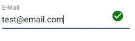

# 角度+材质-UI:使用 mat-icon 和 matInput

> 原文：<https://javascript.plainenglish.io/angular-material-ui-using-mat-icon-with-matinput-6ec8dc92c3ae?source=collection_archive---------2----------------------->

## 将 mat-icon 作为前缀或后缀添加到 mat 输入字段


Photo by [Joanna Kosinska](https://unsplash.com/@joannakosinska?utm_source=medium&utm_medium=referral) on [Unsplash](https://unsplash.com?utm_source=medium&utm_medium=referral)

创建带有图标的登录表单或注册页面会给用户带来良好的视觉体验。如果你使用的是 Angular 的 Material-UI，你可以使用内置的 mat-icons。

# 添加 mat-icon 作为前缀

这里唯一要考虑的属性是在`mat-icon`上使用`**matPrefix**` 。

## 示例 1:带标签

```
<mat-form-field>
  <mat-label> Username </mat-label>
  **<mat-icon matPrefix>people</mat-icon>**
  <input matInput formControlName="username" type="text" />
</mat-form-field>
```

这将显示为


mat-icon with a label

## 示例 2:没有标签

```
<mat-form-field>
 **<mat-icon matPrefix color="primary">password</mat-icon>**  <input matInput formControlName="password" type="password" />
</mat-form-field>
```


mat-icon without a label

在这里，赋予`color=”primary”`将你的材质主题的原色添加到图标上。同样，你可以使用重音，警告，错误等。，为色。

# 添加 mat-icon 作为后缀

对于出现在输入字段末尾的图标，使用 matSuffix

## 示例 1:

```
<mat-form-field>
  <input matInput formControlName="password" type="password" placeholder="Password"/>
  **<mat-icon matSuffix>visibility_off</mat-icon>**
</mat-form-field>
```


mat-icon as a matSuffix

**例 2:有条件地显示图标**

```
<mat-form-field>
  <mat-label> E-Mail </mat-label>
  <input matInput formControlName="email" type="email" />
  **<mat-icon matSuffix *ngIf="!form.get('email')?.errors" color="success">check_circle</mat-icon>**
</mat-form-field>
```

只有当输入有效时，`mat-icon`上的`ngIf`状态才会显示图标。我也给了成功的颜色。

```
.mat-success{
    color: green;
}
```



conditionally display mat-icon

# 结论

*   使用`matPrefix`可以在`matInput`之前显示`mat-icon`，使用`matSuffix`可以在`matInput`之后显示`mat-icon`
*   `mat-icon`可以有条件的样式化显示。
*   点击查看材料图标[的完整列表。](https://fonts.google.com/icons)

## 参考

[](https://material.angular.io/components/form-field/overview) [## 角状材料

### 用于移动和桌面 Angular web 应用程序的 UI 组件基础结构和材料设计组件。

材料.角度. io](https://material.angular.io/components/form-field/overview) 

仅此而已！希望这篇文章有用。

*更多内容请看*[***plain English . io***](http://plainenglish.io/)