# 角度符合 RxJS:错误处理

> 原文：<https://javascript.plainenglish.io/angular-meets-rxjs-error-handling-8fad48721e49?source=collection_archive---------4----------------------->

Photo by [Charl Folscher](https://unsplash.com/@charlfolscher?utm_source=medium&utm_medium=referral) on [Unsplash](https://unsplash.com?utm_source=medium&utm_medium=referral)

# 介绍

这篇文章属于名为“ **Angular meets RxJS** ”的系列文章，在这篇文章中，我尽我所能在“Angular”上下文中使用“RxJS”来解释反应式编程。

# 目录

[基本概念](/angular-meets-rxjs-basic-concepts-f178d8fe0e02)
[RxJS 科目](/angular-meets-rxjs-rxjs-subjects-32cac1b2c8d3)
[RxJS 运算符(第 1 部分)](/angular-meets-rxjs-rxjs-operators-part-1-9e9751a9373e)
[RxJS 运算符(第 2 部分)](/angular-meets-rxjs-rxjs-operators-60d8b2140d20)
[RxJS 运算符(第 3 部分)](https://ssougnez.medium.com/angular-meets-rxjs-rxjs-operators-e64caa5f72e7)
[“take until”和“async”管道](/angular-meets-rxjs-takeuntil-and-the-async-pipe-4d9c6e3d5c2d)
[高阶可观察量](/angular-meets-rxjs-higher-order-observables-632e560ce2d0)
错误处理
RxJS 调度器(即将推出)

# 在这篇文章中

啊！错误…可能是开发中最容易被忽视的方面之一。我不得不承认，当我构建一个新的应用程序时，我 50%的“TODO”都被称为“错误处理”。构建一些东西总是很有趣，但是考虑如何处理应用程序中出现的错误就不那么有趣了。

然而，使用“RxJS”处理错误是一个非常重要的话题，因为当错误发生时，可观测量如何反应。在这篇文章中，我们将看到处理它们的不同方法。

# 指导原则

如果读完这篇文章后，你只需要记住一件事，那就让这件事过去吧:

> 当一个错误发生时，游戏就结束了，可观察性结束了，你无法从中恢复。

让我们用下面的例子来说明:

这里没什么复杂的，但是，如果你有疑问，去读一读这个系列的第一篇文章。现在，我们可以期待什么样的结果呢？

如果您不知道我刚才提到的黄金法则，那么可以合理地假设一些条目会被记录在控制台中，直到“x”达到“5”，然后是一个错误，然后是一些其他条目，直到应用程序结束。然而，正如你所知道的黄金法则，你可能不会对这个结果感到惊讶:

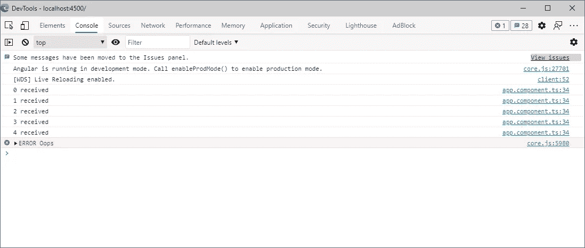

正如你所看到的，一旦错误被可观察对象发出，它就结束了，可观察对象停止发出新的值，仅仅因为它被认为是“坏的”或“死的”，无论你喜欢什么。事实上，错误是不应该出现的，并且“RxJS”认为发出错误的可观察对象受到损害，并且不能再被信任来发出一致的值。

这意味着一个可观察对象可以完成或发出一个错误，但它不能两者都做。事实上，一旦可观察对象完成，它就不会发出错误，但是当可观察对象发出错误时，就不会调用“完成”回调。

现在，让我们看看如何优雅地处理错误。

> 请记住，当它失败时，它就失败了，所以甚至不要尝试谷歌“如何忽略 RxJS 中的一个错误”，因为这是不可能的，相信我，我试过。

# 错误回调

如果您阅读了本系列的第一篇文章，当我说您可以通过提供错误回调来处理错误时，您应该不会感到惊讶。

通过提供这个错误处理程序，您可以“优雅地”处理错误，将它作为警告记录在控制台中。

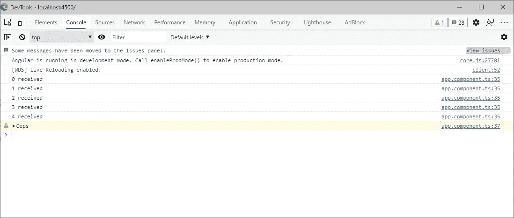

然而，正如您在上面看到的，您处理了错误**的事实并不意味着可观察对象将继续发出值**，这就是为什么即使您处理了异常，也没有记录其他值。

# 捕捉错误

错误回调并不是优雅地处理错误的唯一方式。实际上，您也可以在管道中使用“catchError”操作符来实现这一点。当您构建一个返回可观察对象的函数，但您希望可能的错误由该函数而不是可观察的消费者来处理时，这一点特别有用。

该操作符允许优雅地处理错误，在某种意义上，它允许您在出现错误时发出“与错误不同的值”，这意味着该操作符必须返回另一个可观察值作为错误“值”。此外，由于可观察对象发出的是替换值而不是错误，因此会调用“完整”回调。让我们来看看下面的例子，把事情弄清楚:

在这个例子中，我们在可观察管道中添加了“catchError”操作符，以捕捉由源可观察对象抛出的异常。在这种情况下，如果发生这样的事件，“catchError”运算符会用值“-1”替换错误。通过这样做，它通过用一个值替换它来隐藏错误发生的事实，并完成可观察的，这就是为什么此代码的输出如下:

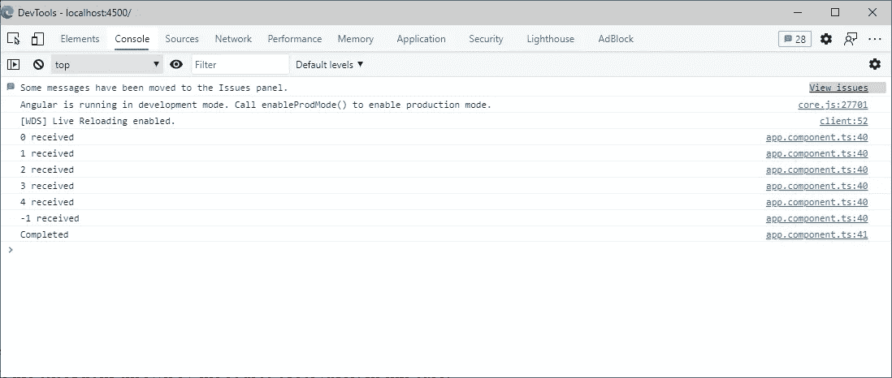

这里有三件重要的事情需要注意:

1.  记录条目“-1 已收到”，就好像“-1”是由可观察对象发出的常规值一样。
2.  不再调用“错误”回调。
3.  即使发生错误，也会调用“完成”回调。

所以，再一次也是最后一次，**我们处理了错误的事实并不意味着可观察对象将继续发出值**。抛出了一个错误，就这样，故事结束了。

该运算符的大理石图如下:

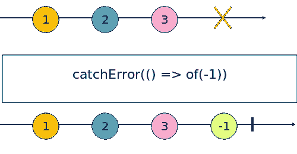

# 投掷误差

该操作符不用于处理错误，但在某些情况下可能会派上用场。实际上，在上面的代码中，我们不想混淆错误发生的事实，但是我们想对错误做些什么。换句话说，捕捉错误以便在全局组件中显示消息，然后“传播”错误以便调用“error”回调是有意义的。这可以通过“throwError”操作符来实现，该操作符接受参数中的一个值，并将其作为错误抛出。

这一次，输出有点不同:

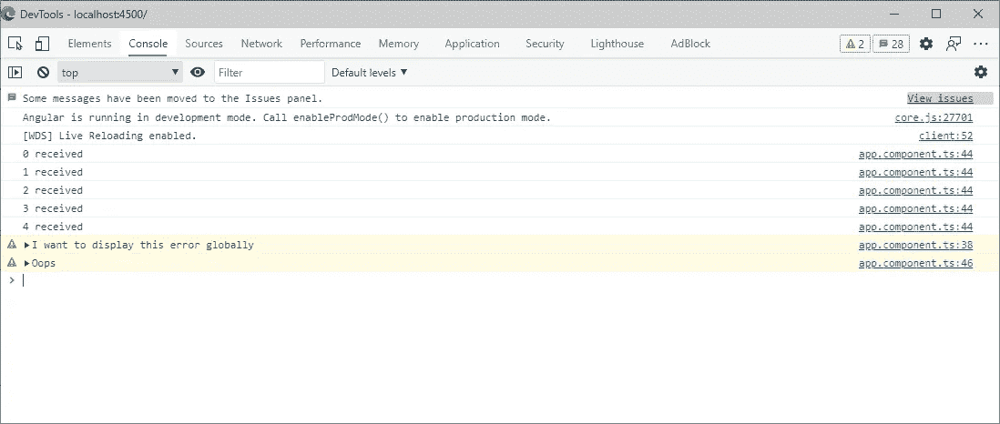

如您所见，通过在控制台中记录警告,“catchError”正确地完成了工作。然而，当我们返回由“throwError”返回的可观察对象时，最初的异常被转发到输出可观察对象，这就是为什么调用“Error”回调而不是“complete”回调的原因。

正如我所说的，在“角度”上下文中，这是一种有效的方法，可以在服务的全局组件中显示消息，同时让使用该函数的组件有机会通过显示服务全局显示的错误或其他内容来本地处理错误。

# 完成

可以看到“catchError”操作符具有 JavaScript 的“try { … } catch { … }”结构，因此正如您所料,“finalize”操作符存在于“finally { … }”子句中。当操作符完成或出错时，这个操作符简单地调用一个函数。例如:

这里，我们在完成可观测值之前捕捉错误以发出值“-1”。我们还使用“finalize”操作符在控制台中记录一条消息。

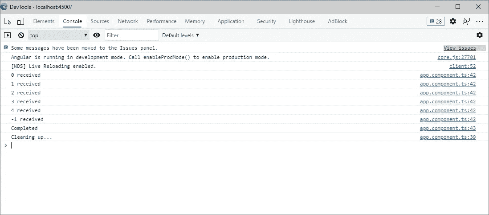

我们可以看到，一旦观察完成，就正确地调用了“finalize”。如果我们从“catchError”中抛出一个异常，也会出现这种情况，如“throwError”一节所述。

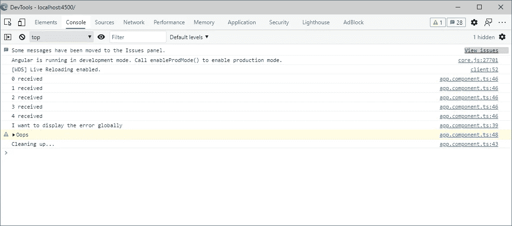

# 链接

您不局限于管道中的一个“catchError”运算符，例如:

> 我为这个蹩脚的代码感到抱歉…在 C#(我最喜欢的后端语言)中，我通常用数字除以 0 来产生错误，但在 JavaScript 中，这不会产生错误，所以我不得不即兴创作。

在上面的代码中，可观察对象直接发出一个错误，这个错误被第一个“catchError”捕获。这个只是登录到控制台并发出值 0。然后是我这辈子输入的最糟糕的代码，它通过调用“null”上的“substring”来创建错误，这就是为什么第二个“catchError”通过捕捉错误并在抛出原始错误之前将某些内容记录到控制台来执行。最后，“finalize”操作符清理一切。

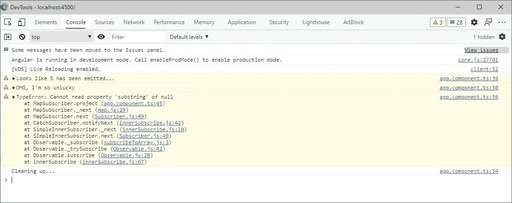

# 重试

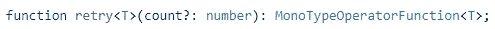

> 嘿！但是你说不可能从错误中恢复，现在你又说要重试！

好吧，我没有说谎，“重试”操作符不能用来简单地重试发出最新的值或什么的。事实上，如果你使用“重试”，你实际上再次订阅了源可观测值，这意味着值将再次开始发出…从头开始。让我们像这样更新我们的例子:

我们更新了我们的可观测值，当“x”等于“5”时发出一个错误，但只有当一个随机数低于 0.5(意味着 50%的概率)时。下面是一个可能的场景:

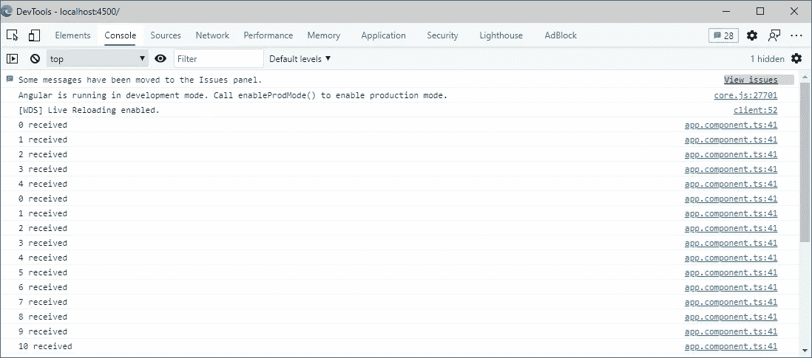

这是最好的情况。随机数大于 0.5，所以可观测值没有发出错误，从此过上了幸福的生活。然而，也存在当生成的数量低于 0.5 时的情况:

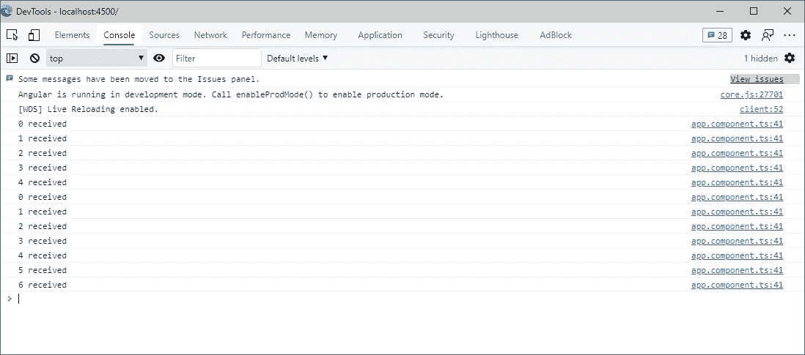

正如我们所看到的，错误没有记录在控制台中，相反，可观察对象被重新订阅，值开始从零开始发出。在这种情况下，第二个生成的数字大于 0.5，这解释了为什么第二个订阅发出的值超过 4。

最后，最后一个场景:

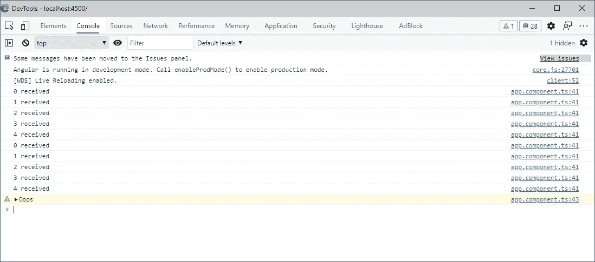

在这种情况下，由于两个生成的数字都低于 0.5，所以会发出两次错误，这也是可观察对象最终会发出错误的原因。我还没有说出来，但是你可能已经猜到了，传递给“重试”的数字定义了可观察对象被重试的次数。

这里有一个有趣的评论。我一直说“重试”重新订阅源可观察。然后，您可以问自己“间隔是否被正确清除？”。事实证明，的确如此，我们可以证明:

这一次，当“x”达到“5”时，我们发出错误，并且当调用“取消订阅”函数(清除间隔的函数)时，我们在控制台中记录一些内容。这段代码的输出如下:

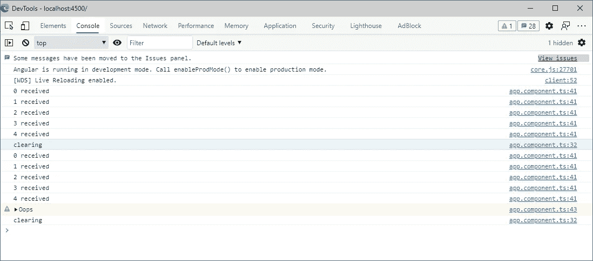

选中的行显示“retry”实际上取消订阅源可观察对象，然后再次订阅它，确保可观察对象分配的所有资源都被释放。

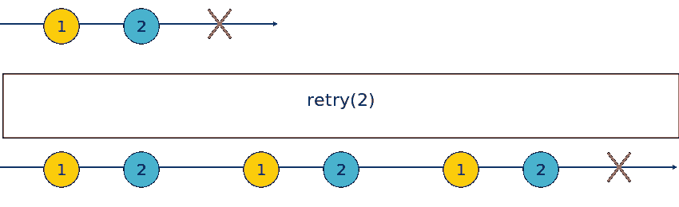

请注意，该大理石图说明了两次重试尝试都失败的情况。

# 重试时间

“retryWhen”运算符有点难以理解。基本上，它的行为与“重试”相似，只是它使用通知可观察对象来确定何时需要重试可观察对象(也就是说，当它需要取消订阅时，然后再次订阅源可观察对象)。让我们从最基本的开始:

好了，在希望理解这段代码之前，有两件重要的事情需要理解:

1.  如果源可观察对象没有发出任何错误，则不会调用传递给“retryWhen”的函数。
2.  传递给“retryWhen”的函数**只被调用一次**，即使源可观察对象在每次重试尝试时发出一个错误。

因此，传递给“retryWhen”的函数的目标是返回一个可观察对象，用于向“retryWhen”指示何时必须取消订阅源可观察对象，然后再次订阅它。这个函数的第一个参数(这里是“错误”)是一个发出被捕获错误的可观察值。

我们通常使用这个可观察对象，并通过管道返回通知可观察对象。定义何时重试可观察对象的是输出可观察对象(由“错误”的“管道”返回的对象)。所以基本上，每次输出可观测发射时，源可观测(主要的)被重试。理解这一点很重要，因为这意味着即使没有抛出第二个错误，也可以重试源可观察值。我们稍后会看到这一点，但首先，让我们看看上面代码的输出:

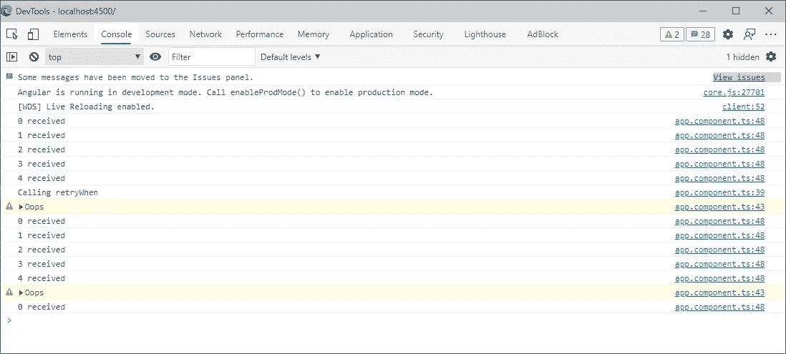

让我们来分解一下:

*   首先，值被正确地发出。
*   当“x”达到“5”时，会抛出一个错误。
*   这样做的直接后果是“retryWhen”被执行(如日志所示)。
*   “retryWhen”的执行导致通知可观察对象的创建，该通知可观察对象定义了何时重试源可观察对象。换句话说，只要新创建的通知可观察对象发出一个值，就会重试源可观察对象。
*   在我们的例子中，通知可观察对象使用“tap”操作符记录错误，然后将输入可观察对象(“错误”)的值转发给通知可观察对象(输出)。
*   这意味着通知可观察对象一创建就发出一个值，从而导致源可观察对象的重试，这就是再次发出值“0”的原因。
*   源可观测值再次发出。
*   当“x”达到“5”时，会抛出一个错误。
*   **如您所见，这一次，称“retryWhen”被调用的条目没有被记录到控制台。我们说过，传递给“retryWhen”的函数只被调用一次。**
*   然而，抛出的错误实际上是在名为“错误”的可观察对象上发出的，因此被转发给通知可观察对象(因为它是从“错误”可观察对象中创建的)。
*   因此，通知可观察对象再次在控制台中记录错误(通过“tap”)，然后发出错误，导致源可观察对象被重试。
*   如此等等…

我还没有说的是，您可以通过完成通知 observable 来阻止“retryWhen”重试。例如:

在这种情况下，一旦在可观察的错误上发出了两个值，我们就完成了可观察的通知，这意味着可观察的通知将只重试一次。事实上，当发出第一个错误时，可观察对象被重试，然而，当发出第二个错误时，通知可观察对象完成，因此，主输出可观察对象也完成。

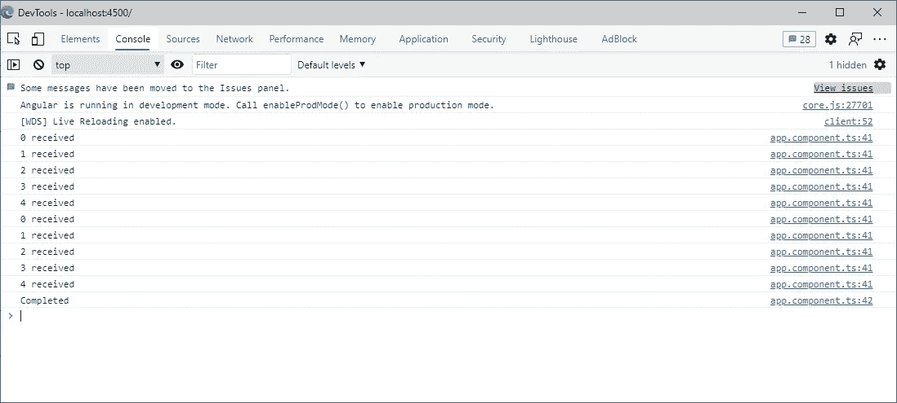

现在，让我们看最后一个(不好的)例子，以确保你理解这个操作符。

# 注意，这个代码是错误的，不能使用。

这里，我们没有从“错误”返回一个可观测值，而是创建一个每 2.5 秒发出一次的全新的可观测值。这是错误的，因为这意味着这个可观察对象与“错误”对象完全不相关，所以如果在这个可观察对象上抛出并发出错误，通知对象不会意识到它，因为它是不相关的。

它是错误的第二个原因(是第一个原因的结果)是，无论发生什么，可观察到的通知每 2.5 秒发出一次。这意味着在第一次错误后，主源观测实际上将每 2.5 秒重试一次。

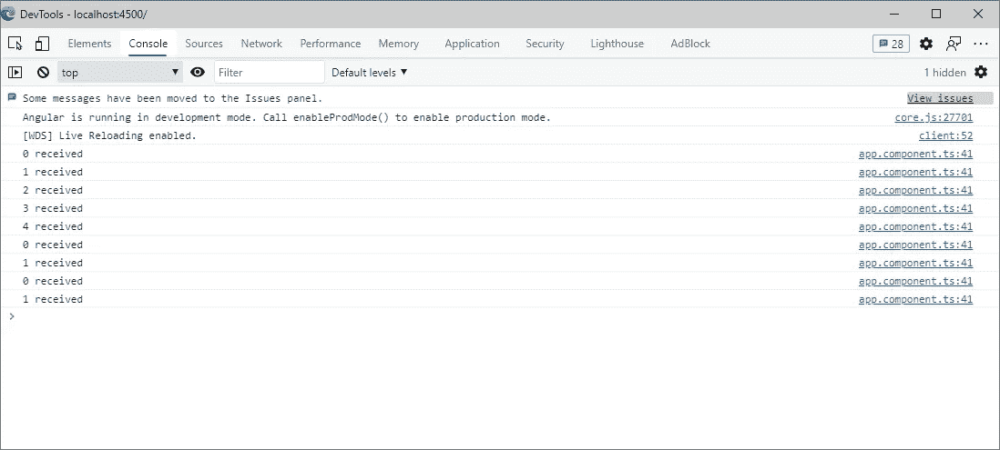

您可以在上面的控制台中看到这一点。虽然没有引发任何错误，但这些值是正确发出的。然后，当抛出第一个错误时，通知可观察对象被创建，然后在 2.5 秒后发出一个值，导致源可观察对象被重试，因此这些值开始再次发出。然而，2.5 秒后，通知 observable 发出一个新值，导致主源 observable 被重试，即使它没有抛出第二个错误。如果你想在一段时间后重试源观测，那么简单地使用“延迟”可能更好。

# 最后的想法

尽管这并不有趣，但是处理错误对于一个高质量的应用程序来说是一个非常重要的标准。事实上，当应用程序中发生错误时，您必须相应地警告用户，并尝试以最好的方式恢复。

在下一篇文章中，我们将看到什么是“RxJS”调度器，以及如何使用它们来更精确地控制 observables 何时发出它们的值。

